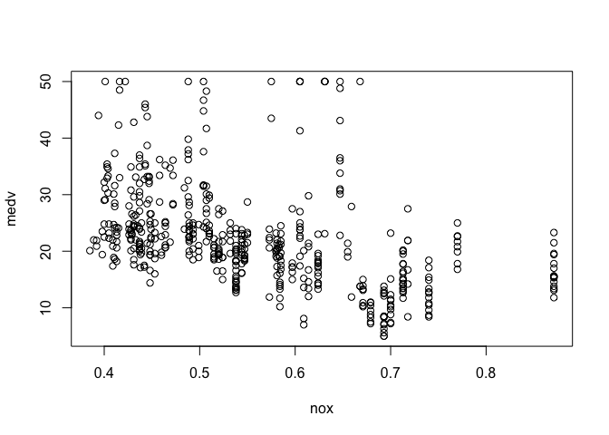
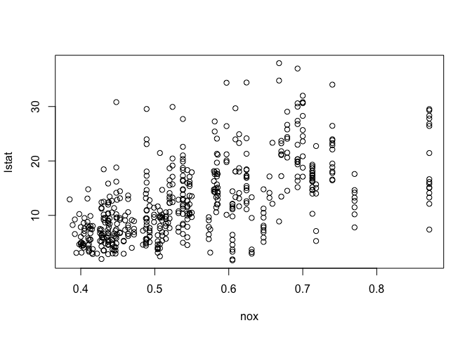
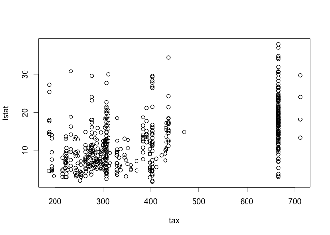
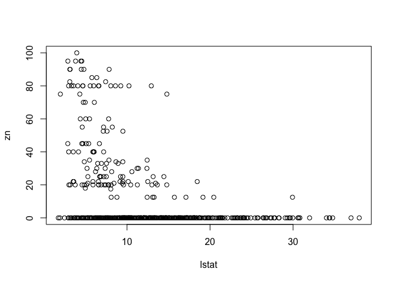
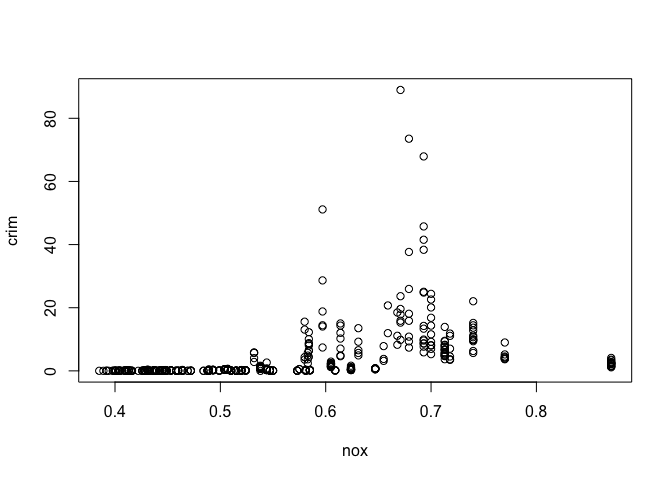
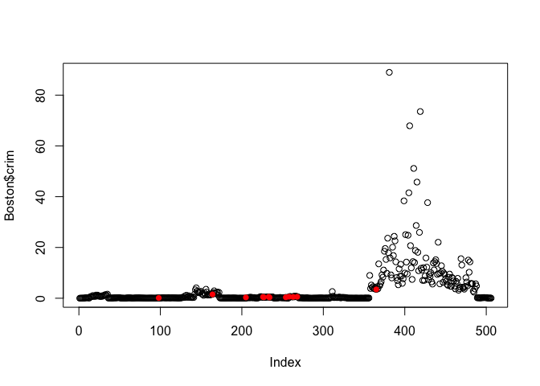
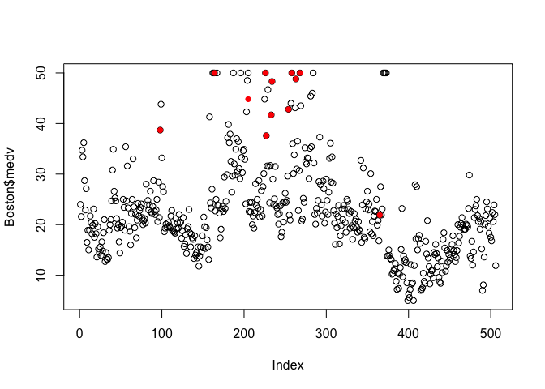
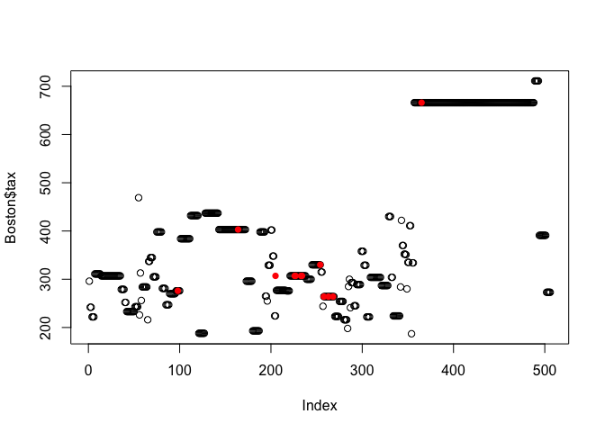
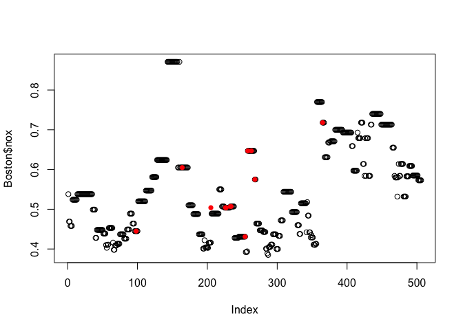

Section 2.4, Exercises 2,5,7,10

# Exercise 2

## a

"We collect a set of data on the top 500 firms in the US. For each firm we record profit, number of employees, industry and the CEO salary. We are interested in understanding which factors affect CEO salary."


This problems is a regression problem because the output or response variable is CEO salary, a quantitative or numerical variable. We are interested in inference because we are examining which particular factors affect CEO salary and we are not making predictions about CEO salaries. For this problem, n = 500 and p = 3.

## b

"We are considering launching a new product and wish to know whether it will be a success or a failure. We collect data on 20 similar products that were previously launched. For each product we have recorded whether it was a success or failure, price charged for the product, marketing budget, competition price, and ten other variables."

This is a classification and prediction problem because we are hoping to predict the categorical outcome of either success or failure of the potential new product. For this problem, n = 20 and p = 13.

## c

"We are interested in predicting the % change in the USD/Euro exchange rate in relation to the weekly changes in the world stock markets. Hence we collect weekly data for all of 2012. For each week we record the % change in the USD/Euro, the % change in the US market, the % change in the British market, and the % change in the German market."

This is a predictive regression problem because we we hoping to predict a quantitative value. In this case our n = 52 because there are 52 weeks in a year, and p = 3.

# Exercise 5

Very flexible models have very little bias because they are very adaptable to the training data set, and therefore fewer assumptions are made about the unknown, true form of the function which describes the data. This can be very useful, but one should be careful to not overfit the data using a highly flexible model, which is overly calibrated for the specific training data. Sometimes less flexible models ignore the "noise" in the training data which leads to a more accurate representation of the unknown function, despite having more bias.

# Exercise 7

## a

```r
euclidean <- function(a,b) sqrt(sum((a-b)^2))
p <- c(0,0,0)
o1 <- c(0,3,0)
o2 <- c(2,0,0)
o3 <- c(0,1,3)
o4 <- c(0,1,2)
o5 <- c(-1,0,1)
o6 <- c(1,1,1)
#distance from test point to Observation 1
print(euclidean(p,o1))
```

```
## [1] 3
```

```r
#distance from test point to Observation 2
print(euclidean(p,o2))
```

```
## [1] 2
```

```r
#distance from test point to Observation 3
print(euclidean(p,o3))
```

```
## [1] 3.162278
```

```r
#distance from test point to Observation 4
print(euclidean(p,o4))
```

```
## [1] 2.236068
```

```r
#distance from test point to Observation 5
print(euclidean(p,o5))
```

```
## [1] 1.414214
```

```r
#distance from test point to Observation 6
print(euclidean(p,o6))
```

```
## [1] 1.732051
```
## b
For K = 1, our prediction would be Green because the closest point in observation 5, which has the response value Green.

## c
For K = 3, our prediction would be Red because the three closest points are observations 2, 5, and 6, and observations 2 and 6 are labeled Red. Since the three nearest points are a majority of Red points, we would assign our test point to the qualitative response value of Red.

## d

If the Bayes decision boundary was highly nonlinear, then the best K value would be small, as this is much more flexible and would give rise to a very nonlinear KNN decision boundary which would be closest to the Bayes decision boundary.

# Exercise 10
## a

```r
library(MASS)
```
There are 506 rows and 14 columns in the Boston data set. The rows represent the 506 different suburbs or census tracts within the Boston area, while the rows represent the 14 different predictors which were observed for each suburb.

## b
The relationship between the median value of owner-occupied homes and nitrogen oxides concentration appears to be roughly linear and negative with significant variance.

```r
plot(medv ~ nox, data = Boston)
```

<!-- -->

The relationship between lower class communities and nitrogen oxides 
concentration appears to be roughly linear and positive, with fairly high 
variance.

```r
plot(lstat~ nox, data = Boston)
```

<!-- -->

The relationship between surbibs with high percentages of lower class communities and tax rates seem to have a roughly positive association with high variance.

```r
plot(lstat~tax, data = Boston)
```

<!-- -->

The relationship between the proportion of residential land zoned for lots over 25,000 sq. ft. and the percentage of lower class communities appears to be very roughly negative.

```r
plot(zn ~ lstat, data = Boston)
```

<!-- -->

## c
It seems as though nitrogen oxides concentration is positively correlated with crime, albeit with high variance. It suggests that communities with higher crime rates also appear to have higher nitrogen oxides concentration.

```r
plot(crim~ nox, data = Boston)
```

<!-- -->

## d

Some of the suburbs of Boston appear to have particularly high crime rates, with an apparent maximum per capita crime rate of close 90. Most communities have very low to moderate per capita crime rates, with some communities having close to 0 and most falling between 0 and 20. Some suburbs seem to have very low tax rates, around $100 per $10,000, while there are many surburbs with very high taxes rates around $680 and $715 per $10,000. For pupil-teacher ratio's predictor values ranged from 10 to 22. 


```r
#mean crime rate
mean(Boston$crim)
```

```
## [1] 3.613524
```

```r
#crime rate range
range(Boston$crim)
```

```
## [1]  0.00632 88.97620
```

```r
#mean tax rates
mean(Boston$tax)
```

```
## [1] 408.2372
```

```r
#range of tax rates
range(Boston$tax)
```

```
## [1] 187 711
```

```r
#mean pupil-teacher ratio
mean(Boston$ptratio)
```

```
## [1] 18.45553
```

```r
#range of pupil-teacher ratio
range(Boston$ptratio)
```

```
## [1] 12.6 22.0
```


## e
There are 35 suburbs in the data set which bound the Charles river.

```r
numbers <- c(Boston$chas)
a <- table(numbers)
a[names(a)==1]
```

```
##  1 
## 35
```

## f
The median pupil-teacher ratio among the towns in this data set is 19.05.

```r
summary(Boston$ptratio)
```

```
##    Min. 1st Qu.  Median    Mean 3rd Qu.    Max. 
##   12.60   17.40   19.05   18.46   20.20   22.00
```

## g
Suburbs 399 and 406 have the lowest median value of owner occupied homes.

```r
df = data.frame(points = c(Boston$medv))
which(df == min(df))
```

```
## [1] 399 406
```
As can be seen from the below data from suburb 399, crime, nitrogen oxide concentration, pupil-teacher ratio, and percentage of the lower class is quite high in this surburb.

```r
mean(Boston$crim)
```

```
## [1] 3.613524
```

```r
mean(Boston$nox)
```

```
## [1] 0.5546951
```

```r
mean(Boston$lstat)
```

```
## [1] 12.65306
```

```r
mean(Boston$tax)
```

```
## [1] 408.2372
```

```r
Boston[399,]
```

```
##        crim zn indus chas   nox    rm age    dis rad tax ptratio black lstat
## 399 38.3518  0  18.1    0 0.693 5.453 100 1.4896  24 666    20.2 396.9 30.59
##     medv
## 399    5
```
Similarly, in suburb 406 crime is extremely high, as well as nitrogen oxides concentration, pupil-teacher ratio, and percentage of the lower class is also significantly high.

```r
Boston[406,]
```

```
##        crim zn indus chas   nox    rm age    dis rad tax ptratio  black lstat
## 406 67.9208  0  18.1    0 0.693 5.683 100 1.4254  24 666    20.2 384.97 22.98
##     medv
## 406    5
```

## h
In this data set, 64 of the suburbs average more than seven rooms per dwelling, while only 13 average more than eight rooms per dwelling.

```r
#Boston$rm > 7
sum(Boston$rm > 7)
```

```
## [1] 64
```

```r
sum(Boston$rm > 8)
```

```
## [1] 13
```

To answer the next question, I had to identify which suburbs exceeded an average of eight rooms per dwelling.

```r
df = data.frame(points = c(Boston$rm))
#displays the suburbs with an average rooms per dwelling greater than 8
which(df > 8.0)
```

```
##  [1]  98 164 205 225 226 227 233 234 254 258 263 268 365
```

Next I created several plots to compare these 13 suburbs with the other suburbs in the data set. I chose to look at predictors crime, median home value, tax rates, and nitrogen oxides concentration. The 13 suburbs are shown in red on the plots.

First, the below plot suggests a correlation between suburbs with high average room per dwelling values and crime rates, as all but one of these 13 suburbs have negligible crime rates.

```r
plot(Boston$crim)
points(98,Boston$crim[98],col="red",pch = 16)
points(164,Boston$crim[164],col="red",pch = 16)
points(205,Boston$crim[225],col="red",pch = 16)
points(226,Boston$crim[226],col="red",pch = 16)
points(227,Boston$crim[227],col="red",pch = 16)
points(233,Boston$crim[233],col="red",pch = 16)
points(234,Boston$crim[234],col="red",pch = 16)
points(254,Boston$crim[254],col="red",pch = 16)
points(258,Boston$crim[258],col="red",pch = 16)
points(263,Boston$crim[263],col="red",pch = 16)
points(268,Boston$crim[268],col="red",pch = 16)
points(365,Boston$crim[365],col="red",pch = 16)
```

<!-- -->

Somewhat unsurprisingly, the below plot suggests a correlation between high average rooms per dwelling and median home values, as nearly all of these 13 suburbs are in the upper percentiles of median home value.

```r
plot(Boston$medv)
points(98,Boston$medv[98],col="red",pch = 16)
points(164,Boston$medv[164],col="red",pch = 16)
points(205,Boston$medv[225],col="red",pch = 16)
points(226,Boston$medv[226],col="red",pch = 16)
points(227,Boston$medv[227],col="red",pch = 16)
points(233,Boston$medv[233],col="red",pch = 16)
points(234,Boston$medv[234],col="red",pch = 16)
points(254,Boston$medv[254],col="red",pch = 16)
points(258,Boston$medv[258],col="red",pch = 16)
points(263,Boston$medv[263],col="red",pch = 16)
points(268,Boston$medv[268],col="red",pch = 16)
points(365,Boston$medv[365],col="red",pch = 16)
```

<!-- -->

Interestingly, these suburbs with large dwellings are largely in moderate to low tax rate communities.

```r
plot(Boston$tax)
points(98,Boston$tax[98],col="red",pch = 16)
points(164,Boston$tax[164],col="red",pch = 16)
points(205,Boston$tax[225],col="red",pch = 16)
points(226,Boston$tax[226],col="red",pch = 16)
points(227,Boston$tax[227],col="red",pch = 16)
points(233,Boston$tax[233],col="red",pch = 16)
points(234,Boston$tax[234],col="red",pch = 16)
points(254,Boston$tax[254],col="red",pch = 16)
points(258,Boston$tax[258],col="red",pch = 16)
points(263,Boston$tax[263],col="red",pch = 16)
points(268,Boston$tax[268],col="red",pch = 16)
points(365,Boston$tax[365],col="red",pch = 16)
```

<!-- -->
As can be seen below, these 13 suburbs experience a variety of nitrogen oxide concentrations, and there is not an obvious association between nitrogen oxide concentrations and high average rooms per dwelling.

```r
plot(Boston$nox)
points(98,Boston$nox[98],col="red",pch = 16)
points(164,Boston$nox[164],col="red",pch = 16)
points(205,Boston$nox[225],col="red",pch = 16)
points(226,Boston$nox[226],col="red",pch = 16)
points(227,Boston$nox[227],col="red",pch = 16)
points(233,Boston$nox[233],col="red",pch = 16)
points(234,Boston$nox[234],col="red",pch = 16)
points(254,Boston$nox[254],col="red",pch = 16)
points(258,Boston$nox[258],col="red",pch = 16)
points(263,Boston$nox[263],col="red",pch = 16)
points(268,Boston$nox[268],col="red",pch = 16)
points(365,Boston$nox[365],col="red",pch = 16)
```

<!-- -->


