# Exercises from 3.7: 3, 6, 8, 10

## Exercise 3
"Suppose we have a data set with five predictors, X1 = GPA, X2 = IQ, X3 = Level (1 for College and 0 for High School), X4 = Interaction between GPA and IQ, and X5 = Interaction between GPA and Level. The response is starting salary after graduation (in thousands of dollars). Suppose we use least squares to fit the model, and get β0 = 50, β1 = 20, β2 = 0.07, β3 = 35, β4 = 0.01, β5 = −10.

### a
"Which answer is correct, and why?"

The correct answer is (iii), which is somewhat counter intuitive. This is because provided high school and college graduates have fixed GPA high enough (fairly close to 4.0), the model grants college graduates with $+35$ (Due to the $X_3$ predictor coefficient) in salary but also $-10*GPA$ due to the $X_5$ predictor coefficient. Thus for sufficiently high GPAs, college graduates could be making as much as $5000 less in salary in comparison to high school graduates. 

### b
"Predict the salary of a college graduate with IQ of 110 and a GPA of 4.0."


```r
a <- 50 + 20*4.0 + 0.07*110 + 35*1 + 0.01*4.0*110 -10*4.0*1
a
```

```
## [1] 137.1
```

So the predicted salary for a college graduate with IQ 110 and GPA of 4.0 is $137,100.

### c
"True or false: Since the coefficient for the GPA/IQ interaction term is very small, there is very little evidence of an interaction effect. Justify your answer."

False. Just because the intereaction coefficient is small, does not mean it is statistically insignificant. To make a conclusion about significance, we would have to conduct a statistical test and examine the p-value and confidence interval.The p-value could be very small(indicating true significance) and the confidence interval could be very narrow regardless of the magnitude of the coefficient.

## Exercise 6
"Using (3.4), argue that in the case of simple linear regression, the
least squares line always passes through the point ($\bar{x}$, $\bar{y}$).

Using our knowledge of the formula for $\hatβ_0 = \bar{y} - \hatβ_1(\bar{x})$ for simple linear regression, we know that the least squares line $\hat{f}(x)$ takes the form 
\[\hat{f}(x) =  \bar{y} - \hatβ_1(\bar{x}) + \hatβ_1(x).\]
Thus, when $x = \bar{x}$, we have $\hat{f}(\bar{x}) = \bar{y}$, so clearly the least squares line always passes through the point ($\bar{x}$, $\bar{y}$).

## Exercise 8

### a
"Use the lm() function to perform a simple linear regression with mpg as the response and horsepower as the predictor. Use the summary() function to print the results. Comment on the output. For example:"

```r
library(ISLR2)
m1 <- lm(mpg ~horsepower, data = Auto)
summary(m1)
```

```
## 
## Call:
## lm(formula = mpg ~ horsepower, data = Auto)
## 
## Residuals:
##      Min       1Q   Median       3Q      Max 
## -13.5710  -3.2592  -0.3435   2.7630  16.9240 
## 
## Coefficients:
##              Estimate Std. Error t value Pr(>|t|)    
## (Intercept) 39.935861   0.717499   55.66   <2e-16 ***
## horsepower  -0.157845   0.006446  -24.49   <2e-16 ***
## ---
## Signif. codes:  0 '***' 0.001 '**' 0.01 '*' 0.05 '.' 0.1 ' ' 1
## 
## Residual standard error: 4.906 on 390 degrees of freedom
## Multiple R-squared:  0.6059,	Adjusted R-squared:  0.6049 
## F-statistic: 599.7 on 1 and 390 DF,  p-value: < 2.2e-16
```
### i.
It is evident that there is a significant relationship between the predictor horsepower and the response mpg because the slope (the horsepower coefficient) is statistically significant with a p-value less than 2.2e-16.

### ii.
The relationship between predictor and response is fairly strong because we have a very significant predictor slope coefficient and high R-squared and adjusted R-squared values of 0.6059. Thus, roughly 60% of the data is explained by our linear model.

### iii.
The relationship between predictor in response is negative for this data, as the predictor coefficient is -0.158. Thus an increase in horsepower leads corresponds to a decrease in mpg.

### iv.

```r
#predicted value
predict(m1, data.frame(horsepower = 98))
```

```
##        1 
## 24.46708
```

```r
#confidence interval for horsepower = 98
predict(m1, data.frame(horsepower = 98), interval = "confidence")
```

```
##        fit      lwr      upr
## 1 24.46708 23.97308 24.96108
```

```r
#prediction interval for horsepower = 98
predict(m1, data.frame(horsepower = 98), interval = "prediction")
```

```
##        fit     lwr      upr
## 1 24.46708 14.8094 34.12476
```
Thus the predicted mpg for a car with 98 horsepower is 24.47, and the the associated confidence and prediction intervals are [23.97308, 23.97308] and [14.8094, 34.12476] respectively.


### b
"Plot the response and the predictor. Use the abline() function to display the least squares regression line."

```r
plot(mpg~ horsepower, data = Auto)
abline(m1)
```

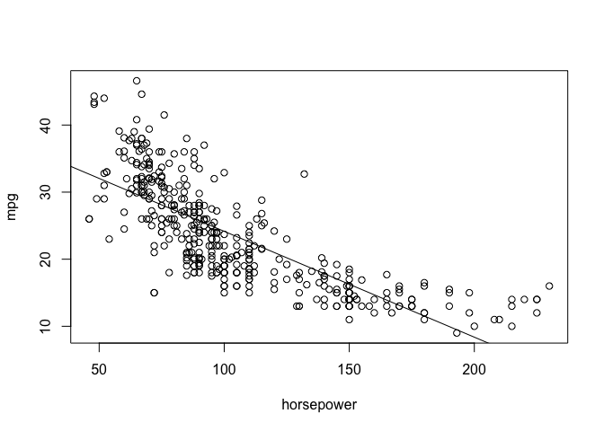<!-- -->

### c
"Use the plot() function to produce diagnostic plots of the least squares regression fit. Comment on any problems you see with the fit."


```r
plot(m1)
```

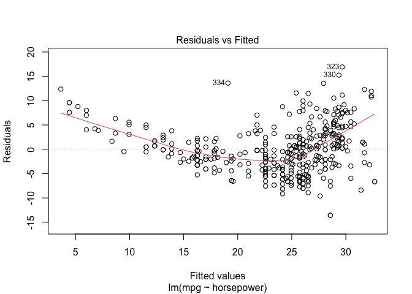<!-- -->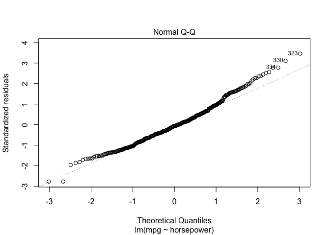<!-- -->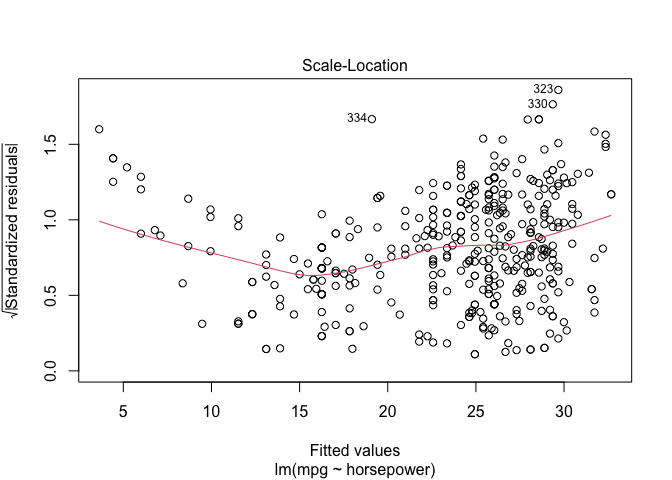<!-- -->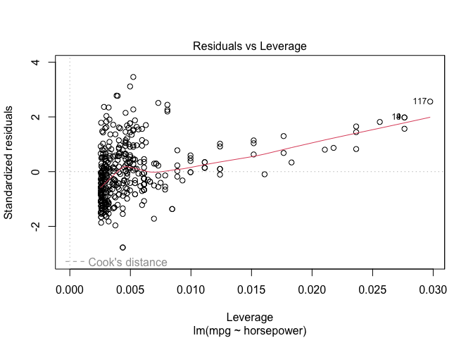<!-- -->

First, the least squares line in the Residuals vs Fitted graph is not close to being horizontal, and there is not an even distribution of residuals about this model line. This indicates a problem with our model as there is some suggestions of non-linear behavior. The Scale-Location plot also shows some non-constant variance, which suggests our model is probably not the best description of the data. 

## Exercise 10

### a
"Fit a multiple regression model to predict Sales using Price, Urban, and US."


```r
m2 <- lm(Sales ~ Price + Urban + US, data = Carseats)
summary(m2)
```

```
## 
## Call:
## lm(formula = Sales ~ Price + Urban + US, data = Carseats)
## 
## Residuals:
##     Min      1Q  Median      3Q     Max 
## -6.9206 -1.6220 -0.0564  1.5786  7.0581 
## 
## Coefficients:
##              Estimate Std. Error t value Pr(>|t|)    
## (Intercept) 13.043469   0.651012  20.036  < 2e-16 ***
## Price       -0.054459   0.005242 -10.389  < 2e-16 ***
## UrbanYes    -0.021916   0.271650  -0.081    0.936    
## USYes        1.200573   0.259042   4.635 4.86e-06 ***
## ---
## Signif. codes:  0 '***' 0.001 '**' 0.01 '*' 0.05 '.' 0.1 ' ' 1
## 
## Residual standard error: 2.472 on 396 degrees of freedom
## Multiple R-squared:  0.2393,	Adjusted R-squared:  0.2335 
## F-statistic: 41.52 on 3 and 396 DF,  p-value: < 2.2e-16
```


### b 
"Provide an interpretation of each coefficient in the model. Be careful—some of the variables in the model are qualitative!"

The Price coefficient of -0.05446 is statistically significant with a p-value less than 2.2e-16 and indicates that holding the Urban and US predictors constant, a one unit increase in Price corresponds to a decrease of 54.46 units in Sales.

The coefficient for UrbanYes is statistically insignificant with a large p-value, but it's interpretation would suggest that holding Prices and US constant, in compairson to stores that are in a rural location urban stores are associated with a decrease in sales by about 21 units.

The Coefficient for USYes is statistically significant with a p-value of 4.86e-06. This coefficient indicates that holding UrbanYes and Price constant, US stores are associated with an increase in sales by about 1200 units in comparison to stores outside of the US.

### c
"Write out the model in equation form, being careful to handle the qualitative variables properly."

\[\text{Sales} = 13.043469 -0.054459*\text{Price} -0.021916*\text{UrbanYes} + 1.200573*\text{USYes}\]

### d
"For which of the predictors can you reject the null hypothesis H0 :βj =0?"

We can reject the null hypothesis that $β_j =0$ for the predictors Price and USYes based on the small p-values already discussed in part (b).

### e
"On the basis of your response to the previous question, fit a smaller model that only uses the predictors for which there is evidence of association with the outcome."


```r
#smaller model with only Price and US predictors
m3 <- lm(Sales ~ Price + US, data = Carseats)
summary(m3)
```

```
## 
## Call:
## lm(formula = Sales ~ Price + US, data = Carseats)
## 
## Residuals:
##     Min      1Q  Median      3Q     Max 
## -6.9269 -1.6286 -0.0574  1.5766  7.0515 
## 
## Coefficients:
##             Estimate Std. Error t value Pr(>|t|)    
## (Intercept) 13.03079    0.63098  20.652  < 2e-16 ***
## Price       -0.05448    0.00523 -10.416  < 2e-16 ***
## USYes        1.19964    0.25846   4.641 4.71e-06 ***
## ---
## Signif. codes:  0 '***' 0.001 '**' 0.01 '*' 0.05 '.' 0.1 ' ' 1
## 
## Residual standard error: 2.469 on 397 degrees of freedom
## Multiple R-squared:  0.2393,	Adjusted R-squared:  0.2354 
## F-statistic: 62.43 on 2 and 397 DF,  p-value: < 2.2e-16
```


### f
"How well do the models in (a) and (e) fit the data?"


```r
#model from (a)
plot(m2)
```

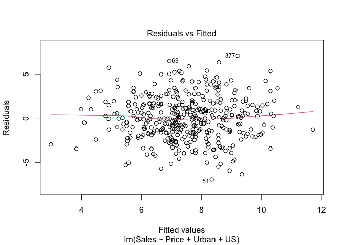<!-- -->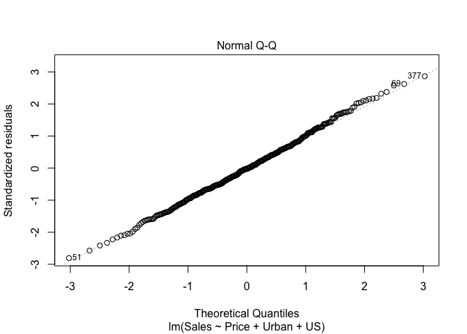<!-- -->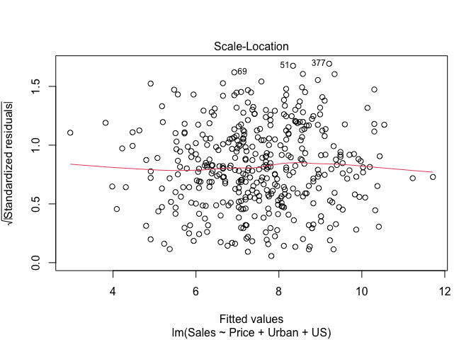<!-- -->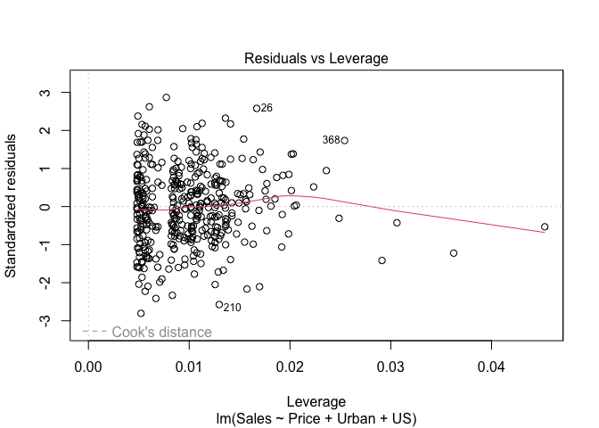<!-- -->

```r
#model from (e)
plot(m3)
```

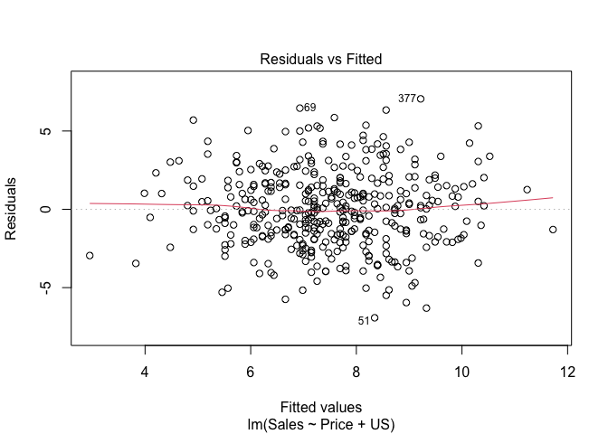<!-- -->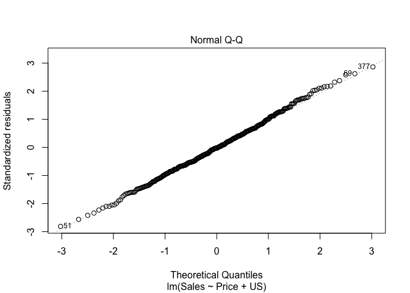<!-- -->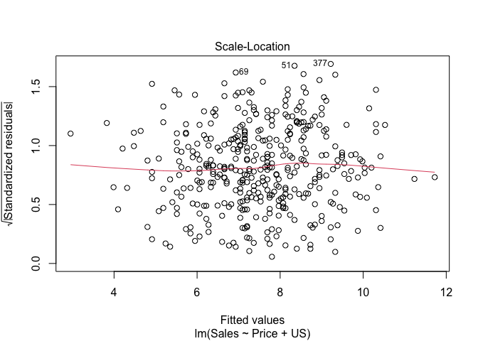<!-- -->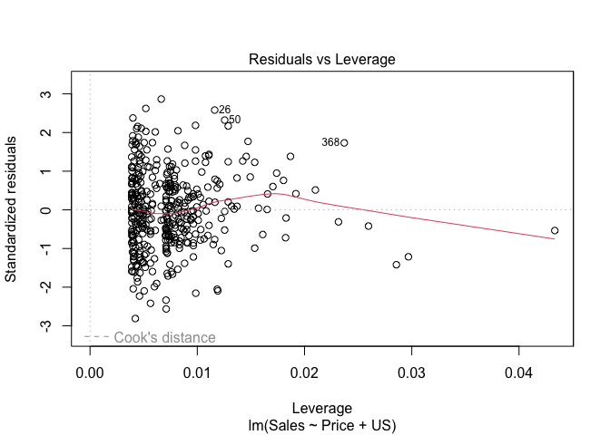<!-- -->

Both models have a fairly low multiple R-squares of 0.2393 and the smaller model (m3) has a minutely larger adjusted R-squared value of 0.2354 than the larger model with a value of 0.2335. Checking the diagnostics for the least squares regression fit using the plot() function, we can see that both models are very similar in their fit of the criteria.

### g
"Using the model from (e), obtain 95% confidence intervals for the coefficient(s)"


```r
confint(m3)
```

```
##                   2.5 %      97.5 %
## (Intercept) 11.79032020 14.27126531
## Price       -0.06475984 -0.04419543
## USYes        0.69151957  1.70776632
```
The 95% confidence intervals for the coefficients are [-0.0648, -0.0442] and [0.6915,1.7078] for Price and USYes respectively.

### h
"Is there evidence of outliers or high leverage observations in the model from (e)?"

As seen in the Residuals vs Leverage plot for model m3, there are no points near or beyond 0.5 Cook's distance, so we can conclude there are no influential outliers or high leverage observations.
