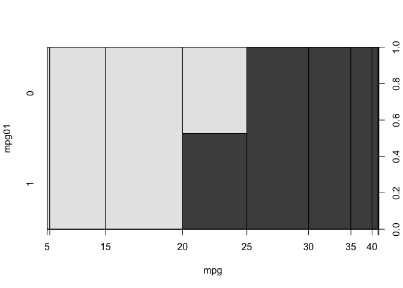
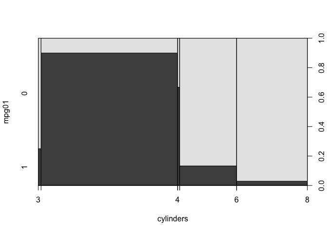
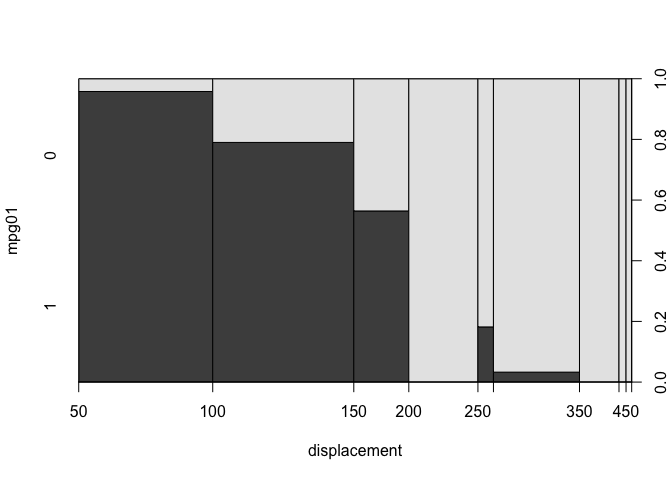
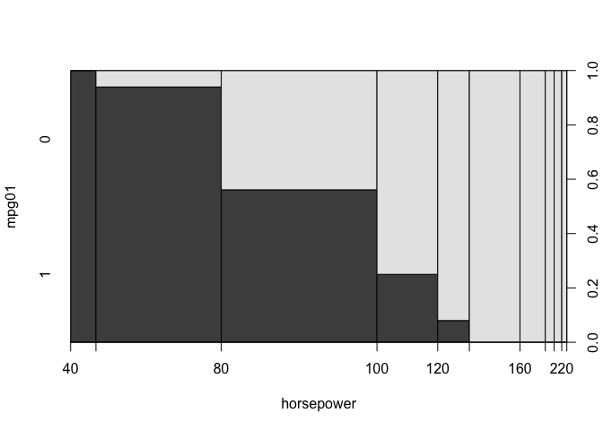
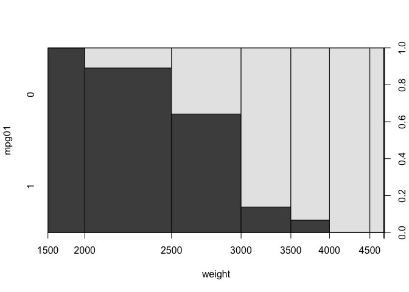
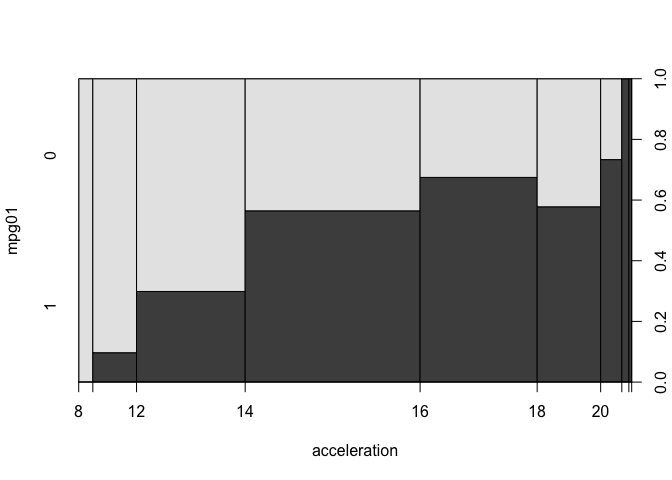
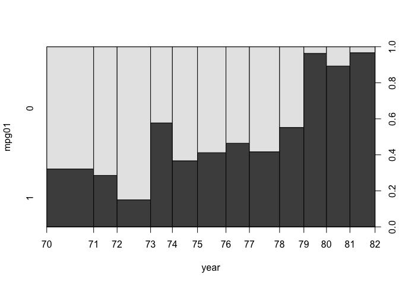
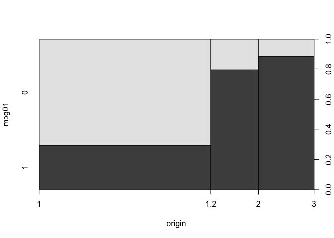

# Section 4 Exercises 3, 4, 6, 14

## Exercise 3

"This problem relates to the QDA model, in which the observations within each class are drawn from a normal distribution with a class- specific mean vector and a class specific covariance matrix. We consider the simple case where p = 1; i.e. there is only one feature.
Suppose that we have K classes, and that if an observation belongs to the kth class then X comes from a one-dimensional normal distribution, $X ∼ N(μ_k,{σ_k}^2)$. Recall that the density function for the one-dimensional normal distribution is given in (4.16). Prove that in this case, the Bayes classifier is not linear. Argue that it is in fact quadratic.
Hint: For this problem, you should follow the arguments laid out in Section 4.4.1, but without making the assumption that $σ_{12} = . . . = σ_{k2}$."

Proof:
As in section 4.4.1, we begin by assuming that the density function of $X$ is normally distributed for all $K$ classes. That is,
\[f_k(x)= \frac{1}{\sqrt{2\pi}\sigma_k} exp{\big(− \frac{1}{2{\sigma_k}^2} (x−μ_k)^2\big)}\]
where $\mu_k$ and ${\sigma_k}^2$ are the mean and variance parameters for the $k$th class. We can plug this formulation of $f_k(x)$ into the formula for Bayes Theorem (4.15) to yield
\[p_k(x) = \frac{(\pi_k)\frac{1}{\sqrt{2\pi}\sigma_k} exp{\big(− \frac{1}{2{\sigma_k}^2} (x−μ_k)^2\big)}}{\sum_{l=1}^K (\pi_l)\frac{1}{\sqrt{2\pi}\sigma_l} exp{\big(− \frac{1}{2{\sigma_l}^2} (x−μ_l)^2\big)}}.\]
In this equation $\pi_k$ denotes the prior probability than an observation belongs to the $k$th class.

Taking the natural log of both sides of this equation gives
\[log(p_k(x)) = \log\big((\pi_k)\frac{1}{\sqrt{2\pi}\sigma_k} exp{\big(− \frac{1}{2{\sigma_k}^2} (x−μ_k)^2\big)}\big) - log\big(\sum_{l=1}^K (\pi_l)\frac{1}{\sqrt{2\pi}\sigma_l} exp{\big(− \frac{1}{2{\sigma_l}^2} (x−μ_l)^2\big)}\big).\]
We can expand the first log of products in to a sum of logs,
\[log(p_k(x)) = \log(\frac{\pi_k}{\sqrt{2\pi}\sigma_k}) - \frac{1}{2{\sigma_k}^2} (x−μ_k)^2 - log\big(\sum_{l=1}^K (\pi_l)\frac{1}{\sqrt{2\pi}\sigma_l} exp{\big(− \frac{1}{2{\sigma_l}^2} (x−μ_l)^2\big)}\big).\]

Since the log of the summation on the right hand side (the denominator of $p_k(x)$) does not vary between classes, we can just consider the left most two terms, or the discriminant function ${\hat\delta_k}(x)$. That is
\[\hat\delta_k(x) = \log(\frac{\pi_k}{\sqrt{2\pi}\sigma_k}) - \frac{1}{2{\sigma_k}^2} (x^2 - 2x\mu_k −{μ_k}^2).\]
However this is clearly not linear as $x$ as it is quadratic. Since the approximation of Bayes Classifier is determined by the discriminant function ${\hat\delta_k}(x)$ which in this case is quadratic in x, we have shown that in this case the Bayes classifier is quadratic.

## Exercise 4
"When the number of features p is large, there tends to be a deteri- oration in the performance of KNN and other local approaches that perform prediction using only observations that are near the test ob-
servation for which a prediction must be made. This phenomenon is
known as the curse of dimensionality, and it ties into the fact that non-parametric approaches often perform poorly when p is large. Wewill now investigate this curse."

### a
"Suppose that we have a set of observations, each with measurements on p = 1 feature, X. We assume that X is uniformly (evenly) distributed on [0, 1]. Associated with each observation is a response value. Suppose that we wish to predict a test obser- vation’s response using only observations that are within 10 % of the range of X closest to that test observation. For instance, in order to predict the response for a test observation with X = 0.6, we will use observations in the range [0.55,0.65]. On average, what fraction of the available observations will we use to make the prediction?"

About $\frac{1}{10}$.

### b 
"Now suppose that we have a set of observations, each with measurements on p = 2 features, X1 and X2. We assume that (X1, X2) are uniformly distributed on [0, 1] × [0, 1]. We wish to predict a test observation’s response using only observations that are within 10 % of the range of X1 and within 10 % of the range of X2 closest to that test observation. For instance, in order to predict the response for a test observation with X1 = 0.6 and X2 = 0.35, we will use observations in the range [0.55, 0.65] for X1 and in the range [0.3,0.4] for X2. On average, what fraction of the available observations will we use to make the prediction?"

About $\frac{1}{100}$.

### c 
"Now suppose that we have a set of observations on p = 100 features. Again the observations are uniformly distributed on each feature, and again each feature ranges in value from 0 to 1. We wish to predict a test observation’s response using observations within the 10 % of each feature’s range that is closest to that test observation. What fraction of the available observations will we use to make the prediction?"

${\big(\frac{1}{10}\big)}^{100} = 1 \cdot 10^{-100}$

### d 
"Using your answers to parts (a)–(c), argue that a drawback of KNN when p is large is that there are very few training obser- vations “near” any given test observation."

A drawback of KNN when $p$ is large is that there are very few observations that are "close" to any given test observation, given the exponential increase of the space in which there are $p$ dimensions. In part (a), there is only a one-dimensional space, but moving to part (b) we see that we have a two dimensional space which increases the volume of the space by a factor of magnitude In the case of these problems, an addition of another dimension leads to an increase in the space by a factor of magnitude. Thus by fixing the number of observations and adding dimensions, you greatly decrease the chance that observations are "close" using the same measure of closeness for lower dimensional spaces.

### e
"Now suppose that we wish to make a prediction for a test obser- vation by creating a p-dimensional hypercube centered around the test observation that contains, on average, 10 % of the train- ing observations. For p = 1,2, and 100, what is the length of each side of the hypercube? Comment on your answer.

If observations are uniformly distributed on all features. For p = 1, the length of the hyper cube is $\frac{1}{10}$th the range of the observations. For p = 2, the length of each side of the hyper cube is about 31.6% of the range of the features, while for p = 2 the length of each side of the hyper cube is about 97.7% of the range of the features.


```r
sqrt(0.1)
```

```
## [1] 0.3162278
```

```r
(0.1)^(1/100)
```

```
## [1] 0.9772372
```

## Exercise 6
"Suppose we collect data for a group of students in a statistics class with variables X1 = hours studied, X2 = undergrad GPA, and Y = receive an A. We fit a logistic regression and produce estimated coefficient, βˆ0 = −6, βˆ1 = 0.05, βˆ2 = 1.

### a 
"Estimate the probability that a student who studies for 40 h and has an undergrad GPA of 3.5 gets an A in the class."


```r
funct_time <- function(hrs_studied, gpa){
  numerator <- exp(-6 + 0.05*hrs_studied + gpa)
  denom <- 1+exp(-6 + 0.05*hrs_studied + gpa)
  pA <- numerator/denom
  return(pA)
}
funct_time(40,3.5)
```

```
## [1] 0.3775407
```


### b
How many hours would the student in part (a) need to study to have a 50 % chance of getting an A in the class?"


```r
library(car)
```

```
## Loading required package: carData
```

```r
x <- logit(0.5)
hrs_needed <- (x + 6 - 3.5) / 0.05
hrs_needed
```

```
## [1] 50
```
50 hours.


## Exercise 14
"In this problem, you will develop a model to predict whether a given car gets high or low gas mileage based on the Auto data set."

### a
"Create a binary variable, mpg01, that contains a 1 if mpg contains a value above its median, and a 0 if mpg contains a value below its median. You can compute the median using the median() function. Note you may find it helpful to use the data.frame() function to create a single data set containing both mpg01 and the other Auto variables."


```r
library(ISLR2)
mpg01 <- factor(1*(Auto$mpg > median(Auto$mpg)))
new_frame <- data.frame(cbind(mpg01, Auto))

#median(Auto$mpg)
#new_frame
```


### b 
"Explore the data graphically in order to investigate the association between mpg01 and the other features. Which of the other features seem most likely to be useful in predicting mpg01? Scatterplots and boxplots may be useful tools to answer this question. Describe your findings."


```r
plot(mpg01 ~ ., data = Auto[,-9])
```

<!-- --><!-- --><!-- --><!-- --><!-- --><!-- --><!-- --><!-- -->

As can be seen in the above plots, the number of cyclinders, enginge displacement, horsepower, and weight all seem to have a negative relationship with mpg01, and could all be useful predictors of mpg01. Car acceleration and year seem to have positive relationships with mpg01 and could also be good predictors of mpg01. It also appears that European and Japanese cars are overwhelmingly more fuel efficient than American cars so origin could also be a useful predictor of mpg01.

### c
"Split the data into a training set and a test set."

```r
# sample <- sample.int(n = nrow(Auto), size = floor(.75*nrow(Auto)), replace = F)
# train2 <- Auto[1:294,]
# test2 <- Auto[294:392,]
# train <- Auto[sample,]
# test <- Auto[-sample,]
training <- data.frame(new_frame[1:294,])
testing <- data.frame(new_frame[294:392,])
# train
# test
```


### d
"Perform LDA on the training data in order to predict mpg01 using the variables that seemed most associated with mpg01 in (b). What is the test error of the model obtained?"

I chose to create my lda model with the weight and horsepower predictors.

```r
library(MASS)
```

```
## 
## Attaching package: 'MASS'
```

```
## The following object is masked from 'package:ISLR2':
## 
##     Boston
```

```r
m_lda <- lda(mpg01 ~ weight + horsepower, data = training)
#yield different results when I do: m_lda <- lda(mpg01 ~ weight + horsepower, data = Auto, subset = sample)
predict_lda <- predict(m_lda, testing)
lda_err <- 1 - mean(predict_lda$class == testing$mpg01)
lda_err
```

```
## [1] 0.2020202
```


### e
"Perform QDA on the training data in order to predict mpg01 using the variables that seemed most associated with mpg01 in (b). What is the test error of the model obtained?"


```r
m_qda <- qda(mpg01 ~ weight + horsepower, data = training)
predict_qda <- predict(m_qda, testing)
qda_err <- 1 - mean(predict_qda$class == testing$mpg01)
qda_err
```

```
## [1] 0.2626263
```


### f
"Perform logistic regression on the training data in order to predict mpg01 using the variables that seemed most associated with mpg01 in (b). What is the test error of the model obtained?"


```r
m_log <- glm(mpg01 ~ weight + horsepower, family = "binomial", data = training)
probs_l <- predict(m_log, type = "response")
pred_log <- rep("0", 98)
pred_log[probs_l > 0.5] <- "1"
log_err <- 1 - mean((pred_log[294:392] == testing$mpg01), na.rm=T)
log_err
```

```
## [1] 0
```

I spent a lot of time on this but I don't know what went wrong here, not sure why I have a zero. 

### g
"Perform naive Bayes on the training data in order to predict mpg01 using the variables that seemed most associated with mpg01 in (b). What is the test error of the model obtained?"


```r
library(e1071)
naive_b <- naiveBayes(mpg01 ~ weight + horsepower, data = training)

nb_class <- predict(naive_b, testing)
nb_err <- 1- mean(nb_class == testing$mpg01)
nb_err
```

```
## [1] 0.2222222
```


### h
"Perform KNN on the training data, with several values of K, in order to predict mpg01. Use only the variables that seemed most associated with mpg01 in (b). What test errors do you obtain? Which value of K seems to perform the best on this data set?"


```r
library(class)

train.X <- data.frame(cbind(Auto$weight, Auto$horsepower)[1:294])
test.X <- data.frame(cbind(Auto$weight, Auto$horsepower)[294:392])
train_output <- new_frame$mpg01[1:294]
#k = 1
knn.pred <- knn(train.X, test.X, train_output, k = 1)
error_knn_1 <- 1- mean(knn.pred == testing$mpg01)
error_knn_1
```

```
## [1] 0.3030303
```

```r
# k= 2
knn.pred2 <- knn(train.X, test.X, train_output, k = 2)
error_knn_2 <- 1- mean(knn.pred2 == testing$mpg01)
error_knn_2
```

```
## [1] 0.3131313
```

```r
# k= 3
knn.pred3 <- knn(train.X, test.X, train_output, k = 3)
error_knn_3 <- 1- mean(knn.pred3 == testing$mpg01)
error_knn_3
```

```
## [1] 0.3333333
```

```r
# k= 4
knn.pred4 <- knn(train.X, test.X, train_output, k = 4)
error_knn_4 <- 1- mean(knn.pred4 == testing$mpg01)
error_knn_4
```

```
## [1] 0.3030303
```

```r
# k= 5
knn.pred5 <- knn(train.X, test.X, train_output, k = 5)
error_knn_5 <- 1- mean(knn.pred5 == testing$mpg01)
error_knn_5
```

```
## [1] 0.3333333
```

```r
# k= 6
knn.pred6 <- knn(train.X, test.X, train_output, k = 5)
error_knn_6 <- 1- mean(knn.pred6 == testing$mpg01)
error_knn_6
```

```
## [1] 0.3333333
```

K = 2 seems to yield the best results when the model is run serval times. K = 4 is often a close second place.

