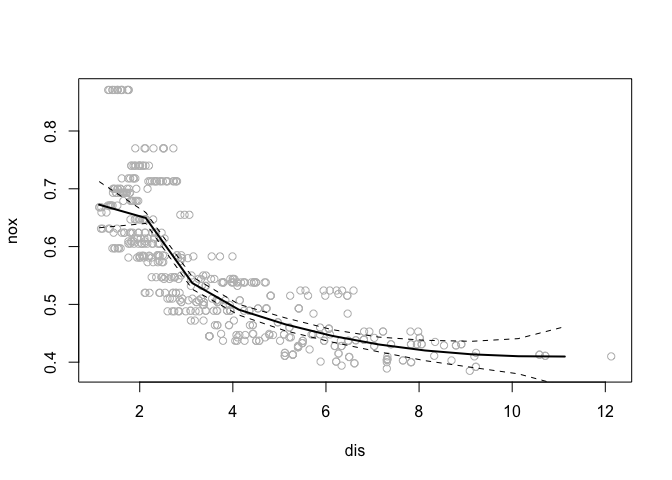

# Chapter 7 Exercises: 1,9,10

## Exercise 1:
"It was mentioned in the chapter that a cubic regression spline with one knot at $\xi$ can be obtained using a basis of the form $x, x^2, x^3, {(x−ξ)^3_{+}}$, where $(x−\xi)^3_{+} =(x−\xi)^3$ if $x>\xi$ and equals 0 otherwise. We will now show that a function of the form"
\[f(x) = \beta_0 + \beta_1x + \beta_2x^2 + \beta_3x^3 + \beta_4(x-\xi)^3_+\]
is indeed a cubic regression spline, regardless of the values of $\beta_0, \beta_1,\beta_2, \beta_3, \beta_4$."

### a
"Find a cubic polynomial
\[f_1(x) = a_1 + b_1x + c_1x^2 + d_1x^3\]
such that $f(x) = f_1(x)$ for all $x\leq \xi$. Express $a_1, b_1, c_1, d_1$ in terms of $\beta_0, \beta_1,\beta_2, \beta_3, \beta_4$."


As $f(x)$ is defined, when $x\leq \xi$, $(x−\xi)^3_{+} = 0$. So for all $x\leq \xi$, we have
\[f(x)  = \beta_0 + \beta_1x + \beta_2x^2 + \beta_3x^3.\] Thus by simply letting $a_1 = \beta_0$, $b_1 = \beta_1$, $c_1 = \beta_2$, and $d_1 = \beta_3$, we have \[f_1(x) = \beta_0 + \beta_1x + \beta_2x^2 + \beta_3x^3.\] Therefore we have found $f_1(x)$ such that $f(x) = f_1(x)$ for all  $x\leq \xi$.

### b
""Find a cubic polynomial
\[f_2(x) = a_2 + b_2x + c_2x^2 + d_2x^3\]
such that $f(x) = f_2(x)$ for all $x >\xi$. Express $a_1, b_1, c_1, d_1$ in terms of $\beta_0, \beta_1,\beta_2, \beta_3, \beta_4$. We have now established that f(x) is a piecewise polynomial."


By definition, for all $x >\xi$, we know that $f(x)$ is defined to be
\[f(x) = \beta_0 + \beta_1x + \beta_2x^2 + \beta_3x^3 + \beta_4(x-\xi)^3.\] We now expand the final term of $f(x)$ to give
\[f(x) = \beta_0 + \beta_1x + \beta_2x^2 + \beta_3x^3 + \beta_4(x-\xi)(x^2 -2x\xi + \xi^2).\] We continue to distrubute to yield
\[f(x) = \beta_0 + \beta_1x + \beta_2x^2 + \beta_3x^3 + \beta_4(x^3 -2x^2\xi + x\xi^2 - x^2\xi + 2x\xi^2 - \xi^3).\]
\[f(x) = \beta_0 + \beta_1x + \beta_2x^2 + \beta_3x^3 + \beta_4x^3 -\beta_42x^2\xi + \beta_4x\xi^2 - \beta_4x^2\xi + \beta_42x\xi^2 - \beta_4\xi^3).\]
We now combine like terms and see that 
\[f(x) = (\beta_0 - \beta_4\xi^3) + (\beta_1 + 2\beta_4\xi^2+ \beta_4\xi^2 )x + (\beta_2 - \beta_4\xi -2\beta_4\xi)x^2 + (\beta_3 + \beta_4)x^3.\]
Finally we are left with
\[f(x) = (\beta_0 - \beta_4\xi^3) + (\beta_1 + 3\beta_4\xi^2)x + (\beta_2 -3\beta_4\xi)x^2 + (\beta_3+ \beta_4)x^3.\]
Thus by letting $a_2 = (\beta_0 - \beta_4\xi^3)$, $b_2 = (\beta_1 + 3\beta_4\xi^2)$, $c_2 = (\beta_2 -3\beta_4\xi)$, and $d_2 = (\beta_3+ \beta_4)$, we have obtained the coefficients of $f_2(x)$ such that $f(x) = f_2(x)$ for all $x>\xi$. 

### c
"Show that $f_1(\xi) = f_2(\xi).$ That is, $f(x)$ is continuous at $\xi$."


Letting $x = \xi$, we see that \[f_1(\xi) = \beta_0 + \beta_1\xi + \beta_2\xi^2 + \beta_3\xi^3\] and 
\[f_2(\xi) = (\beta_0 - \beta_4\xi^3) + (\beta_1 + 3\beta_4\xi^2)\xi + (\beta_2 -3\beta_4\xi)\xi^2 + (\beta_3+ \beta_4)\xi^3.\]
We know expand the formula for $f_2$ to give
\[f_2(\xi) = \beta_0 - \beta_4\xi^3 + \beta_1\xi + 3\beta_4\xi^3 + \beta_2\xi^2 -3\beta_4\xi^3 + \beta_3\xi^3 + \beta_4\xi^3.\]
\[ = \beta_0  + \beta_1\xi  + \beta_2\xi^2 + (3\beta_4\xi^3-3\beta_4\xi^3) + \beta_3\xi^3 + (\beta_4\xi^3 - \beta_4\xi^3).\] Since the grouped terms cancel out we are left with 
\[f_2(\xi) = \beta_0  + \beta_1\xi  + \beta_2\xi^2 + \beta_3\xi^3\] which shows that $f_1(\xi) = f_2(\xi)$. Thus $f$ is continuous at $\xi$.

### d
"Show that $f_1'(\xi) = f_2'(\xi).$ That is, $f'(x)$ is continuous at $\xi$.

Letting $x = \xi$ and taking the first derivative of $f_1$ and $f_2$ we see that
\[f_1'(\xi) =  \beta_1 + 2\beta_2\xi + 3\beta_3\xi^2\] and 
\[f_2'(\xi) =  (\beta_1 + 3\beta_4\xi^2) + 2(\beta_2 -3\beta_4\xi)\xi + 3(\beta_3+ \beta_4)\xi^2.\]
Expanding and grouping like terms of $f_2'(\xi)$ shows that
\[f_2'(\xi) =  \beta_1 + 3\beta_4\xi^2 + 2\beta_2\xi -6\beta_4\xi^2 + 3\beta_3\xi^2 + 3\beta_4\xi^2\]
\[=  \beta_1  + 2\beta_2\xi  + 3\beta_3\xi^2 + (3\beta_4\xi^2 + 3\beta_4\xi^2 -6\beta_4\xi^2).\] Therefore we finally have shown that 
\[f_2'(\xi) = \beta_1  + 2\beta_2\xi  + 3\beta_3\xi^2\] and thus that 
$f_1'(\xi) = f_2'(\xi)$ as desired.

### e 
Show that "$f_1''(\xi) = f_2''(\xi).$ That is, $f''(x)$ is continuous at $\xi$.

Letting $x = \xi$ and computing the second derivative of $f_1$ and $f_2$ we see that
\[f_1''(\xi) =  2\beta_2 + 6\beta_3\xi\] and 
\[f_2''(\xi) =   2(\beta_2 -3\beta_4\xi) + 6(\beta_3+ \beta_4)\xi.\]
Expanding and cancelling terms of $f_2''(\xi)$, we are left with
\[f_2''(\xi) =   2\beta_2 -6\beta_4\xi + 6\beta_3\xi + 6\beta_4\xi\] and finally 
\[f_2''(\xi) =   2\beta_2 + 6\beta_3\xi\] which shows that $f_1''(\xi) = f_2''(\xi)$ as desired. Thus, $f''(x)$ is continuous at $\xi$.


## Exercise 9:
" This question uses the variables dis (the weighted mean of distances to five Boston employment centers) and nox (nitrogen oxides concentration in parts per 10 million) from the Boston data. We will treat dis as the predictor and nox as the response."

```r
library(MASS)
library(splines)
library(boot)
```


### a
"Use the poly() function to fit a cubic polynomial regression to predict nox using dis. Report the regression output, and plot the resulting data and polynomial fits."

```r
cubic <- glm(nox ~ poly(dis,3), data = Boston)
summary(cubic)
```

```
## 
## Call:
## glm(formula = nox ~ poly(dis, 3), data = Boston)
## 
## Deviance Residuals: 
##       Min         1Q     Median         3Q        Max  
## -0.121130  -0.040619  -0.009738   0.023385   0.194904  
## 
## Coefficients:
##                Estimate Std. Error t value Pr(>|t|)    
## (Intercept)    0.554695   0.002759 201.021  < 2e-16 ***
## poly(dis, 3)1 -2.003096   0.062071 -32.271  < 2e-16 ***
## poly(dis, 3)2  0.856330   0.062071  13.796  < 2e-16 ***
## poly(dis, 3)3 -0.318049   0.062071  -5.124 4.27e-07 ***
## ---
## Signif. codes:  0 '***' 0.001 '**' 0.01 '*' 0.05 '.' 0.1 ' ' 1
## 
## (Dispersion parameter for gaussian family taken to be 0.003852802)
## 
##     Null deviance: 6.7810  on 505  degrees of freedom
## Residual deviance: 1.9341  on 502  degrees of freedom
## AIC: -1370.9
## 
## Number of Fisher Scoring iterations: 2
```

```r
disrange <- range(Boston$dis)
dis.grid <- seq(from = disrange[1], to = disrange[2])
plot(nox ~ dis, data = Boston)
cubepreds <- predict(cubic, newdata = list(dis = dis.grid), se = TRUE)
se.bands <- cbind(cubepreds$m1 + 2*cubepreds$se.cubic, cubepreds$cubic - 2*cubepreds$se.cubic)
lines(cubepreds$fit ~  dis.grid, lwd = 2, col = "blue")
lines(cubepreds$fit + 2*cubepreds$se.fit ~ dis.grid, lwd = 1, col = "blue", lty = 3)
lines(cubepreds$fit - 2*cubepreds$se.fit ~ dis.grid, lwd = 1, col = "blue", lty = 3)
```

<!-- -->

The regression summary is evidence that our model is well fitted with very significant coefficients.


### b
"Plot the polynomial fits for a range of different polynomial degrees (say, from 1 to 10), and report the associated residual sum of squares"


```r
disrange <- range(Boston$dis)
dis.grid <- seq(from = disrange[1], to = disrange[2])
for (i in 1:15){
   m1<- glm(nox ~ poly(dis,i), data = Boston)
   polypreds <- predict(m1, newdata = list(dis = dis.grid), se = TRUE)
   se.bands <- cbind(polypreds$m1 + 2*polypreds$se.m1, polypreds$m1 - 2*polypreds$se.m1)
   plot(nox ~ dis, data = Boston)
   lines(polypreds$fit ~  dis.grid, lwd = 2, col = "blue")
   lines(polypreds$fit + 2*polypreds$se.fit ~ dis.grid, lwd = 1, col = "blue", lty = 3)
   lines(polypreds$fit - 2*polypreds$se.fit ~ dis.grid, lwd = 1, col = "blue", lty = 3)
  b<- as.character(i)
  print(paste("RSS for model of degree", b))
  print(sum((polypreds$fit - Boston$nox)^2))
}
```

<!-- -->

```
## [1] "RSS for model of degree 1"
## [1] 20.8994
```

<!-- -->

```
## [1] "RSS for model of degree 2"
## [1] 13.32777
```

<!-- -->

```
## [1] "RSS for model of degree 3"
## [1] 14.30233
```

<!-- -->

```
## [1] "RSS for model of degree 4"
## [1] 14.42078
```

<!-- -->

```
## [1] "RSS for model of degree 5"
## [1] 14.86415
```

<!-- -->

```
## [1] "RSS for model of degree 6"
## [1] 13.63421
```

<!-- -->

```
## [1] "RSS for model of degree 7"
## [1] 13.75387
```

<!-- -->

```
## [1] "RSS for model of degree 8"
## [1] 13.11053
```

<!-- -->

```
## [1] "RSS for model of degree 9"
## [1] 13.39082
```

<!-- -->

```
## [1] "RSS for model of degree 10"
## [1] 12.73548
```

<!-- -->

```
## [1] "RSS for model of degree 11"
## [1] 12.76654
```

<!-- -->

```
## [1] "RSS for model of degree 12"
## [1] 13.61535
```

<!-- -->

```
## [1] "RSS for model of degree 13"
## [1] 27.70543
```

<!-- -->

```
## [1] "RSS for model of degree 14"
## [1] 47.12988
```

<!-- -->

```
## [1] "RSS for model of degree 15"
## [1] 197.1817
```

### c
"Perform cross-validation or another approach to select the optimal degree for the polynomial, and explain your results."


```r
x<- numeric()
#x <- c(Null)
for (i in 1:15){
  m<- glm(nox ~ poly(dis,i), data = Boston)
  cv <- cv.glm(Boston, m, K = 10)
  x[i] <- cv$delta[1]
}
x
```

```
##  [1] 5.543542e-03 4.080958e-03 3.898794e-03 3.904240e-03 4.170174e-03
##  [6] 4.917736e-03 1.209999e-02 4.840758e-03 1.581307e-02 6.955822e-03
## [11] 7.841668e-02 2.400835e+01 2.340941e+00 1.400678e+03 1.014767e+04
```

```r
#best choice of degree
which.min(x)
```

```
## [1] 3
```

As shown above, a third degree polynomial regression produces the lowest cross validation MSE, so this is the ideal predictive model for the data. as degree increases, we are introducing too much variance and potentially overfitting the data.


### d 
" Use the bs() function to fit a regression spline to predict nox using dis. Report the output for the fit using four degrees of freedom. How did you choose the knots? Plot the resulting fit."

```r
disrange <- range(Boston$dis)
dis.grid <- seq(from = disrange[1], to = disrange[2])
s1 <- lm(nox ~ bs(dis, df = 4), data = Boston) #bayes spline
attr(bs(Boston$dis, df = 4), "knots")
```

```
##     50% 
## 3.20745
```

```r
summary(s1)
```

```
## 
## Call:
## lm(formula = nox ~ bs(dis, df = 4), data = Boston)
## 
## Residuals:
##       Min        1Q    Median        3Q       Max 
## -0.124622 -0.039259 -0.008514  0.020850  0.193891 
## 
## Coefficients:
##                  Estimate Std. Error t value Pr(>|t|)    
## (Intercept)       0.73447    0.01460  50.306  < 2e-16 ***
## bs(dis, df = 4)1 -0.05810    0.02186  -2.658  0.00812 ** 
## bs(dis, df = 4)2 -0.46356    0.02366 -19.596  < 2e-16 ***
## bs(dis, df = 4)3 -0.19979    0.04311  -4.634 4.58e-06 ***
## bs(dis, df = 4)4 -0.38881    0.04551  -8.544  < 2e-16 ***
## ---
## Signif. codes:  0 '***' 0.001 '**' 0.01 '*' 0.05 '.' 0.1 ' ' 1
## 
## Residual standard error: 0.06195 on 501 degrees of freedom
## Multiple R-squared:  0.7164,	Adjusted R-squared:  0.7142 
## F-statistic: 316.5 on 4 and 501 DF,  p-value: < 2.2e-16
```

```r
pred_spline <- predict(s1, data.frame(dis = dis.grid), se = T)
plot(nox ~ dis, data = Boston, col = "gray")
lines(pred_spline$fit ~ dis.grid, lwd = 2)
lines((pred_spline$fit+2*pred_spline$se) ~ dis.grid, lty = "dashed")
lines((pred_spline$fit-2*pred_spline$se) ~ dis.grid, lty = "dashed")
```

<!-- -->

I did not choose the knots, but because I left it unspecified and used four degrees of freedom, R automatically used one know at 50% of the range of "dis".
Our model is evidently a good fit because all coefficients are very statistically significant.


### e
"Now fit a regression spline for a range of degrees of freedom, and plot the resulting fits and report the resulting RSS. Describe the results obtained."

```r
disrange <- range(Boston$dis)
dis.grid <- seq(from = disrange[1], to = disrange[2])
for (i in 1:15){
  s1 <- lm(nox ~ bs(dis, df = i), data = Boston) #bayes spline
  summary(s1)
  pred_spline <- predict(s1, data.frame(dis = dis.grid), se = T)
  plot(nox ~ dis, data = Boston, col = "gray")
  lines(pred_spline$fit ~ dis.grid, lwd = 2)
  lines((pred_spline$fit+2*pred_spline$se) ~ dis.grid, lty = "dashed")
  lines((pred_spline$fit-2*pred_spline$se) ~ dis.grid, lty = "dashed")
  b<- as.character(i)
  print(paste("RSS for model of degree", b))
  print(sum((pred_spline$fit - Boston$nox)^2))
}
```

```
## Warning in bs(dis, df = i): 'df' was too small; have used 3
```

```
## [1] "RSS for model of degree 1"
## [1] 14.30233
```

```
## Warning in bs(dis, df = i): 'df' was too small; have used 3
```

<!-- -->

```
## [1] "RSS for model of degree 2"
## [1] 14.30233
```

```
## [1] "RSS for model of degree 3"
## [1] 14.30233
```

<!-- -->

```
## [1] "RSS for model of degree 4"
## [1] 14.011
```

<!-- -->

```
## [1] "RSS for model of degree 5"
## [1] 13.36125
```

<!-- -->

```
## [1] "RSS for model of degree 6"
## [1] 13.21649
```

<!-- -->

```
## [1] "RSS for model of degree 7"
## [1] 13.10655
```

<!-- -->

```
## [1] "RSS for model of degree 8"
## [1] 12.87242
```

<!-- -->

```
## [1] "RSS for model of degree 9"
## [1] 13.0001
```

<!-- -->

```
## [1] "RSS for model of degree 10"
## [1] 13.17838
```

<!-- -->

```
## [1] "RSS for model of degree 11"
## [1] 13.21587
```

<!-- -->

```
## [1] "RSS for model of degree 12"
## [1] 13.12253
```

<!-- -->

```
## [1] "RSS for model of degree 13"
## [1] 12.99631
```

<!-- -->

```
## [1] "RSS for model of degree 14"
## [1] 12.94838
```

<!-- -->

```
## [1] "RSS for model of degree 15"
## [1] 12.91544
```

As evidenced by the printed RSS values for every model, a degree 8 regression spline produced the lowest RSS of 12.87242. As can be seen in the model, as degrees of freedom increase, our prediction line has increasing variance. The jagged nature of the higher degree prediction model is partly due to our small predictor grid, but it is still clear than regression splines with df higher than nine are over fitting the data.

### f
"Perform cross-validation or another approach in order to select the best degrees of freedom for a regression spline on this data. Describe your results."

```r
errors <- numeric()
for (i in 1:20){
  s1 <- glm(nox ~ bs(dis, df = i), data = Boston)
  cv <- cv.glm(Boston, s1, K = 10)
  cve <- cv$delta[1]
  errors[i] <- cve
}
```

```
## Warning in bs(dis, df = i): 'df' was too small; have used 3

## Warning in bs(dis, df = i): 'df' was too small; have used 3

## Warning in bs(dis, df = i): 'df' was too small; have used 3

## Warning in bs(dis, df = i): 'df' was too small; have used 3

## Warning in bs(dis, df = i): 'df' was too small; have used 3
```

```
## Warning in bs(dis, degree = 3L, knots = numeric(0), Boundary.knots = c(1.137, :
## some 'x' values beyond boundary knots may cause ill-conditioned bases

## Warning in bs(dis, degree = 3L, knots = numeric(0), Boundary.knots = c(1.137, :
## some 'x' values beyond boundary knots may cause ill-conditioned bases
```

```
## Warning in bs(dis, df = i): 'df' was too small; have used 3
```

```
## Warning in bs(dis, degree = 3L, knots = numeric(0), Boundary.knots = c(1.1296, :
## some 'x' values beyond boundary knots may cause ill-conditioned bases

## Warning in bs(dis, degree = 3L, knots = numeric(0), Boundary.knots = c(1.1296, :
## some 'x' values beyond boundary knots may cause ill-conditioned bases
```

```
## Warning in bs(dis, df = i): 'df' was too small; have used 3

## Warning in bs(dis, df = i): 'df' was too small; have used 3

## Warning in bs(dis, df = i): 'df' was too small; have used 3

## Warning in bs(dis, df = i): 'df' was too small; have used 3

## Warning in bs(dis, df = i): 'df' was too small; have used 3

## Warning in bs(dis, df = i): 'df' was too small; have used 3

## Warning in bs(dis, df = i): 'df' was too small; have used 3
```

```
## Warning in bs(dis, degree = 3L, knots = numeric(0), Boundary.knots = c(1.1296, :
## some 'x' values beyond boundary knots may cause ill-conditioned bases

## Warning in bs(dis, degree = 3L, knots = numeric(0), Boundary.knots = c(1.1296, :
## some 'x' values beyond boundary knots may cause ill-conditioned bases
```

```
## Warning in bs(dis, df = i): 'df' was too small; have used 3

## Warning in bs(dis, df = i): 'df' was too small; have used 3

## Warning in bs(dis, df = i): 'df' was too small; have used 3

## Warning in bs(dis, df = i): 'df' was too small; have used 3

## Warning in bs(dis, df = i): 'df' was too small; have used 3

## Warning in bs(dis, df = i): 'df' was too small; have used 3

## Warning in bs(dis, df = i): 'df' was too small; have used 3

## Warning in bs(dis, df = i): 'df' was too small; have used 3

## Warning in bs(dis, df = i): 'df' was too small; have used 3
```

```
## Warning in bs(dis, degree = 3L, knots = numeric(0), Boundary.knots = c(1.137, :
## some 'x' values beyond boundary knots may cause ill-conditioned bases

## Warning in bs(dis, degree = 3L, knots = numeric(0), Boundary.knots = c(1.137, :
## some 'x' values beyond boundary knots may cause ill-conditioned bases
```

```
## Warning in bs(dis, degree = 3L, knots = numeric(0), Boundary.knots = c(1.1296, :
## some 'x' values beyond boundary knots may cause ill-conditioned bases

## Warning in bs(dis, degree = 3L, knots = numeric(0), Boundary.knots = c(1.1296, :
## some 'x' values beyond boundary knots may cause ill-conditioned bases
```

```
## Warning in bs(dis, degree = 3L, knots = numeric(0), Boundary.knots = c(1.137, :
## some 'x' values beyond boundary knots may cause ill-conditioned bases

## Warning in bs(dis, degree = 3L, knots = numeric(0), Boundary.knots = c(1.137, :
## some 'x' values beyond boundary knots may cause ill-conditioned bases
```

```
## Warning in bs(dis, degree = 3L, knots = c(`50%` = 3.1992), Boundary.knots =
## c(1.1296, : some 'x' values beyond boundary knots may cause ill-conditioned
## bases

## Warning in bs(dis, degree = 3L, knots = c(`50%` = 3.1992), Boundary.knots =
## c(1.1296, : some 'x' values beyond boundary knots may cause ill-conditioned
## bases
```

```
## Warning in bs(dis, degree = 3L, knots = c(`50%` = 3.1025), Boundary.knots =
## c(1.137, : some 'x' values beyond boundary knots may cause ill-conditioned bases

## Warning in bs(dis, degree = 3L, knots = c(`50%` = 3.1025), Boundary.knots =
## c(1.137, : some 'x' values beyond boundary knots may cause ill-conditioned bases
```

```
## Warning in bs(dis, degree = 3L, knots = c(`33.33333%` = 2.38883333333333, : some
## 'x' values beyond boundary knots may cause ill-conditioned bases

## Warning in bs(dis, degree = 3L, knots = c(`33.33333%` = 2.38883333333333, : some
## 'x' values beyond boundary knots may cause ill-conditioned bases
```

```
## Warning in bs(dis, degree = 3L, knots = c(`33.33333%` = 2.39243333333333, : some
## 'x' values beyond boundary knots may cause ill-conditioned bases

## Warning in bs(dis, degree = 3L, knots = c(`33.33333%` = 2.39243333333333, : some
## 'x' values beyond boundary knots may cause ill-conditioned bases
```

```
## Warning in bs(dis, degree = 3L, knots = c(`25%` = 2.0941, `50%` = 3.1121, : some
## 'x' values beyond boundary knots may cause ill-conditioned bases

## Warning in bs(dis, degree = 3L, knots = c(`25%` = 2.0941, `50%` = 3.1121, : some
## 'x' values beyond boundary knots may cause ill-conditioned bases
```

```
## Warning in bs(dis, degree = 3L, knots = c(`25%` = 2.09705, `50%` = 3.1992, :
## some 'x' values beyond boundary knots may cause ill-conditioned bases

## Warning in bs(dis, degree = 3L, knots = c(`25%` = 2.09705, `50%` = 3.1992, :
## some 'x' values beyond boundary knots may cause ill-conditioned bases
```

```
## Warning in bs(dis, degree = 3L, knots = c(`20%` = 1.9709, `40%` = 2.6463, : some
## 'x' values beyond boundary knots may cause ill-conditioned bases

## Warning in bs(dis, degree = 3L, knots = c(`20%` = 1.9709, `40%` = 2.6463, : some
## 'x' values beyond boundary knots may cause ill-conditioned bases
```

```
## Warning in bs(dis, degree = 3L, knots = c(`20%` = 1.9799, `40%` = 2.7175, : some
## 'x' values beyond boundary knots may cause ill-conditioned bases

## Warning in bs(dis, degree = 3L, knots = c(`20%` = 1.9799, `40%` = 2.7175, : some
## 'x' values beyond boundary knots may cause ill-conditioned bases
```

```
## Warning in bs(dis, degree = 3L, knots = c(`16.66667%` = 1.8651, `33.33333%` =
## 2.3727, : some 'x' values beyond boundary knots may cause ill-conditioned bases

## Warning in bs(dis, degree = 3L, knots = c(`16.66667%` = 1.8651, `33.33333%` =
## 2.3727, : some 'x' values beyond boundary knots may cause ill-conditioned bases
```

```
## Warning in bs(dis, degree = 3L, knots = c(`16.66667%` = 1.86565, `33.33333%`
## = 2.39623333333333, : some 'x' values beyond boundary knots may cause ill-
## conditioned bases

## Warning in bs(dis, degree = 3L, knots = c(`16.66667%` = 1.86565, `33.33333%`
## = 2.39623333333333, : some 'x' values beyond boundary knots may cause ill-
## conditioned bases
```

```
## Warning in bs(dis, degree = 3L, knots = c(`14.28571%` = 1.7883, `28.57143%` =
## 2.198, : some 'x' values beyond boundary knots may cause ill-conditioned bases

## Warning in bs(dis, degree = 3L, knots = c(`14.28571%` = 1.7883, `28.57143%` =
## 2.198, : some 'x' values beyond boundary knots may cause ill-conditioned bases
```

```
## Warning in bs(dis, degree = 3L, knots = c(`14.28571%` = 1.7883, `28.57143%` =
## 2.2004, : some 'x' values beyond boundary knots may cause ill-conditioned bases

## Warning in bs(dis, degree = 3L, knots = c(`14.28571%` = 1.7883, `28.57143%` =
## 2.2004, : some 'x' values beyond boundary knots may cause ill-conditioned bases
```

```
## Warning in bs(dis, degree = 3L, knots = c(`12.5%` = 1.76375, `25%` = 2.1114, :
## some 'x' values beyond boundary knots may cause ill-conditioned bases

## Warning in bs(dis, degree = 3L, knots = c(`12.5%` = 1.76375, `25%` = 2.1114, :
## some 'x' values beyond boundary knots may cause ill-conditioned bases
```

```
## Warning in bs(dis, degree = 3L, knots = c(`12.5%` = 1.751575, `25%` = 2.10215, :
## some 'x' values beyond boundary knots may cause ill-conditioned bases

## Warning in bs(dis, degree = 3L, knots = c(`12.5%` = 1.751575, `25%` = 2.10215, :
## some 'x' values beyond boundary knots may cause ill-conditioned bases
```

```
## Warning in bs(dis, degree = 3L, knots = c(`11.11111%` = 1.68835555555556, : some
## 'x' values beyond boundary knots may cause ill-conditioned bases

## Warning in bs(dis, degree = 3L, knots = c(`11.11111%` = 1.68835555555556, : some
## 'x' values beyond boundary knots may cause ill-conditioned bases
```

```
## Warning in bs(dis, degree = 3L, knots = c(`10%` = 1.61512, `20%` = 1.92938, :
## some 'x' values beyond boundary knots may cause ill-conditioned bases

## Warning in bs(dis, degree = 3L, knots = c(`10%` = 1.61512, `20%` = 1.92938, :
## some 'x' values beyond boundary knots may cause ill-conditioned bases
```

```
## Warning in bs(dis, degree = 3L, knots = c(`10%` = 1.64325, `20%` = 1.9682, :
## some 'x' values beyond boundary knots may cause ill-conditioned bases

## Warning in bs(dis, degree = 3L, knots = c(`10%` = 1.64325, `20%` = 1.9682, :
## some 'x' values beyond boundary knots may cause ill-conditioned bases
```

```
## Warning in bs(dis, degree = 3L, knots = c(`9.090909%` = 1.59045454545455, : some
## 'x' values beyond boundary knots may cause ill-conditioned bases

## Warning in bs(dis, degree = 3L, knots = c(`9.090909%` = 1.59045454545455, : some
## 'x' values beyond boundary knots may cause ill-conditioned bases
```

```
## Warning in bs(dis, degree = 3L, knots = c(`9.090909%` = 1.58942727272727, : some
## 'x' values beyond boundary knots may cause ill-conditioned bases

## Warning in bs(dis, degree = 3L, knots = c(`9.090909%` = 1.58942727272727, : some
## 'x' values beyond boundary knots may cause ill-conditioned bases
```

```
## Warning in bs(dis, degree = 3L, knots = c(`8.333333%` = 1.5874, `16.66667%` =
## 1.8208, : some 'x' values beyond boundary knots may cause ill-conditioned bases

## Warning in bs(dis, degree = 3L, knots = c(`8.333333%` = 1.5874, `16.66667%` =
## 1.8208, : some 'x' values beyond boundary knots may cause ill-conditioned bases
```

```
## Warning in bs(dis, degree = 3L, knots = c(`8.333333%` = 1.5893, `16.66667%`
## = 1.86746666666667, : some 'x' values beyond boundary knots may cause ill-
## conditioned bases

## Warning in bs(dis, degree = 3L, knots = c(`8.333333%` = 1.5893, `16.66667%`
## = 1.86746666666667, : some 'x' values beyond boundary knots may cause ill-
## conditioned bases
```

```
## Warning in bs(dis, degree = 3L, knots = c(`7.692308%` = 1.58766923076923, : some
## 'x' values beyond boundary knots may cause ill-conditioned bases

## Warning in bs(dis, degree = 3L, knots = c(`7.692308%` = 1.58766923076923, : some
## 'x' values beyond boundary knots may cause ill-conditioned bases
```

```
## Warning in bs(dis, degree = 3L, knots = c(`7.692308%` = 1.52943846153846, : some
## 'x' values beyond boundary knots may cause ill-conditioned bases

## Warning in bs(dis, degree = 3L, knots = c(`7.692308%` = 1.52943846153846, : some
## 'x' values beyond boundary knots may cause ill-conditioned bases
```

```
## Warning in bs(dis, degree = 3L, knots = c(`7.142857%` = 1.5266, `14.28571%` =
## 1.7659, : some 'x' values beyond boundary knots may cause ill-conditioned bases

## Warning in bs(dis, degree = 3L, knots = c(`7.142857%` = 1.5266, `14.28571%` =
## 1.7659, : some 'x' values beyond boundary knots may cause ill-conditioned bases
```

```
## Warning in bs(dis, degree = 3L, knots = c(`7.142857%` = 1.5284, `14.28571%`
## = 1.78741428571429, : some 'x' values beyond boundary knots may cause ill-
## conditioned bases

## Warning in bs(dis, degree = 3L, knots = c(`7.142857%` = 1.5284, `14.28571%`
## = 1.78741428571429, : some 'x' values beyond boundary knots may cause ill-
## conditioned bases
```

```
## Warning in bs(dis, degree = 3L, knots = c(`6.666667%` = 1.52806, `13.33333%`
## = 1.75725333333333, : some 'x' values beyond boundary knots may cause ill-
## conditioned bases

## Warning in bs(dis, degree = 3L, knots = c(`6.666667%` = 1.52806, `13.33333%`
## = 1.75725333333333, : some 'x' values beyond boundary knots may cause ill-
## conditioned bases
```

```
## Warning in bs(dis, degree = 3L, knots = c(`6.666667%` = 1.52093333333333, : some
## 'x' values beyond boundary knots may cause ill-conditioned bases

## Warning in bs(dis, degree = 3L, knots = c(`6.666667%` = 1.52093333333333, : some
## 'x' values beyond boundary knots may cause ill-conditioned bases
```

```
## Warning in bs(dis, degree = 3L, knots = c(`6.25%` = 1.513225, `12.5%` =
## 1.7489125, : some 'x' values beyond boundary knots may cause ill-conditioned
## bases

## Warning in bs(dis, degree = 3L, knots = c(`6.25%` = 1.513225, `12.5%` =
## 1.7489125, : some 'x' values beyond boundary knots may cause ill-conditioned
## bases
```

```
## Warning in bs(dis, degree = 3L, knots = c(`6.25%` = 1.5216375, `12.5%` =
## 1.754625, : some 'x' values beyond boundary knots may cause ill-conditioned
## bases

## Warning in bs(dis, degree = 3L, knots = c(`6.25%` = 1.5216375, `12.5%` =
## 1.754625, : some 'x' values beyond boundary knots may cause ill-conditioned
## bases
```

```
## Warning in bs(dis, degree = 3L, knots = c(`5.882353%` = 1.49722352941176, : some
## 'x' values beyond boundary knots may cause ill-conditioned bases

## Warning in bs(dis, degree = 3L, knots = c(`5.882353%` = 1.49722352941176, : some
## 'x' values beyond boundary knots may cause ill-conditioned bases
```

```
## Warning in bs(dis, degree = 3L, knots = c(`5.882353%` = 1.51787058823529, : some
## 'x' values beyond boundary knots may cause ill-conditioned bases

## Warning in bs(dis, degree = 3L, knots = c(`5.882353%` = 1.51787058823529, : some
## 'x' values beyond boundary knots may cause ill-conditioned bases
```

```
## Warning in bs(dis, degree = 3L, knots = c(`5.555556%` = 1.47466666666667, : some
## 'x' values beyond boundary knots may cause ill-conditioned bases

## Warning in bs(dis, degree = 3L, knots = c(`5.555556%` = 1.47466666666667, : some
## 'x' values beyond boundary knots may cause ill-conditioned bases
```

```
## Warning in bs(dis, degree = 3L, knots = c(`5.555556%` = 1.47217777777778, : some
## 'x' values beyond boundary knots may cause ill-conditioned bases

## Warning in bs(dis, degree = 3L, knots = c(`5.555556%` = 1.47217777777778, : some
## 'x' values beyond boundary knots may cause ill-conditioned bases
```

```r
plot(errors, type = "l")
```

<!-- -->

```r
which.min(errors)
```

```
## [1] 8
```

As can be seen in the plot, a regression spline with 10 degree's of freedom minimizes 10-fold cross validation error so this would be the ideal model to use for prediction.


## Exercise 10
"Using the College data set"

```r
library(ISLR2)
```

```
## 
## Attaching package: 'ISLR2'
```

```
## The following object is masked from 'package:MASS':
## 
##     Boston
```
### a
"Split the data into a training set and a test set. Using out-of-state tuition as the response and the other variables as the predictors, perform forward stepwise selection on the training set in order to identify a satisfactory model that uses just a subset of the predictors."


```r
library(leaps)
set.seed(20)
size <- length(College$Private)
train <- sample(size, size*0.75)
reg.fit.fwd <- regsubsets(Outstate ~., data = College, subset = train, nvmax = 18, method = "forward")
summary(reg.fit.fwd)
```

```
## Subset selection object
## Call: regsubsets.formula(Outstate ~ ., data = College, subset = train, 
##     nvmax = 18, method = "forward")
## 17 Variables  (and intercept)
##             Forced in Forced out
## PrivateYes      FALSE      FALSE
## Apps            FALSE      FALSE
## Accept          FALSE      FALSE
## Enroll          FALSE      FALSE
## Top10perc       FALSE      FALSE
## Top25perc       FALSE      FALSE
## F.Undergrad     FALSE      FALSE
## P.Undergrad     FALSE      FALSE
## Room.Board      FALSE      FALSE
## Books           FALSE      FALSE
## Personal        FALSE      FALSE
## PhD             FALSE      FALSE
## Terminal        FALSE      FALSE
## S.F.Ratio       FALSE      FALSE
## perc.alumni     FALSE      FALSE
## Expend          FALSE      FALSE
## Grad.Rate       FALSE      FALSE
## 1 subsets of each size up to 17
## Selection Algorithm: forward
##           PrivateYes Apps Accept Enroll Top10perc Top25perc F.Undergrad
## 1  ( 1 )  " "        " "  " "    " "    " "       " "       " "        
## 2  ( 1 )  "*"        " "  " "    " "    " "       " "       " "        
## 3  ( 1 )  "*"        " "  " "    " "    " "       " "       " "        
## 4  ( 1 )  "*"        " "  " "    " "    " "       " "       " "        
## 5  ( 1 )  "*"        " "  " "    " "    " "       " "       " "        
## 6  ( 1 )  "*"        " "  " "    " "    " "       " "       " "        
## 7  ( 1 )  "*"        " "  "*"    " "    " "       " "       " "        
## 8  ( 1 )  "*"        "*"  "*"    " "    " "       " "       " "        
## 9  ( 1 )  "*"        "*"  "*"    "*"    " "       " "       " "        
## 10  ( 1 ) "*"        "*"  "*"    "*"    "*"       " "       " "        
## 11  ( 1 ) "*"        "*"  "*"    "*"    "*"       " "       " "        
## 12  ( 1 ) "*"        "*"  "*"    "*"    "*"       " "       " "        
## 13  ( 1 ) "*"        "*"  "*"    "*"    "*"       " "       " "        
## 14  ( 1 ) "*"        "*"  "*"    "*"    "*"       " "       "*"        
## 15  ( 1 ) "*"        "*"  "*"    "*"    "*"       "*"       "*"        
## 16  ( 1 ) "*"        "*"  "*"    "*"    "*"       "*"       "*"        
## 17  ( 1 ) "*"        "*"  "*"    "*"    "*"       "*"       "*"        
##           P.Undergrad Room.Board Books Personal PhD Terminal S.F.Ratio
## 1  ( 1 )  " "         " "        " "   " "      " " " "      " "      
## 2  ( 1 )  " "         " "        " "   " "      " " " "      " "      
## 3  ( 1 )  " "         "*"        " "   " "      " " " "      " "      
## 4  ( 1 )  " "         "*"        " "   " "      " " " "      " "      
## 5  ( 1 )  " "         "*"        " "   " "      " " "*"      " "      
## 6  ( 1 )  " "         "*"        " "   " "      " " "*"      " "      
## 7  ( 1 )  " "         "*"        " "   " "      " " "*"      " "      
## 8  ( 1 )  " "         "*"        " "   " "      " " "*"      " "      
## 9  ( 1 )  " "         "*"        " "   " "      " " "*"      " "      
## 10  ( 1 ) " "         "*"        " "   " "      " " "*"      " "      
## 11  ( 1 ) " "         "*"        " "   "*"      " " "*"      " "      
## 12  ( 1 ) " "         "*"        " "   "*"      " " "*"      "*"      
## 13  ( 1 ) " "         "*"        " "   "*"      "*" "*"      "*"      
## 14  ( 1 ) " "         "*"        " "   "*"      "*" "*"      "*"      
## 15  ( 1 ) " "         "*"        " "   "*"      "*" "*"      "*"      
## 16  ( 1 ) "*"         "*"        " "   "*"      "*" "*"      "*"      
## 17  ( 1 ) "*"         "*"        "*"   "*"      "*" "*"      "*"      
##           perc.alumni Expend Grad.Rate
## 1  ( 1 )  " "         "*"    " "      
## 2  ( 1 )  " "         "*"    " "      
## 3  ( 1 )  " "         "*"    " "      
## 4  ( 1 )  "*"         "*"    " "      
## 5  ( 1 )  "*"         "*"    " "      
## 6  ( 1 )  "*"         "*"    "*"      
## 7  ( 1 )  "*"         "*"    "*"      
## 8  ( 1 )  "*"         "*"    "*"      
## 9  ( 1 )  "*"         "*"    "*"      
## 10  ( 1 ) "*"         "*"    "*"      
## 11  ( 1 ) "*"         "*"    "*"      
## 12  ( 1 ) "*"         "*"    "*"      
## 13  ( 1 ) "*"         "*"    "*"      
## 14  ( 1 ) "*"         "*"    "*"      
## 15  ( 1 ) "*"         "*"    "*"      
## 16  ( 1 ) "*"         "*"    "*"      
## 17  ( 1 ) "*"         "*"    "*"
```

Using the information gained in the forward selection predictor table, I chose to use the three predictor model using the predictors Private, Room.Board, and Expense. This three predictor model favors simplicity but should be able to produce accurate predictions.


### b
"Fit a GAM on the training data, using out-of-state tuition as the response and the features selected in the previous step as the predictors. Plot the results, and explain your findings."


```r
library(gam)
```

```
## Loading required package: foreach
```

```
## Loaded gam 1.22-2
```

```r
gam.b <- gam(Outstate ~ s(Expend, 3) + Private + s(Room.Board, 3), data = College)
summary(gam.b)
```

```
## 
## Call: gam(formula = Outstate ~ s(Expend, 3) + Private + s(Room.Board, 
##     3), data = College)
## Deviance Residuals:
##      Min       1Q   Median       3Q      Max 
## -8742.14 -1283.83    -4.35  1308.72  6793.44 
## 
## (Dispersion Parameter for gaussian family taken to be 4155583)
## 
##     Null Deviance: 12559297426 on 776 degrees of freedom
## Residual Deviance: 3195642804 on 768.9999 degrees of freedom
## AIC: 14056.44 
## 
## Number of Local Scoring Iterations: NA 
## 
## Anova for Parametric Effects
##                   Df     Sum Sq    Mean Sq F value    Pr(>F)    
## s(Expend, 3)       1 5747912378 5747912378 1383.18 < 2.2e-16 ***
## Private            1 1521299030 1521299030  366.09 < 2.2e-16 ***
## s(Room.Board, 3)   1  538539377  538539377  129.59 < 2.2e-16 ***
## Residuals        769 3195642804    4155583                      
## ---
## Signif. codes:  0 '***' 0.001 '**' 0.01 '*' 0.05 '.' 0.1 ' ' 1
## 
## Anova for Nonparametric Effects
##                  Npar Df Npar F     Pr(F)    
## (Intercept)                                  
## s(Expend, 3)           2 86.757 < 2.2e-16 ***
## Private                                      
## s(Room.Board, 3)       2  5.468  0.004386 ** 
## ---
## Signif. codes:  0 '***' 0.001 '**' 0.01 '*' 0.05 '.' 0.1 ' ' 1
```

```r
par(mfrow = c(1,3))
plot(gam.b, se = TRUE, col = "blue")
```

<!-- -->

As seen in the plot, Expend, Private, and Room.Board are all highly correlated with Outstate as indicated by the narrow confidence intervals.

### c
"Evaluate the model obtained on the test set, and explain the results obtained."

```r
vector <- numeric()
for (i in 1:length(train)){
  vector<- c(vector,train[i])
}
pred_gam_train <- predict(gam.b, newdata = College[vector,])
pred_gam <- predict(gam.b, newdata = College[-vector,])
#training MSE
sum((pred_gam_train - College[vector,]$Outstate)^2)/(length(College[train,]$Private))
```

```
## [1] 3967446
```

```r
#test MSE
sum((pred_gam - College[-vector,]$Outstate)^2)/(length(College$Private) - length(College[train,]$Private))
```

```
## [1] 4546470
```

The test MSE results are not significantly higher than the training MSE, so our model has done a moderately well job of predicting the data in the test set.


### d
"For which variables, if any, is there evidence of a non-linear relationship with the response?"

```r
gam.b <- gam(Outstate ~ s(Expend, 3) + Private + s(Room.Board, 3), data = College)
gam.b2 <- gam(Outstate ~ Expend + Private + s(Room.Board,3), data = College)
gam.b3 <- gam(Outstate ~ Expend + Private + Room.Board, data = College)
gam.b4<- gam(Outstate ~ s(Expend,3) + Private + Room.Board, data = College)
anova(gam.b,gam.b2,gam.b3,gam.b4, test = "F")
```

```
## Analysis of Deviance Table
## 
## Model 1: Outstate ~ s(Expend, 3) + Private + s(Room.Board, 3)
## Model 2: Outstate ~ Expend + Private + s(Room.Board, 3)
## Model 3: Outstate ~ Expend + Private + Room.Board
## Model 4: Outstate ~ s(Expend, 3) + Private + Room.Board
##   Resid. Df Resid. Dev      Df   Deviance       F    Pr(>F)    
## 1       769 3195642804                                         
## 2       771 3905704435 -2.0001 -710061631 85.4308 < 2.2e-16 ***
## 3       773 3986294296 -2.0000  -80589861  9.6964 6.936e-05 ***
## 4       771 3237977883  2.0001  748316413 90.0334 < 2.2e-16 ***
## ---
## Signif. codes:  0 '***' 0.001 '**' 0.01 '*' 0.05 '.' 0.1 ' ' 1
```

```r
summary(gam.b)
```

```
## 
## Call: gam(formula = Outstate ~ s(Expend, 3) + Private + s(Room.Board, 
##     3), data = College)
## Deviance Residuals:
##      Min       1Q   Median       3Q      Max 
## -8742.14 -1283.83    -4.35  1308.72  6793.44 
## 
## (Dispersion Parameter for gaussian family taken to be 4155583)
## 
##     Null Deviance: 12559297426 on 776 degrees of freedom
## Residual Deviance: 3195642804 on 768.9999 degrees of freedom
## AIC: 14056.44 
## 
## Number of Local Scoring Iterations: NA 
## 
## Anova for Parametric Effects
##                   Df     Sum Sq    Mean Sq F value    Pr(>F)    
## s(Expend, 3)       1 5747912378 5747912378 1383.18 < 2.2e-16 ***
## Private            1 1521299030 1521299030  366.09 < 2.2e-16 ***
## s(Room.Board, 3)   1  538539377  538539377  129.59 < 2.2e-16 ***
## Residuals        769 3195642804    4155583                      
## ---
## Signif. codes:  0 '***' 0.001 '**' 0.01 '*' 0.05 '.' 0.1 ' ' 1
## 
## Anova for Nonparametric Effects
##                  Npar Df Npar F     Pr(F)    
## (Intercept)                                  
## s(Expend, 3)           2 86.757 < 2.2e-16 ***
## Private                                      
## s(Room.Board, 3)       2  5.468  0.004386 ** 
## ---
## Signif. codes:  0 '***' 0.001 '**' 0.01 '*' 0.05 '.' 0.1 ' ' 1
```

As can be seen from the Anova for non-parametric effects, relationship between both Room.Board and Expend with Outstate are very clearly non-linear as the p-value dictates that we reject the null hypothesis of linearity. In the Analysis of Deviation table, the simple linear GAM performed the worse in comparison to the other combinations of smoothing splines and linear terms.

