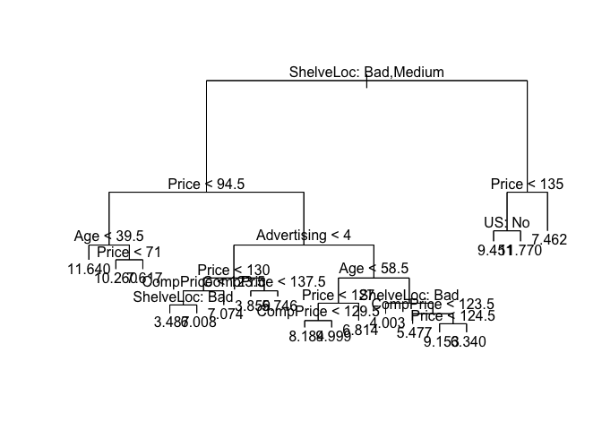
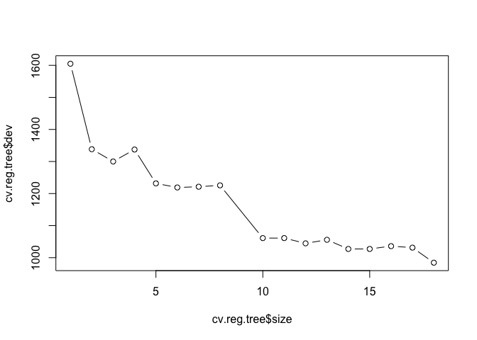
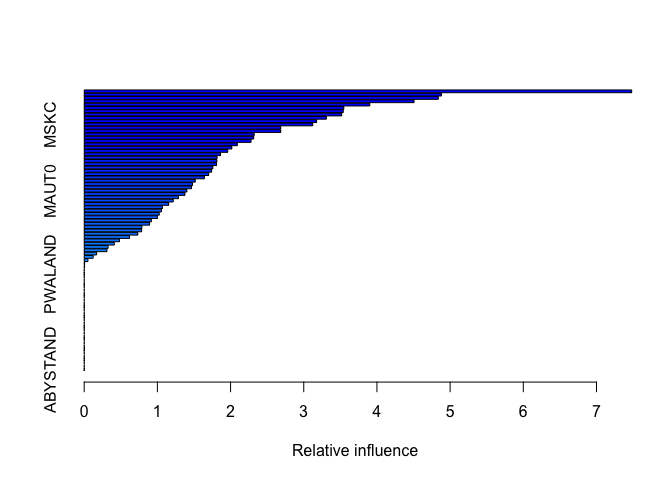

# Chapter 8 problems: 4,8(a-e), and 11

## Exercise 4
Attached seperately


## Exercise 8 (a-e)
"In the lab, a classification tree was applied to the Carseats data set after converting Sales into a qualitative response variable. Now we will seek to predict Sales using regression trees and related approaches, treating the response as a quantitative variable."

### a
"Split the data into a training and test set."

```r
library(ISLR2)
set.seed(1)
#training indices
train <- sample(1:nrow(Carseats), nrow(Carseats)/2)
training <- Carseats[train,]
testing <- Carseats[-train,]
```


### b
"Fit a regression tree to the training set. Plot the tree, and interpret the results. What test MSE do you obtain?"

```r
library(tree)
reg.tree <- tree(Sales ~., data = training)
plot(reg.tree)
text(reg.tree, pretty = 0)
```

<!-- -->

```r
summary(reg.tree)
```

```
## 
## Regression tree:
## tree(formula = Sales ~ ., data = training)
## Variables actually used in tree construction:
## [1] "ShelveLoc"   "Price"       "Age"         "Advertising" "CompPrice"  
## [6] "US"         
## Number of terminal nodes:  18 
## Residual mean deviance:  2.167 = 394.3 / 182 
## Distribution of residuals:
##     Min.  1st Qu.   Median     Mean  3rd Qu.     Max. 
## -3.88200 -0.88200 -0.08712  0.00000  0.89590  4.09900
```

```r
yhat <- predict(reg.tree, testing)
carseat_test <- testing$Sales
mean((yhat - carseat_test)^2)
```

```
## [1] 4.922039
```

As seen in the plot, the single predictor whose split is the most informative in predicting "Sales" is the qualitve predictor "ShelvLoc" split between "Good" and "Bad/Medium". After this split, the second most informative predictor split is "Price" for both "Good" and "Bad/Medium" shelving locations("ShelvLoc"). As indicated by the residual mean deviance in the summary of our regression tree, our tree has achieved a testing MSE of 4.922039 when using all predictors.


### c
"Use cross-validation in order to determine the optimal level of tree complexity. Does pruning the tree improve the test MSE?"

```r
set.seed(1)
cv.reg.tree <- cv.tree(reg.tree)
plot(cv.reg.tree$size, cv.reg.tree$dev, type = "b")
```

<!-- -->

```r
#check a pruned treee
prune.carseats <- prune.tree(reg.tree, best = 14)
yhat.prune <- predict(prune.carseats, testing)
mean((yhat.prune - carseat_test)^2)
```

```
## [1] 5.013738
```

As indicated in the plot above, the tree with 18 terminal nodes(the most complex tree) is the tree that yields the lowest CV MSE. Thus pruning the tree will likely increase our test MSE, which is seen to be true with a 15 terminal node prune tree giving a test MSE of 5.013738.

### d
"Use the bagging approach in order to analyze this data. What test MSE do you obtain? Use the importance() function to determine which variables are most important."

```r
library(randomForest)
```

```
## randomForest 4.7-1.1
```

```
## Type rfNews() to see new features/changes/bug fixes.
```

```r
set.seed(1)
#there are 10 predictors in the Carseats data set.
bag.Carseats <- randomForest(Sales ~., data = training, mtry = 10)
yhat.BG <- predict(bag.Carseats, testing)
mean((yhat.BG - carseat_test)^2)
```

```
## [1] 2.592505
```

Our bagging model produces a test MSE of 2.592505 which is significantly lower than the simple regression tree.


### e
"Use random forests to analyze this data. What test MSE do you obtain? Use the importance() function to determine which variables are most important. Describe the effect of m, the number of variables considered at each split, on the error rate obtained."


```r
rf.Carseats2 <- randomForest(Sales ~., data = training, mtry = 2)
yhat.rf2 <- predict(rf.Carseats2, testing)
#Test MSE for m = 2
mean((yhat.rf2 - carseat_test)^2)
```

```
## [1] 3.487251
```

```r
rf.Carseats3 <- randomForest(Sales ~., data = training, mtry = 3)
yhat.rf3 <- predict(rf.Carseats3, testing)
#Test MSE for m = 3
mean((yhat.rf3 - carseat_test)^2)
```

```
## [1] 3.00501
```

```r
importance(rf.Carseats3)
```

```
##             IncNodePurity
## CompPrice       155.58640
## Income          124.42572
## Advertising     111.55193
## Population      100.05530
## Price           387.00354
## ShelveLoc       287.87584
## Age             177.74219
## Education        70.51751
## Urban            15.72332
## US               30.97174
```

```r
rf.Carseats4 <- randomForest(Sales ~., data = training, mtry = 4)
yhat.rf4 <- predict(rf.Carseats4, testing)
#Test MSE for m = 4
mean((yhat.rf4 - carseat_test)^2)
```

```
## [1] 2.816532
```

```r
importance(rf.Carseats4)
```

```
##             IncNodePurity
## CompPrice       158.01777
## Income          116.17169
## Advertising     101.81103
## Population       88.12935
## Price           424.79328
## ShelveLoc       329.57904
## Age             169.96447
## Education        64.13502
## Urban            13.35515
## US               30.84049
```

```r
rf.Carseats5 <- randomForest(Sales ~., data = training, mtry = 5)
yhat.rf5 <- predict(rf.Carseats5, testing)
#Test MSE for m = 5
mean((yhat.rf5 - carseat_test)^2)
```

```
## [1] 2.728352
```

```r
importance(rf.Carseats5)
```

```
##             IncNodePurity
## CompPrice       162.96285
## Income          104.98865
## Advertising     105.90215
## Population       79.54401
## Price           447.38489
## ShelveLoc       340.35188
## Age             173.54801
## Education        64.31514
## Urban            12.29371
## US               25.16482
```

```r
rf.Carseats6 <- randomForest(Sales ~., data = training, mtry = 6)
yhat.rf6 <- predict(rf.Carseats6, testing)
#Test MSE for m = 6
mean((yhat.rf6 - carseat_test)^2)
```

```
## [1] 2.641292
```

```r
importance(rf.Carseats6)
```

```
##             IncNodePurity
## CompPrice       165.82186
## Income          105.25124
## Advertising     106.06003
## Population       71.85005
## Price           462.84004
## ShelveLoc       350.07026
## Age             164.59850
## Education        54.01804
## Urban            11.13832
## US               22.32301
```

Our random forest model with m = 3 produced a test MSE of 2.939203, but with m = 4 our test MSE was 2.773733, m = 5: 2.72356, and m= 6: 2.646605. As we can see, as m increases, so does our test MSE. In all models "Price" and "ShelveLoc" were the most important predictors.

## Exercise 11
"Caravan data set"

### a 
"Create a training set consisting of the first 1,000 observations,
and a test set consisting of the remaining observations."

```r
library(ISLR2)
trainingC <- Caravan[1:1000,]
testingC <- Caravan[1001:dim(Caravan)[1],]
trainingC1 <- Caravan[1:1000,]
testingC1 <- Caravan[1001:dim(Caravan)[1],]
```


### b 
"Fit a boosting model to the training set with Purchase as the response and the other variables as predictors. Use 1,000 trees, and a shrinkage value of 0.01. Which predictors appear to be the most important?"


```r
library(gbm)
```

```
## Loaded gbm 2.1.8.1
```

```r
set.seed(1)
# predictors PVRAAUT and AVRAAUT have no variation
trainingC$Purchase <- ifelse(trainingC$Purchase=="Yes", 1, 0)
boost.caravan <- gbm(Purchase ~ ., data = trainingC, distribution = "bernoulli", n.trees = 1000, interaction.depth = 4, shrinkage = 0.01)
```

```
## Warning in gbm.fit(x = x, y = y, offset = offset, distribution = distribution, :
## variable 50: PVRAAUT has no variation.
```

```
## Warning in gbm.fit(x = x, y = y, offset = offset, distribution = distribution, :
## variable 71: AVRAAUT has no variation.
```

```r
#rm(trainingC$Purchase)
summary(boost.caravan)
```

<!-- -->

```
##               var     rel.inf
## PPERSAUT PPERSAUT 7.480819014
## MOPLHOOG MOPLHOOG 4.882054338
## MGODGE     MGODGE 4.838869962
## MKOOPKLA MKOOPKLA 4.507280400
## MOSTYPE   MOSTYPE 3.902338079
## MGODPR     MGODPR 3.547892360
## PBRAND     PBRAND 3.539487907
## MBERMIDD MBERMIDD 3.518082698
## MBERARBG MBERARBG 3.309004843
## MINK3045 MINK3045 3.175313873
## MSKC         MSKC 3.123008472
## MSKA         MSKA 2.685844523
## MAUT2       MAUT2 2.685548007
## MAUT1       MAUT1 2.322786246
## PWAPART   PWAPART 2.316252267
## MSKB1       MSKB1 2.279820190
## MRELOV     MRELOV 2.092410309
## MFWEKIND MFWEKIND 2.017651081
## MBERHOOG MBERHOOG 1.961378700
## MBERARBO MBERARBO 1.862074416
## MRELGE     MRELGE 1.815276446
## MINK7512 MINK7512 1.812894054
## MINKM30   MINKM30 1.808781053
## MOPLMIDD MOPLMIDD 1.757784665
## MFGEKIND MFGEKIND 1.741172971
## MGODOV     MGODOV 1.701539077
## MZFONDS   MZFONDS 1.641658796
## MFALLEEN MFALLEEN 1.517763739
## MSKB2       MSKB2 1.480397941
## MINK4575 MINK4575 1.466410983
## MAUT0       MAUT0 1.403097259
## ABRAND     ABRAND 1.375696683
## MHHUUR     MHHUUR 1.287672857
## MINKGEM   MINKGEM 1.216351643
## MHKOOP     MHKOOP 1.154970948
## MGEMLEEF MGEMLEEF 1.068800262
## MGODRK     MGODRK 1.056066524
## MRELSA     MRELSA 1.025383382
## MZPART     MZPART 0.999705745
## MSKD         MSKD 0.917077921
## MGEMOMV   MGEMOMV 0.893757812
## MBERZELF MBERZELF 0.788935429
## APERSAUT APERSAUT 0.784652995
## MOPLLAAG MOPLLAAG 0.732210597
## MOSHOOFD MOSHOOFD 0.618703929
## PMOTSCO   PMOTSCO 0.481824116
## PLEVEN     PLEVEN 0.410808274
## PBYSTAND PBYSTAND 0.326851643
## MBERBOER MBERBOER 0.311571820
## MINK123M MINK123M 0.169710044
## MAANTHUI MAANTHUI 0.122660387
## ALEVEN     ALEVEN 0.051158218
## PAANHANG PAANHANG 0.006040057
## PFIETS     PFIETS 0.004694048
## PWABEDR   PWABEDR 0.000000000
## PWALAND   PWALAND 0.000000000
## PBESAUT   PBESAUT 0.000000000
## PVRAAUT   PVRAAUT 0.000000000
## PTRACTOR PTRACTOR 0.000000000
## PWERKT     PWERKT 0.000000000
## PBROM       PBROM 0.000000000
## PPERSONG PPERSONG 0.000000000
## PGEZONG   PGEZONG 0.000000000
## PWAOREG   PWAOREG 0.000000000
## PZEILPL   PZEILPL 0.000000000
## PPLEZIER PPLEZIER 0.000000000
## PINBOED   PINBOED 0.000000000
## AWAPART   AWAPART 0.000000000
## AWABEDR   AWABEDR 0.000000000
## AWALAND   AWALAND 0.000000000
## ABESAUT   ABESAUT 0.000000000
## AMOTSCO   AMOTSCO 0.000000000
## AVRAAUT   AVRAAUT 0.000000000
## AAANHANG AAANHANG 0.000000000
## ATRACTOR ATRACTOR 0.000000000
## AWERKT     AWERKT 0.000000000
## ABROM       ABROM 0.000000000
## APERSONG APERSONG 0.000000000
## AGEZONG   AGEZONG 0.000000000
## AWAOREG   AWAOREG 0.000000000
## AZEILPL   AZEILPL 0.000000000
## APLEZIER APLEZIER 0.000000000
## AFIETS     AFIETS 0.000000000
## AINBOED   AINBOED 0.000000000
## ABYSTAND ABYSTAND 0.000000000
```

With interaction depth = 4, the predictors "PPERSAUT","MOPLHOOG", and "MGODGE" are the three most important.


### c
"Use the boosting model to predict the response on the test data. Predict that a person will make a purchase if the estimated probability of purchase is greater than 20 %. Form a confusion matrix. What fraction of the people predicted to make a purchase do in fact make one? How does this compare with the results obtained from applying KNN or logistic regression to this data set?"


```r
set.seed(1)
testingC$Purchase <- ifelse(testingC$Purchase=="Yes", 1, 0)
yhatsB <- predict(boost.caravan, testingC)
```

```
## Using 1000 trees...
```

```r
yhatsB <- ifelse(yhatsB >0.2,1,0)
table(yhatsB, testingC$Purchase)
```

```
##       
## yhatsB    0    1
##      0 4509  279
##      1   24   10
```

```r
10 / (24 + 10)
```

```
## [1] 0.2941176
```

We can see that 10/34 people who were predicted to make a purchase actually make a purchase.

Now we compare with logistic regression and KNN


```r
#KNN
library(class)
set.seed(1)
trainingC1$Purchase <- ifelse(trainingC1$Purchase=="Yes", 1, 0)
testingC1 <- ifelse(testingC$Purchase == "Yes",1,0)
knn.pred3 <- knn(trainingC1[,1:85], testingC[,1:85], trainingC1$Purchase, k = 3)
#yhatsKNN <- ifelse(knn.pred3 >0.2,1,0)
table(knn.pred3, testingC1)
```

```
##          testingC1
## knn.pred3    0
##         0 4749
##         1   73
```


```r
# logistic regression
set.seed(1)
glmCaravan <- glm(Purchase ~., data = trainingC, family = "binomial")
```

```
## Warning: glm.fit: fitted probabilities numerically 0 or 1 occurred
```

```r
logpreds <- predict(glmCaravan, testingC)
```

```
## Warning in predict.lm(object, newdata, se.fit, scale = 1, type = if (type == :
## prediction from a rank-deficient fit may be misleading
```

```r
yhatslog <- ifelse(logpreds >0.2,1,0)
table(yhatslog, testingC$Purchase)
```

```
##         
## yhatslog    0    1
##        0 4451  274
##        1   82   15
```


With K = 3 for KNN, we get a fraction of only 289/4822 and for logistic regression we get a fraction of 15/97. Thus our boosting model outperforms theses KNN and logistic regression models in terms of accuracy when the models predicts a customer to make a purchase.


