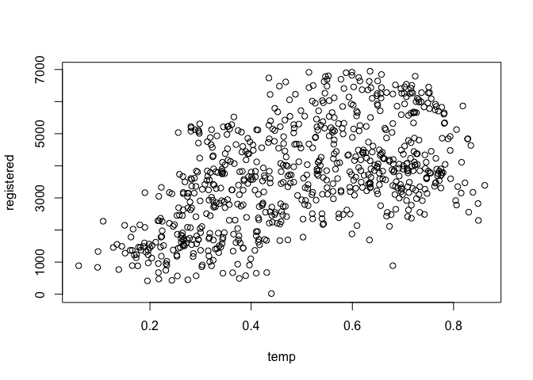
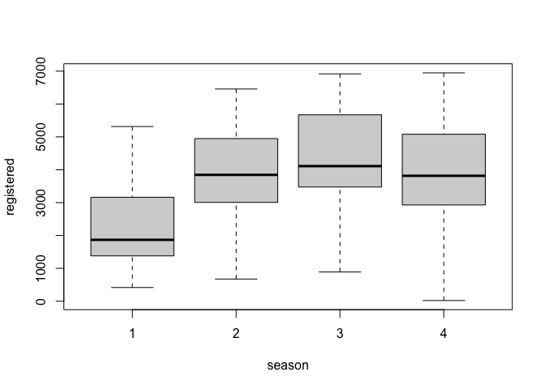
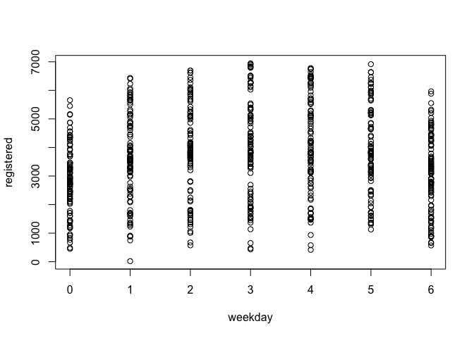
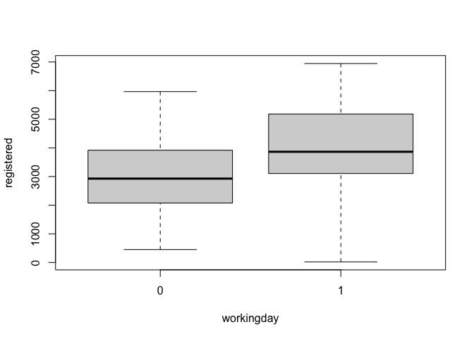
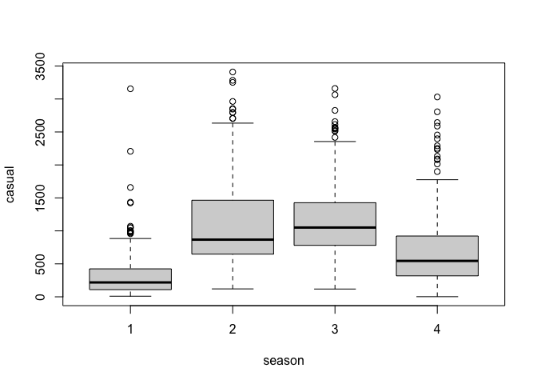
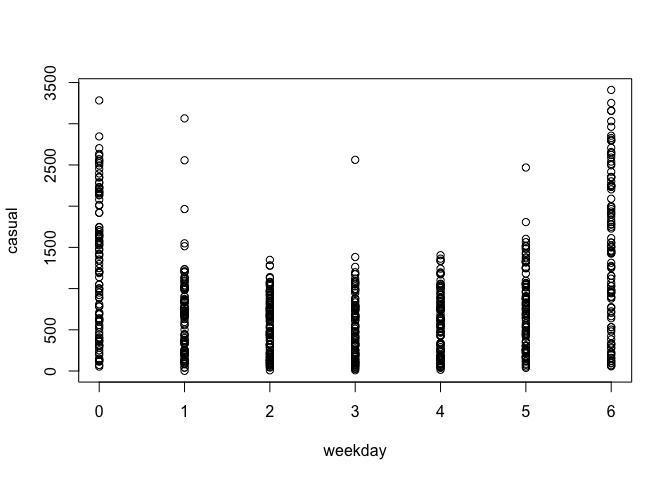
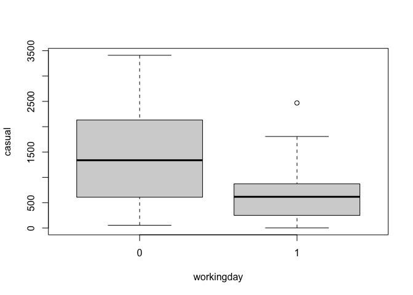
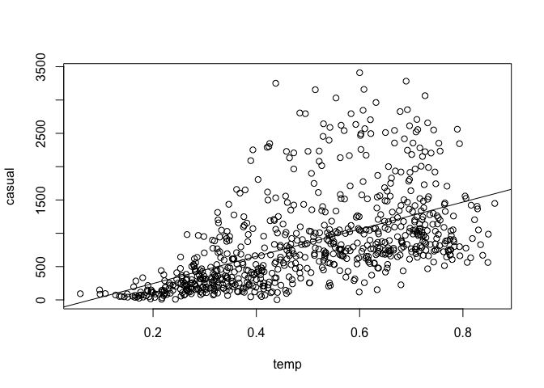

## Exercise 1

First I noticed a generally positive, roughly linear relationship between registered bike rentals and temperature.

```r
bike <- read.csv("bike.csv")
#Temperature and registered bike rentals
plot(registered ~ temp, data = bike)
```

<!-- -->

Next I observed that the season does have some association with registered bike rentals, as registered rentals are lowest during the winter and much higher during the rest of the year.

```r
#registered bike rentals and season
bike$season <- factor(bike$season)
boxplot(registered ~ season, data = bike)
```

<!-- -->

I saw some association between day of the week and registed bike rentals, as there are fewer registered rentals during the weekend (days 0 and 6).

```r
#registered bike rentals and week day
plot(registered ~ weekday, data = bike)
```

<!-- -->

Similar to the above association, I noticed that registered bike rentals occured more frequently on non-holiday weekdays. This could be because most registered bike rentals are used for commuting.

```r
#make "workingday" variable categorical
bike$workingday <- factor(bike$workingday)
#box plot of our categorical working day variable and registered rentals
boxplot(registered ~ workingday, data = bike)
```

<!-- -->

## Exercise 2

Interesting the association between casual bike rentals and temperature appears to be stronger, likely because casual bikers care more about the weather during thier ride.

```r
#casual bike rentals and temperature
plot(casual ~ temp, data = bike)
```

<!-- -->

Similarly to registered rentals, casual rentals were lowest in the winter, but interestingly seem to be highest in the spring, which wasn't seen among registered rentals.

```r
#make our season variable categorical
bike$season <- factor(bike$season)
#box plot of season and casual rentals
boxplot(casual ~ season, data = bike)
```

<!-- -->

Unsurprisingly, I found that casual bike rentals were much higher on the weekend (days 0 and 6) in comparison to weekdays were casual riders don't use bikes for commuting. 

```r
#casual bike rentals and day of the week plot
plot(casual ~ weekday, data = bike)
```

<!-- -->

Finally, I found that casual bike rentals were much higher during holiday and weekends in comparison to working days.

```r
#categorize "workingday" variable
bike$workingday <- factor(bike$workingday)
#box plot of working day and casual rentals
boxplot(casual ~ workingday, data = bike)
```

<!-- -->

## Exercise 3

From the associations investigated in exercises 1 and 2, the relationship between casual bike rentals and temperature seems to be quite linear. As temperature increases, it appears as though variance also increases. The Least Squares regression model shown in the plot appears to fit the data fairly well.


```r
#casual bike rentals and temperature
plot(casual ~ temp, data = bike)
#create the least squares regression model
m1 <- lm(casual ~ temp, data = bike)
#add the linear model to the plot
abline(m1)
```

<!-- -->

