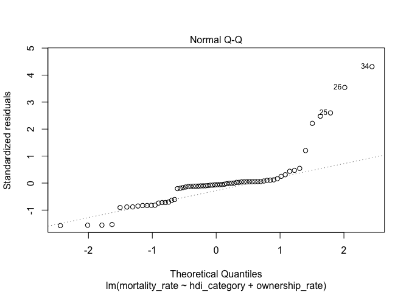
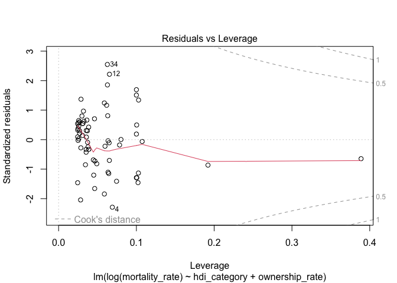

```r
guns <- read.csv("guns.csv")
```

# Exercise 1
"Find a multiple linear regression model with mortality_rate as the response variable and hdi and ownership_rate as predictors. Check if the conditions for LS squares regression are satisfied."


```r
m1 = lm(mortality_rate ~ hdi + ownership_rate, data = guns)
summary(m1)
```

```
## 
## Call:
## lm(formula = mortality_rate ~ hdi + ownership_rate, data = guns)
## 
## Residuals:
##     Min      1Q  Median      3Q     Max 
## -17.993  -4.175  -0.746   1.060  39.730 
## 
## Coefficients:
##                 Estimate Std. Error t value Pr(>|t|)    
## (Intercept)     38.77911    8.23823   4.707 1.33e-05 ***
## hdi            -43.61048   10.75465  -4.055 0.000135 ***
## ownership_rate   0.07853    0.08234   0.954 0.343723    
## ---
## Signif. codes:  0 '***' 0.001 '**' 0.01 '*' 0.05 '.' 0.1 ' ' 1
## 
## Residual standard error: 9.393 on 66 degrees of freedom
##   (6 observations deleted due to missingness)
## Multiple R-squared:  0.202,	Adjusted R-squared:  0.1778 
## F-statistic: 8.353 on 2 and 66 DF,  p-value: 0.0005836
```

```r
plot(m1)
```

<!-- --><!-- --><!-- --><!-- -->
Since the model line in the Residuals vs Fitted values plot is not horizontal and we don't see evenly spread values about a horizontal line, there is some indication that our data has non-linear relationships.

As seen in the Normal Q-Q plot, the data appears normal distributed as most points follows the line of normal distribution.

As seen in the Scale-Location plot, we have significantly increasing, and thus non-constant variance in the residuals of the data set. This suggests our linear model is not quite capturing the data well.

As seen in the Residuals vs Leverage plot, there are no points beyond Cook's distance, so there are no influential outlines.

These plots provide a good check of the assumptions for linear regression, and generally we can see that our this model fits this data somewhat poorly.


# Exercise 2
"Find a multiple linear regression model with the log of mortality rate as the response variable and hdi and ownership rate as predictors. Check if the assumptions for LS squares regression are satisfied."


```r
m2 = lm(log(mortality_rate) ~ hdi + ownership_rate, data = guns)
summary(m1)
```

```
## 
## Call:
## lm(formula = mortality_rate ~ hdi + ownership_rate, data = guns)
## 
## Residuals:
##     Min      1Q  Median      3Q     Max 
## -17.993  -4.175  -0.746   1.060  39.730 
## 
## Coefficients:
##                 Estimate Std. Error t value Pr(>|t|)    
## (Intercept)     38.77911    8.23823   4.707 1.33e-05 ***
## hdi            -43.61048   10.75465  -4.055 0.000135 ***
## ownership_rate   0.07853    0.08234   0.954 0.343723    
## ---
## Signif. codes:  0 '***' 0.001 '**' 0.01 '*' 0.05 '.' 0.1 ' ' 1
## 
## Residual standard error: 9.393 on 66 degrees of freedom
##   (6 observations deleted due to missingness)
## Multiple R-squared:  0.202,	Adjusted R-squared:  0.1778 
## F-statistic: 8.353 on 2 and 66 DF,  p-value: 0.0005836
```

```r
plot(m1)
```

<!-- --><!-- --><!-- --><!-- -->
As seen in the Residuals vs Fitted graph, the line is roughly horizontal with roughly constant variance, indicating we most likely don't have non-linear relationships.

In the Normal Q-Q plot, the data looks to be distributed normally.

In the Scale-Location plot, we see a fairly horizontal line with near-constant variance, which indicates our model is capturing the linear behavior.

In the Residuals vs Leverage plot, we don't see any points beyond Cook's distance, so there are no influential outliers in the plot.

These plots provide a good check of the assumptions for linear regression, and we can see that while there are some model-data discrepancies, overall this linear model fits the data much better than the model in Exercise 1.

# Exercise 3
"Which of the models from exercises 2 and 3 met the assumptions best? Which had the higher R2?"

The model in Exercise 2, based on the log of mortality rate as the response variable met the assumptions better than the Exercise 1 model. The log(mortality_rate) model also and had larger R^2 and R^2 adjusted values.

# Exercise 4
"For the best model (according to exerise 3), interpret the output, including a description for the slopes."

Both predictor coefficient estimations are significant, as well as the model in general with p value 4.318e-05.Holding gun ownership_rate constant, and increase of one unit of hdi correlates with a decrease in the log of mortality_rate by 6.47. Holding hdi constant, an increase of one unit of gun ownership_rate corresponds to a 0.0428 unit increase in the log of mortality_rate.

# Exercise 5
"Is there a significant interaction between hdi and gun ownership? If so, interpret the interaction."

```r
m3 = lm(log(mortality_rate) ~ hdi* ownership_rate, data = guns)
summary(m3)
```

```
## 
## Call:
## lm(formula = log(mortality_rate) ~ hdi * ownership_rate, data = guns)
## 
## Residuals:
##     Min      1Q  Median      3Q     Max 
## -3.1114 -1.0354  0.2524  0.8455  3.1742 
## 
## Coefficients:
##                    Estimate Std. Error t value Pr(>|t|)   
## (Intercept)         4.81465    1.59987   3.009  0.00372 **
## hdi                -6.20265    1.99469  -3.110  0.00278 **
## ownership_rate      0.06912    0.12869   0.537  0.59300   
## hdi:ownership_rate -0.03056    0.14858  -0.206  0.83771   
## ---
## Signif. codes:  0 '***' 0.001 '**' 0.01 '*' 0.05 '.' 0.1 ' ' 1
## 
## Residual standard error: 1.337 on 65 degrees of freedom
##   (6 observations deleted due to missingness)
## Multiple R-squared:  0.263,	Adjusted R-squared:  0.229 
## F-statistic: 7.733 on 3 and 65 DF,  p-value: 0.0001709
```

As seen in the summary of the log of mortality_rate model, the interactive effects between hdi and gun ownership rate has a p-value of 0.838. This is significantly greater than 0.05, so we accept our null hypothesis which states that there are no interactive effects between hdi and gun ownership_rate.

# Exercise 6
## 1

```r
guns$hdi_category <- factor(guns$hdi_category, levels = c("low","medium","high","very high"))
m4 = lm(mortality_rate ~ hdi_category + ownership_rate, data = guns)
summary(m4)
```

```
## 
## Call:
## lm(formula = mortality_rate ~ hdi_category + ownership_rate, 
##     data = guns)
## 
## Residuals:
##     Min      1Q  Median      3Q     Max 
## -14.087  -5.445  -0.531   0.544  39.431 
## 
## Coefficients:
##                       Estimate Std. Error t value Pr(>|t|)
## (Intercept)            4.55141    9.45053   0.482    0.632
## hdi_categorymedium    10.15057    9.90589   1.025    0.309
## hdi_categoryhigh       3.10811    9.75583   0.319    0.751
## hdi_categoryvery high -3.41087    9.61838  -0.355    0.724
## ownership_rate         0.04317    0.08052   0.536    0.594
## 
## Residual standard error: 9.443 on 64 degrees of freedom
##   (6 observations deleted due to missingness)
## Multiple R-squared:  0.2179,	Adjusted R-squared:  0.169 
## F-statistic: 4.458 on 4 and 64 DF,  p-value: 0.003062
```

```r
plot(m4)
```

```
## Warning: not plotting observations with leverage one:
##   69
```

<!-- --><!-- --><!-- --><!-- -->
Since the model line in the Residual vs Fitted plot is not horizontal and we don't see evenly spread values about a horizontal line, there is some indication that our data has non-linear relationships.

As seen in the Normal Q-Q plot, the data appears fairly normally distributed as most points follows the line of normal distribution.

As seen in the Scale-Location plot, we have significantly increasing, and thus non-constant variance in the residuals of the data set. This suggests our linear model is not quite capturing the data well.

As seen in the Residuals vs Leverage plot, there are no points beyond Cook's distance, no there are no influential outlines.

These plots provide a good check of the assumptions for linear regression, and generally we can see that our this model fits this data somewhat poorly.


## 2

```r
m6 = lm(log(mortality_rate) ~ hdi_category + ownership_rate, data = guns)
summary(m6)
```

```
## 
## Call:
## lm(formula = log(mortality_rate) ~ hdi_category + ownership_rate, 
##     data = guns)
## 
## Residuals:
##     Min      1Q  Median      3Q     Max 
## -2.9978 -0.9235  0.0387  0.7655  3.3464 
## 
## Coefficients:
##                       Estimate Std. Error t value Pr(>|t|)   
## (Intercept)            1.38363    1.35737   1.019  0.31188   
## hdi_categorymedium     0.04621    1.42277   0.032  0.97419   
## hdi_categoryhigh      -1.17786    1.40122  -0.841  0.40371   
## hdi_categoryvery high -1.87046    1.38148  -1.354  0.18051   
## ownership_rate         0.03794    0.01156   3.281  0.00168 **
## ---
## Signif. codes:  0 '***' 0.001 '**' 0.01 '*' 0.05 '.' 0.1 ' ' 1
## 
## Residual standard error: 1.356 on 64 degrees of freedom
##   (6 observations deleted due to missingness)
## Multiple R-squared:  0.2531,	Adjusted R-squared:  0.2064 
## F-statistic: 5.422 on 4 and 64 DF,  p-value: 0.0008008
```

```r
plot(m6)
```

```
## Warning: not plotting observations with leverage one:
##   69
```

<!-- --><!-- --><!-- --><!-- -->
As seen in the Residuals vs Fitted values plot, the model line is roughly horizontal with roughly constant variance, indicating we most likely don't have any non-linear relationships.

In the Normal Q-Q plot, the data looks to be distributed normally.

In the Scale-Location plot, we see a fairly horizontal line with near-constant variance, which indicates our model is capturing the linear behavior.

In the Residuals vs Leverage plot, we don't see any points beyond Cook's distance, so there are no influential outliers in the plot.
These plots provide a good check of the assumptions for linear regression, and we can see that while there are some model-data discrepancies, overall this linear model fits the data much better than the model in Exercise 1.

## 3 

Once again the model with the log of the mortality rate as the response was the better model, as it met the assumptions of linearity best and had higher R^2 and R^2 adjusted values.

## 4

```r
m7 = lm(log(mortality_rate) ~ hdi_category + ownership_rate, data = guns)
summary(m7)
```

```
## 
## Call:
## lm(formula = log(mortality_rate) ~ hdi_category + ownership_rate, 
##     data = guns)
## 
## Residuals:
##     Min      1Q  Median      3Q     Max 
## -2.9978 -0.9235  0.0387  0.7655  3.3464 
## 
## Coefficients:
##                       Estimate Std. Error t value Pr(>|t|)   
## (Intercept)            1.38363    1.35737   1.019  0.31188   
## hdi_categorymedium     0.04621    1.42277   0.032  0.97419   
## hdi_categoryhigh      -1.17786    1.40122  -0.841  0.40371   
## hdi_categoryvery high -1.87046    1.38148  -1.354  0.18051   
## ownership_rate         0.03794    0.01156   3.281  0.00168 **
## ---
## Signif. codes:  0 '***' 0.001 '**' 0.01 '*' 0.05 '.' 0.1 ' ' 1
## 
## Residual standard error: 1.356 on 64 degrees of freedom
##   (6 observations deleted due to missingness)
## Multiple R-squared:  0.2531,	Adjusted R-squared:  0.2064 
## F-statistic: 5.422 on 4 and 64 DF,  p-value: 0.0008008
```
Holding all other predictors constant, an increase of one unit in ownership rates corresponds to a 0.0379 increase in the log of the mortality rate. The model generally is significant with a low p-value of 0.0008, but has low R-squared and adjusted R-squared values of 0.253 and 0.206 respectively.

## 5 

```r
m8 = lm(log(mortality_rate) ~ hdi_category * ownership_rate, data = guns)
summary(m8)
```

```
## 
## Call:
## lm(formula = log(mortality_rate) ~ hdi_category * ownership_rate, 
##     data = guns)
## 
## Residuals:
##     Min      1Q  Median      3Q     Max 
## -3.0747 -0.8627  0.0425  0.8003  3.2993 
## 
## Coefficients: (1 not defined because of singularities)
##                                       Estimate Std. Error t value Pr(>|t|)   
## (Intercept)                           1.387533   1.355679   1.023  0.31005   
## hdi_categorymedium                   -0.873272   1.554806  -0.562  0.57637   
## hdi_categoryhigh                     -1.082281   1.443522  -0.750  0.45624   
## hdi_categoryvery high                -1.859095   1.382222  -1.345  0.18352   
## ownership_rate                        0.037089   0.013289   2.791  0.00697 **
## hdi_categorymedium:ownership_rate     0.133927   0.092443   1.449  0.15244   
## hdi_categoryhigh:ownership_rate      -0.005614   0.027548  -0.204  0.83920   
## hdi_categoryvery high:ownership_rate        NA         NA      NA       NA   
## ---
## Signif. codes:  0 '***' 0.001 '**' 0.01 '*' 0.05 '.' 0.1 ' ' 1
## 
## Residual standard error: 1.354 on 62 degrees of freedom
##   (6 observations deleted due to missingness)
## Multiple R-squared:  0.2786,	Adjusted R-squared:  0.2088 
## F-statistic: 3.991 on 6 and 62 DF,  p-value: 0.001932
```

```r
summary(factor(guns$hdi_category))
```

```
##       low    medium      high very high      NA's 
##         1        10        17        41         6
```
As seen in the summary for the model above, there is no significant interactions between any hdi categories and ownership rate, so we accept the null hypothesis: there is no interactive effects between hdi category and ownership rates.
