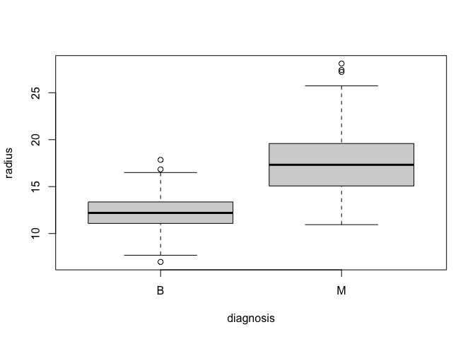

```r
#import dataset
bc <- read.csv("bc.csv")

#boxplots of each predictor and the response diagnosis
for(i in 2:11){
  boxplot(bc[,i] ~ bc[,1], 
          xlab = "diagnosis",
          ylab = names(bc)[i])
}
```

<!-- --><!-- --><!-- --><!-- --><!-- --><!-- --><!-- --><!-- --><!-- --><!-- -->

```r
#relationships among the predictors
plot(bc)
```

<!-- -->

```r
#ensures diagnosis is categorical
bc$diagnosis <- factor(bc$diagnosis)
#logistic regression using all predictors
m1 <- glm(diagnosis ~., family = "binomial", data = bc)
```

```
## Warning: glm.fit: fitted probabilities numerically 0 or 1 occurred
```

```r
summary(m1)
```

```
## 
## Call:
## glm(formula = diagnosis ~ ., family = "binomial", data = bc)
## 
## Deviance Residuals: 
##      Min        1Q    Median        3Q       Max  
## -1.95590  -0.14839  -0.03943   0.00429   2.91690  
## 
## Coefficients:
##                 Estimate Std. Error z value Pr(>|z|)    
## (Intercept)     -7.35952   12.85259  -0.573   0.5669    
## radius          -2.04930    3.71588  -0.551   0.5813    
## texture          0.38473    0.06454   5.961  2.5e-09 ***
## perimeter       -0.07151    0.50516  -0.142   0.8874    
## area             0.03980    0.01674   2.377   0.0174 *  
## smoothness      76.43227   31.95492   2.392   0.0168 *  
## compactness     -1.46242   20.34249  -0.072   0.9427    
## concavity        8.46870    8.12003   1.043   0.2970    
## concave.points  66.82176   28.52910   2.342   0.0192 *  
## symmetry        16.27824   10.63059   1.531   0.1257    
## fractal        -68.33703   85.55666  -0.799   0.4244    
## ---
## Signif. codes:  0 '***' 0.001 '**' 0.01 '*' 0.05 '.' 0.1 ' ' 1
## 
## (Dispersion parameter for binomial family taken to be 1)
## 
##     Null deviance: 751.44  on 568  degrees of freedom
## Residual deviance: 146.13  on 558  degrees of freedom
## AIC: 168.13
## 
## Number of Fisher Scoring iterations: 9
```


# Exercise 1
"Use logistic regression to predict breast cancer presence and estimate the proportion of incorrect classifications on test sets using 10-fold cross-validation."


```r
#logistic cross validation function
cv.log <- function(data, logfit, K){
  n <- dim(data)[1] # number of rows in the dataset 
  indexes <- rep_len(1:K, n) # fold numbers
  indexes <- sample(indexes, n) # shuffle the fold number
  
  # initialize a numeric vector for the errors of each fold
  err <- numeric() 
  
  y <- which(names(data) == all.vars(logfit$call)[1]) # column of y
  lev <- levels(data[,y])
  # run K-fold cross-validation
  for(i in 1:K) {
    fold <- which(indexes == i)
    m <- update(logfit, data = data[-fold,]) # train data
    pred <- predict(m, data[fold,], type = "response") # predict on i-th fold
    class <- rep(lev[1], length(fold))
    class[pred > 0.5] <- lev[2]
    err[i] <- 1 - mean(class == data[fold,y], na.rm=T)
  }
  return(mean(err))
}
m3 <- glm(diagnosis ~., family = "binomial", data = bc)
```

```
## Warning: glm.fit: fitted probabilities numerically 0 or 1 occurred
```

```r
#proportion of incorrect classifications
err1.1 <- cv.log(bc, m3, K = 10)
```

```
## Warning: glm.fit: fitted probabilities numerically 0 or 1 occurred

## Warning: glm.fit: fitted probabilities numerically 0 or 1 occurred

## Warning: glm.fit: fitted probabilities numerically 0 or 1 occurred

## Warning: glm.fit: fitted probabilities numerically 0 or 1 occurred

## Warning: glm.fit: fitted probabilities numerically 0 or 1 occurred

## Warning: glm.fit: fitted probabilities numerically 0 or 1 occurred

## Warning: glm.fit: fitted probabilities numerically 0 or 1 occurred

## Warning: glm.fit: fitted probabilities numerically 0 or 1 occurred

## Warning: glm.fit: fitted probabilities numerically 0 or 1 occurred

## Warning: glm.fit: fitted probabilities numerically 0 or 1 occurred
```

```r
err1.1
```

```
## [1] 0.06503759
```


# Exercise 2
"Use LDA to predict breast cancer presence and estimate the proportion of incorrect classifications on test sets using 10-fold cross-validation."


```r
set.seed(56)
#function from notes
cv.da <- function(data, dafit, K){
  n <- dim(data)[1] # number of rows in the dataset 
  indexes <- rep_len(1:K, n) # fold numbers
  indexes <- sample(indexes, n) # shuffle the fold number
  
  # initialize a numeric vector for the errors of each fold
  err <- numeric() 
  
  y <- which(names(data) == all.vars(dafit$call)[1]) # column of y
  # run K-fold cross-validation
  for(i in 1:K) {
    fold <- which(indexes == i)
    m <- update(dafit, data = data[-fold,]) # train data
    pred <- predict(m, data[fold,]) # predict on i-th fold
    err[i] <- 1 - mean(pred$class == data[fold,y], na.rm=T)
  }
  return(mean(err))
}
set.seed(56)
#create an LDA model
LDA_all_data <- lda(diagnosis ~ ., data = bc)
#determine proportional of incorrect classifications
err2.3 <- cv.da(bc, LDA_all_data, K = 10)
err2.3
```

```
## [1] 0.06494361
```


# Exercise 3
Use QDA to predict breast cancer presence and estimate the proportion of incorrect classifications on test sets using 10-fold cross-validation.


```r
set.seed(56)
#create
m7 <- qda(diagnosis ~ ., data = bc)
err3.3 <- cv.da(bc, m7, K=10)
err3.3
```

```
## [1] 0.06857769
```


# Exercise 4
Use KNN to predict breast cancer presence and estimate the proportion of incorrect classifications on test sets using 10-fold cross-validation.


```r
library(class)
set.seed(56)
#function for cross validation with KNN
cv.knn <- function(X, y, k, K){
  n <- length(y) # number of rows in the dataset 
  indexes <- rep_len(1:K, n) # fold numbers
  indexes <- sample(indexes, n) # shuffle the fold number
  
  # initialize a numeric vector for the errors of each fold
  err <- numeric() 
  
    # run K-fold cross-validation
  for(i in 1:K) {
    fold <- which(indexes == i)
    train.X <- data.frame(X[-fold,])
    test.X <- data.frame(X[fold, ])
    train.y <- y[-fold]
    test.y <- y[fold]
    class <- knn(train.X, test.X, train.y, k=k)
    err[i] <- 1 - mean(class == test.y, na.rm = T)
  }
  return(mean(err))
}
#create data fram with all but response column 
X <- data.frame(cbind(bc[,-1]))
err <- numeric()
#check value of k through 25
for(i in 1:25){
  err[i] <- cv.knn(X, bc$diagnosis, k=i, K=10)
}
#plot error with respect to k value
plot(err, type = "l")
```

<!-- -->

```r
#choose k-value with lowest error
err.index <- which.min(err)
#return the minimum error
err9.2 <- err[err.index]
err9.2
```

```
## [1] 0.1053258
```


# Exercise 5
What are your observations from the previous exercises?

I observed that LDA yielded the lowest test error, but the error rate was very close to that of the logistic egression. Thus the LDA model misclassified the test data the fewest number of time. We also noted that a high k-value (21) yielded the lowest error rate for KNN, but KNN still signifcantly incraesed the proportion of incorrectly classified points in comparison to the three other methods.

# Exercise 6
"Reduce the number of predictors to 5 (you may use the exploratory graphs from the lab instructions to make that choice) and re-do exercises 1-5."

First I used the step function to examine which predictors had the most significant association with diagnosis.

```r
filtered_model <- glm(diagnosis ~., family = "binomial", data = bc)
```

```
## Warning: glm.fit: fitted probabilities numerically 0 or 1 occurred
```

```r
s <- step(filtered_model)
```

```
## Start:  AIC=168.13
## diagnosis ~ radius + texture + perimeter + area + smoothness + 
##     compactness + concavity + concave.points + symmetry + fractal
```

```
## Warning: glm.fit: fitted probabilities numerically 0 or 1 occurred

## Warning: glm.fit: fitted probabilities numerically 0 or 1 occurred

## Warning: glm.fit: fitted probabilities numerically 0 or 1 occurred

## Warning: glm.fit: fitted probabilities numerically 0 or 1 occurred

## Warning: glm.fit: fitted probabilities numerically 0 or 1 occurred

## Warning: glm.fit: fitted probabilities numerically 0 or 1 occurred

## Warning: glm.fit: fitted probabilities numerically 0 or 1 occurred

## Warning: glm.fit: fitted probabilities numerically 0 or 1 occurred

## Warning: glm.fit: fitted probabilities numerically 0 or 1 occurred
```

```
##                  Df Deviance    AIC
## - compactness     1   146.14 166.14
## - perimeter       1   146.15 166.15
## - radius          1   146.44 166.44
## - fractal         1   146.78 166.78
## - concavity       1   147.23 167.23
## <none>                146.13 168.13
## - symmetry        1   148.44 168.44
## - area            1   151.63 171.63
## - concave.points  1   151.93 171.93
## - smoothness      1   152.42 172.42
## - texture         1   195.34 215.34
```

```
## Warning: glm.fit: fitted probabilities numerically 0 or 1 occurred
```

```
## 
## Step:  AIC=166.14
## diagnosis ~ radius + texture + perimeter + area + smoothness + 
##     concavity + concave.points + symmetry + fractal
```

```
## Warning: glm.fit: fitted probabilities numerically 0 or 1 occurred

## Warning: glm.fit: fitted probabilities numerically 0 or 1 occurred

## Warning: glm.fit: fitted probabilities numerically 0 or 1 occurred

## Warning: glm.fit: fitted probabilities numerically 0 or 1 occurred

## Warning: glm.fit: fitted probabilities numerically 0 or 1 occurred

## Warning: glm.fit: fitted probabilities numerically 0 or 1 occurred

## Warning: glm.fit: fitted probabilities numerically 0 or 1 occurred

## Warning: glm.fit: fitted probabilities numerically 0 or 1 occurred
```

```
##                  Df Deviance    AIC
## - perimeter       1   146.22 164.22
## - radius          1   146.52 164.52
## - concavity       1   147.25 165.25
## - fractal         1   147.27 165.27
## <none>                146.14 166.14
## - symmetry        1   148.46 166.46
## - concave.points  1   151.93 169.93
## - area            1   152.00 170.00
## - smoothness      1   152.45 170.45
## - texture         1   195.48 213.48
```

```
## Warning: glm.fit: fitted probabilities numerically 0 or 1 occurred
```

```
## 
## Step:  AIC=164.22
## diagnosis ~ radius + texture + area + smoothness + concavity + 
##     concave.points + symmetry + fractal
```

```
## Warning: glm.fit: fitted probabilities numerically 0 or 1 occurred

## Warning: glm.fit: fitted probabilities numerically 0 or 1 occurred

## Warning: glm.fit: fitted probabilities numerically 0 or 1 occurred

## Warning: glm.fit: fitted probabilities numerically 0 or 1 occurred

## Warning: glm.fit: fitted probabilities numerically 0 or 1 occurred

## Warning: glm.fit: fitted probabilities numerically 0 or 1 occurred

## Warning: glm.fit: fitted probabilities numerically 0 or 1 occurred
```

```
##                  Df Deviance    AIC
## - concavity       1   147.28 163.28
## <none>                146.22 164.22
## - fractal         1   148.30 164.30
## - symmetry        1   148.52 164.52
## - radius          1   150.19 166.19
## - concave.points  1   152.19 168.19
## - area            1   153.35 169.35
## - smoothness      1   153.39 169.39
## - texture         1   195.93 211.93
```

```
## Warning: glm.fit: fitted probabilities numerically 0 or 1 occurred
```

```
## 
## Step:  AIC=163.28
## diagnosis ~ radius + texture + area + smoothness + concave.points + 
##     symmetry + fractal
```

```
## Warning: glm.fit: fitted probabilities numerically 0 or 1 occurred

## Warning: glm.fit: fitted probabilities numerically 0 or 1 occurred

## Warning: glm.fit: fitted probabilities numerically 0 or 1 occurred

## Warning: glm.fit: fitted probabilities numerically 0 or 1 occurred

## Warning: glm.fit: fitted probabilities numerically 0 or 1 occurred

## Warning: glm.fit: fitted probabilities numerically 0 or 1 occurred
```

```
##                  Df Deviance    AIC
## - fractal         1   148.38 162.38
## <none>                147.28 163.28
## - symmetry        1   150.03 164.03
## - radius          1   153.04 167.04
## - smoothness      1   153.61 167.61
## - area            1   156.64 170.64
## - concave.points  1   170.51 184.51
## - texture         1   197.40 211.40
```

```
## Warning: glm.fit: fitted probabilities numerically 0 or 1 occurred
```

```
## 
## Step:  AIC=162.39
## diagnosis ~ radius + texture + area + smoothness + concave.points + 
##     symmetry
```

```
## Warning: glm.fit: fitted probabilities numerically 0 or 1 occurred

## Warning: glm.fit: fitted probabilities numerically 0 or 1 occurred

## Warning: glm.fit: fitted probabilities numerically 0 or 1 occurred

## Warning: glm.fit: fitted probabilities numerically 0 or 1 occurred

## Warning: glm.fit: fitted probabilities numerically 0 or 1 occurred
```

```
##                  Df Deviance    AIC
## <none>                148.38 162.38
## - symmetry        1   150.68 162.68
## - radius          1   153.44 165.44
## - smoothness      1   154.44 166.44
## - area            1   157.38 169.38
## - concave.points  1   172.31 184.31
## - texture         1   198.83 210.83
```

```r
summary(s)
```

```
## 
## Call:
## glm(formula = diagnosis ~ radius + texture + area + smoothness + 
##     concave.points + symmetry, family = "binomial", data = bc)
## 
## Deviance Residuals: 
##      Min        1Q    Median        3Q       Max  
## -1.94562  -0.15248  -0.04346   0.00366   2.89274  
## 
## Coefficients:
##                Estimate Std. Error z value Pr(>|z|)    
## (Intercept)    -8.61085    8.33550  -1.033  0.30159    
## radius         -2.72515    1.17554  -2.318  0.02044 *  
## texture         0.38522    0.06430   5.991 2.09e-09 ***
## area            0.04308    0.01428   3.017  0.00255 ** 
## smoothness     58.37855   23.49622   2.485  0.01297 *  
## concave.points 73.70154   16.21489   4.545 5.49e-06 ***
## symmetry       15.56212   10.25705   1.517  0.12921    
## ---
## Signif. codes:  0 '***' 0.001 '**' 0.01 '*' 0.05 '.' 0.1 ' ' 1
## 
## (Dispersion parameter for binomial family taken to be 1)
## 
##     Null deviance: 751.44  on 568  degrees of freedom
## Residual deviance: 148.39  on 562  degrees of freedom
## AIC: 162.39
## 
## Number of Fisher Scoring iterations: 9
```
As can be seen in the summary, the predictors, radius, texture, area smoothness, and concave.points were the five most significant predictors. Upon inspection of the plot of the relationships between predictors, radius is highly correlated with area, and area is more statistically significant in the summary so I decided to remove radius from the model. 

Next I used the step function again with these four inputs to see if any other inputs would be come significant, which they did not.

```r
set.seed(56)
m4p <- glm(diagnosis ~ texture + area + smoothness + concave.points, family = "binomial", data = bc)
```

```
## Warning: glm.fit: fitted probabilities numerically 0 or 1 occurred
```

```r
s <- step(m4p)
```

```
## Start:  AIC=166.44
## diagnosis ~ texture + area + smoothness + concave.points
```

```
## Warning: glm.fit: fitted probabilities numerically 0 or 1 occurred
```

```
##                  Df Deviance    AIC
## <none>                156.44 166.44
## - smoothness      1   161.70 169.70
## - concave.points  1   182.53 190.53
## - area            1   198.46 206.46
## - texture         1   205.46 213.46
```

```r
summary(s)
```

```
## 
## Call:
## glm(formula = diagnosis ~ texture + area + smoothness + concave.points, 
##     family = "binomial", data = bc)
## 
## Deviance Residuals: 
##      Min        1Q    Median        3Q       Max  
## -2.31798  -0.15623  -0.04212   0.01662   2.84201  
## 
## Coefficients:
##                  Estimate Std. Error z value Pr(>|z|)    
## (Intercept)    -23.677816   3.882774  -6.098 1.07e-09 ***
## texture          0.362687   0.060544   5.990 2.09e-09 ***
## area             0.010342   0.002002   5.165 2.40e-07 ***
## smoothness      59.471304  25.965153   2.290    0.022 *  
## concave.points  76.571210  16.427864   4.661 3.15e-06 ***
## ---
## Signif. codes:  0 '***' 0.001 '**' 0.01 '*' 0.05 '.' 0.1 ' ' 1
## 
## (Dispersion parameter for binomial family taken to be 1)
## 
##     Null deviance: 751.44  on 568  degrees of freedom
## Residual deviance: 156.44  on 564  degrees of freedom
## AIC: 166.44
## 
## Number of Fisher Scoring iterations: 8
```

Thus, exercises 1-5 will be repeated using only the four predictors texture, area, smoothness, and concave.points as seen in the summary above.


# Exercise 6: Repeat of Exercises 1-5

## 1 Logistic regression 

```r
set.seed(56)
kfold2 <- cv.glm(bc, m4p, K=10)
```

```
## Warning: glm.fit: fitted probabilities numerically 0 or 1 occurred

## Warning: glm.fit: fitted probabilities numerically 0 or 1 occurred

## Warning: glm.fit: fitted probabilities numerically 0 or 1 occurred

## Warning: glm.fit: fitted probabilities numerically 0 or 1 occurred

## Warning: glm.fit: fitted probabilities numerically 0 or 1 occurred

## Warning: glm.fit: fitted probabilities numerically 0 or 1 occurred

## Warning: glm.fit: fitted probabilities numerically 0 or 1 occurred

## Warning: glm.fit: fitted probabilities numerically 0 or 1 occurred
```

```r
err6.1 <- kfold2$delta[1]
err6.1
```

```
## [1] 0.04519457
```

## LDA 

```r
set.seed(56)

#create LDA model w the 4 predictors
mLDA_2 <- lda(diagnosis ~ texture + area + smoothness + concave.points, data = bc)
err6.21 <- cv.da(bc, mLDA_2, K=10)
err6.21
```

```
## [1] 0.08255013
```

##QDA

```r
set.seed(56)
#create a qda model with the 4 predictors
mqda2 <- qda(diagnosis ~ texture + area + smoothness + concave.points, data = bc)
err6.31 <- cv.da(bc, mqda2, K=10)
err6.31
```

```
## [1] 0.07211779
```

## KNN

```r
set.seed(56)
X <- data.frame(cbind(bc$texture, bc$area, bc$smoothness, bc$concave.points))
err2 <- numeric()
#expand range of k-values of 25 for testing
for(i in 1:25){
  err2[i] <- cv.knn(X, bc$diagnosis, k=i, K=10)
}
plot(err2, type = "l")
```

<!-- -->

```r
set.seed(56)
err2.index <- which.min(err2)
err7.4 <- err2[err2.index]
err7.4
```

```
## [1] 0.1054825
```


# Exercise 7
Which model would you choose to use for predicting the presence of breast cancer?

Seeing that the logisitic regression model with the four predictors (area, smoothness, texture, and concave points) yielded the lowest error rate (least amount of missclassifications of belign of malignant tumors) of 0.0452 , I would choose this model. Not only does this model make the lest mistakes, but it is also an advantage that the model uses only four predicors which makes it less computationally expensive.

