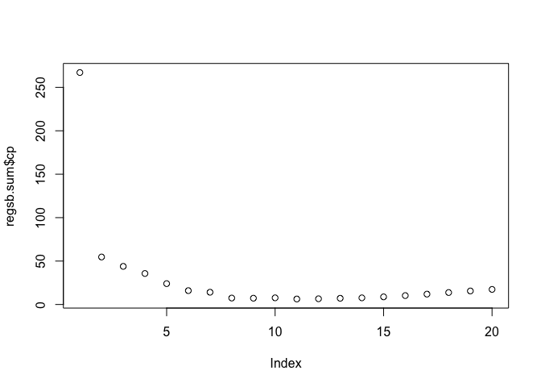
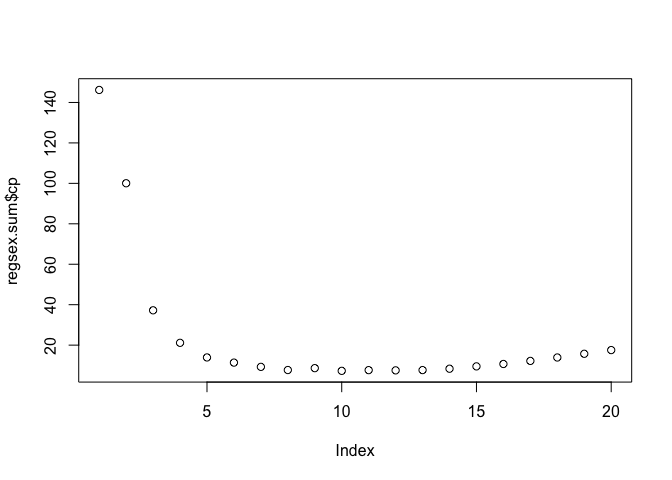
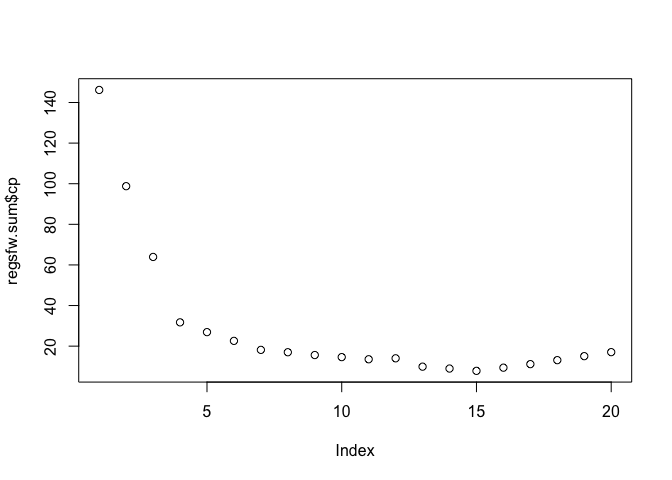
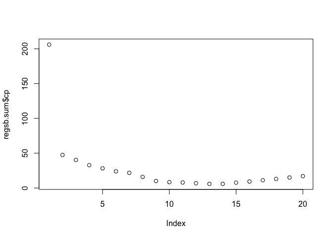
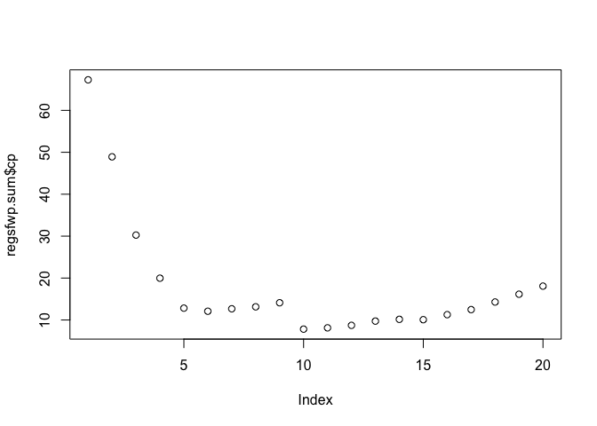
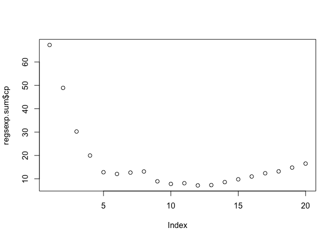

# Exercise 1
"Select a subset of the variables in the cars dataset to build a model with the goal of predicting city mpg. Do not select highway mpg. Compare exhaustive, forward, and backwards procedures (do they suggest the same variables?)"


```r
#forward
regs_fw <- regsubsets(city_mpg~ ., data = cars_dat[,-21], method = "forward", nvmax = 20)
regsfw.sum <- summary(regs_fw)
regsfw.sum
```

```
## Subset selection object
## Call: regsubsets.formula(city_mpg ~ ., data = cars_dat[, -21], method = "forward", 
##     nvmax = 20)
## 24 Variables  (and intercept)
##                 Forced in Forced out
## symboling           FALSE      FALSE
## losses              FALSE      FALSE
## fuelgas             FALSE      FALSE
## aspirationturbo     FALSE      FALSE
## doorstwo            FALSE      FALSE
## bodyhardtop         FALSE      FALSE
## bodyhatchback       FALSE      FALSE
## bodysedan           FALSE      FALSE
## bodywagon           FALSE      FALSE
## drivefwd            FALSE      FALSE
## driverwd            FALSE      FALSE
## wheelbase           FALSE      FALSE
## length              FALSE      FALSE
## width               FALSE      FALSE
## height              FALSE      FALSE
## weight              FALSE      FALSE
## cylinders           FALSE      FALSE
## enginesize          FALSE      FALSE
## bore                FALSE      FALSE
## stroke              FALSE      FALSE
## compression         FALSE      FALSE
## horsepower          FALSE      FALSE
## peakrpm             FALSE      FALSE
## price               FALSE      FALSE
## 1 subsets of each size up to 20
## Selection Algorithm: forward
##           symboling losses fuelgas aspirationturbo doorstwo bodyhardtop
## 1  ( 1 )  " "       " "    " "     " "             " "      " "        
## 2  ( 1 )  " "       " "    " "     " "             " "      " "        
## 3  ( 1 )  " "       " "    " "     " "             " "      " "        
## 4  ( 1 )  " "       " "    " "     " "             " "      " "        
## 5  ( 1 )  " "       " "    "*"     " "             " "      " "        
## 6  ( 1 )  " "       " "    "*"     " "             " "      " "        
## 7  ( 1 )  "*"       " "    "*"     " "             " "      " "        
## 8  ( 1 )  "*"       " "    "*"     " "             " "      " "        
## 9  ( 1 )  "*"       " "    "*"     " "             " "      " "        
## 10  ( 1 ) "*"       " "    "*"     " "             " "      " "        
## 11  ( 1 ) "*"       " "    "*"     " "             " "      " "        
## 12  ( 1 ) "*"       " "    "*"     " "             " "      " "        
## 13  ( 1 ) "*"       " "    "*"     " "             " "      " "        
## 14  ( 1 ) "*"       " "    "*"     " "             " "      "*"        
## 15  ( 1 ) "*"       " "    "*"     " "             " "      "*"        
## 16  ( 1 ) "*"       " "    "*"     "*"             " "      "*"        
## 17  ( 1 ) "*"       " "    "*"     "*"             " "      "*"        
## 18  ( 1 ) "*"       "*"    "*"     "*"             " "      "*"        
## 19  ( 1 ) "*"       "*"    "*"     "*"             "*"      "*"        
## 20  ( 1 ) "*"       "*"    "*"     "*"             "*"      "*"        
##           bodyhatchback bodysedan bodywagon drivefwd driverwd wheelbase length
## 1  ( 1 )  " "           " "       " "       " "      " "      " "       " "   
## 2  ( 1 )  " "           " "       " "       " "      " "      " "       "*"   
## 3  ( 1 )  " "           " "       " "       " "      " "      " "       "*"   
## 4  ( 1 )  " "           " "       " "       " "      " "      " "       "*"   
## 5  ( 1 )  " "           " "       " "       " "      " "      " "       "*"   
## 6  ( 1 )  " "           " "       " "       " "      " "      " "       "*"   
## 7  ( 1 )  " "           " "       " "       " "      " "      " "       "*"   
## 8  ( 1 )  " "           " "       " "       " "      " "      " "       "*"   
## 9  ( 1 )  " "           " "       " "       " "      " "      " "       "*"   
## 10  ( 1 ) " "           " "       " "       " "      " "      " "       "*"   
## 11  ( 1 ) " "           " "       " "       " "      "*"      " "       "*"   
## 12  ( 1 ) " "           " "       " "       "*"      "*"      " "       "*"   
## 13  ( 1 ) " "           " "       " "       "*"      "*"      "*"       "*"   
## 14  ( 1 ) " "           " "       " "       "*"      "*"      "*"       "*"   
## 15  ( 1 ) " "           " "       " "       "*"      "*"      "*"       "*"   
## 16  ( 1 ) " "           " "       " "       "*"      "*"      "*"       "*"   
## 17  ( 1 ) "*"           " "       " "       "*"      "*"      "*"       "*"   
## 18  ( 1 ) "*"           " "       " "       "*"      "*"      "*"       "*"   
## 19  ( 1 ) "*"           " "       " "       "*"      "*"      "*"       "*"   
## 20  ( 1 ) "*"           " "       " "       "*"      "*"      "*"       "*"   
##           width height weight cylinders enginesize bore stroke compression
## 1  ( 1 )  " "   " "    " "    " "       " "        " "  " "    " "        
## 2  ( 1 )  " "   " "    " "    " "       " "        " "  " "    " "        
## 3  ( 1 )  " "   " "    " "    " "       " "        " "  " "    "*"        
## 4  ( 1 )  " "   " "    "*"    " "       " "        " "  " "    "*"        
## 5  ( 1 )  " "   " "    "*"    " "       " "        " "  " "    "*"        
## 6  ( 1 )  " "   " "    "*"    " "       " "        " "  " "    "*"        
## 7  ( 1 )  " "   " "    "*"    " "       " "        " "  " "    "*"        
## 8  ( 1 )  " "   " "    "*"    " "       " "        " "  "*"    "*"        
## 9  ( 1 )  " "   " "    "*"    " "       " "        "*"  "*"    "*"        
## 10  ( 1 ) " "   " "    "*"    "*"       " "        "*"  "*"    "*"        
## 11  ( 1 ) " "   " "    "*"    "*"       " "        "*"  "*"    "*"        
## 12  ( 1 ) " "   " "    "*"    "*"       " "        "*"  "*"    "*"        
## 13  ( 1 ) " "   " "    "*"    "*"       " "        "*"  "*"    "*"        
## 14  ( 1 ) " "   " "    "*"    "*"       " "        "*"  "*"    "*"        
## 15  ( 1 ) " "   " "    "*"    "*"       "*"        "*"  "*"    "*"        
## 16  ( 1 ) " "   " "    "*"    "*"       "*"        "*"  "*"    "*"        
## 17  ( 1 ) " "   " "    "*"    "*"       "*"        "*"  "*"    "*"        
## 18  ( 1 ) " "   " "    "*"    "*"       "*"        "*"  "*"    "*"        
## 19  ( 1 ) " "   " "    "*"    "*"       "*"        "*"  "*"    "*"        
## 20  ( 1 ) " "   "*"    "*"    "*"       "*"        "*"  "*"    "*"        
##           horsepower peakrpm price
## 1  ( 1 )  "*"        " "     " "  
## 2  ( 1 )  "*"        " "     " "  
## 3  ( 1 )  "*"        " "     " "  
## 4  ( 1 )  "*"        " "     " "  
## 5  ( 1 )  "*"        " "     " "  
## 6  ( 1 )  "*"        "*"     " "  
## 7  ( 1 )  "*"        "*"     " "  
## 8  ( 1 )  "*"        "*"     " "  
## 9  ( 1 )  "*"        "*"     " "  
## 10  ( 1 ) "*"        "*"     " "  
## 11  ( 1 ) "*"        "*"     " "  
## 12  ( 1 ) "*"        "*"     " "  
## 13  ( 1 ) "*"        "*"     " "  
## 14  ( 1 ) "*"        "*"     " "  
## 15  ( 1 ) "*"        "*"     " "  
## 16  ( 1 ) "*"        "*"     " "  
## 17  ( 1 ) "*"        "*"     " "  
## 18  ( 1 ) "*"        "*"     " "  
## 19  ( 1 ) "*"        "*"     " "  
## 20  ( 1 ) "*"        "*"     " "
```

```r
plot(regsfw.sum$cp)
```

<!-- -->

```r
regsfw.sum$cp
```

```
##  [1] 146.183914 100.053676  37.224167  21.138871  13.915621  11.359786
##  [7]   9.251065   7.690643   8.624660   7.286491   7.642719   7.522980
## [13]   7.666470   8.342801   9.494584  10.684494  12.199232  13.892747
## [19]  15.727253  17.557541
```

```r
#regssubset tells us that 10 predictors is the best
coefs_f1 = coef(regs_fw,10)
vars_f1 = names(coefs_f1)[-1]
vars_f1[2] = "fuel"
vars_f1
```

```
##  [1] "symboling"   "fuel"        "length"      "weight"      "cylinders"  
##  [6] "bore"        "stroke"      "compression" "horsepower"  "peakrpm"
```
As seen in the regsfw.sum$cp output, the model with ten predictors has the lowest cp value.


```r
#backward
regs_b <- regsubsets(city_mpg~ ., data = cars_dat[,-21], method = "backward", nvmax = 20)
regsb.sum <- summary(regs_b)
regsb.sum
```

```
## Subset selection object
## Call: regsubsets.formula(city_mpg ~ ., data = cars_dat[, -21], method = "backward", 
##     nvmax = 20)
## 24 Variables  (and intercept)
##                 Forced in Forced out
## symboling           FALSE      FALSE
## losses              FALSE      FALSE
## fuelgas             FALSE      FALSE
## aspirationturbo     FALSE      FALSE
## doorstwo            FALSE      FALSE
## bodyhardtop         FALSE      FALSE
## bodyhatchback       FALSE      FALSE
## bodysedan           FALSE      FALSE
## bodywagon           FALSE      FALSE
## drivefwd            FALSE      FALSE
## driverwd            FALSE      FALSE
## wheelbase           FALSE      FALSE
## length              FALSE      FALSE
## width               FALSE      FALSE
## height              FALSE      FALSE
## weight              FALSE      FALSE
## cylinders           FALSE      FALSE
## enginesize          FALSE      FALSE
## bore                FALSE      FALSE
## stroke              FALSE      FALSE
## compression         FALSE      FALSE
## horsepower          FALSE      FALSE
## peakrpm             FALSE      FALSE
## price               FALSE      FALSE
## 1 subsets of each size up to 20
## Selection Algorithm: backward
##           symboling losses fuelgas aspirationturbo doorstwo bodyhardtop
## 1  ( 1 )  " "       " "    " "     " "             " "      " "        
## 2  ( 1 )  " "       " "    " "     " "             " "      " "        
## 3  ( 1 )  " "       " "    " "     " "             " "      " "        
## 4  ( 1 )  " "       " "    "*"     " "             " "      " "        
## 5  ( 1 )  " "       " "    "*"     " "             " "      " "        
## 6  ( 1 )  "*"       " "    "*"     " "             " "      " "        
## 7  ( 1 )  "*"       " "    "*"     " "             " "      " "        
## 8  ( 1 )  "*"       " "    "*"     " "             " "      " "        
## 9  ( 1 )  "*"       " "    "*"     " "             " "      " "        
## 10  ( 1 ) "*"       " "    "*"     " "             " "      " "        
## 11  ( 1 ) "*"       " "    "*"     " "             " "      " "        
## 12  ( 1 ) "*"       " "    "*"     " "             " "      " "        
## 13  ( 1 ) "*"       " "    "*"     " "             " "      " "        
## 14  ( 1 ) "*"       " "    "*"     " "             " "      "*"        
## 15  ( 1 ) "*"       " "    "*"     "*"             " "      "*"        
## 16  ( 1 ) "*"       " "    "*"     "*"             " "      "*"        
## 17  ( 1 ) "*"       "*"    "*"     "*"             " "      "*"        
## 18  ( 1 ) "*"       "*"    "*"     "*"             " "      "*"        
## 19  ( 1 ) "*"       "*"    "*"     "*"             " "      "*"        
## 20  ( 1 ) "*"       "*"    "*"     "*"             "*"      "*"        
##           bodyhatchback bodysedan bodywagon drivefwd driverwd wheelbase length
## 1  ( 1 )  " "           " "       " "       " "      " "      " "       " "   
## 2  ( 1 )  " "           " "       " "       " "      " "      " "       " "   
## 3  ( 1 )  " "           " "       " "       " "      " "      " "       "*"   
## 4  ( 1 )  " "           " "       " "       " "      " "      " "       "*"   
## 5  ( 1 )  " "           " "       " "       " "      " "      " "       "*"   
## 6  ( 1 )  " "           " "       " "       " "      " "      " "       "*"   
## 7  ( 1 )  " "           " "       " "       " "      " "      " "       "*"   
## 8  ( 1 )  " "           " "       " "       " "      " "      " "       "*"   
## 9  ( 1 )  " "           " "       " "       " "      " "      " "       "*"   
## 10  ( 1 ) " "           " "       " "       " "      "*"      " "       "*"   
## 11  ( 1 ) " "           " "       " "       "*"      "*"      " "       "*"   
## 12  ( 1 ) " "           " "       " "       "*"      "*"      "*"       "*"   
## 13  ( 1 ) " "           " "       " "       "*"      "*"      "*"       "*"   
## 14  ( 1 ) " "           " "       " "       "*"      "*"      "*"       "*"   
## 15  ( 1 ) " "           " "       " "       "*"      "*"      "*"       "*"   
## 16  ( 1 ) "*"           " "       " "       "*"      "*"      "*"       "*"   
## 17  ( 1 ) "*"           " "       " "       "*"      "*"      "*"       "*"   
## 18  ( 1 ) "*"           "*"       " "       "*"      "*"      "*"       "*"   
## 19  ( 1 ) "*"           "*"       " "       "*"      "*"      "*"       "*"   
## 20  ( 1 ) "*"           "*"       " "       "*"      "*"      "*"       "*"   
##           width height weight cylinders enginesize bore stroke compression
## 1  ( 1 )  " "   " "    "*"    " "       " "        " "  " "    " "        
## 2  ( 1 )  " "   " "    "*"    " "       " "        " "  " "    "*"        
## 3  ( 1 )  " "   " "    "*"    " "       " "        " "  " "    "*"        
## 4  ( 1 )  " "   " "    "*"    " "       " "        " "  " "    "*"        
## 5  ( 1 )  " "   " "    "*"    " "       " "        " "  " "    "*"        
## 6  ( 1 )  " "   " "    "*"    " "       " "        " "  " "    "*"        
## 7  ( 1 )  " "   " "    "*"    " "       " "        "*"  " "    "*"        
## 8  ( 1 )  " "   " "    "*"    "*"       " "        "*"  " "    "*"        
## 9  ( 1 )  " "   " "    "*"    "*"       " "        "*"  " "    "*"        
## 10  ( 1 ) " "   " "    "*"    "*"       " "        "*"  " "    "*"        
## 11  ( 1 ) " "   " "    "*"    "*"       " "        "*"  " "    "*"        
## 12  ( 1 ) " "   " "    "*"    "*"       " "        "*"  " "    "*"        
## 13  ( 1 ) " "   " "    "*"    "*"       "*"        "*"  " "    "*"        
## 14  ( 1 ) " "   " "    "*"    "*"       "*"        "*"  " "    "*"        
## 15  ( 1 ) " "   " "    "*"    "*"       "*"        "*"  " "    "*"        
## 16  ( 1 ) " "   " "    "*"    "*"       "*"        "*"  " "    "*"        
## 17  ( 1 ) " "   " "    "*"    "*"       "*"        "*"  " "    "*"        
## 18  ( 1 ) " "   " "    "*"    "*"       "*"        "*"  " "    "*"        
## 19  ( 1 ) " "   "*"    "*"    "*"       "*"        "*"  " "    "*"        
## 20  ( 1 ) " "   "*"    "*"    "*"       "*"        "*"  " "    "*"        
##           horsepower peakrpm price
## 1  ( 1 )  " "        " "     " "  
## 2  ( 1 )  " "        " "     " "  
## 3  ( 1 )  " "        " "     " "  
## 4  ( 1 )  " "        " "     " "  
## 5  ( 1 )  " "        "*"     " "  
## 6  ( 1 )  " "        "*"     " "  
## 7  ( 1 )  " "        "*"     " "  
## 8  ( 1 )  " "        "*"     " "  
## 9  ( 1 )  "*"        "*"     " "  
## 10  ( 1 ) "*"        "*"     " "  
## 11  ( 1 ) "*"        "*"     " "  
## 12  ( 1 ) "*"        "*"     " "  
## 13  ( 1 ) "*"        "*"     " "  
## 14  ( 1 ) "*"        "*"     " "  
## 15  ( 1 ) "*"        "*"     " "  
## 16  ( 1 ) "*"        "*"     " "  
## 17  ( 1 ) "*"        "*"     " "  
## 18  ( 1 ) "*"        "*"     " "  
## 19  ( 1 ) "*"        "*"     " "  
## 20  ( 1 ) "*"        "*"     " "
```

```r
plot(regsb.sum$cp)
```

<!-- -->

```r
regsb.sum$cp
```

```
##  [1] 267.078393  54.678160  43.892476  35.696857  24.005969  15.956299
##  [7]  14.113962   7.426135   7.246430   7.671411   6.326696   6.588819
## [13]   7.165386   7.649026   8.775196  10.256781  11.959013  13.796639
## [19]  15.563501  17.366688
```

```r
coefs_b = coef(regs_b,11)
varsb1 = names(coefs_b)[-1]
varsb1[2] = "fuel"
varsb1 <- varsb1[-3]
varsb1[3] = "drive"
varsb1
```

```
##  [1] "symboling"   "fuel"        "drive"       "length"      "weight"     
##  [6] "cylinders"   "bore"        "compression" "horsepower"  "peakrpm"
```
In the backwards set, the model with 11 predictors produced the lowest cp value.


```r
# exhaustive
regs_ex <- regsubsets(city_mpg~ ., data = cars_dat[,-21], nvmax = 20)
regsex.sum <- summary(regs_fw)
regsex.sum
```

```
## Subset selection object
## Call: regsubsets.formula(city_mpg ~ ., data = cars_dat[, -21], method = "forward", 
##     nvmax = 20)
## 24 Variables  (and intercept)
##                 Forced in Forced out
## symboling           FALSE      FALSE
## losses              FALSE      FALSE
## fuelgas             FALSE      FALSE
## aspirationturbo     FALSE      FALSE
## doorstwo            FALSE      FALSE
## bodyhardtop         FALSE      FALSE
## bodyhatchback       FALSE      FALSE
## bodysedan           FALSE      FALSE
## bodywagon           FALSE      FALSE
## drivefwd            FALSE      FALSE
## driverwd            FALSE      FALSE
## wheelbase           FALSE      FALSE
## length              FALSE      FALSE
## width               FALSE      FALSE
## height              FALSE      FALSE
## weight              FALSE      FALSE
## cylinders           FALSE      FALSE
## enginesize          FALSE      FALSE
## bore                FALSE      FALSE
## stroke              FALSE      FALSE
## compression         FALSE      FALSE
## horsepower          FALSE      FALSE
## peakrpm             FALSE      FALSE
## price               FALSE      FALSE
## 1 subsets of each size up to 20
## Selection Algorithm: forward
##           symboling losses fuelgas aspirationturbo doorstwo bodyhardtop
## 1  ( 1 )  " "       " "    " "     " "             " "      " "        
## 2  ( 1 )  " "       " "    " "     " "             " "      " "        
## 3  ( 1 )  " "       " "    " "     " "             " "      " "        
## 4  ( 1 )  " "       " "    " "     " "             " "      " "        
## 5  ( 1 )  " "       " "    "*"     " "             " "      " "        
## 6  ( 1 )  " "       " "    "*"     " "             " "      " "        
## 7  ( 1 )  "*"       " "    "*"     " "             " "      " "        
## 8  ( 1 )  "*"       " "    "*"     " "             " "      " "        
## 9  ( 1 )  "*"       " "    "*"     " "             " "      " "        
## 10  ( 1 ) "*"       " "    "*"     " "             " "      " "        
## 11  ( 1 ) "*"       " "    "*"     " "             " "      " "        
## 12  ( 1 ) "*"       " "    "*"     " "             " "      " "        
## 13  ( 1 ) "*"       " "    "*"     " "             " "      " "        
## 14  ( 1 ) "*"       " "    "*"     " "             " "      "*"        
## 15  ( 1 ) "*"       " "    "*"     " "             " "      "*"        
## 16  ( 1 ) "*"       " "    "*"     "*"             " "      "*"        
## 17  ( 1 ) "*"       " "    "*"     "*"             " "      "*"        
## 18  ( 1 ) "*"       "*"    "*"     "*"             " "      "*"        
## 19  ( 1 ) "*"       "*"    "*"     "*"             "*"      "*"        
## 20  ( 1 ) "*"       "*"    "*"     "*"             "*"      "*"        
##           bodyhatchback bodysedan bodywagon drivefwd driverwd wheelbase length
## 1  ( 1 )  " "           " "       " "       " "      " "      " "       " "   
## 2  ( 1 )  " "           " "       " "       " "      " "      " "       "*"   
## 3  ( 1 )  " "           " "       " "       " "      " "      " "       "*"   
## 4  ( 1 )  " "           " "       " "       " "      " "      " "       "*"   
## 5  ( 1 )  " "           " "       " "       " "      " "      " "       "*"   
## 6  ( 1 )  " "           " "       " "       " "      " "      " "       "*"   
## 7  ( 1 )  " "           " "       " "       " "      " "      " "       "*"   
## 8  ( 1 )  " "           " "       " "       " "      " "      " "       "*"   
## 9  ( 1 )  " "           " "       " "       " "      " "      " "       "*"   
## 10  ( 1 ) " "           " "       " "       " "      " "      " "       "*"   
## 11  ( 1 ) " "           " "       " "       " "      "*"      " "       "*"   
## 12  ( 1 ) " "           " "       " "       "*"      "*"      " "       "*"   
## 13  ( 1 ) " "           " "       " "       "*"      "*"      "*"       "*"   
## 14  ( 1 ) " "           " "       " "       "*"      "*"      "*"       "*"   
## 15  ( 1 ) " "           " "       " "       "*"      "*"      "*"       "*"   
## 16  ( 1 ) " "           " "       " "       "*"      "*"      "*"       "*"   
## 17  ( 1 ) "*"           " "       " "       "*"      "*"      "*"       "*"   
## 18  ( 1 ) "*"           " "       " "       "*"      "*"      "*"       "*"   
## 19  ( 1 ) "*"           " "       " "       "*"      "*"      "*"       "*"   
## 20  ( 1 ) "*"           " "       " "       "*"      "*"      "*"       "*"   
##           width height weight cylinders enginesize bore stroke compression
## 1  ( 1 )  " "   " "    " "    " "       " "        " "  " "    " "        
## 2  ( 1 )  " "   " "    " "    " "       " "        " "  " "    " "        
## 3  ( 1 )  " "   " "    " "    " "       " "        " "  " "    "*"        
## 4  ( 1 )  " "   " "    "*"    " "       " "        " "  " "    "*"        
## 5  ( 1 )  " "   " "    "*"    " "       " "        " "  " "    "*"        
## 6  ( 1 )  " "   " "    "*"    " "       " "        " "  " "    "*"        
## 7  ( 1 )  " "   " "    "*"    " "       " "        " "  " "    "*"        
## 8  ( 1 )  " "   " "    "*"    " "       " "        " "  "*"    "*"        
## 9  ( 1 )  " "   " "    "*"    " "       " "        "*"  "*"    "*"        
## 10  ( 1 ) " "   " "    "*"    "*"       " "        "*"  "*"    "*"        
## 11  ( 1 ) " "   " "    "*"    "*"       " "        "*"  "*"    "*"        
## 12  ( 1 ) " "   " "    "*"    "*"       " "        "*"  "*"    "*"        
## 13  ( 1 ) " "   " "    "*"    "*"       " "        "*"  "*"    "*"        
## 14  ( 1 ) " "   " "    "*"    "*"       " "        "*"  "*"    "*"        
## 15  ( 1 ) " "   " "    "*"    "*"       "*"        "*"  "*"    "*"        
## 16  ( 1 ) " "   " "    "*"    "*"       "*"        "*"  "*"    "*"        
## 17  ( 1 ) " "   " "    "*"    "*"       "*"        "*"  "*"    "*"        
## 18  ( 1 ) " "   " "    "*"    "*"       "*"        "*"  "*"    "*"        
## 19  ( 1 ) " "   " "    "*"    "*"       "*"        "*"  "*"    "*"        
## 20  ( 1 ) " "   "*"    "*"    "*"       "*"        "*"  "*"    "*"        
##           horsepower peakrpm price
## 1  ( 1 )  "*"        " "     " "  
## 2  ( 1 )  "*"        " "     " "  
## 3  ( 1 )  "*"        " "     " "  
## 4  ( 1 )  "*"        " "     " "  
## 5  ( 1 )  "*"        " "     " "  
## 6  ( 1 )  "*"        "*"     " "  
## 7  ( 1 )  "*"        "*"     " "  
## 8  ( 1 )  "*"        "*"     " "  
## 9  ( 1 )  "*"        "*"     " "  
## 10  ( 1 ) "*"        "*"     " "  
## 11  ( 1 ) "*"        "*"     " "  
## 12  ( 1 ) "*"        "*"     " "  
## 13  ( 1 ) "*"        "*"     " "  
## 14  ( 1 ) "*"        "*"     " "  
## 15  ( 1 ) "*"        "*"     " "  
## 16  ( 1 ) "*"        "*"     " "  
## 17  ( 1 ) "*"        "*"     " "  
## 18  ( 1 ) "*"        "*"     " "  
## 19  ( 1 ) "*"        "*"     " "  
## 20  ( 1 ) "*"        "*"     " "
```

```r
plot(regsex.sum$cp)
```

<!-- -->

```r
regsex.sum$cp
```

```
##  [1] 146.183914 100.053676  37.224167  21.138871  13.915621  11.359786
##  [7]   9.251065   7.690643   8.624660   7.286491   7.642719   7.522980
## [13]   7.666470   8.342801   9.494584  10.684494  12.199232  13.892747
## [19]  15.727253  17.557541
```

```r
coefs1 = coef(regs_ex,10)
vars_ex1 = names(coefs1)[-1]
vars_ex1[2] = "fuel"
vars_ex1
```

```
##  [1] "symboling"   "fuel"        "length"      "weight"      "cylinders"  
##  [6] "enginesize"  "bore"        "compression" "horsepower"  "peakrpm"
```
The model selected through exhaustive selection has 10 predictors.


### Comparison

```r
#forward
vars_f1
```

```
##  [1] "symboling"   "fuel"        "length"      "weight"      "cylinders"  
##  [6] "bore"        "stroke"      "compression" "horsepower"  "peakrpm"
```

```r
#backwards
varsb1
```

```
##  [1] "symboling"   "fuel"        "drive"       "length"      "weight"     
##  [6] "cylinders"   "bore"        "compression" "horsepower"  "peakrpm"
```

```r
#exhaustive
vars_ex1
```

```
##  [1] "symboling"   "fuel"        "length"      "weight"      "cylinders"  
##  [6] "enginesize"  "bore"        "compression" "horsepower"  "peakrpm"
```

As can be seen in the above code output, the forward and exhaustive selection methods were very similar and only differed with the exhaustive method lacking replacing "stroke" in the forward selection with "enginesize" as a predictor. The backwards selection method differed from the forward and exhaustive selections the most but all three selection methods suggested the same number of predictors.

# Exercise 2
"Select a subset of the variables in the cars dataset to build a model with the goal of predicting highway mpg. Do not select city mpg. Compare exhaustive, forward, and backwards procedures (do they suggest the same variables?) How do these variables compare with the ones from exercise 1?"


```r
#forward
regs_fw <- regsubsets(highway_mpg~ ., data = cars_dat[,-20], method = "forward", nvmax = 20)
regsfw.sum <- summary(regs_fw)
regsfw.sum
```

```
## Subset selection object
## Call: regsubsets.formula(highway_mpg ~ ., data = cars_dat[, -20], method = "forward", 
##     nvmax = 20)
## 24 Variables  (and intercept)
##                 Forced in Forced out
## symboling           FALSE      FALSE
## losses              FALSE      FALSE
## fuelgas             FALSE      FALSE
## aspirationturbo     FALSE      FALSE
## doorstwo            FALSE      FALSE
## bodyhardtop         FALSE      FALSE
## bodyhatchback       FALSE      FALSE
## bodysedan           FALSE      FALSE
## bodywagon           FALSE      FALSE
## drivefwd            FALSE      FALSE
## driverwd            FALSE      FALSE
## wheelbase           FALSE      FALSE
## length              FALSE      FALSE
## width               FALSE      FALSE
## height              FALSE      FALSE
## weight              FALSE      FALSE
## cylinders           FALSE      FALSE
## enginesize          FALSE      FALSE
## bore                FALSE      FALSE
## stroke              FALSE      FALSE
## compression         FALSE      FALSE
## horsepower          FALSE      FALSE
## peakrpm             FALSE      FALSE
## price               FALSE      FALSE
## 1 subsets of each size up to 20
## Selection Algorithm: forward
##           symboling losses fuelgas aspirationturbo doorstwo bodyhardtop
## 1  ( 1 )  " "       " "    " "     " "             " "      " "        
## 2  ( 1 )  " "       " "    " "     " "             " "      " "        
## 3  ( 1 )  " "       " "    " "     " "             " "      " "        
## 4  ( 1 )  " "       " "    " "     " "             " "      " "        
## 5  ( 1 )  " "       " "    "*"     " "             " "      " "        
## 6  ( 1 )  " "       " "    "*"     " "             " "      " "        
## 7  ( 1 )  " "       " "    "*"     " "             " "      " "        
## 8  ( 1 )  " "       " "    "*"     " "             " "      " "        
## 9  ( 1 )  " "       " "    "*"     " "             " "      " "        
## 10  ( 1 ) " "       " "    "*"     " "             " "      " "        
## 11  ( 1 ) " "       " "    "*"     " "             " "      "*"        
## 12  ( 1 ) " "       " "    "*"     " "             " "      "*"        
## 13  ( 1 ) " "       " "    "*"     " "             " "      "*"        
## 14  ( 1 ) " "       " "    "*"     " "             " "      "*"        
## 15  ( 1 ) " "       " "    "*"     " "             "*"      "*"        
## 16  ( 1 ) " "       " "    "*"     " "             "*"      "*"        
## 17  ( 1 ) " "       " "    "*"     " "             "*"      "*"        
## 18  ( 1 ) " "       " "    "*"     " "             "*"      "*"        
## 19  ( 1 ) " "       " "    "*"     " "             "*"      "*"        
## 20  ( 1 ) "*"       " "    "*"     " "             "*"      "*"        
##           bodyhatchback bodysedan bodywagon drivefwd driverwd wheelbase length
## 1  ( 1 )  " "           " "       " "       " "      " "      " "       " "   
## 2  ( 1 )  " "           " "       " "       " "      " "      " "       "*"   
## 3  ( 1 )  " "           " "       " "       " "      " "      " "       "*"   
## 4  ( 1 )  " "           " "       " "       " "      " "      " "       "*"   
## 5  ( 1 )  " "           " "       " "       " "      " "      " "       "*"   
## 6  ( 1 )  " "           " "       " "       " "      " "      " "       "*"   
## 7  ( 1 )  " "           " "       " "       " "      " "      " "       "*"   
## 8  ( 1 )  " "           " "       " "       " "      " "      " "       "*"   
## 9  ( 1 )  " "           " "       " "       " "      " "      " "       "*"   
## 10  ( 1 ) " "           " "       " "       " "      " "      " "       "*"   
## 11  ( 1 ) " "           " "       " "       " "      " "      " "       "*"   
## 12  ( 1 ) " "           " "       " "       " "      "*"      " "       "*"   
## 13  ( 1 ) " "           " "       " "       "*"      "*"      " "       "*"   
## 14  ( 1 ) " "           " "       " "       "*"      "*"      "*"       "*"   
## 15  ( 1 ) " "           " "       " "       "*"      "*"      "*"       "*"   
## 16  ( 1 ) "*"           " "       " "       "*"      "*"      "*"       "*"   
## 17  ( 1 ) "*"           " "       " "       "*"      "*"      "*"       "*"   
## 18  ( 1 ) "*"           "*"       " "       "*"      "*"      "*"       "*"   
## 19  ( 1 ) "*"           "*"       "*"       "*"      "*"      "*"       "*"   
## 20  ( 1 ) "*"           "*"       "*"       "*"      "*"      "*"       "*"   
##           width height weight cylinders enginesize bore stroke compression
## 1  ( 1 )  " "   " "    " "    " "       " "        " "  " "    " "        
## 2  ( 1 )  " "   " "    " "    " "       " "        " "  " "    " "        
## 3  ( 1 )  " "   " "    " "    " "       " "        " "  " "    "*"        
## 4  ( 1 )  " "   " "    "*"    " "       " "        " "  " "    "*"        
## 5  ( 1 )  " "   " "    "*"    " "       " "        " "  " "    "*"        
## 6  ( 1 )  " "   " "    "*"    " "       " "        " "  " "    "*"        
## 7  ( 1 )  " "   " "    "*"    " "       " "        " "  "*"    "*"        
## 8  ( 1 )  " "   " "    "*"    "*"       " "        " "  "*"    "*"        
## 9  ( 1 )  " "   " "    "*"    "*"       " "        "*"  "*"    "*"        
## 10  ( 1 ) " "   " "    "*"    "*"       "*"        "*"  "*"    "*"        
## 11  ( 1 ) " "   " "    "*"    "*"       "*"        "*"  "*"    "*"        
## 12  ( 1 ) " "   " "    "*"    "*"       "*"        "*"  "*"    "*"        
## 13  ( 1 ) " "   " "    "*"    "*"       "*"        "*"  "*"    "*"        
## 14  ( 1 ) " "   " "    "*"    "*"       "*"        "*"  "*"    "*"        
## 15  ( 1 ) " "   " "    "*"    "*"       "*"        "*"  "*"    "*"        
## 16  ( 1 ) " "   " "    "*"    "*"       "*"        "*"  "*"    "*"        
## 17  ( 1 ) "*"   " "    "*"    "*"       "*"        "*"  "*"    "*"        
## 18  ( 1 ) "*"   " "    "*"    "*"       "*"        "*"  "*"    "*"        
## 19  ( 1 ) "*"   " "    "*"    "*"       "*"        "*"  "*"    "*"        
## 20  ( 1 ) "*"   " "    "*"    "*"       "*"        "*"  "*"    "*"        
##           horsepower peakrpm price
## 1  ( 1 )  "*"        " "     " "  
## 2  ( 1 )  "*"        " "     " "  
## 3  ( 1 )  "*"        " "     " "  
## 4  ( 1 )  "*"        " "     " "  
## 5  ( 1 )  "*"        " "     " "  
## 6  ( 1 )  "*"        "*"     " "  
## 7  ( 1 )  "*"        "*"     " "  
## 8  ( 1 )  "*"        "*"     " "  
## 9  ( 1 )  "*"        "*"     " "  
## 10  ( 1 ) "*"        "*"     " "  
## 11  ( 1 ) "*"        "*"     " "  
## 12  ( 1 ) "*"        "*"     " "  
## 13  ( 1 ) "*"        "*"     " "  
## 14  ( 1 ) "*"        "*"     " "  
## 15  ( 1 ) "*"        "*"     " "  
## 16  ( 1 ) "*"        "*"     " "  
## 17  ( 1 ) "*"        "*"     " "  
## 18  ( 1 ) "*"        "*"     " "  
## 19  ( 1 ) "*"        "*"     " "  
## 20  ( 1 ) "*"        "*"     " "
```

```r
plot(regsfw.sum$cp)
```

<!-- -->

```r
regsfw.sum$cp
```

```
##  [1] 146.177080  98.787409  63.928919  31.720971  26.909449  22.588843
##  [7]  18.157928  17.005278  15.616400  14.599636  13.539309  14.007910
## [13]   9.895719   8.969530   7.834105   9.401180  11.142267  13.102380
## [19]  15.070512  17.049230
```

```r
# 15
#regssubset tells us that 15 predictors is the best
coefs_f = coef(regs_fw,15)
vars_f = names(coefs_f)[-1]
vars_f[1] = "fuel"
vars_f[2] = "doors"
vars_f[3] = "body"
vars_f = vars_f[-4]
vars_f[4] = "drive"
vars_f
```

```
##  [1] "fuel"        "doors"       "body"        "drive"       "wheelbase"  
##  [6] "length"      "weight"      "cylinders"   "enginesize"  "bore"       
## [11] "stroke"      "compression" "horsepower"  "peakrpm"
```
Forward selection suggested a 15 predictor model.


```r
#backward
regs_b <- regsubsets(highway_mpg~ ., data = cars_dat[,-20], method = "backward", nvmax = 20)
regsb.sum <- summary(regs_b)
regsb.sum
```

```
## Subset selection object
## Call: regsubsets.formula(highway_mpg ~ ., data = cars_dat[, -20], method = "backward", 
##     nvmax = 20)
## 24 Variables  (and intercept)
##                 Forced in Forced out
## symboling           FALSE      FALSE
## losses              FALSE      FALSE
## fuelgas             FALSE      FALSE
## aspirationturbo     FALSE      FALSE
## doorstwo            FALSE      FALSE
## bodyhardtop         FALSE      FALSE
## bodyhatchback       FALSE      FALSE
## bodysedan           FALSE      FALSE
## bodywagon           FALSE      FALSE
## drivefwd            FALSE      FALSE
## driverwd            FALSE      FALSE
## wheelbase           FALSE      FALSE
## length              FALSE      FALSE
## width               FALSE      FALSE
## height              FALSE      FALSE
## weight              FALSE      FALSE
## cylinders           FALSE      FALSE
## enginesize          FALSE      FALSE
## bore                FALSE      FALSE
## stroke              FALSE      FALSE
## compression         FALSE      FALSE
## horsepower          FALSE      FALSE
## peakrpm             FALSE      FALSE
## price               FALSE      FALSE
## 1 subsets of each size up to 20
## Selection Algorithm: backward
##           symboling losses fuelgas aspirationturbo doorstwo bodyhardtop
## 1  ( 1 )  " "       " "    " "     " "             " "      " "        
## 2  ( 1 )  " "       " "    " "     " "             " "      " "        
## 3  ( 1 )  " "       " "    " "     " "             " "      " "        
## 4  ( 1 )  " "       " "    "*"     " "             " "      " "        
## 5  ( 1 )  " "       " "    "*"     " "             " "      " "        
## 6  ( 1 )  " "       " "    "*"     " "             " "      " "        
## 7  ( 1 )  " "       " "    "*"     " "             " "      " "        
## 8  ( 1 )  " "       " "    "*"     " "             " "      " "        
## 9  ( 1 )  " "       " "    "*"     " "             " "      " "        
## 10  ( 1 ) " "       " "    "*"     " "             " "      " "        
## 11  ( 1 ) " "       " "    "*"     " "             " "      " "        
## 12  ( 1 ) " "       " "    "*"     " "             "*"      " "        
## 13  ( 1 ) " "       " "    "*"     " "             "*"      " "        
## 14  ( 1 ) " "       " "    "*"     " "             "*"      "*"        
## 15  ( 1 ) " "       " "    "*"     " "             "*"      "*"        
## 16  ( 1 ) " "       " "    "*"     " "             "*"      "*"        
## 17  ( 1 ) " "       " "    "*"     " "             "*"      "*"        
## 18  ( 1 ) " "       " "    "*"     " "             "*"      "*"        
## 19  ( 1 ) "*"       " "    "*"     " "             "*"      "*"        
## 20  ( 1 ) "*"       "*"    "*"     " "             "*"      "*"        
##           bodyhatchback bodysedan bodywagon drivefwd driverwd wheelbase length
## 1  ( 1 )  " "           " "       " "       " "      " "      " "       " "   
## 2  ( 1 )  " "           " "       " "       " "      " "      " "       " "   
## 3  ( 1 )  " "           " "       " "       " "      " "      " "       " "   
## 4  ( 1 )  " "           " "       " "       " "      " "      " "       " "   
## 5  ( 1 )  " "           " "       " "       " "      " "      " "       "*"   
## 6  ( 1 )  " "           " "       " "       " "      " "      " "       "*"   
## 7  ( 1 )  " "           " "       " "       "*"      " "      " "       "*"   
## 8  ( 1 )  " "           " "       " "       "*"      "*"      " "       "*"   
## 9  ( 1 )  " "           " "       " "       "*"      "*"      " "       "*"   
## 10  ( 1 ) " "           " "       " "       "*"      "*"      " "       "*"   
## 11  ( 1 ) " "           " "       " "       "*"      "*"      "*"       "*"   
## 12  ( 1 ) " "           " "       " "       "*"      "*"      "*"       "*"   
## 13  ( 1 ) " "           " "       " "       "*"      "*"      "*"       "*"   
## 14  ( 1 ) " "           " "       " "       "*"      "*"      "*"       "*"   
## 15  ( 1 ) " "           " "       " "       "*"      "*"      "*"       "*"   
## 16  ( 1 ) " "           "*"       " "       "*"      "*"      "*"       "*"   
## 17  ( 1 ) " "           "*"       "*"       "*"      "*"      "*"       "*"   
## 18  ( 1 ) " "           "*"       "*"       "*"      "*"      "*"       "*"   
## 19  ( 1 ) " "           "*"       "*"       "*"      "*"      "*"       "*"   
## 20  ( 1 ) " "           "*"       "*"       "*"      "*"      "*"       "*"   
##           width height weight cylinders enginesize bore stroke compression
## 1  ( 1 )  " "   " "    "*"    " "       " "        " "  " "    " "        
## 2  ( 1 )  " "   " "    "*"    " "       " "        " "  " "    "*"        
## 3  ( 1 )  " "   " "    "*"    " "       " "        " "  " "    "*"        
## 4  ( 1 )  " "   " "    "*"    " "       " "        " "  " "    "*"        
## 5  ( 1 )  " "   " "    "*"    " "       " "        " "  " "    "*"        
## 6  ( 1 )  " "   " "    "*"    "*"       " "        " "  " "    "*"        
## 7  ( 1 )  " "   " "    "*"    "*"       " "        " "  " "    "*"        
## 8  ( 1 )  " "   " "    "*"    "*"       " "        " "  " "    "*"        
## 9  ( 1 )  " "   " "    "*"    "*"       " "        "*"  " "    "*"        
## 10  ( 1 ) " "   " "    "*"    "*"       " "        "*"  " "    "*"        
## 11  ( 1 ) " "   " "    "*"    "*"       " "        "*"  " "    "*"        
## 12  ( 1 ) " "   " "    "*"    "*"       " "        "*"  " "    "*"        
## 13  ( 1 ) " "   " "    "*"    "*"       "*"        "*"  " "    "*"        
## 14  ( 1 ) " "   " "    "*"    "*"       "*"        "*"  " "    "*"        
## 15  ( 1 ) "*"   " "    "*"    "*"       "*"        "*"  " "    "*"        
## 16  ( 1 ) "*"   " "    "*"    "*"       "*"        "*"  " "    "*"        
## 17  ( 1 ) "*"   " "    "*"    "*"       "*"        "*"  " "    "*"        
## 18  ( 1 ) "*"   " "    "*"    "*"       "*"        "*"  "*"    "*"        
## 19  ( 1 ) "*"   " "    "*"    "*"       "*"        "*"  "*"    "*"        
## 20  ( 1 ) "*"   " "    "*"    "*"       "*"        "*"  "*"    "*"        
##           horsepower peakrpm price
## 1  ( 1 )  " "        " "     " "  
## 2  ( 1 )  " "        " "     " "  
## 3  ( 1 )  " "        "*"     " "  
## 4  ( 1 )  " "        "*"     " "  
## 5  ( 1 )  " "        "*"     " "  
## 6  ( 1 )  " "        "*"     " "  
## 7  ( 1 )  " "        "*"     " "  
## 8  ( 1 )  " "        "*"     " "  
## 9  ( 1 )  " "        "*"     " "  
## 10  ( 1 ) "*"        "*"     " "  
## 11  ( 1 ) "*"        "*"     " "  
## 12  ( 1 ) "*"        "*"     " "  
## 13  ( 1 ) "*"        "*"     " "  
## 14  ( 1 ) "*"        "*"     " "  
## 15  ( 1 ) "*"        "*"     " "  
## 16  ( 1 ) "*"        "*"     " "  
## 17  ( 1 ) "*"        "*"     " "  
## 18  ( 1 ) "*"        "*"     " "  
## 19  ( 1 ) "*"        "*"     " "  
## 20  ( 1 ) "*"        "*"     " "
```

```r
plot(regsb.sum$cp)
```

<!-- -->

```r
regsb.sum$cp
```

```
##  [1] 205.961705  47.511086  40.321866  32.792367  28.168465  23.937110
##  [7]  21.763938  15.940179  10.003577   8.407670   7.916953   6.807124
## [13]   5.918046   5.953676   7.591725   9.290558  11.171942  13.072306
## [19]  15.050212  17.021733
```

```r
#13
coefs_b = coef(regs_b,13)
varsb = names(coefs_b)[-1]
varsb[1] = "fuel"
varsb[2] = "doors"
varsb <- varsb[-3]
varsb[3] = "drive"
varsb
```

```
##  [1] "fuel"        "doors"       "drive"       "wheelbase"   "length"     
##  [6] "weight"      "cylinders"   "enginesize"  "bore"        "compression"
## [11] "horsepower"  "peakrpm"
```

Backward selection suggested a 15 predictor model.


```r
# exhaustive
regs_ex <- regsubsets(highway_mpg ~ ., data = cars_dat[,-20], nvmax = 20)
regsex.sum <- summary(regs_ex)
regsex.sum
```

```
## Subset selection object
## Call: regsubsets.formula(highway_mpg ~ ., data = cars_dat[, -20], nvmax = 20)
## 24 Variables  (and intercept)
##                 Forced in Forced out
## symboling           FALSE      FALSE
## losses              FALSE      FALSE
## fuelgas             FALSE      FALSE
## aspirationturbo     FALSE      FALSE
## doorstwo            FALSE      FALSE
## bodyhardtop         FALSE      FALSE
## bodyhatchback       FALSE      FALSE
## bodysedan           FALSE      FALSE
## bodywagon           FALSE      FALSE
## drivefwd            FALSE      FALSE
## driverwd            FALSE      FALSE
## wheelbase           FALSE      FALSE
## length              FALSE      FALSE
## width               FALSE      FALSE
## height              FALSE      FALSE
## weight              FALSE      FALSE
## cylinders           FALSE      FALSE
## enginesize          FALSE      FALSE
## bore                FALSE      FALSE
## stroke              FALSE      FALSE
## compression         FALSE      FALSE
## horsepower          FALSE      FALSE
## peakrpm             FALSE      FALSE
## price               FALSE      FALSE
## 1 subsets of each size up to 20
## Selection Algorithm: exhaustive
##           symboling losses fuelgas aspirationturbo doorstwo bodyhardtop
## 1  ( 1 )  " "       " "    " "     " "             " "      " "        
## 2  ( 1 )  " "       " "    " "     " "             " "      " "        
## 3  ( 1 )  " "       " "    " "     " "             " "      " "        
## 4  ( 1 )  " "       " "    " "     " "             " "      " "        
## 5  ( 1 )  " "       " "    "*"     " "             " "      " "        
## 6  ( 1 )  " "       " "    " "     " "             " "      " "        
## 7  ( 1 )  " "       " "    " "     " "             " "      " "        
## 8  ( 1 )  " "       " "    "*"     " "             " "      " "        
## 9  ( 1 )  " "       " "    "*"     " "             " "      " "        
## 10  ( 1 ) " "       " "    "*"     "*"             " "      " "        
## 11  ( 1 ) " "       " "    "*"     "*"             "*"      " "        
## 12  ( 1 ) " "       " "    "*"     " "             "*"      " "        
## 13  ( 1 ) " "       " "    "*"     " "             "*"      " "        
## 14  ( 1 ) " "       " "    "*"     " "             "*"      "*"        
## 15  ( 1 ) " "       " "    "*"     " "             "*"      "*"        
## 16  ( 1 ) " "       " "    "*"     " "             "*"      "*"        
## 17  ( 1 ) " "       " "    "*"     " "             "*"      "*"        
## 18  ( 1 ) " "       " "    "*"     " "             "*"      "*"        
## 19  ( 1 ) "*"       " "    "*"     " "             "*"      "*"        
## 20  ( 1 ) "*"       "*"    "*"     " "             "*"      "*"        
##           bodyhatchback bodysedan bodywagon drivefwd driverwd wheelbase length
## 1  ( 1 )  " "           " "       " "       " "      " "      " "       " "   
## 2  ( 1 )  " "           " "       " "       " "      " "      " "       " "   
## 3  ( 1 )  " "           " "       " "       " "      " "      " "       " "   
## 4  ( 1 )  " "           " "       " "       " "      " "      " "       " "   
## 5  ( 1 )  " "           " "       " "       " "      " "      " "       "*"   
## 6  ( 1 )  " "           " "       " "       "*"      "*"      "*"       " "   
## 7  ( 1 )  " "           " "       " "       "*"      "*"      "*"       " "   
## 8  ( 1 )  " "           " "       " "       "*"      "*"      " "       "*"   
## 9  ( 1 )  " "           " "       " "       "*"      "*"      " "       "*"   
## 10  ( 1 ) " "           " "       " "       "*"      "*"      " "       "*"   
## 11  ( 1 ) " "           " "       " "       "*"      "*"      " "       "*"   
## 12  ( 1 ) " "           " "       " "       "*"      "*"      "*"       "*"   
## 13  ( 1 ) " "           " "       " "       "*"      "*"      "*"       "*"   
## 14  ( 1 ) " "           " "       " "       "*"      "*"      "*"       "*"   
## 15  ( 1 ) "*"           " "       " "       "*"      "*"      "*"       "*"   
## 16  ( 1 ) "*"           " "       " "       "*"      "*"      "*"       "*"   
## 17  ( 1 ) "*"           " "       " "       "*"      "*"      "*"       "*"   
## 18  ( 1 ) " "           "*"       "*"       "*"      "*"      "*"       "*"   
## 19  ( 1 ) " "           "*"       "*"       "*"      "*"      "*"       "*"   
## 20  ( 1 ) " "           "*"       "*"       "*"      "*"      "*"       "*"   
##           width height weight cylinders enginesize bore stroke compression
## 1  ( 1 )  " "   " "    " "    " "       " "        " "  " "    " "        
## 2  ( 1 )  " "   " "    "*"    " "       " "        " "  " "    "*"        
## 3  ( 1 )  " "   " "    "*"    " "       " "        " "  " "    "*"        
## 4  ( 1 )  " "   " "    "*"    " "       "*"        " "  " "    "*"        
## 5  ( 1 )  " "   " "    "*"    " "       " "        " "  " "    "*"        
## 6  ( 1 )  " "   " "    "*"    " "       " "        " "  " "    "*"        
## 7  ( 1 )  " "   " "    "*"    " "       " "        " "  " "    "*"        
## 8  ( 1 )  " "   " "    "*"    " "       " "        " "  " "    "*"        
## 9  ( 1 )  " "   " "    "*"    "*"       " "        "*"  " "    "*"        
## 10  ( 1 ) " "   " "    "*"    "*"       " "        "*"  " "    "*"        
## 11  ( 1 ) " "   " "    "*"    "*"       " "        "*"  " "    "*"        
## 12  ( 1 ) " "   " "    "*"    "*"       " "        "*"  " "    "*"        
## 13  ( 1 ) " "   " "    "*"    "*"       "*"        "*"  " "    "*"        
## 14  ( 1 ) " "   " "    "*"    "*"       "*"        "*"  " "    "*"        
## 15  ( 1 ) " "   " "    "*"    "*"       "*"        "*"  " "    "*"        
## 16  ( 1 ) "*"   " "    "*"    "*"       "*"        "*"  " "    "*"        
## 17  ( 1 ) "*"   " "    "*"    "*"       "*"        "*"  "*"    "*"        
## 18  ( 1 ) "*"   " "    "*"    "*"       "*"        "*"  "*"    "*"        
## 19  ( 1 ) "*"   " "    "*"    "*"       "*"        "*"  "*"    "*"        
## 20  ( 1 ) "*"   " "    "*"    "*"       "*"        "*"  "*"    "*"        
##           horsepower peakrpm price
## 1  ( 1 )  "*"        " "     " "  
## 2  ( 1 )  " "        " "     " "  
## 3  ( 1 )  "*"        " "     " "  
## 4  ( 1 )  "*"        " "     " "  
## 5  ( 1 )  "*"        " "     " "  
## 6  ( 1 )  "*"        " "     " "  
## 7  ( 1 )  "*"        "*"     " "  
## 8  ( 1 )  "*"        "*"     " "  
## 9  ( 1 )  " "        "*"     " "  
## 10  ( 1 ) " "        "*"     " "  
## 11  ( 1 ) " "        "*"     " "  
## 12  ( 1 ) "*"        "*"     " "  
## 13  ( 1 ) "*"        "*"     " "  
## 14  ( 1 ) "*"        "*"     " "  
## 15  ( 1 ) "*"        "*"     " "  
## 16  ( 1 ) "*"        "*"     " "  
## 17  ( 1 ) "*"        "*"     " "  
## 18  ( 1 ) "*"        "*"     " "  
## 19  ( 1 ) "*"        "*"     " "  
## 20  ( 1 ) "*"        "*"     " "
```

```r
plot(regsex.sum$cp)
```

<!-- -->

```r
regsex.sum$cp
```

```
##  [1] 146.177080  47.511086  35.247802  31.128136  26.909449  18.306679
##  [7]  15.092054  12.177169  10.003577   8.203421   7.292988   6.807124
## [13]   5.918046   5.953676   7.489345   9.234483  11.142267  13.072306
## [19]  15.050212  17.021733
```

```r
#13
coefs_ex = coef(regs_ex,13)
vars_ex2 = names(coefs_ex)[-1]
vars_ex2[1] = "fuel"
vars_ex2[2] = "doors"
vars_ex2 <- vars_ex2[-3]
vars_ex2[3] = "drive"
vars_ex2
```

```
##  [1] "fuel"        "doors"       "drive"       "wheelbase"   "length"     
##  [6] "weight"      "cylinders"   "enginesize"  "bore"        "compression"
## [11] "horsepower"  "peakrpm"
```

Exhaustive selection  suggested a 13 predictor model.

## Comparison amongst highway_mpg in Exercise 2 and with Exercise 1 predictors for city_mpg

### Exercise 1 variables

```r
#forward
vars_f1
```

```
##  [1] "symboling"   "fuel"        "length"      "weight"      "cylinders"  
##  [6] "bore"        "stroke"      "compression" "horsepower"  "peakrpm"
```

```r
#backwards
varsb1
```

```
##  [1] "symboling"   "fuel"        "drive"       "length"      "weight"     
##  [6] "cylinders"   "bore"        "compression" "horsepower"  "peakrpm"
```

```r
#exhaustive
vars_ex1
```

```
##  [1] "symboling"   "fuel"        "length"      "weight"      "cylinders"  
##  [6] "enginesize"  "bore"        "compression" "horsepower"  "peakrpm"
```

### Exercise 2

```r
#forwards
vars_f
```

```
##  [1] "fuel"        "doors"       "body"        "drive"       "wheelbase"  
##  [6] "length"      "weight"      "cylinders"   "enginesize"  "bore"       
## [11] "stroke"      "compression" "horsepower"  "peakrpm"
```

```r
#backwards
varsb
```

```
##  [1] "fuel"        "doors"       "drive"       "wheelbase"   "length"     
##  [6] "weight"      "cylinders"   "enginesize"  "bore"        "compression"
## [11] "horsepower"  "peakrpm"
```

```r
#exhaustive
vars_ex2
```

```
##  [1] "fuel"        "doors"       "drive"       "wheelbase"   "length"     
##  [6] "weight"      "cylinders"   "enginesize"  "bore"        "compression"
## [11] "horsepower"  "peakrpm"
```

As seen in the variable names above, forward selection used the the most variables and includes predictors  "body" and "stroke" which were not selected in the backwards and exhaustive selections. The backwards and exhaustive selections suggest a model with the exact same predictors.

In comparison to the predictors suggested for predicting city_mpg in Exercise 1, models intending to predict highway_mpg are suggested to have more predictors and contain predictors like "wheelbase", "doors", "body", and "drive" which are evidently less relevant in predictions of city_mpg.


# Exercise 3
"Select a subset of the variables in the cars dataset to build a model with the goal of predicting car price. Compare exhaustive, forward, and backwards procedures (do they suggest the same variables?)"


```r
#forward
regs_fwp <- regsubsets(price~ ., data = cars_dat, method = "forward", nvmax = 20)
regsfwp.sum <- summary(regs_fwp)
regsfwp.sum
```

```
## Subset selection object
## Call: regsubsets.formula(price ~ ., data = cars_dat, method = "forward", 
##     nvmax = 20)
## 25 Variables  (and intercept)
##                 Forced in Forced out
## symboling           FALSE      FALSE
## losses              FALSE      FALSE
## fuelgas             FALSE      FALSE
## aspirationturbo     FALSE      FALSE
## doorstwo            FALSE      FALSE
## bodyhardtop         FALSE      FALSE
## bodyhatchback       FALSE      FALSE
## bodysedan           FALSE      FALSE
## bodywagon           FALSE      FALSE
## drivefwd            FALSE      FALSE
## driverwd            FALSE      FALSE
## wheelbase           FALSE      FALSE
## length              FALSE      FALSE
## width               FALSE      FALSE
## height              FALSE      FALSE
## weight              FALSE      FALSE
## cylinders           FALSE      FALSE
## enginesize          FALSE      FALSE
## bore                FALSE      FALSE
## stroke              FALSE      FALSE
## compression         FALSE      FALSE
## horsepower          FALSE      FALSE
## peakrpm             FALSE      FALSE
## city_mpg            FALSE      FALSE
## highway_mpg         FALSE      FALSE
## 1 subsets of each size up to 20
## Selection Algorithm: forward
##           symboling losses fuelgas aspirationturbo doorstwo bodyhardtop
## 1  ( 1 )  " "       " "    " "     " "             " "      " "        
## 2  ( 1 )  " "       " "    " "     " "             " "      " "        
## 3  ( 1 )  " "       " "    " "     " "             " "      " "        
## 4  ( 1 )  " "       " "    " "     " "             " "      " "        
## 5  ( 1 )  " "       " "    " "     "*"             " "      " "        
## 6  ( 1 )  " "       " "    " "     "*"             " "      " "        
## 7  ( 1 )  " "       " "    " "     "*"             " "      " "        
## 8  ( 1 )  " "       " "    " "     "*"             " "      " "        
## 9  ( 1 )  " "       " "    " "     "*"             " "      " "        
## 10  ( 1 ) " "       " "    " "     "*"             " "      "*"        
## 11  ( 1 ) " "       " "    " "     "*"             " "      "*"        
## 12  ( 1 ) "*"       " "    " "     "*"             " "      "*"        
## 13  ( 1 ) "*"       " "    " "     "*"             " "      "*"        
## 14  ( 1 ) "*"       " "    " "     "*"             " "      "*"        
## 15  ( 1 ) "*"       " "    " "     "*"             " "      "*"        
## 16  ( 1 ) "*"       " "    " "     "*"             " "      "*"        
## 17  ( 1 ) "*"       " "    " "     "*"             " "      "*"        
## 18  ( 1 ) "*"       "*"    " "     "*"             " "      "*"        
## 19  ( 1 ) "*"       "*"    " "     "*"             "*"      "*"        
## 20  ( 1 ) "*"       "*"    " "     "*"             "*"      "*"        
##           bodyhatchback bodysedan bodywagon drivefwd driverwd wheelbase length
## 1  ( 1 )  " "           " "       " "       " "      " "      " "       " "   
## 2  ( 1 )  " "           " "       " "       " "      " "      " "       " "   
## 3  ( 1 )  " "           " "       " "       " "      " "      " "       " "   
## 4  ( 1 )  " "           " "       " "       " "      "*"      " "       " "   
## 5  ( 1 )  " "           " "       " "       " "      "*"      " "       " "   
## 6  ( 1 )  " "           " "       " "       " "      "*"      " "       " "   
## 7  ( 1 )  " "           " "       "*"       " "      "*"      " "       " "   
## 8  ( 1 )  "*"           " "       "*"       " "      "*"      " "       " "   
## 9  ( 1 )  "*"           "*"       "*"       " "      "*"      " "       " "   
## 10  ( 1 ) "*"           "*"       "*"       " "      "*"      " "       " "   
## 11  ( 1 ) "*"           "*"       "*"       " "      "*"      "*"       " "   
## 12  ( 1 ) "*"           "*"       "*"       " "      "*"      "*"       " "   
## 13  ( 1 ) "*"           "*"       "*"       " "      "*"      "*"       " "   
## 14  ( 1 ) "*"           "*"       "*"       " "      "*"      "*"       " "   
## 15  ( 1 ) "*"           "*"       "*"       " "      "*"      "*"       " "   
## 16  ( 1 ) "*"           "*"       "*"       " "      "*"      "*"       "*"   
## 17  ( 1 ) "*"           "*"       "*"       " "      "*"      "*"       "*"   
## 18  ( 1 ) "*"           "*"       "*"       " "      "*"      "*"       "*"   
## 19  ( 1 ) "*"           "*"       "*"       " "      "*"      "*"       "*"   
## 20  ( 1 ) "*"           "*"       "*"       "*"      "*"      "*"       "*"   
##           width height weight cylinders enginesize bore stroke compression
## 1  ( 1 )  " "   " "    "*"    " "       " "        " "  " "    " "        
## 2  ( 1 )  " "   " "    "*"    "*"       " "        " "  " "    " "        
## 3  ( 1 )  "*"   " "    "*"    "*"       " "        " "  " "    " "        
## 4  ( 1 )  "*"   " "    "*"    "*"       " "        " "  " "    " "        
## 5  ( 1 )  "*"   " "    "*"    "*"       " "        " "  " "    " "        
## 6  ( 1 )  "*"   " "    "*"    "*"       " "        " "  " "    " "        
## 7  ( 1 )  "*"   " "    "*"    "*"       " "        " "  " "    " "        
## 8  ( 1 )  "*"   " "    "*"    "*"       " "        " "  " "    " "        
## 9  ( 1 )  "*"   " "    "*"    "*"       " "        " "  " "    " "        
## 10  ( 1 ) "*"   " "    "*"    "*"       " "        " "  " "    " "        
## 11  ( 1 ) "*"   " "    "*"    "*"       " "        " "  " "    " "        
## 12  ( 1 ) "*"   " "    "*"    "*"       " "        " "  " "    " "        
## 13  ( 1 ) "*"   " "    "*"    "*"       "*"        " "  " "    " "        
## 14  ( 1 ) "*"   " "    "*"    "*"       "*"        " "  "*"    " "        
## 15  ( 1 ) "*"   " "    "*"    "*"       "*"        "*"  "*"    " "        
## 16  ( 1 ) "*"   " "    "*"    "*"       "*"        "*"  "*"    " "        
## 17  ( 1 ) "*"   "*"    "*"    "*"       "*"        "*"  "*"    " "        
## 18  ( 1 ) "*"   "*"    "*"    "*"       "*"        "*"  "*"    " "        
## 19  ( 1 ) "*"   "*"    "*"    "*"       "*"        "*"  "*"    " "        
## 20  ( 1 ) "*"   "*"    "*"    "*"       "*"        "*"  "*"    " "        
##           horsepower peakrpm city_mpg highway_mpg
## 1  ( 1 )  " "        " "     " "      " "        
## 2  ( 1 )  " "        " "     " "      " "        
## 3  ( 1 )  " "        " "     " "      " "        
## 4  ( 1 )  " "        " "     " "      " "        
## 5  ( 1 )  " "        " "     " "      " "        
## 6  ( 1 )  " "        "*"     " "      " "        
## 7  ( 1 )  " "        "*"     " "      " "        
## 8  ( 1 )  " "        "*"     " "      " "        
## 9  ( 1 )  " "        "*"     " "      " "        
## 10  ( 1 ) " "        "*"     " "      " "        
## 11  ( 1 ) " "        "*"     " "      " "        
## 12  ( 1 ) " "        "*"     " "      " "        
## 13  ( 1 ) " "        "*"     " "      " "        
## 14  ( 1 ) " "        "*"     " "      " "        
## 15  ( 1 ) " "        "*"     " "      " "        
## 16  ( 1 ) " "        "*"     " "      " "        
## 17  ( 1 ) " "        "*"     " "      " "        
## 18  ( 1 ) " "        "*"     " "      " "        
## 19  ( 1 ) " "        "*"     " "      " "        
## 20  ( 1 ) " "        "*"     " "      " "
```

```r
plot(regsfwp.sum$cp)
```

<!-- -->

```r
regsfwp.sum$cp
```

```
##  [1] 67.279473 48.918010 30.249626 19.968760 12.827599 12.086193 12.668744
##  [8] 13.138868 14.110895  7.819833  8.125008  8.722556  9.737036 10.158375
## [15] 10.070754 11.271148 12.478858 14.285130 16.148940 18.077787
```

```r
# 10
# #regssubset tells us that 10 predictors is the best
coefs_fp = coef(regs_fwp,10)
vars_fp = names(coefs_fp)[-1]
# vars_f[1] = "fuel"
vars_fp[1] = "aspiration"
vars_fp <- vars_fp[-2]
vars_fp <- vars_fp[-2]
vars_fp <- vars_fp[-2]
vars_fp[2] = "body"
vars_fp[3] = "drive"
vars_fp
```

```
## [1] "aspiration" "body"       "drive"      "width"      "weight"    
## [6] "cylinders"  "peakrpm"
```

Forward selection suggested a 10 predictor model.


```r
#backward
regs_bp <- regsubsets(price~ ., data = cars_dat, method = "backward", nvmax = 20)
regsbp.sum <- summary(regs_bp)
regsbp.sum
```

```
## Subset selection object
## Call: regsubsets.formula(price ~ ., data = cars_dat, method = "backward", 
##     nvmax = 20)
## 25 Variables  (and intercept)
##                 Forced in Forced out
## symboling           FALSE      FALSE
## losses              FALSE      FALSE
## fuelgas             FALSE      FALSE
## aspirationturbo     FALSE      FALSE
## doorstwo            FALSE      FALSE
## bodyhardtop         FALSE      FALSE
## bodyhatchback       FALSE      FALSE
## bodysedan           FALSE      FALSE
## bodywagon           FALSE      FALSE
## drivefwd            FALSE      FALSE
## driverwd            FALSE      FALSE
## wheelbase           FALSE      FALSE
## length              FALSE      FALSE
## width               FALSE      FALSE
## height              FALSE      FALSE
## weight              FALSE      FALSE
## cylinders           FALSE      FALSE
## enginesize          FALSE      FALSE
## bore                FALSE      FALSE
## stroke              FALSE      FALSE
## compression         FALSE      FALSE
## horsepower          FALSE      FALSE
## peakrpm             FALSE      FALSE
## city_mpg            FALSE      FALSE
## highway_mpg         FALSE      FALSE
## 1 subsets of each size up to 20
## Selection Algorithm: backward
##           symboling losses fuelgas aspirationturbo doorstwo bodyhardtop
## 1  ( 1 )  " "       " "    " "     " "             " "      " "        
## 2  ( 1 )  " "       " "    " "     " "             " "      " "        
## 3  ( 1 )  " "       " "    " "     " "             " "      " "        
## 4  ( 1 )  " "       " "    " "     "*"             " "      " "        
## 5  ( 1 )  " "       " "    " "     "*"             " "      " "        
## 6  ( 1 )  " "       " "    " "     "*"             " "      " "        
## 7  ( 1 )  " "       " "    " "     "*"             " "      " "        
## 8  ( 1 )  " "       " "    " "     "*"             " "      "*"        
## 9  ( 1 )  " "       " "    " "     "*"             " "      "*"        
## 10  ( 1 ) " "       " "    " "     "*"             " "      "*"        
## 11  ( 1 ) " "       " "    " "     "*"             " "      "*"        
## 12  ( 1 ) " "       " "    " "     "*"             " "      "*"        
## 13  ( 1 ) " "       " "    " "     "*"             " "      "*"        
## 14  ( 1 ) " "       " "    " "     "*"             " "      "*"        
## 15  ( 1 ) " "       " "    "*"     "*"             " "      "*"        
## 16  ( 1 ) " "       " "    "*"     "*"             " "      "*"        
## 17  ( 1 ) " "       "*"    "*"     "*"             " "      "*"        
## 18  ( 1 ) " "       "*"    "*"     "*"             " "      "*"        
## 19  ( 1 ) " "       "*"    "*"     "*"             " "      "*"        
## 20  ( 1 ) " "       "*"    "*"     "*"             " "      "*"        
##           bodyhatchback bodysedan bodywagon drivefwd driverwd wheelbase length
## 1  ( 1 )  " "           " "       " "       " "      " "      " "       " "   
## 2  ( 1 )  " "           " "       " "       " "      " "      " "       " "   
## 3  ( 1 )  " "           " "       " "       " "      "*"      " "       " "   
## 4  ( 1 )  " "           " "       " "       " "      "*"      " "       " "   
## 5  ( 1 )  " "           " "       " "       " "      "*"      " "       " "   
## 6  ( 1 )  " "           " "       " "       " "      "*"      " "       " "   
## 7  ( 1 )  "*"           " "       " "       " "      "*"      " "       " "   
## 8  ( 1 )  "*"           " "       " "       " "      "*"      " "       " "   
## 9  ( 1 )  "*"           "*"       " "       " "      "*"      " "       " "   
## 10  ( 1 ) "*"           "*"       "*"       " "      "*"      " "       " "   
## 11  ( 1 ) "*"           "*"       "*"       " "      "*"      " "       " "   
## 12  ( 1 ) "*"           "*"       "*"       " "      "*"      " "       " "   
## 13  ( 1 ) "*"           "*"       "*"       " "      "*"      "*"       " "   
## 14  ( 1 ) "*"           "*"       "*"       " "      "*"      "*"       " "   
## 15  ( 1 ) "*"           "*"       "*"       " "      "*"      "*"       " "   
## 16  ( 1 ) "*"           "*"       "*"       " "      "*"      "*"       "*"   
## 17  ( 1 ) "*"           "*"       "*"       " "      "*"      "*"       "*"   
## 18  ( 1 ) "*"           "*"       "*"       " "      "*"      "*"       "*"   
## 19  ( 1 ) "*"           "*"       "*"       " "      "*"      "*"       "*"   
## 20  ( 1 ) "*"           "*"       "*"       " "      "*"      "*"       "*"   
##           width height weight cylinders enginesize bore stroke compression
## 1  ( 1 )  "*"   " "    " "    " "       " "        " "  " "    " "        
## 2  ( 1 )  "*"   " "    " "    " "       "*"        " "  " "    " "        
## 3  ( 1 )  "*"   " "    " "    " "       "*"        " "  " "    " "        
## 4  ( 1 )  "*"   " "    " "    " "       "*"        " "  " "    " "        
## 5  ( 1 )  "*"   " "    " "    " "       "*"        " "  "*"    " "        
## 6  ( 1 )  "*"   " "    " "    " "       "*"        "*"  "*"    " "        
## 7  ( 1 )  "*"   " "    " "    " "       "*"        "*"  "*"    " "        
## 8  ( 1 )  "*"   " "    " "    " "       "*"        "*"  "*"    " "        
## 9  ( 1 )  "*"   " "    " "    " "       "*"        "*"  "*"    " "        
## 10  ( 1 ) "*"   " "    " "    " "       "*"        "*"  "*"    " "        
## 11  ( 1 ) "*"   " "    "*"    " "       "*"        "*"  "*"    " "        
## 12  ( 1 ) "*"   " "    "*"    " "       "*"        "*"  "*"    " "        
## 13  ( 1 ) "*"   " "    "*"    " "       "*"        "*"  "*"    " "        
## 14  ( 1 ) "*"   " "    "*"    " "       "*"        "*"  "*"    "*"        
## 15  ( 1 ) "*"   " "    "*"    " "       "*"        "*"  "*"    "*"        
## 16  ( 1 ) "*"   " "    "*"    " "       "*"        "*"  "*"    "*"        
## 17  ( 1 ) "*"   " "    "*"    " "       "*"        "*"  "*"    "*"        
## 18  ( 1 ) "*"   "*"    "*"    " "       "*"        "*"  "*"    "*"        
## 19  ( 1 ) "*"   "*"    "*"    " "       "*"        "*"  "*"    "*"        
## 20  ( 1 ) "*"   "*"    "*"    " "       "*"        "*"  "*"    "*"        
##           horsepower peakrpm city_mpg highway_mpg
## 1  ( 1 )  " "        " "     " "      " "        
## 2  ( 1 )  " "        " "     " "      " "        
## 3  ( 1 )  " "        " "     " "      " "        
## 4  ( 1 )  " "        " "     " "      " "        
## 5  ( 1 )  " "        " "     " "      " "        
## 6  ( 1 )  " "        " "     " "      " "        
## 7  ( 1 )  " "        " "     " "      " "        
## 8  ( 1 )  " "        " "     " "      " "        
## 9  ( 1 )  " "        " "     " "      " "        
## 10  ( 1 ) " "        " "     " "      " "        
## 11  ( 1 ) " "        " "     " "      " "        
## 12  ( 1 ) " "        "*"     " "      " "        
## 13  ( 1 ) " "        "*"     " "      " "        
## 14  ( 1 ) " "        "*"     " "      " "        
## 15  ( 1 ) " "        "*"     " "      " "        
## 16  ( 1 ) " "        "*"     " "      " "        
## 17  ( 1 ) " "        "*"     " "      " "        
## 18  ( 1 ) " "        "*"     " "      " "        
## 19  ( 1 ) " "        "*"     "*"      " "        
## 20  ( 1 ) " "        "*"     "*"      "*"
```

```r
plot(regsbp.sum$cp)
```

<!-- -->

```r
regsbp.sum$cp
```

```
##  [1] 163.644276  70.206302  52.036504  36.900070  33.131180  23.761191
##  [7]  19.449974  18.342892  19.423623  13.537084   9.482941   7.177471
## [13]   7.318720   9.208550  10.228228  11.369732  12.385498  13.192654
## [19]  14.802565  16.517324
```

```r
#12
coefs_bp = coef(regs_bp,12)
varsbp = names(coefs_bp)[-1]
varsbp[1] = "aspiration"
varsbp <- varsbp[-2]
varsbp <- varsbp[-2]
varsbp <- varsbp[-2]
varsbp[2] = "body"
varsbp[3] = "drive"
varsbp
```

```
## [1] "aspiration" "body"       "drive"      "width"      "weight"    
## [6] "enginesize" "bore"       "stroke"     "peakrpm"
```

Backwards selection suggested a 12 predictor model.


```r
# exhaustive
regs_exp <- regsubsets(price ~ ., data = cars_dat, nvmax = 20)
regsexp.sum <- summary(regs_exp)
regsexp.sum
```

```
## Subset selection object
## Call: regsubsets.formula(price ~ ., data = cars_dat, nvmax = 20)
## 25 Variables  (and intercept)
##                 Forced in Forced out
## symboling           FALSE      FALSE
## losses              FALSE      FALSE
## fuelgas             FALSE      FALSE
## aspirationturbo     FALSE      FALSE
## doorstwo            FALSE      FALSE
## bodyhardtop         FALSE      FALSE
## bodyhatchback       FALSE      FALSE
## bodysedan           FALSE      FALSE
## bodywagon           FALSE      FALSE
## drivefwd            FALSE      FALSE
## driverwd            FALSE      FALSE
## wheelbase           FALSE      FALSE
## length              FALSE      FALSE
## width               FALSE      FALSE
## height              FALSE      FALSE
## weight              FALSE      FALSE
## cylinders           FALSE      FALSE
## enginesize          FALSE      FALSE
## bore                FALSE      FALSE
## stroke              FALSE      FALSE
## compression         FALSE      FALSE
## horsepower          FALSE      FALSE
## peakrpm             FALSE      FALSE
## city_mpg            FALSE      FALSE
## highway_mpg         FALSE      FALSE
## 1 subsets of each size up to 20
## Selection Algorithm: exhaustive
##           symboling losses fuelgas aspirationturbo doorstwo bodyhardtop
## 1  ( 1 )  " "       " "    " "     " "             " "      " "        
## 2  ( 1 )  " "       " "    " "     " "             " "      " "        
## 3  ( 1 )  " "       " "    " "     " "             " "      " "        
## 4  ( 1 )  " "       " "    " "     " "             " "      " "        
## 5  ( 1 )  " "       " "    " "     "*"             " "      " "        
## 6  ( 1 )  " "       " "    " "     "*"             " "      " "        
## 7  ( 1 )  " "       " "    " "     "*"             " "      " "        
## 8  ( 1 )  " "       " "    " "     "*"             " "      " "        
## 9  ( 1 )  " "       " "    " "     "*"             " "      "*"        
## 10  ( 1 ) " "       " "    " "     "*"             " "      "*"        
## 11  ( 1 ) " "       " "    " "     "*"             " "      "*"        
## 12  ( 1 ) " "       " "    " "     "*"             " "      "*"        
## 13  ( 1 ) " "       " "    " "     "*"             " "      "*"        
## 14  ( 1 ) " "       " "    " "     "*"             " "      "*"        
## 15  ( 1 ) "*"       " "    " "     "*"             " "      "*"        
## 16  ( 1 ) "*"       " "    " "     "*"             " "      "*"        
## 17  ( 1 ) " "       "*"    "*"     "*"             " "      "*"        
## 18  ( 1 ) " "       "*"    "*"     "*"             " "      "*"        
## 19  ( 1 ) " "       "*"    "*"     "*"             " "      "*"        
## 20  ( 1 ) " "       "*"    "*"     "*"             " "      "*"        
##           bodyhatchback bodysedan bodywagon drivefwd driverwd wheelbase length
## 1  ( 1 )  " "           " "       " "       " "      " "      " "       " "   
## 2  ( 1 )  " "           " "       " "       " "      " "      " "       " "   
## 3  ( 1 )  " "           " "       " "       " "      " "      " "       " "   
## 4  ( 1 )  " "           " "       " "       " "      "*"      " "       " "   
## 5  ( 1 )  " "           " "       " "       " "      "*"      " "       " "   
## 6  ( 1 )  " "           " "       " "       " "      "*"      " "       " "   
## 7  ( 1 )  " "           " "       "*"       " "      "*"      " "       " "   
## 8  ( 1 )  "*"           " "       "*"       " "      "*"      " "       " "   
## 9  ( 1 )  "*"           "*"       "*"       " "      "*"      " "       " "   
## 10  ( 1 ) "*"           "*"       "*"       " "      "*"      " "       " "   
## 11  ( 1 ) "*"           "*"       "*"       " "      "*"      "*"       " "   
## 12  ( 1 ) "*"           "*"       "*"       " "      "*"      " "       " "   
## 13  ( 1 ) "*"           "*"       "*"       " "      "*"      "*"       " "   
## 14  ( 1 ) "*"           "*"       "*"       " "      "*"      "*"       " "   
## 15  ( 1 ) "*"           "*"       "*"       " "      "*"      "*"       "*"   
## 16  ( 1 ) "*"           "*"       "*"       " "      "*"      "*"       "*"   
## 17  ( 1 ) "*"           "*"       "*"       " "      "*"      "*"       "*"   
## 18  ( 1 ) "*"           "*"       "*"       " "      "*"      "*"       "*"   
## 19  ( 1 ) "*"           "*"       "*"       " "      "*"      "*"       "*"   
## 20  ( 1 ) "*"           "*"       "*"       " "      "*"      "*"       "*"   
##           width height weight cylinders enginesize bore stroke compression
## 1  ( 1 )  " "   " "    "*"    " "       " "        " "  " "    " "        
## 2  ( 1 )  " "   " "    "*"    "*"       " "        " "  " "    " "        
## 3  ( 1 )  "*"   " "    "*"    "*"       " "        " "  " "    " "        
## 4  ( 1 )  "*"   " "    "*"    "*"       " "        " "  " "    " "        
## 5  ( 1 )  "*"   " "    "*"    "*"       " "        " "  " "    " "        
## 6  ( 1 )  "*"   " "    "*"    "*"       " "        " "  " "    " "        
## 7  ( 1 )  "*"   " "    "*"    "*"       " "        " "  " "    " "        
## 8  ( 1 )  "*"   " "    "*"    "*"       " "        " "  " "    " "        
## 9  ( 1 )  "*"   " "    "*"    "*"       " "        " "  " "    " "        
## 10  ( 1 ) "*"   " "    "*"    "*"       " "        " "  " "    " "        
## 11  ( 1 ) "*"   " "    "*"    "*"       " "        " "  " "    " "        
## 12  ( 1 ) "*"   " "    "*"    " "       "*"        "*"  "*"    " "        
## 13  ( 1 ) "*"   " "    "*"    " "       "*"        "*"  "*"    " "        
## 14  ( 1 ) "*"   "*"    "*"    " "       "*"        "*"  "*"    " "        
## 15  ( 1 ) "*"   " "    "*"    " "       "*"        "*"  "*"    " "        
## 16  ( 1 ) "*"   "*"    "*"    " "       "*"        "*"  "*"    " "        
## 17  ( 1 ) "*"   " "    "*"    " "       "*"        "*"  "*"    "*"        
## 18  ( 1 ) "*"   "*"    "*"    " "       "*"        "*"  "*"    "*"        
## 19  ( 1 ) "*"   "*"    "*"    " "       "*"        "*"  "*"    "*"        
## 20  ( 1 ) "*"   "*"    "*"    " "       "*"        "*"  "*"    "*"        
##           horsepower peakrpm city_mpg highway_mpg
## 1  ( 1 )  " "        " "     " "      " "        
## 2  ( 1 )  " "        " "     " "      " "        
## 3  ( 1 )  " "        " "     " "      " "        
## 4  ( 1 )  " "        " "     " "      " "        
## 5  ( 1 )  " "        " "     " "      " "        
## 6  ( 1 )  " "        "*"     " "      " "        
## 7  ( 1 )  " "        "*"     " "      " "        
## 8  ( 1 )  " "        "*"     " "      " "        
## 9  ( 1 )  " "        " "     " "      " "        
## 10  ( 1 ) " "        "*"     " "      " "        
## 11  ( 1 ) " "        "*"     " "      " "        
## 12  ( 1 ) " "        "*"     " "      " "        
## 13  ( 1 ) " "        "*"     " "      " "        
## 14  ( 1 ) " "        "*"     " "      " "        
## 15  ( 1 ) " "        "*"     " "      " "        
## 16  ( 1 ) " "        "*"     " "      " "        
## 17  ( 1 ) " "        "*"     " "      " "        
## 18  ( 1 ) " "        "*"     " "      " "        
## 19  ( 1 ) " "        "*"     "*"      " "        
## 20  ( 1 ) " "        "*"     "*"      "*"
```

```r
plot(regsexp.sum$cp)
```

<!-- -->

```r
regsexp.sum$cp
```

```
##  [1] 67.279473 48.918010 30.249626 19.968760 12.827599 12.086193 12.668744
##  [8] 13.138868  8.932204  7.819833  8.125008  7.177471  7.318720  8.603269
## [15]  9.790706 10.988724 12.385498 13.192654 14.802565 16.517324
```

```r
#12
coefs_exp = coef(regs_exp,12)
vars_exp = names(coefs_exp)[-1]
# vars_ex[1] = "fuel"
vars_exp[1] = "aspiration"
vars_exp <- vars_exp[-2]
vars_exp <- vars_exp[-2]
vars_exp <- vars_exp[-2]
vars_exp[2] = "body"
vars_exp[3] = "drive"
vars_exp
```

```
## [1] "aspiration" "body"       "drive"      "width"      "weight"    
## [6] "enginesize" "bore"       "stroke"     "peakrpm"
```

Exhaustive selection suggested a 12 predictor model.

## Comparison

```r
#forward
vars_fp
```

```
## [1] "aspiration" "body"       "drive"      "width"      "weight"    
## [6] "cylinders"  "peakrpm"
```

```r
#backwards
varsbp
```

```
## [1] "aspiration" "body"       "drive"      "width"      "weight"    
## [6] "enginesize" "bore"       "stroke"     "peakrpm"
```

```r
#exhaustive
vars_exp
```

```
## [1] "aspiration" "body"       "drive"      "width"      "weight"    
## [6] "enginesize" "bore"       "stroke"     "peakrpm"
```

Exhaustive and backwards selection produced a model with the same predictors.
Forwards selection produced a model with less predictors and included "cylinders" and "peakrpm", which the exhaustive and backwards selections did not include.

## Fit a model with final subset of variables and show R^2

```r
#use the exhaustive selection model for predictor for the prediction of 
#highway_mpg
vars_ex2
```

```
##  [1] "fuel"        "doors"       "drive"       "wheelbase"   "length"     
##  [6] "weight"      "cylinders"   "enginesize"  "bore"        "compression"
## [11] "horsepower"  "peakrpm"
```

```r
#create the model
m12 <- lm(highway_mpg ~ fuel + doors + drive +  wheelbase + length + weight + cylinders + enginesize + bore + compression + horsepower + peakrpm, data = cars_dat)
summary(m12)
```

```
## 
## Call:
## lm(formula = highway_mpg ~ fuel + doors + drive + wheelbase + 
##     length + weight + cylinders + enginesize + bore + compression + 
##     horsepower + peakrpm, data = cars_dat)
## 
## Residuals:
##     Min      1Q  Median      3Q     Max 
## -6.8755 -1.3711 -0.0796  1.1791 10.8109 
## 
## Coefficients:
##               Estimate Std. Error t value Pr(>|t|)    
## (Intercept) 46.2545605 10.4750875   4.416 1.72e-05 ***
## fuelgas     23.3817110  5.1282262   4.559 9.37e-06 ***
## doorstwo    -0.8717501  0.5018869  -1.737  0.08408 .  
## drivefwd     2.5548660  1.0850981   2.355  0.01961 *  
## driverwd     2.1327616  1.1231961   1.899  0.05916 .  
## wheelbase    0.1091262  0.0785761   1.389  0.16658    
## length      -0.1930198  0.0473531  -4.076 6.82e-05 ***
## weight      -0.0064024  0.0015244  -4.200 4.17e-05 ***
## cylinders   -1.2051022  0.5550685  -2.171  0.03121 *  
## enginesize   0.0228094  0.0182826   1.248  0.21377    
## bore        -2.5968150  1.3271154  -1.957  0.05190 .  
## compression  2.1933038  0.3739068   5.866 2.05e-08 ***
## horsepower  -0.0059992  0.0140287  -0.428  0.66942    
## peakrpm     -0.0019024  0.0005907  -3.220  0.00151 ** 
## ---
## Signif. codes:  0 '***' 0.001 '**' 0.01 '*' 0.05 '.' 0.1 ' ' 1
## 
## Residual standard error: 2.674 on 183 degrees of freedom
##   (8 observations deleted due to missingness)
## Multiple R-squared:  0.8594,	Adjusted R-squared:  0.8494 
## F-statistic: 86.05 on 13 and 183 DF,  p-value: < 2.2e-16
```
This linear regression model produced an adjusted R-squared values of 0.8494.

