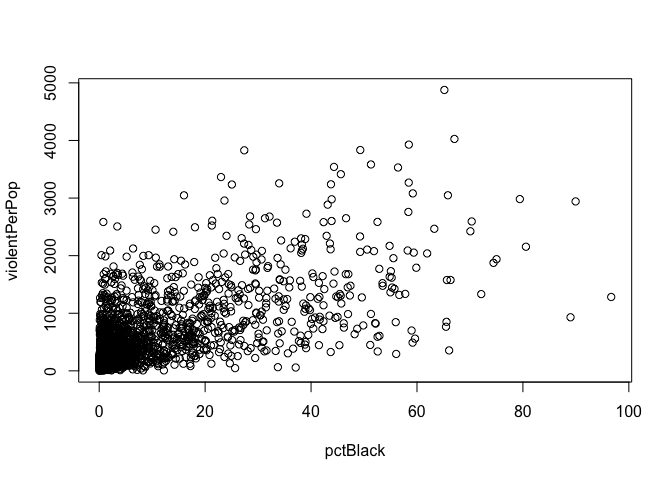
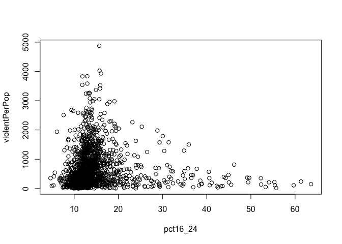
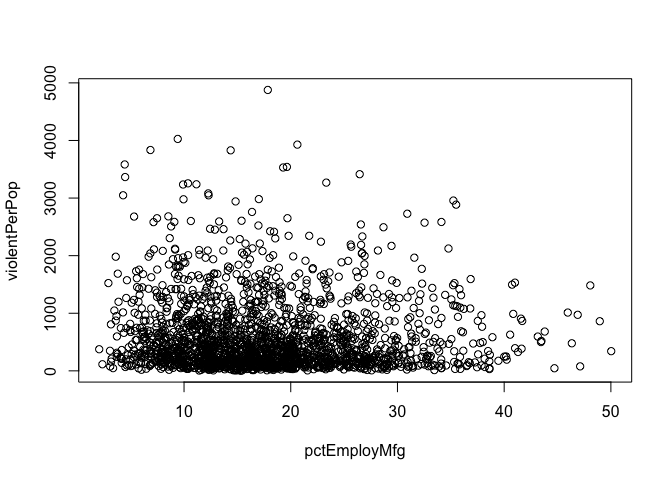
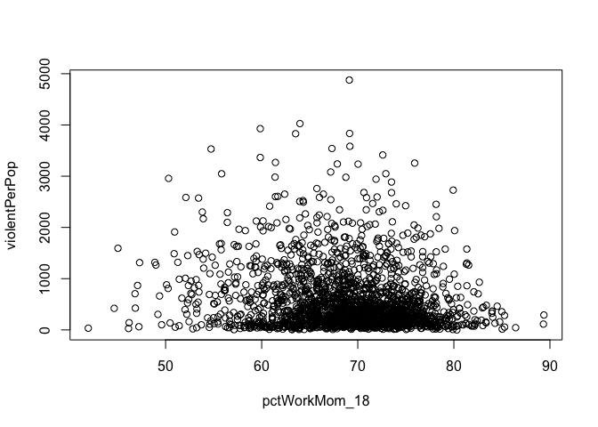
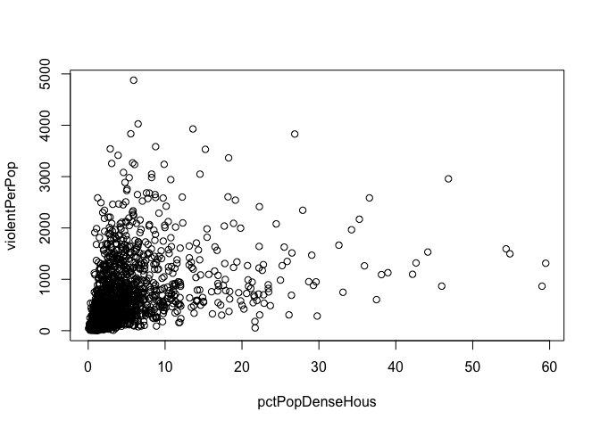

```r
crime <- read.csv("/Users/henryjones/Desktop/Math_CC/MA340_stats/crime.csv")
#View(crime)
```

# Exercises

# 1
"Show all your steps in finding what you consider to be the best predictive models for reported violent and non-violent crimes (2 models) using census information. Your submission will be the steps you took to arrive at the models."

## Violent 

### Random forest model
First we tried a random forest model with m = 34.


```r
set.seed(1)
library(tree)
library(randomForest)
```

```
## randomForest 4.7-1.1
```

```
## Type rfNews() to see new features/changes/bug fixes.
```

```r
bag.tr1 <- randomForest(violentPerPop ~., data = na.omit(crime), mtry = 34, importance = T)
bag.tr1 #significant decrease in error
```

```
## 
## Call:
##  randomForest(formula = violentPerPop ~ ., data = na.omit(crime),      mtry = 34, importance = T) 
##                Type of random forest: regression
##                      Number of trees: 500
## No. of variables tried at each split: 34
## 
##           Mean of squared residuals: 108603.5
##                     % Var explained: 70.65
```

```r
#bag.tr1$cv.error
varImpPlot(bag.tr1)
```

<!-- -->

```r
importance(bag.tr1)
```

```
##                        %IncMSE IncNodePurity
## pop                  5.3578568     2247614.1
## perHoush             3.7743040     1313569.8
## pctBlack            11.2226269    15689519.9
## pctWhite            15.4031901    42675593.7
## pctAsian             3.4080949     1720059.0
## pctHisp              7.6164520     4484121.7
## pct12_21             3.7312542     1411679.4
## pct12_29             3.0839926     1327766.7
## pct16_24             4.8492257     1561857.3
## pct65up              4.2322122     1479522.8
## persUrban            5.2520753     2386607.7
## pctUrban             2.4207663      548199.7
## medIncome            2.5381548     1369200.9
## pctWwage             5.2768189     1506789.6
## pctWfarm            -0.3173078     2575328.6
## pctWdiv              6.1667207     7226038.6
## pctWsocsec           3.7455744     1927089.4
## pctPubAsst           8.0134646     3670755.5
## pctRetire            3.0402645     1761248.2
## medFamIncome         3.9147275     1626666.3
## perCapInc            4.3891453     1242296.5
## whitePerCap          3.5649902     1571087.9
## blackPerCap          3.4372375     2179636.3
## NAperCap             2.1660987     1884409.7
## asianPerCap          4.4935072     3058354.2
## otherPerCap          6.1671746     3779160.2
## hispPerCap           6.0650914     2963270.1
## persPoverty          7.0631072     5194924.4
## pctPoverty           6.3815467     3477388.6
## pctLowEdu            6.5674943     1953389.2
## pctNotHSgrad         5.4652185     1855640.3
## pctCollGrad          4.2958819     1978405.9
## pctUnemploy          5.7230003     2803656.7
## pctEmploy            3.2537071     1638425.8
## pctEmployMfg         2.8521042     2643813.0
## pctEmployProfServ    0.1874221     2199748.5
## pctOccupManu         3.8842293     1771653.8
## pctOccupMgmt         4.8799927     2336363.9
## pctMaleDivorc        4.8533694     5771418.7
## pctMaleNevMar        4.1570170     2310372.8
## pctFemDivorc         6.8948628     5898981.6
## pctAllDivorc         6.9289975     5896409.8
## persPerFam           4.8650284     1714215.1
## pct2Par             11.1953514    36908846.1
## pctKids2Par         15.6017372   104757722.9
## pctKids_4w2Par       4.9092242     8887104.5
## pct12_17w2Par        5.8108272    12705128.3
## pctWorkMom_6         3.8793934     2199126.9
## pctWorkMom_18        4.0029310     2090784.3
## kidsBornNevrMarr    11.1379623    38996140.0
## pctKidsBornNevrMarr 16.7911747   114366130.4
## numForeignBorn       8.0155767     4020155.2
## pctFgnImmig_3        3.6091652     1653988.8
## pctFgnImmig_5        3.6364453     1479824.5
## pctFgnImmig_8        4.5550797     1782089.0
## pctFgnImmig_10       4.2964035     2018378.0
## pctImmig_3           4.0641335     1167977.9
## pctImmig_5           2.6994006     1510138.5
## pctImmig_8           4.4928669     1482418.2
## pctImmig_10          3.5719926     1571411.9
## pctSpeakOnlyEng      6.3464507     2804822.5
## pctNotSpeakEng       6.1006142     2801454.8
## pctLargHousFam       6.0146831     3963697.4
## pctLargHous          5.0838350     2818516.3
## persPerOccupHous     2.9400029     1558892.6
## persPerOwnOccup      4.6946547     1709088.0
## persPerRenterOccup   7.1911155     2345274.3
## pctPersOwnOccup      4.7285456     1802648.1
## pctPopDenseHous     11.9965870     8478745.1
## pctSmallHousUnits    3.7352432     4852827.7
## medNumBedrm         -0.1156863      176353.1
## houseVacant          8.1240814     4793169.4
## pctHousOccup         2.7780822     3020704.4
## pctHousOwnerOccup    5.5536475     1526612.2
## pctVacantBoarded     1.6436468     5112201.0
## pctVacant6up         0.9242036     1809157.8
## medYrHousBuilt       2.7483376     1937177.2
## pctHousWOphone       3.2656394     2109463.9
## pctHousWOplumb       3.2892110     2204291.3
## ownHousLowQ          3.1412610     1750358.3
## ownHousMed           3.9624690     1296230.0
## ownHousUperQ         3.9059803     1468917.4
## ownHousQrange        7.1721099     2167156.4
## rentLowQ             2.2496879     1403502.6
## rentMed              4.1405459     1422361.7
## rentUpperQ           3.9426940     1569484.3
## rentQrange           6.8883259     3700993.7
## medGrossRent         5.0412412     1761025.8
## medRentpctHousInc    6.7881449     2452530.6
## medOwnCostpct        5.3239613     2229310.8
## medOwnCostPctWO      5.7066410     2439874.1
## persEmergShelt       4.8160028     2337500.6
## persHomeless         6.8048531     5730997.4
## pctForeignBorn       4.9478167     2380279.0
## pctBornStateResid    6.5178009     2181712.3
## pctSameHouse_5       4.1321691     1691147.8
## pctSameCounty_5      3.5844431     2149825.5
## pctSameState_5       4.0939219     1936105.7
## landArea             3.5633857     2138787.0
## popDensity           4.9372290     3562054.7
## pctUsePubTrans       4.9515560     5550486.7
## pctOfficDrugUnit    -0.2464789      901010.6
## nonViolPerPop       32.2415156    81608474.5
```
We have a reported training MSE of 108603.5.

### Non linear model
Next we tried a non-linear model using smoothing splines. We first determined our subset of predictors by using the regsubsets() function for forward selection. After determining this subset, we plotted all these predictors against violentPerPop to check for nonlinearity. In doing so, we selected "pctWdiv", "ownHousLowQ", "pctWorkMom_6", and "asianPerCap" as our most obviously nonlinear terms. In the creation of our next model, we fit these four predictors with cubic smoothing splines and left all others predictors as linear. 

```r
library(gam)
```

```
## Loading required package: splines
```

```
## Loading required package: foreach
```

```
## Loaded gam 1.22-2
```

```r
library(glmnet)
```

```
## Loading required package: Matrix
```

```
## Loaded glmnet 4.1-7
```

```r
library(leaps)
library(splines)
library(boot)
set.seed(1)
reg.fit.fwd <- regsubsets(violentPerPop ~., data = crime, nvmax = 50, method = "forward", really.big = T)
```

```
## Warning in leaps.setup(x, y, wt = wt, nbest = nbest, nvmax = nvmax, force.in =
## force.in, : 2 linear dependencies found
```

```
## Reordering variables and trying again:
```

```r
summari <- summary(reg.fit.fwd)
summari
```

```
## Subset selection object
## Call: regsubsets.formula(violentPerPop ~ ., data = crime, nvmax = 50, 
##     method = "forward", really.big = T)
## 103 Variables  (and intercept)
##                     Forced in Forced out
## pop                     FALSE      FALSE
## perHoush                FALSE      FALSE
## pctBlack                FALSE      FALSE
## pctWhite                FALSE      FALSE
## pctAsian                FALSE      FALSE
## pctHisp                 FALSE      FALSE
## pct12_21                FALSE      FALSE
## pct12_29                FALSE      FALSE
## pct16_24                FALSE      FALSE
## pct65up                 FALSE      FALSE
## persUrban               FALSE      FALSE
## pctUrban                FALSE      FALSE
## medIncome               FALSE      FALSE
## pctWwage                FALSE      FALSE
## pctWfarm                FALSE      FALSE
## pctWdiv                 FALSE      FALSE
## pctWsocsec              FALSE      FALSE
## pctPubAsst              FALSE      FALSE
## pctRetire               FALSE      FALSE
## medFamIncome            FALSE      FALSE
## perCapInc               FALSE      FALSE
## whitePerCap             FALSE      FALSE
## blackPerCap             FALSE      FALSE
## NAperCap                FALSE      FALSE
## asianPerCap             FALSE      FALSE
## otherPerCap             FALSE      FALSE
## hispPerCap              FALSE      FALSE
## persPoverty             FALSE      FALSE
## pctPoverty              FALSE      FALSE
## pctLowEdu               FALSE      FALSE
## pctNotHSgrad            FALSE      FALSE
## pctCollGrad             FALSE      FALSE
## pctUnemploy             FALSE      FALSE
## pctEmploy               FALSE      FALSE
## pctEmployMfg            FALSE      FALSE
## pctEmployProfServ       FALSE      FALSE
## pctOccupManu            FALSE      FALSE
## pctOccupMgmt            FALSE      FALSE
## pctMaleDivorc           FALSE      FALSE
## pctMaleNevMar           FALSE      FALSE
## pctFemDivorc            FALSE      FALSE
## pctAllDivorc            FALSE      FALSE
## persPerFam              FALSE      FALSE
## pct2Par                 FALSE      FALSE
## pctKids2Par             FALSE      FALSE
## pctKids_4w2Par          FALSE      FALSE
## pct12_17w2Par           FALSE      FALSE
## pctWorkMom_6            FALSE      FALSE
## pctWorkMom_18           FALSE      FALSE
## kidsBornNevrMarr        FALSE      FALSE
## pctKidsBornNevrMarr     FALSE      FALSE
## numForeignBorn          FALSE      FALSE
## pctFgnImmig_3           FALSE      FALSE
## pctFgnImmig_5           FALSE      FALSE
## pctFgnImmig_8           FALSE      FALSE
## pctFgnImmig_10          FALSE      FALSE
## pctImmig_3              FALSE      FALSE
## pctImmig_5              FALSE      FALSE
## pctImmig_8              FALSE      FALSE
## pctImmig_10             FALSE      FALSE
## pctSpeakOnlyEng         FALSE      FALSE
## pctNotSpeakEng          FALSE      FALSE
## pctLargHousFam          FALSE      FALSE
## pctLargHous             FALSE      FALSE
## persPerOccupHous        FALSE      FALSE
## persPerOwnOccup         FALSE      FALSE
## persPerRenterOccup      FALSE      FALSE
## pctPersOwnOccup         FALSE      FALSE
## pctPopDenseHous         FALSE      FALSE
## pctSmallHousUnits       FALSE      FALSE
## medNumBedrm             FALSE      FALSE
## houseVacant             FALSE      FALSE
## pctHousOccup            FALSE      FALSE
## pctHousOwnerOccup       FALSE      FALSE
## pctVacantBoarded        FALSE      FALSE
## pctVacant6up            FALSE      FALSE
## medYrHousBuilt          FALSE      FALSE
## pctHousWOphone          FALSE      FALSE
## pctHousWOplumb          FALSE      FALSE
## ownHousLowQ             FALSE      FALSE
## ownHousMed              FALSE      FALSE
## ownHousUperQ            FALSE      FALSE
## rentLowQ                FALSE      FALSE
## rentMed                 FALSE      FALSE
## rentUpperQ              FALSE      FALSE
## medGrossRent            FALSE      FALSE
## medRentpctHousInc       FALSE      FALSE
## medOwnCostpct           FALSE      FALSE
## medOwnCostPctWO         FALSE      FALSE
## persEmergShelt          FALSE      FALSE
## persHomeless            FALSE      FALSE
## pctForeignBorn          FALSE      FALSE
## pctBornStateResid       FALSE      FALSE
## pctSameHouse_5          FALSE      FALSE
## pctSameCounty_5         FALSE      FALSE
## pctSameState_5          FALSE      FALSE
## landArea                FALSE      FALSE
## popDensity              FALSE      FALSE
## pctUsePubTrans          FALSE      FALSE
## pctOfficDrugUnit        FALSE      FALSE
## nonViolPerPop           FALSE      FALSE
## ownHousQrange           FALSE      FALSE
## rentQrange              FALSE      FALSE
## 1 subsets of each size up to 51
## Selection Algorithm: forward
##           pop perHoush pctBlack pctWhite pctAsian pctHisp pct12_21 pct12_29
## 1  ( 1 )  " " " "      " "      " "      " "      " "     " "      " "     
## 2  ( 1 )  " " " "      " "      " "      " "      " "     " "      " "     
## 3  ( 1 )  " " " "      " "      "*"      " "      " "     " "      " "     
## 4  ( 1 )  " " " "      " "      "*"      " "      " "     " "      " "     
## 5  ( 1 )  " " " "      " "      "*"      " "      " "     " "      "*"     
## 6  ( 1 )  " " " "      " "      "*"      " "      " "     " "      "*"     
## 7  ( 1 )  " " " "      " "      "*"      " "      " "     " "      "*"     
## 8  ( 1 )  " " " "      " "      "*"      " "      " "     " "      "*"     
## 9  ( 1 )  " " " "      " "      "*"      " "      " "     " "      "*"     
## 10  ( 1 ) " " " "      "*"      "*"      " "      " "     " "      "*"     
## 11  ( 1 ) " " " "      "*"      "*"      " "      " "     " "      "*"     
## 12  ( 1 ) " " " "      "*"      "*"      " "      " "     " "      "*"     
## 13  ( 1 ) " " " "      "*"      "*"      " "      " "     " "      "*"     
## 14  ( 1 ) " " " "      "*"      "*"      " "      " "     " "      "*"     
## 15  ( 1 ) " " " "      "*"      "*"      " "      " "     " "      "*"     
## 16  ( 1 ) " " " "      "*"      "*"      " "      " "     " "      "*"     
## 17  ( 1 ) " " " "      "*"      "*"      " "      " "     " "      "*"     
## 18  ( 1 ) " " " "      "*"      "*"      " "      " "     " "      "*"     
## 19  ( 1 ) " " " "      "*"      "*"      " "      " "     " "      "*"     
## 20  ( 1 ) " " " "      "*"      "*"      " "      " "     " "      "*"     
## 21  ( 1 ) " " " "      "*"      "*"      " "      " "     " "      "*"     
## 22  ( 1 ) " " " "      "*"      "*"      " "      " "     " "      "*"     
## 23  ( 1 ) " " " "      "*"      "*"      " "      " "     " "      "*"     
## 24  ( 1 ) " " " "      "*"      "*"      " "      " "     " "      "*"     
## 25  ( 1 ) " " " "      "*"      "*"      " "      " "     " "      "*"     
## 26  ( 1 ) " " " "      "*"      "*"      " "      " "     " "      "*"     
## 27  ( 1 ) " " " "      "*"      "*"      " "      " "     " "      "*"     
## 28  ( 1 ) " " " "      "*"      "*"      " "      " "     " "      "*"     
## 29  ( 1 ) " " " "      "*"      "*"      " "      " "     " "      "*"     
## 30  ( 1 ) " " " "      "*"      "*"      " "      " "     " "      "*"     
## 31  ( 1 ) " " " "      "*"      "*"      " "      " "     " "      "*"     
## 32  ( 1 ) " " " "      "*"      "*"      " "      " "     " "      "*"     
## 33  ( 1 ) "*" " "      "*"      "*"      " "      " "     " "      "*"     
## 34  ( 1 ) "*" " "      "*"      "*"      " "      " "     " "      "*"     
## 35  ( 1 ) "*" " "      "*"      "*"      " "      " "     " "      "*"     
## 36  ( 1 ) "*" " "      "*"      "*"      " "      " "     " "      "*"     
## 37  ( 1 ) "*" " "      "*"      "*"      " "      " "     " "      "*"     
## 38  ( 1 ) "*" " "      "*"      "*"      " "      " "     " "      "*"     
## 39  ( 1 ) "*" " "      "*"      "*"      " "      " "     " "      "*"     
## 40  ( 1 ) "*" " "      "*"      "*"      " "      " "     " "      "*"     
## 41  ( 1 ) "*" " "      "*"      "*"      " "      " "     " "      "*"     
## 42  ( 1 ) "*" " "      "*"      "*"      " "      " "     " "      "*"     
## 43  ( 1 ) "*" " "      "*"      "*"      " "      " "     " "      "*"     
## 44  ( 1 ) "*" "*"      "*"      "*"      " "      " "     " "      "*"     
## 45  ( 1 ) "*" "*"      "*"      "*"      " "      " "     " "      "*"     
## 46  ( 1 ) "*" "*"      "*"      "*"      " "      " "     " "      "*"     
## 47  ( 1 ) "*" "*"      "*"      "*"      " "      " "     " "      "*"     
## 48  ( 1 ) "*" "*"      "*"      "*"      " "      " "     " "      "*"     
## 49  ( 1 ) "*" "*"      "*"      "*"      " "      " "     " "      "*"     
## 50  ( 1 ) "*" "*"      "*"      "*"      " "      " "     " "      "*"     
## 51  ( 1 ) "*" "*"      "*"      "*"      " "      " "     " "      "*"     
##           pct16_24 pct65up persUrban pctUrban medIncome pctWwage pctWfarm
## 1  ( 1 )  " "      " "     " "       " "      " "       " "      " "     
## 2  ( 1 )  " "      " "     " "       " "      " "       " "      " "     
## 3  ( 1 )  " "      " "     " "       " "      " "       " "      " "     
## 4  ( 1 )  " "      " "     " "       " "      " "       " "      " "     
## 5  ( 1 )  " "      " "     " "       " "      " "       " "      " "     
## 6  ( 1 )  " "      " "     " "       " "      " "       " "      " "     
## 7  ( 1 )  " "      " "     " "       " "      " "       " "      " "     
## 8  ( 1 )  " "      " "     " "       " "      " "       " "      " "     
## 9  ( 1 )  " "      " "     " "       " "      " "       " "      " "     
## 10  ( 1 ) " "      " "     " "       " "      " "       " "      " "     
## 11  ( 1 ) " "      " "     " "       " "      " "       " "      " "     
## 12  ( 1 ) " "      " "     " "       " "      " "       " "      " "     
## 13  ( 1 ) " "      " "     " "       " "      " "       " "      " "     
## 14  ( 1 ) " "      " "     " "       " "      " "       " "      " "     
## 15  ( 1 ) " "      " "     " "       " "      " "       " "      " "     
## 16  ( 1 ) "*"      " "     " "       " "      " "       " "      " "     
## 17  ( 1 ) "*"      " "     " "       " "      " "       " "      " "     
## 18  ( 1 ) "*"      " "     " "       " "      " "       " "      " "     
## 19  ( 1 ) "*"      " "     " "       "*"      " "       " "      " "     
## 20  ( 1 ) "*"      " "     " "       "*"      " "       " "      " "     
## 21  ( 1 ) "*"      " "     " "       "*"      " "       " "      " "     
## 22  ( 1 ) "*"      " "     " "       "*"      " "       " "      " "     
## 23  ( 1 ) "*"      " "     " "       "*"      " "       " "      " "     
## 24  ( 1 ) "*"      " "     " "       "*"      " "       " "      " "     
## 25  ( 1 ) "*"      " "     " "       "*"      " "       " "      " "     
## 26  ( 1 ) "*"      " "     " "       "*"      " "       " "      " "     
## 27  ( 1 ) "*"      " "     " "       "*"      " "       " "      " "     
## 28  ( 1 ) "*"      " "     " "       "*"      " "       " "      " "     
## 29  ( 1 ) "*"      " "     " "       "*"      " "       " "      " "     
## 30  ( 1 ) "*"      " "     " "       "*"      " "       " "      " "     
## 31  ( 1 ) "*"      " "     " "       "*"      " "       " "      " "     
## 32  ( 1 ) "*"      " "     " "       "*"      " "       " "      " "     
## 33  ( 1 ) "*"      " "     " "       "*"      " "       " "      " "     
## 34  ( 1 ) "*"      " "     " "       "*"      " "       " "      "*"     
## 35  ( 1 ) "*"      " "     " "       "*"      " "       " "      "*"     
## 36  ( 1 ) "*"      " "     " "       "*"      " "       " "      "*"     
## 37  ( 1 ) "*"      " "     " "       "*"      " "       " "      "*"     
## 38  ( 1 ) "*"      " "     " "       "*"      " "       " "      "*"     
## 39  ( 1 ) "*"      " "     " "       "*"      " "       " "      "*"     
## 40  ( 1 ) "*"      " "     " "       "*"      " "       " "      "*"     
## 41  ( 1 ) "*"      " "     " "       "*"      " "       "*"      "*"     
## 42  ( 1 ) "*"      " "     " "       "*"      " "       "*"      "*"     
## 43  ( 1 ) "*"      " "     " "       "*"      " "       "*"      "*"     
## 44  ( 1 ) "*"      " "     " "       "*"      " "       "*"      "*"     
## 45  ( 1 ) "*"      " "     " "       "*"      " "       "*"      "*"     
## 46  ( 1 ) "*"      " "     " "       "*"      " "       "*"      "*"     
## 47  ( 1 ) "*"      " "     " "       "*"      " "       "*"      "*"     
## 48  ( 1 ) "*"      " "     " "       "*"      " "       "*"      "*"     
## 49  ( 1 ) "*"      " "     " "       "*"      " "       "*"      "*"     
## 50  ( 1 ) "*"      " "     " "       "*"      " "       "*"      "*"     
## 51  ( 1 ) "*"      " "     " "       "*"      " "       "*"      "*"     
##           pctWdiv pctWsocsec pctPubAsst pctRetire medFamIncome perCapInc
## 1  ( 1 )  " "     " "        " "        " "       " "          " "      
## 2  ( 1 )  " "     " "        " "        " "       " "          " "      
## 3  ( 1 )  " "     " "        " "        " "       " "          " "      
## 4  ( 1 )  " "     " "        " "        " "       " "          " "      
## 5  ( 1 )  " "     " "        " "        " "       " "          " "      
## 6  ( 1 )  " "     " "        " "        " "       " "          " "      
## 7  ( 1 )  " "     " "        " "        " "       " "          " "      
## 8  ( 1 )  " "     " "        " "        " "       " "          " "      
## 9  ( 1 )  " "     " "        " "        " "       " "          " "      
## 10  ( 1 ) " "     " "        " "        " "       " "          " "      
## 11  ( 1 ) " "     " "        " "        " "       " "          " "      
## 12  ( 1 ) " "     " "        " "        " "       " "          " "      
## 13  ( 1 ) " "     " "        " "        " "       " "          " "      
## 14  ( 1 ) " "     " "        " "        " "       " "          " "      
## 15  ( 1 ) "*"     " "        " "        " "       " "          " "      
## 16  ( 1 ) "*"     " "        " "        " "       " "          " "      
## 17  ( 1 ) "*"     " "        " "        " "       " "          " "      
## 18  ( 1 ) "*"     " "        " "        " "       " "          " "      
## 19  ( 1 ) "*"     " "        " "        " "       " "          " "      
## 20  ( 1 ) "*"     " "        " "        " "       " "          " "      
## 21  ( 1 ) "*"     " "        "*"        " "       " "          " "      
## 22  ( 1 ) "*"     " "        "*"        "*"       " "          " "      
## 23  ( 1 ) "*"     " "        "*"        "*"       " "          " "      
## 24  ( 1 ) "*"     " "        "*"        "*"       " "          " "      
## 25  ( 1 ) "*"     " "        "*"        "*"       " "          " "      
## 26  ( 1 ) "*"     " "        "*"        "*"       " "          " "      
## 27  ( 1 ) "*"     " "        "*"        "*"       " "          " "      
## 28  ( 1 ) "*"     " "        "*"        "*"       " "          " "      
## 29  ( 1 ) "*"     " "        "*"        "*"       " "          " "      
## 30  ( 1 ) "*"     " "        "*"        "*"       " "          " "      
## 31  ( 1 ) "*"     " "        "*"        "*"       " "          " "      
## 32  ( 1 ) "*"     " "        "*"        "*"       " "          " "      
## 33  ( 1 ) "*"     " "        "*"        "*"       " "          " "      
## 34  ( 1 ) "*"     " "        "*"        "*"       " "          " "      
## 35  ( 1 ) "*"     " "        "*"        "*"       " "          " "      
## 36  ( 1 ) "*"     " "        "*"        "*"       " "          " "      
## 37  ( 1 ) "*"     " "        "*"        "*"       " "          " "      
## 38  ( 1 ) "*"     " "        "*"        "*"       " "          " "      
## 39  ( 1 ) "*"     " "        "*"        "*"       " "          " "      
## 40  ( 1 ) "*"     " "        "*"        "*"       " "          " "      
## 41  ( 1 ) "*"     " "        "*"        "*"       " "          " "      
## 42  ( 1 ) "*"     "*"        "*"        "*"       " "          " "      
## 43  ( 1 ) "*"     "*"        "*"        "*"       " "          " "      
## 44  ( 1 ) "*"     "*"        "*"        "*"       " "          " "      
## 45  ( 1 ) "*"     "*"        "*"        "*"       " "          " "      
## 46  ( 1 ) "*"     "*"        "*"        "*"       " "          " "      
## 47  ( 1 ) "*"     "*"        "*"        "*"       " "          " "      
## 48  ( 1 ) "*"     "*"        "*"        "*"       " "          " "      
## 49  ( 1 ) "*"     "*"        "*"        "*"       " "          " "      
## 50  ( 1 ) "*"     "*"        "*"        "*"       " "          " "      
## 51  ( 1 ) "*"     "*"        "*"        "*"       " "          " "      
##           whitePerCap blackPerCap NAperCap asianPerCap otherPerCap hispPerCap
## 1  ( 1 )  " "         " "         " "      " "         " "         " "       
## 2  ( 1 )  " "         " "         " "      " "         " "         " "       
## 3  ( 1 )  " "         " "         " "      " "         " "         " "       
## 4  ( 1 )  " "         " "         " "      " "         " "         " "       
## 5  ( 1 )  " "         " "         " "      " "         " "         " "       
## 6  ( 1 )  " "         " "         " "      " "         " "         " "       
## 7  ( 1 )  " "         " "         " "      " "         " "         " "       
## 8  ( 1 )  " "         " "         " "      " "         " "         " "       
## 9  ( 1 )  " "         " "         " "      " "         " "         " "       
## 10  ( 1 ) " "         " "         " "      " "         " "         " "       
## 11  ( 1 ) " "         " "         " "      " "         " "         " "       
## 12  ( 1 ) " "         " "         " "      " "         " "         " "       
## 13  ( 1 ) " "         " "         " "      " "         " "         " "       
## 14  ( 1 ) " "         " "         " "      " "         " "         " "       
## 15  ( 1 ) " "         " "         " "      " "         " "         " "       
## 16  ( 1 ) " "         " "         " "      " "         " "         " "       
## 17  ( 1 ) " "         " "         " "      " "         " "         " "       
## 18  ( 1 ) " "         " "         " "      " "         " "         " "       
## 19  ( 1 ) " "         " "         " "      " "         " "         " "       
## 20  ( 1 ) " "         " "         " "      "*"         " "         " "       
## 21  ( 1 ) " "         " "         " "      "*"         " "         " "       
## 22  ( 1 ) " "         " "         " "      "*"         " "         " "       
## 23  ( 1 ) " "         " "         " "      "*"         " "         " "       
## 24  ( 1 ) " "         " "         " "      "*"         " "         " "       
## 25  ( 1 ) " "         " "         " "      "*"         "*"         " "       
## 26  ( 1 ) " "         " "         " "      "*"         "*"         " "       
## 27  ( 1 ) " "         " "         " "      "*"         "*"         " "       
## 28  ( 1 ) " "         " "         " "      "*"         "*"         " "       
## 29  ( 1 ) "*"         " "         " "      "*"         "*"         " "       
## 30  ( 1 ) "*"         " "         " "      "*"         "*"         " "       
## 31  ( 1 ) "*"         " "         " "      "*"         "*"         " "       
## 32  ( 1 ) "*"         " "         " "      "*"         "*"         " "       
## 33  ( 1 ) "*"         " "         " "      "*"         "*"         " "       
## 34  ( 1 ) "*"         " "         " "      "*"         "*"         " "       
## 35  ( 1 ) "*"         " "         " "      "*"         "*"         " "       
## 36  ( 1 ) "*"         " "         " "      "*"         "*"         " "       
## 37  ( 1 ) "*"         " "         " "      "*"         "*"         " "       
## 38  ( 1 ) "*"         " "         " "      "*"         "*"         " "       
## 39  ( 1 ) "*"         " "         " "      "*"         "*"         " "       
## 40  ( 1 ) "*"         " "         " "      "*"         "*"         " "       
## 41  ( 1 ) "*"         " "         " "      "*"         "*"         " "       
## 42  ( 1 ) "*"         " "         " "      "*"         "*"         " "       
## 43  ( 1 ) "*"         " "         " "      "*"         "*"         " "       
## 44  ( 1 ) "*"         " "         " "      "*"         "*"         " "       
## 45  ( 1 ) "*"         " "         " "      "*"         "*"         " "       
## 46  ( 1 ) "*"         " "         " "      "*"         "*"         " "       
## 47  ( 1 ) "*"         " "         " "      "*"         "*"         " "       
## 48  ( 1 ) "*"         " "         " "      "*"         "*"         " "       
## 49  ( 1 ) "*"         " "         " "      "*"         "*"         " "       
## 50  ( 1 ) "*"         " "         " "      "*"         "*"         " "       
## 51  ( 1 ) "*"         " "         " "      "*"         "*"         " "       
##           persPoverty pctPoverty pctLowEdu pctNotHSgrad pctCollGrad pctUnemploy
## 1  ( 1 )  " "         " "        " "       " "          " "         " "        
## 2  ( 1 )  " "         " "        " "       " "          " "         " "        
## 3  ( 1 )  " "         " "        " "       " "          " "         " "        
## 4  ( 1 )  " "         " "        " "       " "          " "         " "        
## 5  ( 1 )  " "         " "        " "       " "          " "         " "        
## 6  ( 1 )  " "         " "        " "       " "          " "         " "        
## 7  ( 1 )  " "         " "        " "       " "          " "         " "        
## 8  ( 1 )  " "         " "        " "       " "          " "         " "        
## 9  ( 1 )  " "         " "        " "       " "          " "         " "        
## 10  ( 1 ) " "         " "        " "       " "          " "         " "        
## 11  ( 1 ) " "         " "        " "       " "          " "         " "        
## 12  ( 1 ) " "         " "        " "       " "          " "         " "        
## 13  ( 1 ) " "         " "        " "       " "          " "         " "        
## 14  ( 1 ) " "         "*"        " "       " "          " "         " "        
## 15  ( 1 ) " "         "*"        " "       " "          " "         " "        
## 16  ( 1 ) " "         "*"        " "       " "          " "         " "        
## 17  ( 1 ) " "         "*"        "*"       " "          " "         " "        
## 18  ( 1 ) " "         "*"        "*"       " "          " "         " "        
## 19  ( 1 ) " "         "*"        "*"       " "          " "         " "        
## 20  ( 1 ) " "         "*"        "*"       " "          " "         " "        
## 21  ( 1 ) " "         "*"        "*"       " "          " "         " "        
## 22  ( 1 ) " "         "*"        "*"       " "          " "         " "        
## 23  ( 1 ) " "         "*"        "*"       " "          " "         " "        
## 24  ( 1 ) " "         "*"        "*"       " "          " "         " "        
## 25  ( 1 ) " "         "*"        "*"       " "          " "         " "        
## 26  ( 1 ) " "         "*"        "*"       " "          " "         " "        
## 27  ( 1 ) " "         "*"        "*"       "*"          " "         " "        
## 28  ( 1 ) " "         "*"        "*"       "*"          " "         " "        
## 29  ( 1 ) " "         "*"        "*"       "*"          " "         " "        
## 30  ( 1 ) " "         "*"        "*"       "*"          "*"         " "        
## 31  ( 1 ) " "         "*"        "*"       "*"          "*"         " "        
## 32  ( 1 ) " "         "*"        "*"       "*"          "*"         " "        
## 33  ( 1 ) " "         "*"        "*"       "*"          "*"         " "        
## 34  ( 1 ) " "         "*"        "*"       "*"          "*"         " "        
## 35  ( 1 ) " "         "*"        "*"       "*"          "*"         " "        
## 36  ( 1 ) " "         "*"        "*"       "*"          "*"         " "        
## 37  ( 1 ) " "         "*"        "*"       "*"          "*"         " "        
## 38  ( 1 ) " "         "*"        "*"       "*"          "*"         " "        
## 39  ( 1 ) " "         "*"        "*"       "*"          "*"         " "        
## 40  ( 1 ) " "         "*"        "*"       "*"          "*"         " "        
## 41  ( 1 ) " "         "*"        "*"       "*"          "*"         " "        
## 42  ( 1 ) " "         "*"        "*"       "*"          "*"         " "        
## 43  ( 1 ) " "         "*"        "*"       "*"          "*"         " "        
## 44  ( 1 ) " "         "*"        "*"       "*"          "*"         " "        
## 45  ( 1 ) " "         "*"        "*"       "*"          "*"         " "        
## 46  ( 1 ) " "         "*"        "*"       "*"          "*"         " "        
## 47  ( 1 ) " "         "*"        "*"       "*"          "*"         " "        
## 48  ( 1 ) " "         "*"        "*"       "*"          "*"         " "        
## 49  ( 1 ) " "         "*"        "*"       "*"          "*"         " "        
## 50  ( 1 ) " "         "*"        "*"       "*"          "*"         " "        
## 51  ( 1 ) " "         "*"        "*"       "*"          "*"         " "        
##           pctEmploy pctEmployMfg pctEmployProfServ pctOccupManu pctOccupMgmt
## 1  ( 1 )  " "       " "          " "               " "          " "         
## 2  ( 1 )  " "       " "          " "               " "          " "         
## 3  ( 1 )  " "       " "          " "               " "          " "         
## 4  ( 1 )  " "       " "          " "               " "          " "         
## 5  ( 1 )  " "       " "          " "               " "          " "         
## 6  ( 1 )  " "       " "          " "               " "          " "         
## 7  ( 1 )  " "       " "          " "               " "          " "         
## 8  ( 1 )  " "       " "          " "               " "          " "         
## 9  ( 1 )  " "       " "          " "               " "          " "         
## 10  ( 1 ) " "       " "          " "               " "          " "         
## 11  ( 1 ) " "       " "          " "               " "          " "         
## 12  ( 1 ) " "       " "          " "               " "          " "         
## 13  ( 1 ) " "       " "          " "               " "          " "         
## 14  ( 1 ) " "       " "          " "               " "          " "         
## 15  ( 1 ) " "       " "          " "               " "          " "         
## 16  ( 1 ) " "       " "          " "               " "          " "         
## 17  ( 1 ) " "       " "          " "               " "          " "         
## 18  ( 1 ) " "       " "          " "               " "          " "         
## 19  ( 1 ) " "       " "          " "               " "          " "         
## 20  ( 1 ) " "       " "          " "               " "          " "         
## 21  ( 1 ) " "       " "          " "               " "          " "         
## 22  ( 1 ) " "       " "          " "               " "          " "         
## 23  ( 1 ) " "       " "          " "               " "          " "         
## 24  ( 1 ) " "       " "          " "               " "          " "         
## 25  ( 1 ) " "       " "          " "               " "          " "         
## 26  ( 1 ) " "       "*"          " "               " "          " "         
## 27  ( 1 ) " "       "*"          " "               " "          " "         
## 28  ( 1 ) " "       "*"          " "               " "          " "         
## 29  ( 1 ) " "       "*"          " "               " "          " "         
## 30  ( 1 ) " "       "*"          " "               " "          " "         
## 31  ( 1 ) " "       "*"          " "               " "          " "         
## 32  ( 1 ) " "       "*"          " "               " "          " "         
## 33  ( 1 ) " "       "*"          " "               " "          " "         
## 34  ( 1 ) " "       "*"          " "               " "          " "         
## 35  ( 1 ) " "       "*"          " "               " "          " "         
## 36  ( 1 ) " "       "*"          " "               " "          " "         
## 37  ( 1 ) " "       "*"          " "               " "          " "         
## 38  ( 1 ) " "       "*"          " "               " "          " "         
## 39  ( 1 ) " "       "*"          " "               " "          " "         
## 40  ( 1 ) " "       "*"          " "               " "          " "         
## 41  ( 1 ) " "       "*"          " "               " "          " "         
## 42  ( 1 ) " "       "*"          " "               " "          " "         
## 43  ( 1 ) " "       "*"          " "               " "          " "         
## 44  ( 1 ) " "       "*"          " "               " "          " "         
## 45  ( 1 ) " "       "*"          " "               " "          " "         
## 46  ( 1 ) " "       "*"          " "               " "          " "         
## 47  ( 1 ) " "       "*"          " "               " "          " "         
## 48  ( 1 ) " "       "*"          " "               " "          " "         
## 49  ( 1 ) " "       "*"          " "               " "          " "         
## 50  ( 1 ) " "       "*"          " "               " "          " "         
## 51  ( 1 ) " "       "*"          " "               " "          " "         
##           pctMaleDivorc pctMaleNevMar pctFemDivorc pctAllDivorc persPerFam
## 1  ( 1 )  " "           " "           " "          " "          " "       
## 2  ( 1 )  " "           " "           " "          " "          " "       
## 3  ( 1 )  " "           " "           " "          " "          " "       
## 4  ( 1 )  " "           " "           " "          " "          " "       
## 5  ( 1 )  " "           " "           " "          " "          " "       
## 6  ( 1 )  " "           " "           " "          " "          " "       
## 7  ( 1 )  " "           " "           " "          " "          " "       
## 8  ( 1 )  "*"           " "           " "          " "          " "       
## 9  ( 1 )  "*"           " "           " "          " "          " "       
## 10  ( 1 ) "*"           " "           " "          " "          " "       
## 11  ( 1 ) "*"           " "           " "          " "          " "       
## 12  ( 1 ) "*"           " "           " "          " "          " "       
## 13  ( 1 ) "*"           " "           " "          " "          " "       
## 14  ( 1 ) "*"           " "           " "          " "          " "       
## 15  ( 1 ) "*"           " "           " "          " "          " "       
## 16  ( 1 ) "*"           " "           " "          " "          " "       
## 17  ( 1 ) "*"           " "           " "          " "          " "       
## 18  ( 1 ) "*"           " "           " "          "*"          " "       
## 19  ( 1 ) "*"           " "           " "          "*"          " "       
## 20  ( 1 ) "*"           " "           " "          "*"          " "       
## 21  ( 1 ) "*"           " "           " "          "*"          " "       
## 22  ( 1 ) "*"           " "           " "          "*"          " "       
## 23  ( 1 ) "*"           " "           " "          "*"          " "       
## 24  ( 1 ) "*"           " "           "*"          "*"          " "       
## 25  ( 1 ) "*"           " "           "*"          "*"          " "       
## 26  ( 1 ) "*"           " "           "*"          "*"          " "       
## 27  ( 1 ) "*"           " "           "*"          "*"          " "       
## 28  ( 1 ) "*"           " "           "*"          "*"          " "       
## 29  ( 1 ) "*"           " "           "*"          "*"          " "       
## 30  ( 1 ) "*"           " "           "*"          "*"          " "       
## 31  ( 1 ) "*"           " "           "*"          "*"          " "       
## 32  ( 1 ) "*"           " "           "*"          "*"          " "       
## 33  ( 1 ) "*"           " "           "*"          "*"          " "       
## 34  ( 1 ) "*"           " "           "*"          "*"          " "       
## 35  ( 1 ) "*"           " "           "*"          "*"          " "       
## 36  ( 1 ) "*"           " "           "*"          "*"          " "       
## 37  ( 1 ) "*"           " "           "*"          "*"          " "       
## 38  ( 1 ) "*"           " "           "*"          "*"          " "       
## 39  ( 1 ) "*"           " "           "*"          "*"          " "       
## 40  ( 1 ) "*"           " "           "*"          "*"          " "       
## 41  ( 1 ) "*"           " "           "*"          "*"          " "       
## 42  ( 1 ) "*"           " "           "*"          "*"          " "       
## 43  ( 1 ) "*"           " "           "*"          "*"          " "       
## 44  ( 1 ) "*"           " "           "*"          "*"          " "       
## 45  ( 1 ) "*"           " "           "*"          "*"          " "       
## 46  ( 1 ) "*"           " "           "*"          "*"          " "       
## 47  ( 1 ) "*"           " "           "*"          "*"          " "       
## 48  ( 1 ) "*"           " "           "*"          "*"          " "       
## 49  ( 1 ) "*"           " "           "*"          "*"          " "       
## 50  ( 1 ) "*"           " "           "*"          "*"          " "       
## 51  ( 1 ) "*"           " "           "*"          "*"          " "       
##           pct2Par pctKids2Par pctKids_4w2Par pct12_17w2Par pctWorkMom_6
## 1  ( 1 )  " "     " "         " "            " "           " "         
## 2  ( 1 )  " "     " "         " "            " "           " "         
## 3  ( 1 )  " "     " "         " "            " "           " "         
## 4  ( 1 )  " "     " "         " "            " "           " "         
## 5  ( 1 )  " "     " "         " "            " "           " "         
## 6  ( 1 )  " "     " "         " "            " "           " "         
## 7  ( 1 )  " "     " "         " "            " "           " "         
## 8  ( 1 )  " "     " "         " "            " "           " "         
## 9  ( 1 )  " "     " "         " "            " "           " "         
## 10  ( 1 ) " "     " "         " "            " "           " "         
## 11  ( 1 ) " "     " "         " "            " "           " "         
## 12  ( 1 ) " "     " "         " "            " "           " "         
## 13  ( 1 ) " "     " "         " "            " "           " "         
## 14  ( 1 ) " "     " "         " "            " "           " "         
## 15  ( 1 ) " "     " "         " "            " "           " "         
## 16  ( 1 ) " "     " "         " "            " "           " "         
## 17  ( 1 ) " "     " "         " "            " "           " "         
## 18  ( 1 ) " "     " "         " "            " "           " "         
## 19  ( 1 ) " "     " "         " "            " "           " "         
## 20  ( 1 ) " "     " "         " "            " "           " "         
## 21  ( 1 ) " "     " "         " "            " "           " "         
## 22  ( 1 ) " "     " "         " "            " "           " "         
## 23  ( 1 ) " "     "*"         " "            " "           " "         
## 24  ( 1 ) " "     "*"         " "            " "           " "         
## 25  ( 1 ) " "     "*"         " "            " "           " "         
## 26  ( 1 ) " "     "*"         " "            " "           " "         
## 27  ( 1 ) " "     "*"         " "            " "           " "         
## 28  ( 1 ) " "     "*"         " "            " "           " "         
## 29  ( 1 ) " "     "*"         " "            " "           " "         
## 30  ( 1 ) " "     "*"         " "            " "           " "         
## 31  ( 1 ) " "     "*"         " "            " "           " "         
## 32  ( 1 ) " "     "*"         " "            " "           " "         
## 33  ( 1 ) " "     "*"         " "            " "           " "         
## 34  ( 1 ) " "     "*"         " "            " "           " "         
## 35  ( 1 ) " "     "*"         " "            " "           " "         
## 36  ( 1 ) " "     "*"         " "            " "           " "         
## 37  ( 1 ) " "     "*"         " "            " "           " "         
## 38  ( 1 ) " "     "*"         " "            " "           " "         
## 39  ( 1 ) " "     "*"         " "            " "           "*"         
## 40  ( 1 ) " "     "*"         " "            " "           "*"         
## 41  ( 1 ) " "     "*"         " "            " "           "*"         
## 42  ( 1 ) " "     "*"         " "            " "           "*"         
## 43  ( 1 ) " "     "*"         " "            " "           "*"         
## 44  ( 1 ) " "     "*"         " "            " "           "*"         
## 45  ( 1 ) " "     "*"         " "            " "           "*"         
## 46  ( 1 ) " "     "*"         " "            " "           "*"         
## 47  ( 1 ) " "     "*"         " "            " "           "*"         
## 48  ( 1 ) " "     "*"         " "            " "           "*"         
## 49  ( 1 ) " "     "*"         " "            " "           "*"         
## 50  ( 1 ) " "     "*"         "*"            " "           "*"         
## 51  ( 1 ) " "     "*"         "*"            " "           "*"         
##           pctWorkMom_18 kidsBornNevrMarr pctKidsBornNevrMarr numForeignBorn
## 1  ( 1 )  " "           " "              "*"                 " "           
## 2  ( 1 )  " "           " "              "*"                 " "           
## 3  ( 1 )  " "           " "              "*"                 " "           
## 4  ( 1 )  " "           " "              "*"                 " "           
## 5  ( 1 )  " "           " "              "*"                 " "           
## 6  ( 1 )  " "           " "              "*"                 " "           
## 7  ( 1 )  " "           " "              "*"                 " "           
## 8  ( 1 )  " "           " "              "*"                 " "           
## 9  ( 1 )  " "           " "              "*"                 " "           
## 10  ( 1 ) " "           " "              "*"                 " "           
## 11  ( 1 ) "*"           " "              "*"                 " "           
## 12  ( 1 ) "*"           " "              "*"                 " "           
## 13  ( 1 ) "*"           " "              "*"                 " "           
## 14  ( 1 ) "*"           " "              "*"                 " "           
## 15  ( 1 ) "*"           " "              "*"                 " "           
## 16  ( 1 ) "*"           " "              "*"                 " "           
## 17  ( 1 ) "*"           " "              "*"                 " "           
## 18  ( 1 ) "*"           " "              "*"                 " "           
## 19  ( 1 ) "*"           " "              "*"                 " "           
## 20  ( 1 ) "*"           " "              "*"                 " "           
## 21  ( 1 ) "*"           " "              "*"                 " "           
## 22  ( 1 ) "*"           " "              "*"                 " "           
## 23  ( 1 ) "*"           " "              "*"                 " "           
## 24  ( 1 ) "*"           " "              "*"                 " "           
## 25  ( 1 ) "*"           " "              "*"                 " "           
## 26  ( 1 ) "*"           " "              "*"                 " "           
## 27  ( 1 ) "*"           " "              "*"                 " "           
## 28  ( 1 ) "*"           " "              "*"                 " "           
## 29  ( 1 ) "*"           " "              "*"                 " "           
## 30  ( 1 ) "*"           " "              "*"                 " "           
## 31  ( 1 ) "*"           " "              "*"                 " "           
## 32  ( 1 ) "*"           " "              "*"                 " "           
## 33  ( 1 ) "*"           " "              "*"                 " "           
## 34  ( 1 ) "*"           " "              "*"                 " "           
## 35  ( 1 ) "*"           " "              "*"                 "*"           
## 36  ( 1 ) "*"           " "              "*"                 "*"           
## 37  ( 1 ) "*"           " "              "*"                 "*"           
## 38  ( 1 ) "*"           " "              "*"                 "*"           
## 39  ( 1 ) "*"           " "              "*"                 "*"           
## 40  ( 1 ) "*"           " "              "*"                 "*"           
## 41  ( 1 ) "*"           " "              "*"                 "*"           
## 42  ( 1 ) "*"           " "              "*"                 "*"           
## 43  ( 1 ) "*"           " "              "*"                 "*"           
## 44  ( 1 ) "*"           " "              "*"                 "*"           
## 45  ( 1 ) "*"           " "              "*"                 "*"           
## 46  ( 1 ) "*"           " "              "*"                 "*"           
## 47  ( 1 ) "*"           " "              "*"                 "*"           
## 48  ( 1 ) "*"           " "              "*"                 "*"           
## 49  ( 1 ) "*"           " "              "*"                 "*"           
## 50  ( 1 ) "*"           " "              "*"                 "*"           
## 51  ( 1 ) "*"           " "              "*"                 "*"           
##           pctFgnImmig_3 pctFgnImmig_5 pctFgnImmig_8 pctFgnImmig_10 pctImmig_3
## 1  ( 1 )  " "           " "           " "           " "            " "       
## 2  ( 1 )  " "           " "           " "           " "            " "       
## 3  ( 1 )  " "           " "           " "           " "            " "       
## 4  ( 1 )  " "           " "           " "           " "            " "       
## 5  ( 1 )  " "           " "           " "           " "            " "       
## 6  ( 1 )  " "           " "           " "           " "            " "       
## 7  ( 1 )  " "           " "           " "           " "            " "       
## 8  ( 1 )  " "           " "           " "           " "            " "       
## 9  ( 1 )  " "           " "           " "           " "            " "       
## 10  ( 1 ) " "           " "           " "           " "            " "       
## 11  ( 1 ) " "           " "           " "           " "            " "       
## 12  ( 1 ) " "           " "           " "           " "            " "       
## 13  ( 1 ) " "           " "           " "           " "            " "       
## 14  ( 1 ) " "           " "           " "           " "            " "       
## 15  ( 1 ) " "           " "           " "           " "            " "       
## 16  ( 1 ) " "           " "           " "           " "            " "       
## 17  ( 1 ) " "           " "           " "           " "            " "       
## 18  ( 1 ) " "           " "           " "           " "            " "       
## 19  ( 1 ) " "           " "           " "           " "            " "       
## 20  ( 1 ) " "           " "           " "           " "            " "       
## 21  ( 1 ) " "           " "           " "           " "            " "       
## 22  ( 1 ) " "           " "           " "           " "            " "       
## 23  ( 1 ) " "           " "           " "           " "            " "       
## 24  ( 1 ) " "           " "           " "           " "            " "       
## 25  ( 1 ) " "           " "           " "           " "            " "       
## 26  ( 1 ) " "           " "           " "           " "            " "       
## 27  ( 1 ) " "           " "           " "           " "            " "       
## 28  ( 1 ) " "           " "           " "           " "            " "       
## 29  ( 1 ) " "           " "           " "           " "            " "       
## 30  ( 1 ) " "           " "           " "           " "            " "       
## 31  ( 1 ) " "           " "           " "           " "            " "       
## 32  ( 1 ) " "           " "           " "           " "            " "       
## 33  ( 1 ) " "           " "           " "           " "            " "       
## 34  ( 1 ) " "           " "           " "           " "            " "       
## 35  ( 1 ) " "           " "           " "           " "            " "       
## 36  ( 1 ) " "           " "           " "           " "            " "       
## 37  ( 1 ) " "           " "           " "           " "            " "       
## 38  ( 1 ) " "           " "           " "           " "            " "       
## 39  ( 1 ) " "           " "           " "           " "            " "       
## 40  ( 1 ) " "           " "           " "           " "            " "       
## 41  ( 1 ) " "           " "           " "           " "            " "       
## 42  ( 1 ) " "           " "           " "           " "            " "       
## 43  ( 1 ) " "           " "           " "           " "            " "       
## 44  ( 1 ) " "           " "           " "           " "            " "       
## 45  ( 1 ) " "           " "           " "           " "            " "       
## 46  ( 1 ) " "           " "           " "           " "            " "       
## 47  ( 1 ) " "           " "           " "           " "            " "       
## 48  ( 1 ) " "           " "           "*"           " "            " "       
## 49  ( 1 ) "*"           " "           "*"           " "            " "       
## 50  ( 1 ) "*"           " "           "*"           " "            " "       
## 51  ( 1 ) "*"           " "           "*"           " "            " "       
##           pctImmig_5 pctImmig_8 pctImmig_10 pctSpeakOnlyEng pctNotSpeakEng
## 1  ( 1 )  " "        " "        " "         " "             " "           
## 2  ( 1 )  " "        " "        " "         " "             " "           
## 3  ( 1 )  " "        " "        " "         " "             " "           
## 4  ( 1 )  " "        " "        " "         " "             " "           
## 5  ( 1 )  " "        " "        " "         " "             " "           
## 6  ( 1 )  " "        " "        " "         " "             " "           
## 7  ( 1 )  " "        " "        " "         " "             " "           
## 8  ( 1 )  " "        " "        " "         " "             " "           
## 9  ( 1 )  " "        " "        " "         " "             " "           
## 10  ( 1 ) " "        " "        " "         " "             " "           
## 11  ( 1 ) " "        " "        " "         " "             " "           
## 12  ( 1 ) " "        " "        " "         " "             " "           
## 13  ( 1 ) " "        " "        " "         " "             " "           
## 14  ( 1 ) " "        " "        " "         " "             " "           
## 15  ( 1 ) " "        " "        " "         " "             " "           
## 16  ( 1 ) " "        " "        " "         " "             " "           
## 17  ( 1 ) " "        " "        " "         " "             " "           
## 18  ( 1 ) " "        " "        " "         " "             " "           
## 19  ( 1 ) " "        " "        " "         " "             " "           
## 20  ( 1 ) " "        " "        " "         " "             " "           
## 21  ( 1 ) " "        " "        " "         " "             " "           
## 22  ( 1 ) " "        " "        " "         " "             " "           
## 23  ( 1 ) " "        " "        " "         " "             " "           
## 24  ( 1 ) " "        " "        " "         " "             " "           
## 25  ( 1 ) " "        " "        " "         " "             " "           
## 26  ( 1 ) " "        " "        " "         " "             " "           
## 27  ( 1 ) " "        " "        " "         " "             " "           
## 28  ( 1 ) " "        " "        " "         " "             " "           
## 29  ( 1 ) " "        " "        " "         " "             " "           
## 30  ( 1 ) " "        " "        " "         " "             " "           
## 31  ( 1 ) " "        " "        " "         " "             " "           
## 32  ( 1 ) " "        " "        " "         " "             " "           
## 33  ( 1 ) " "        " "        " "         " "             " "           
## 34  ( 1 ) " "        " "        " "         " "             " "           
## 35  ( 1 ) " "        " "        " "         " "             " "           
## 36  ( 1 ) " "        " "        " "         " "             "*"           
## 37  ( 1 ) " "        " "        " "         " "             "*"           
## 38  ( 1 ) " "        " "        " "         " "             "*"           
## 39  ( 1 ) " "        " "        " "         " "             "*"           
## 40  ( 1 ) " "        " "        " "         " "             "*"           
## 41  ( 1 ) " "        " "        " "         " "             "*"           
## 42  ( 1 ) " "        " "        " "         " "             "*"           
## 43  ( 1 ) " "        " "        " "         " "             "*"           
## 44  ( 1 ) " "        " "        " "         " "             "*"           
## 45  ( 1 ) " "        " "        " "         " "             "*"           
## 46  ( 1 ) " "        " "        " "         " "             "*"           
## 47  ( 1 ) " "        " "        " "         " "             "*"           
## 48  ( 1 ) " "        " "        " "         " "             "*"           
## 49  ( 1 ) " "        " "        " "         " "             "*"           
## 50  ( 1 ) " "        " "        " "         " "             "*"           
## 51  ( 1 ) " "        " "        " "         " "             "*"           
##           pctLargHousFam pctLargHous persPerOccupHous persPerOwnOccup
## 1  ( 1 )  " "            " "         " "              " "            
## 2  ( 1 )  " "            " "         " "              " "            
## 3  ( 1 )  " "            " "         " "              " "            
## 4  ( 1 )  " "            " "         " "              " "            
## 5  ( 1 )  " "            " "         " "              " "            
## 6  ( 1 )  " "            " "         " "              " "            
## 7  ( 1 )  " "            " "         " "              " "            
## 8  ( 1 )  " "            " "         " "              " "            
## 9  ( 1 )  " "            " "         " "              " "            
## 10  ( 1 ) " "            " "         " "              " "            
## 11  ( 1 ) " "            " "         " "              " "            
## 12  ( 1 ) " "            " "         " "              " "            
## 13  ( 1 ) " "            " "         " "              " "            
## 14  ( 1 ) " "            " "         " "              " "            
## 15  ( 1 ) " "            " "         " "              " "            
## 16  ( 1 ) " "            " "         " "              " "            
## 17  ( 1 ) " "            " "         " "              " "            
## 18  ( 1 ) " "            " "         " "              " "            
## 19  ( 1 ) " "            " "         " "              " "            
## 20  ( 1 ) " "            " "         " "              " "            
## 21  ( 1 ) " "            " "         " "              " "            
## 22  ( 1 ) " "            " "         " "              " "            
## 23  ( 1 ) " "            " "         " "              " "            
## 24  ( 1 ) " "            " "         " "              " "            
## 25  ( 1 ) " "            " "         " "              " "            
## 26  ( 1 ) " "            " "         " "              " "            
## 27  ( 1 ) " "            " "         " "              " "            
## 28  ( 1 ) " "            "*"         " "              " "            
## 29  ( 1 ) " "            "*"         " "              " "            
## 30  ( 1 ) " "            "*"         " "              " "            
## 31  ( 1 ) " "            "*"         " "              " "            
## 32  ( 1 ) " "            "*"         " "              " "            
## 33  ( 1 ) " "            "*"         " "              " "            
## 34  ( 1 ) " "            "*"         " "              " "            
## 35  ( 1 ) " "            "*"         " "              " "            
## 36  ( 1 ) " "            "*"         " "              " "            
## 37  ( 1 ) " "            "*"         " "              " "            
## 38  ( 1 ) "*"            "*"         " "              " "            
## 39  ( 1 ) "*"            "*"         " "              " "            
## 40  ( 1 ) "*"            "*"         "*"              " "            
## 41  ( 1 ) "*"            "*"         "*"              " "            
## 42  ( 1 ) "*"            "*"         "*"              " "            
## 43  ( 1 ) "*"            "*"         "*"              " "            
## 44  ( 1 ) "*"            "*"         "*"              " "            
## 45  ( 1 ) "*"            "*"         "*"              " "            
## 46  ( 1 ) "*"            "*"         "*"              " "            
## 47  ( 1 ) "*"            "*"         "*"              " "            
## 48  ( 1 ) "*"            "*"         "*"              " "            
## 49  ( 1 ) "*"            "*"         "*"              " "            
## 50  ( 1 ) "*"            "*"         "*"              " "            
## 51  ( 1 ) "*"            "*"         "*"              " "            
##           persPerRenterOccup pctPersOwnOccup pctPopDenseHous pctSmallHousUnits
## 1  ( 1 )  " "                " "             " "             " "              
## 2  ( 1 )  " "                " "             " "             " "              
## 3  ( 1 )  " "                " "             " "             " "              
## 4  ( 1 )  " "                " "             " "             " "              
## 5  ( 1 )  " "                " "             " "             " "              
## 6  ( 1 )  " "                " "             "*"             " "              
## 7  ( 1 )  " "                " "             "*"             " "              
## 8  ( 1 )  " "                " "             "*"             " "              
## 9  ( 1 )  " "                " "             "*"             " "              
## 10  ( 1 ) " "                " "             "*"             " "              
## 11  ( 1 ) " "                " "             "*"             " "              
## 12  ( 1 ) " "                " "             "*"             " "              
## 13  ( 1 ) " "                " "             "*"             "*"              
## 14  ( 1 ) " "                " "             "*"             "*"              
## 15  ( 1 ) " "                " "             "*"             "*"              
## 16  ( 1 ) " "                " "             "*"             "*"              
## 17  ( 1 ) " "                " "             "*"             "*"              
## 18  ( 1 ) " "                " "             "*"             "*"              
## 19  ( 1 ) " "                " "             "*"             "*"              
## 20  ( 1 ) " "                " "             "*"             "*"              
## 21  ( 1 ) " "                " "             "*"             "*"              
## 22  ( 1 ) " "                " "             "*"             "*"              
## 23  ( 1 ) " "                " "             "*"             "*"              
## 24  ( 1 ) " "                " "             "*"             "*"              
## 25  ( 1 ) " "                " "             "*"             "*"              
## 26  ( 1 ) " "                " "             "*"             "*"              
## 27  ( 1 ) " "                " "             "*"             "*"              
## 28  ( 1 ) " "                " "             "*"             "*"              
## 29  ( 1 ) " "                " "             "*"             "*"              
## 30  ( 1 ) " "                " "             "*"             "*"              
## 31  ( 1 ) " "                " "             "*"             "*"              
## 32  ( 1 ) " "                " "             "*"             "*"              
## 33  ( 1 ) " "                " "             "*"             "*"              
## 34  ( 1 ) " "                " "             "*"             "*"              
## 35  ( 1 ) " "                " "             "*"             "*"              
## 36  ( 1 ) " "                " "             "*"             "*"              
## 37  ( 1 ) " "                " "             "*"             "*"              
## 38  ( 1 ) " "                " "             "*"             "*"              
## 39  ( 1 ) " "                " "             "*"             "*"              
## 40  ( 1 ) " "                " "             "*"             "*"              
## 41  ( 1 ) " "                " "             "*"             "*"              
## 42  ( 1 ) " "                " "             "*"             "*"              
## 43  ( 1 ) " "                " "             "*"             "*"              
## 44  ( 1 ) " "                " "             "*"             "*"              
## 45  ( 1 ) " "                " "             "*"             "*"              
## 46  ( 1 ) " "                " "             "*"             "*"              
## 47  ( 1 ) " "                " "             "*"             "*"              
## 48  ( 1 ) " "                " "             "*"             "*"              
## 49  ( 1 ) " "                " "             "*"             "*"              
## 50  ( 1 ) " "                " "             "*"             "*"              
## 51  ( 1 ) " "                " "             "*"             "*"              
##           medNumBedrm houseVacant pctHousOccup pctHousOwnerOccup
## 1  ( 1 )  " "         " "         " "          " "              
## 2  ( 1 )  " "         " "         " "          " "              
## 3  ( 1 )  " "         " "         " "          " "              
## 4  ( 1 )  " "         "*"         " "          " "              
## 5  ( 1 )  " "         "*"         " "          " "              
## 6  ( 1 )  " "         "*"         " "          " "              
## 7  ( 1 )  " "         "*"         " "          " "              
## 8  ( 1 )  " "         "*"         " "          " "              
## 9  ( 1 )  " "         "*"         " "          " "              
## 10  ( 1 ) " "         "*"         " "          " "              
## 11  ( 1 ) " "         "*"         " "          " "              
## 12  ( 1 ) " "         "*"         " "          " "              
## 13  ( 1 ) " "         "*"         " "          " "              
## 14  ( 1 ) " "         "*"         " "          " "              
## 15  ( 1 ) " "         "*"         " "          " "              
## 16  ( 1 ) " "         "*"         " "          " "              
## 17  ( 1 ) " "         "*"         " "          " "              
## 18  ( 1 ) " "         "*"         " "          " "              
## 19  ( 1 ) " "         "*"         " "          " "              
## 20  ( 1 ) " "         "*"         " "          " "              
## 21  ( 1 ) " "         "*"         " "          " "              
## 22  ( 1 ) " "         "*"         " "          " "              
## 23  ( 1 ) " "         "*"         " "          " "              
## 24  ( 1 ) " "         "*"         " "          " "              
## 25  ( 1 ) " "         "*"         " "          " "              
## 26  ( 1 ) " "         "*"         " "          " "              
## 27  ( 1 ) " "         "*"         " "          " "              
## 28  ( 1 ) " "         "*"         " "          " "              
## 29  ( 1 ) " "         "*"         " "          " "              
## 30  ( 1 ) " "         "*"         " "          " "              
## 31  ( 1 ) " "         "*"         " "          " "              
## 32  ( 1 ) " "         "*"         " "          " "              
## 33  ( 1 ) " "         "*"         " "          " "              
## 34  ( 1 ) " "         "*"         " "          " "              
## 35  ( 1 ) " "         "*"         " "          " "              
## 36  ( 1 ) " "         "*"         " "          " "              
## 37  ( 1 ) " "         "*"         " "          " "              
## 38  ( 1 ) " "         "*"         " "          " "              
## 39  ( 1 ) " "         "*"         " "          " "              
## 40  ( 1 ) " "         "*"         " "          " "              
## 41  ( 1 ) " "         "*"         " "          " "              
## 42  ( 1 ) " "         "*"         " "          " "              
## 43  ( 1 ) " "         "*"         " "          " "              
## 44  ( 1 ) " "         "*"         " "          " "              
## 45  ( 1 ) " "         "*"         " "          " "              
## 46  ( 1 ) " "         "*"         " "          " "              
## 47  ( 1 ) " "         "*"         " "          " "              
## 48  ( 1 ) " "         "*"         " "          " "              
## 49  ( 1 ) " "         "*"         " "          " "              
## 50  ( 1 ) " "         "*"         " "          " "              
## 51  ( 1 ) " "         "*"         " "          " "              
##           pctVacantBoarded pctVacant6up medYrHousBuilt pctHousWOphone
## 1  ( 1 )  " "              " "          " "            " "           
## 2  ( 1 )  " "              " "          " "            " "           
## 3  ( 1 )  " "              " "          " "            " "           
## 4  ( 1 )  " "              " "          " "            " "           
## 5  ( 1 )  " "              " "          " "            " "           
## 6  ( 1 )  " "              " "          " "            " "           
## 7  ( 1 )  "*"              " "          " "            " "           
## 8  ( 1 )  "*"              " "          " "            " "           
## 9  ( 1 )  "*"              " "          " "            " "           
## 10  ( 1 ) "*"              " "          " "            " "           
## 11  ( 1 ) "*"              " "          " "            " "           
## 12  ( 1 ) "*"              " "          " "            " "           
## 13  ( 1 ) "*"              " "          " "            " "           
## 14  ( 1 ) "*"              " "          " "            " "           
## 15  ( 1 ) "*"              " "          " "            " "           
## 16  ( 1 ) "*"              " "          " "            " "           
## 17  ( 1 ) "*"              " "          " "            " "           
## 18  ( 1 ) "*"              " "          " "            " "           
## 19  ( 1 ) "*"              " "          " "            " "           
## 20  ( 1 ) "*"              " "          " "            " "           
## 21  ( 1 ) "*"              " "          " "            " "           
## 22  ( 1 ) "*"              " "          " "            " "           
## 23  ( 1 ) "*"              " "          " "            " "           
## 24  ( 1 ) "*"              " "          " "            " "           
## 25  ( 1 ) "*"              " "          " "            " "           
## 26  ( 1 ) "*"              " "          " "            " "           
## 27  ( 1 ) "*"              " "          " "            " "           
## 28  ( 1 ) "*"              " "          " "            " "           
## 29  ( 1 ) "*"              " "          " "            " "           
## 30  ( 1 ) "*"              " "          " "            " "           
## 31  ( 1 ) "*"              " "          " "            " "           
## 32  ( 1 ) "*"              " "          " "            " "           
## 33  ( 1 ) "*"              " "          " "            " "           
## 34  ( 1 ) "*"              " "          " "            " "           
## 35  ( 1 ) "*"              " "          " "            " "           
## 36  ( 1 ) "*"              " "          " "            " "           
## 37  ( 1 ) "*"              " "          " "            " "           
## 38  ( 1 ) "*"              " "          " "            " "           
## 39  ( 1 ) "*"              " "          " "            " "           
## 40  ( 1 ) "*"              " "          " "            " "           
## 41  ( 1 ) "*"              " "          " "            " "           
## 42  ( 1 ) "*"              " "          " "            " "           
## 43  ( 1 ) "*"              " "          "*"            " "           
## 44  ( 1 ) "*"              " "          "*"            " "           
## 45  ( 1 ) "*"              " "          "*"            " "           
## 46  ( 1 ) "*"              " "          "*"            " "           
## 47  ( 1 ) "*"              "*"          "*"            " "           
## 48  ( 1 ) "*"              "*"          "*"            " "           
## 49  ( 1 ) "*"              "*"          "*"            " "           
## 50  ( 1 ) "*"              "*"          "*"            " "           
## 51  ( 1 ) "*"              "*"          "*"            " "           
##           pctHousWOplumb ownHousLowQ ownHousMed ownHousUperQ ownHousQrange
## 1  ( 1 )  " "            " "         " "        " "          " "          
## 2  ( 1 )  " "            " "         " "        " "          " "          
## 3  ( 1 )  " "            " "         " "        " "          " "          
## 4  ( 1 )  " "            " "         " "        " "          " "          
## 5  ( 1 )  " "            " "         " "        " "          " "          
## 6  ( 1 )  " "            " "         " "        " "          " "          
## 7  ( 1 )  " "            " "         " "        " "          " "          
## 8  ( 1 )  " "            " "         " "        " "          " "          
## 9  ( 1 )  " "            " "         " "        " "          " "          
## 10  ( 1 ) " "            " "         " "        " "          " "          
## 11  ( 1 ) " "            " "         " "        " "          " "          
## 12  ( 1 ) " "            " "         " "        " "          " "          
## 13  ( 1 ) " "            " "         " "        " "          " "          
## 14  ( 1 ) " "            " "         " "        " "          " "          
## 15  ( 1 ) " "            " "         " "        " "          " "          
## 16  ( 1 ) " "            " "         " "        " "          " "          
## 17  ( 1 ) " "            " "         " "        " "          " "          
## 18  ( 1 ) " "            " "         " "        " "          " "          
## 19  ( 1 ) " "            " "         " "        " "          " "          
## 20  ( 1 ) " "            " "         " "        " "          " "          
## 21  ( 1 ) " "            " "         " "        " "          " "          
## 22  ( 1 ) " "            " "         " "        " "          " "          
## 23  ( 1 ) " "            " "         " "        " "          " "          
## 24  ( 1 ) " "            " "         " "        " "          " "          
## 25  ( 1 ) " "            " "         " "        " "          " "          
## 26  ( 1 ) " "            " "         " "        " "          " "          
## 27  ( 1 ) " "            " "         " "        " "          " "          
## 28  ( 1 ) " "            " "         " "        " "          " "          
## 29  ( 1 ) " "            " "         " "        " "          " "          
## 30  ( 1 ) " "            " "         " "        " "          " "          
## 31  ( 1 ) " "            " "         " "        " "          " "          
## 32  ( 1 ) " "            "*"         " "        " "          " "          
## 33  ( 1 ) " "            "*"         " "        " "          " "          
## 34  ( 1 ) " "            "*"         " "        " "          " "          
## 35  ( 1 ) " "            "*"         " "        " "          " "          
## 36  ( 1 ) " "            "*"         " "        " "          " "          
## 37  ( 1 ) " "            "*"         " "        " "          " "          
## 38  ( 1 ) " "            "*"         " "        " "          " "          
## 39  ( 1 ) " "            "*"         " "        " "          " "          
## 40  ( 1 ) " "            "*"         " "        " "          " "          
## 41  ( 1 ) " "            "*"         " "        " "          " "          
## 42  ( 1 ) " "            "*"         " "        " "          " "          
## 43  ( 1 ) " "            "*"         " "        " "          " "          
## 44  ( 1 ) " "            "*"         " "        " "          " "          
## 45  ( 1 ) " "            "*"         " "        " "          " "          
## 46  ( 1 ) " "            "*"         " "        " "          " "          
## 47  ( 1 ) " "            "*"         " "        " "          " "          
## 48  ( 1 ) " "            "*"         " "        " "          " "          
## 49  ( 1 ) " "            "*"         " "        " "          " "          
## 50  ( 1 ) " "            "*"         " "        " "          " "          
## 51  ( 1 ) " "            "*"         " "        "*"          " "          
##           rentLowQ rentMed rentUpperQ rentQrange medGrossRent medRentpctHousInc
## 1  ( 1 )  " "      " "     " "        " "        " "          " "              
## 2  ( 1 )  " "      " "     " "        " "        " "          " "              
## 3  ( 1 )  " "      " "     " "        " "        " "          " "              
## 4  ( 1 )  " "      " "     " "        " "        " "          " "              
## 5  ( 1 )  " "      " "     " "        " "        " "          " "              
## 6  ( 1 )  " "      " "     " "        " "        " "          " "              
## 7  ( 1 )  " "      " "     " "        " "        " "          " "              
## 8  ( 1 )  " "      " "     " "        " "        " "          " "              
## 9  ( 1 )  " "      " "     " "        "*"        " "          " "              
## 10  ( 1 ) " "      " "     " "        "*"        " "          " "              
## 11  ( 1 ) " "      " "     " "        "*"        " "          " "              
## 12  ( 1 ) " "      " "     " "        "*"        " "          " "              
## 13  ( 1 ) " "      " "     " "        "*"        " "          " "              
## 14  ( 1 ) " "      " "     " "        "*"        " "          " "              
## 15  ( 1 ) " "      " "     " "        "*"        " "          " "              
## 16  ( 1 ) " "      " "     " "        "*"        " "          " "              
## 17  ( 1 ) " "      " "     " "        "*"        " "          " "              
## 18  ( 1 ) " "      " "     " "        "*"        " "          " "              
## 19  ( 1 ) " "      " "     " "        "*"        " "          " "              
## 20  ( 1 ) " "      " "     " "        "*"        " "          " "              
## 21  ( 1 ) " "      " "     " "        "*"        " "          " "              
## 22  ( 1 ) " "      " "     " "        "*"        " "          " "              
## 23  ( 1 ) " "      " "     " "        "*"        " "          " "              
## 24  ( 1 ) " "      " "     " "        "*"        " "          " "              
## 25  ( 1 ) " "      " "     " "        "*"        " "          " "              
## 26  ( 1 ) " "      " "     " "        "*"        " "          " "              
## 27  ( 1 ) " "      " "     " "        "*"        " "          " "              
## 28  ( 1 ) " "      " "     " "        "*"        " "          " "              
## 29  ( 1 ) " "      " "     " "        "*"        " "          " "              
## 30  ( 1 ) " "      " "     " "        "*"        " "          " "              
## 31  ( 1 ) " "      " "     " "        "*"        " "          " "              
## 32  ( 1 ) " "      " "     " "        "*"        " "          " "              
## 33  ( 1 ) " "      " "     " "        "*"        " "          " "              
## 34  ( 1 ) " "      " "     " "        "*"        " "          " "              
## 35  ( 1 ) " "      " "     " "        "*"        " "          " "              
## 36  ( 1 ) " "      " "     " "        "*"        " "          " "              
## 37  ( 1 ) " "      " "     " "        "*"        " "          " "              
## 38  ( 1 ) " "      " "     " "        "*"        " "          " "              
## 39  ( 1 ) " "      " "     " "        "*"        " "          " "              
## 40  ( 1 ) " "      " "     " "        "*"        " "          " "              
## 41  ( 1 ) " "      " "     " "        "*"        " "          " "              
## 42  ( 1 ) " "      " "     " "        "*"        " "          " "              
## 43  ( 1 ) " "      " "     " "        "*"        " "          " "              
## 44  ( 1 ) " "      " "     " "        "*"        " "          " "              
## 45  ( 1 ) " "      " "     " "        "*"        "*"          " "              
## 46  ( 1 ) "*"      " "     " "        "*"        "*"          " "              
## 47  ( 1 ) "*"      " "     " "        "*"        "*"          " "              
## 48  ( 1 ) "*"      " "     " "        "*"        "*"          " "              
## 49  ( 1 ) "*"      " "     " "        "*"        "*"          " "              
## 50  ( 1 ) "*"      " "     " "        "*"        "*"          " "              
## 51  ( 1 ) "*"      " "     " "        "*"        "*"          " "              
##           medOwnCostpct medOwnCostPctWO persEmergShelt persHomeless
## 1  ( 1 )  " "           " "             " "            " "         
## 2  ( 1 )  " "           " "             " "            " "         
## 3  ( 1 )  " "           " "             " "            " "         
## 4  ( 1 )  " "           " "             " "            " "         
## 5  ( 1 )  " "           " "             " "            " "         
## 6  ( 1 )  " "           " "             " "            " "         
## 7  ( 1 )  " "           " "             " "            " "         
## 8  ( 1 )  " "           " "             " "            " "         
## 9  ( 1 )  " "           " "             " "            " "         
## 10  ( 1 ) " "           " "             " "            " "         
## 11  ( 1 ) " "           " "             " "            " "         
## 12  ( 1 ) " "           "*"             " "            " "         
## 13  ( 1 ) " "           "*"             " "            " "         
## 14  ( 1 ) " "           "*"             " "            " "         
## 15  ( 1 ) " "           "*"             " "            " "         
## 16  ( 1 ) " "           "*"             " "            " "         
## 17  ( 1 ) " "           "*"             " "            " "         
## 18  ( 1 ) " "           "*"             " "            " "         
## 19  ( 1 ) " "           "*"             " "            " "         
## 20  ( 1 ) " "           "*"             " "            " "         
## 21  ( 1 ) " "           "*"             " "            " "         
## 22  ( 1 ) " "           "*"             " "            " "         
## 23  ( 1 ) " "           "*"             " "            " "         
## 24  ( 1 ) " "           "*"             " "            " "         
## 25  ( 1 ) " "           "*"             " "            " "         
## 26  ( 1 ) " "           "*"             " "            " "         
## 27  ( 1 ) " "           "*"             " "            " "         
## 28  ( 1 ) " "           "*"             " "            " "         
## 29  ( 1 ) " "           "*"             " "            " "         
## 30  ( 1 ) " "           "*"             " "            " "         
## 31  ( 1 ) " "           "*"             " "            " "         
## 32  ( 1 ) " "           "*"             " "            " "         
## 33  ( 1 ) " "           "*"             " "            " "         
## 34  ( 1 ) " "           "*"             " "            " "         
## 35  ( 1 ) " "           "*"             " "            " "         
## 36  ( 1 ) " "           "*"             " "            " "         
## 37  ( 1 ) " "           "*"             "*"            " "         
## 38  ( 1 ) " "           "*"             "*"            " "         
## 39  ( 1 ) " "           "*"             "*"            " "         
## 40  ( 1 ) " "           "*"             "*"            " "         
## 41  ( 1 ) " "           "*"             "*"            " "         
## 42  ( 1 ) " "           "*"             "*"            " "         
## 43  ( 1 ) " "           "*"             "*"            " "         
## 44  ( 1 ) " "           "*"             "*"            " "         
## 45  ( 1 ) " "           "*"             "*"            " "         
## 46  ( 1 ) " "           "*"             "*"            " "         
## 47  ( 1 ) " "           "*"             "*"            " "         
## 48  ( 1 ) " "           "*"             "*"            " "         
## 49  ( 1 ) " "           "*"             "*"            " "         
## 50  ( 1 ) " "           "*"             "*"            " "         
## 51  ( 1 ) " "           "*"             "*"            " "         
##           pctForeignBorn pctBornStateResid pctSameHouse_5 pctSameCounty_5
## 1  ( 1 )  " "            " "               " "            " "            
## 2  ( 1 )  " "            " "               " "            " "            
## 3  ( 1 )  " "            " "               " "            " "            
## 4  ( 1 )  " "            " "               " "            " "            
## 5  ( 1 )  " "            " "               " "            " "            
## 6  ( 1 )  " "            " "               " "            " "            
## 7  ( 1 )  " "            " "               " "            " "            
## 8  ( 1 )  " "            " "               " "            " "            
## 9  ( 1 )  " "            " "               " "            " "            
## 10  ( 1 ) " "            " "               " "            " "            
## 11  ( 1 ) " "            " "               " "            " "            
## 12  ( 1 ) " "            " "               " "            " "            
## 13  ( 1 ) " "            " "               " "            " "            
## 14  ( 1 ) " "            " "               " "            " "            
## 15  ( 1 ) " "            " "               " "            " "            
## 16  ( 1 ) " "            " "               " "            " "            
## 17  ( 1 ) " "            " "               " "            " "            
## 18  ( 1 ) " "            " "               " "            " "            
## 19  ( 1 ) " "            " "               " "            " "            
## 20  ( 1 ) " "            " "               " "            " "            
## 21  ( 1 ) " "            " "               " "            " "            
## 22  ( 1 ) " "            " "               " "            " "            
## 23  ( 1 ) " "            " "               " "            " "            
## 24  ( 1 ) " "            " "               " "            " "            
## 25  ( 1 ) " "            " "               " "            " "            
## 26  ( 1 ) " "            " "               " "            " "            
## 27  ( 1 ) " "            " "               " "            " "            
## 28  ( 1 ) " "            " "               " "            " "            
## 29  ( 1 ) " "            " "               " "            " "            
## 30  ( 1 ) " "            " "               " "            " "            
## 31  ( 1 ) " "            " "               " "            " "            
## 32  ( 1 ) " "            " "               " "            " "            
## 33  ( 1 ) " "            " "               " "            " "            
## 34  ( 1 ) " "            " "               " "            " "            
## 35  ( 1 ) " "            " "               " "            " "            
## 36  ( 1 ) " "            " "               " "            " "            
## 37  ( 1 ) " "            " "               " "            " "            
## 38  ( 1 ) " "            " "               " "            " "            
## 39  ( 1 ) " "            " "               " "            " "            
## 40  ( 1 ) " "            " "               " "            " "            
## 41  ( 1 ) " "            " "               " "            " "            
## 42  ( 1 ) " "            " "               " "            " "            
## 43  ( 1 ) " "            " "               " "            " "            
## 44  ( 1 ) " "            " "               " "            " "            
## 45  ( 1 ) " "            " "               " "            " "            
## 46  ( 1 ) " "            " "               " "            " "            
## 47  ( 1 ) " "            " "               " "            " "            
## 48  ( 1 ) " "            " "               " "            " "            
## 49  ( 1 ) " "            " "               " "            " "            
## 50  ( 1 ) " "            " "               " "            " "            
## 51  ( 1 ) " "            " "               " "            " "            
##           pctSameState_5 landArea popDensity pctUsePubTrans pctOfficDrugUnit
## 1  ( 1 )  " "            " "      " "        " "            " "             
## 2  ( 1 )  " "            " "      " "        " "            " "             
## 3  ( 1 )  " "            " "      " "        " "            " "             
## 4  ( 1 )  " "            " "      " "        " "            " "             
## 5  ( 1 )  " "            " "      " "        " "            " "             
## 6  ( 1 )  " "            " "      " "        " "            " "             
## 7  ( 1 )  " "            " "      " "        " "            " "             
## 8  ( 1 )  " "            " "      " "        " "            " "             
## 9  ( 1 )  " "            " "      " "        " "            " "             
## 10  ( 1 ) " "            " "      " "        " "            " "             
## 11  ( 1 ) " "            " "      " "        " "            " "             
## 12  ( 1 ) " "            " "      " "        " "            " "             
## 13  ( 1 ) " "            " "      " "        " "            " "             
## 14  ( 1 ) " "            " "      " "        " "            " "             
## 15  ( 1 ) " "            " "      " "        " "            " "             
## 16  ( 1 ) " "            " "      " "        " "            " "             
## 17  ( 1 ) " "            " "      " "        " "            " "             
## 18  ( 1 ) " "            " "      " "        " "            " "             
## 19  ( 1 ) " "            " "      " "        " "            " "             
## 20  ( 1 ) " "            " "      " "        " "            " "             
## 21  ( 1 ) " "            " "      " "        " "            " "             
## 22  ( 1 ) " "            " "      " "        " "            " "             
## 23  ( 1 ) " "            " "      " "        " "            " "             
## 24  ( 1 ) " "            " "      " "        " "            " "             
## 25  ( 1 ) " "            " "      " "        " "            " "             
## 26  ( 1 ) " "            " "      " "        " "            " "             
## 27  ( 1 ) " "            " "      " "        " "            " "             
## 28  ( 1 ) " "            " "      " "        " "            " "             
## 29  ( 1 ) " "            " "      " "        " "            " "             
## 30  ( 1 ) " "            " "      " "        " "            " "             
## 31  ( 1 ) " "            " "      " "        " "            "*"             
## 32  ( 1 ) " "            " "      " "        " "            "*"             
## 33  ( 1 ) " "            " "      " "        " "            "*"             
## 34  ( 1 ) " "            " "      " "        " "            "*"             
## 35  ( 1 ) " "            " "      " "        " "            "*"             
## 36  ( 1 ) " "            " "      " "        " "            "*"             
## 37  ( 1 ) " "            " "      " "        " "            "*"             
## 38  ( 1 ) " "            " "      " "        " "            "*"             
## 39  ( 1 ) " "            " "      " "        " "            "*"             
## 40  ( 1 ) " "            " "      " "        " "            "*"             
## 41  ( 1 ) " "            " "      " "        " "            "*"             
## 42  ( 1 ) " "            " "      " "        " "            "*"             
## 43  ( 1 ) " "            " "      " "        " "            "*"             
## 44  ( 1 ) " "            " "      " "        " "            "*"             
## 45  ( 1 ) " "            " "      " "        " "            "*"             
## 46  ( 1 ) " "            " "      " "        " "            "*"             
## 47  ( 1 ) " "            " "      " "        " "            "*"             
## 48  ( 1 ) " "            " "      " "        " "            "*"             
## 49  ( 1 ) " "            " "      " "        " "            "*"             
## 50  ( 1 ) " "            " "      " "        " "            "*"             
## 51  ( 1 ) " "            " "      " "        " "            "*"             
##           nonViolPerPop
## 1  ( 1 )  " "          
## 2  ( 1 )  "*"          
## 3  ( 1 )  "*"          
## 4  ( 1 )  "*"          
## 5  ( 1 )  "*"          
## 6  ( 1 )  "*"          
## 7  ( 1 )  "*"          
## 8  ( 1 )  "*"          
## 9  ( 1 )  "*"          
## 10  ( 1 ) "*"          
## 11  ( 1 ) "*"          
## 12  ( 1 ) "*"          
## 13  ( 1 ) "*"          
## 14  ( 1 ) "*"          
## 15  ( 1 ) "*"          
## 16  ( 1 ) "*"          
## 17  ( 1 ) "*"          
## 18  ( 1 ) "*"          
## 19  ( 1 ) "*"          
## 20  ( 1 ) "*"          
## 21  ( 1 ) "*"          
## 22  ( 1 ) "*"          
## 23  ( 1 ) "*"          
## 24  ( 1 ) "*"          
## 25  ( 1 ) "*"          
## 26  ( 1 ) "*"          
## 27  ( 1 ) "*"          
## 28  ( 1 ) "*"          
## 29  ( 1 ) "*"          
## 30  ( 1 ) "*"          
## 31  ( 1 ) "*"          
## 32  ( 1 ) "*"          
## 33  ( 1 ) "*"          
## 34  ( 1 ) "*"          
## 35  ( 1 ) "*"          
## 36  ( 1 ) "*"          
## 37  ( 1 ) "*"          
## 38  ( 1 ) "*"          
## 39  ( 1 ) "*"          
## 40  ( 1 ) "*"          
## 41  ( 1 ) "*"          
## 42  ( 1 ) "*"          
## 43  ( 1 ) "*"          
## 44  ( 1 ) "*"          
## 45  ( 1 ) "*"          
## 46  ( 1 ) "*"          
## 47  ( 1 ) "*"          
## 48  ( 1 ) "*"          
## 49  ( 1 ) "*"          
## 50  ( 1 ) "*"          
## 51  ( 1 ) "*"
```

```r
coefs <- coef(reg.fit.fwd,43)[-1]
predict_names <- names(coefs)
namesof <- numeric()
#examine plots of the selected subset to choose non-linear vars for the model
plot(violentPerPop ~ ., data = na.omit(crime[,c(predict_names,"violentPerPop")]))
```

<!-- --><!-- --><!-- --><!-- --><!-- --><!-- --><!-- --><!-- --><!-- --><!-- --><!-- --><!-- --><!-- --><!-- --><!-- --><!-- --><!-- --><!-- --><!-- --><!-- --><!-- --><!-- --><!-- --><!-- --><!-- --><!-- --><!-- --><!-- --><!-- --><!-- --><!-- --><!-- --><!-- --><!-- --><!-- --><!-- --><!-- --><!-- --><!-- --><!-- --><!-- --><!-- --><!-- -->

```r
plot(summari$cp)
```

<!-- -->

```r
#we get a minimum error with 43 degrees of freedom.
which.min(summari$cp)
```

```
## [1] 43
```

```r
#reg.fit.fwd

#create out nonlinear GAM model
set.seed(1)
gam.1 <- glm(violentPerPop ~ bs((pctWdiv), 3) + s(ownHousLowQ,3) + s(pctWorkMom_6,3) + s(asianPerCap,3) + ., data = na.omit(crime))
#summary(gam.1)

#make predictions
pred_gam1 <- predict(gam.1, newdata = na.omit(crime))
```

```
## Warning in predict.lm(object, newdata, se.fit, scale = 1, type = if (type == :
## prediction from a rank-deficient fit may be misleading
```

```r
crime <- na.omit(crime)
set.seed(1)
cv.glm(crime, gam.1,K=10)$delta[1]
```

```
## Warning in predict.lm(object, newdata, se.fit, scale = 1, type = if (type == :
## prediction from a rank-deficient fit may be misleading
```

```
## Warning in predict.lm(object, newdata, se.fit, scale = 1, type = if (type == :
## prediction from a rank-deficient fit may be misleading

## Warning in predict.lm(object, newdata, se.fit, scale = 1, type = if (type == :
## prediction from a rank-deficient fit may be misleading

## Warning in predict.lm(object, newdata, se.fit, scale = 1, type = if (type == :
## prediction from a rank-deficient fit may be misleading
```

```
## Warning in bs((pctWdiv), degree = 3L, knots = numeric(0), Boundary.knots =
## c(9.02, : some 'x' values beyond boundary knots may cause ill-conditioned bases
```

```
## Warning in predict.lm(object, newdata, se.fit, scale = 1, type = if (type == :
## prediction from a rank-deficient fit may be misleading
```

```
## Warning in bs((pctWdiv), degree = 3L, knots = numeric(0), Boundary.knots =
## c(9.02, : some 'x' values beyond boundary knots may cause ill-conditioned bases
```

```
## Warning in predict.lm(object, newdata, se.fit, scale = 1, type = if (type == :
## prediction from a rank-deficient fit may be misleading

## Warning in predict.lm(object, newdata, se.fit, scale = 1, type = if (type == :
## prediction from a rank-deficient fit may be misleading

## Warning in predict.lm(object, newdata, se.fit, scale = 1, type = if (type == :
## prediction from a rank-deficient fit may be misleading

## Warning in predict.lm(object, newdata, se.fit, scale = 1, type = if (type == :
## prediction from a rank-deficient fit may be misleading

## Warning in predict.lm(object, newdata, se.fit, scale = 1, type = if (type == :
## prediction from a rank-deficient fit may be misleading
```

```
## Warning in bs((pctWdiv), degree = 3L, knots = numeric(0), Boundary.knots =
## c(10.1, : some 'x' values beyond boundary knots may cause ill-conditioned bases
```

```
## Warning in predict.lm(object, newdata, se.fit, scale = 1, type = if (type == :
## prediction from a rank-deficient fit may be misleading
```

```
## Warning in bs((pctWdiv), degree = 3L, knots = numeric(0), Boundary.knots =
## c(10.1, : some 'x' values beyond boundary knots may cause ill-conditioned bases
```

```
## Warning in predict.lm(object, newdata, se.fit, scale = 1, type = if (type == :
## prediction from a rank-deficient fit may be misleading

## Warning in predict.lm(object, newdata, se.fit, scale = 1, type = if (type == :
## prediction from a rank-deficient fit may be misleading

## Warning in predict.lm(object, newdata, se.fit, scale = 1, type = if (type == :
## prediction from a rank-deficient fit may be misleading

## Warning in predict.lm(object, newdata, se.fit, scale = 1, type = if (type == :
## prediction from a rank-deficient fit may be misleading

## Warning in predict.lm(object, newdata, se.fit, scale = 1, type = if (type == :
## prediction from a rank-deficient fit may be misleading

## Warning in predict.lm(object, newdata, se.fit, scale = 1, type = if (type == :
## prediction from a rank-deficient fit may be misleading

## Warning in predict.lm(object, newdata, se.fit, scale = 1, type = if (type == :
## prediction from a rank-deficient fit may be misleading

## Warning in predict.lm(object, newdata, se.fit, scale = 1, type = if (type == :
## prediction from a rank-deficient fit may be misleading

## Warning in predict.lm(object, newdata, se.fit, scale = 1, type = if (type == :
## prediction from a rank-deficient fit may be misleading
```

```
## [1] 142574.1
```

Our model produces a cross validation error of 142574.1

### LS
Next we made a simple least squares model with the subset determined by regsubsets().

```r
set.seed(1)
l1 <- glm(violentPerPop ~ ., data = crime[,c(predict_names, "violentPerPop")])
summary(l1)
```

```
## 
## Call:
## glm(formula = violentPerPop ~ ., data = crime[, c(predict_names, 
##     "violentPerPop")])
## 
## Deviance Residuals: 
##      Min        1Q    Median        3Q       Max  
## -1529.68   -181.63    -38.98    120.29   2168.20  
## 
## Coefficients:
##                       Estimate Std. Error t value Pr(>|t|)    
## (Intercept)          6.457e+02  2.263e+03   0.285 0.775454    
## pop                 -7.034e-04  2.856e-04  -2.463 0.013881 *  
## pctBlack             7.262e+00  2.211e+00   3.285 0.001040 ** 
## pctWhite             8.151e-01  1.968e+00   0.414 0.678711    
## pct12_29            -3.309e+01  9.447e+00  -3.502 0.000472 ***
## pct16_24             2.695e+01  8.650e+00   3.115 0.001866 ** 
## pctUrban             1.096e+00  2.441e-01   4.492 7.49e-06 ***
## pctWwage            -7.614e+00  4.954e+00  -1.537 0.124444    
## pctWfarm             2.312e+01  1.514e+01   1.527 0.126839    
## pctWdiv             -3.948e+00  2.303e+00  -1.714 0.086609 .  
## pctWsocsec          -3.671e+00  4.607e+00  -0.797 0.425663    
## pctPubAsst           8.160e+00  4.990e+00   1.635 0.102160    
## pctRetire           -1.204e+01  3.289e+00  -3.661 0.000259 ***
## whitePerCap         -4.917e-03  4.161e-03  -1.182 0.237423    
## asianPerCap          2.034e-03  9.832e-04   2.068 0.038755 *  
## otherPerCap          3.288e-03  1.098e-03   2.995 0.002784 ** 
## pctPoverty          -8.939e+00  3.498e+00  -2.556 0.010676 *  
## pctLowEdu           -1.210e+01  5.904e+00  -2.049 0.040633 *  
## pctNotHSgrad         4.162e+00  4.454e+00   0.934 0.350287    
## pctCollGrad          3.275e+00  2.162e+00   1.515 0.129948    
## pctEmployMfg        -3.407e+00  1.340e+00  -2.542 0.011096 *  
## pctMaleDivorc        2.123e+02  5.305e+01   4.002 6.52e-05 ***
## pctFemDivorc         1.707e+02  5.681e+01   3.005 0.002688 ** 
## pctAllDivorc        -3.652e+02  1.089e+02  -3.354 0.000812 ***
## pctKids2Par         -1.771e+01  3.531e+00  -5.017 5.75e-07 ***
## pctWorkMom_6         2.704e+00  2.672e+00   1.012 0.311589    
## pctWorkMom_18       -7.875e+00  3.728e+00  -2.112 0.034796 *  
## pctKidsBornNevrMarr  3.760e+01  8.679e+00   4.332 1.55e-05 ***
## numForeignBorn       6.888e-04  6.015e-04   1.145 0.252269    
## pctNotSpeakEng      -1.337e+01  8.122e+00  -1.646 0.099894 .  
## pctLargHousFam       3.582e+01  2.099e+01   1.707 0.087990 .  
## pctLargHous         -5.479e+01  2.643e+01  -2.074 0.038259 *  
## persPerOccupHous     1.370e+02  1.355e+02   1.012 0.311878    
## pctPopDenseHous      2.578e+01  6.305e+00   4.089 4.52e-05 ***
## pctSmallHousUnits    1.588e+00  1.681e+00   0.945 0.344934    
## houseVacant          2.271e-02  5.394e-03   4.210 2.68e-05 ***
## pctVacantBoarded     1.013e+01  3.335e+00   3.038 0.002411 ** 
## medYrHousBuilt       1.183e+00  1.088e+00   1.087 0.277366    
## ownHousLowQ         -1.343e-04  3.098e-04  -0.433 0.664711    
## medRentpctHousInc   -4.426e+00  4.260e+00  -1.039 0.298925    
## persHomeless         6.461e-02  1.004e-01   0.643 0.520138    
## pctForeignBorn       5.001e+00  3.315e+00   1.508 0.131597    
## ownHousQrange       -5.352e-04  3.698e-04  -1.447 0.148034    
## rentQrange           3.791e-01  1.505e-01   2.519 0.011841 *  
## ---
## Signif. codes:  0 '***' 0.001 '**' 0.01 '*' 0.05 '.' 0.1 ' ' 1
## 
## (Dispersion parameter for gaussian family taken to be 126350.7)
## 
##     Null deviance: 703355849  on 1900  degrees of freedom
## Residual deviance: 234633282  on 1857  degrees of freedom
## AIC: 27771
## 
## Number of Fisher Scoring iterations: 2
```

```r
predicts <- predict(l1, data = crime)


cv.glm(crime,l1,K=10)$delta[1]
```

```
## Warning in predict.lm(object, newdata, se.fit, scale = 1, type = if (type == :
## prediction from a rank-deficient fit may be misleading

## Warning in predict.lm(object, newdata, se.fit, scale = 1, type = if (type == :
## prediction from a rank-deficient fit may be misleading

## Warning in predict.lm(object, newdata, se.fit, scale = 1, type = if (type == :
## prediction from a rank-deficient fit may be misleading

## Warning in predict.lm(object, newdata, se.fit, scale = 1, type = if (type == :
## prediction from a rank-deficient fit may be misleading

## Warning in predict.lm(object, newdata, se.fit, scale = 1, type = if (type == :
## prediction from a rank-deficient fit may be misleading

## Warning in predict.lm(object, newdata, se.fit, scale = 1, type = if (type == :
## prediction from a rank-deficient fit may be misleading

## Warning in predict.lm(object, newdata, se.fit, scale = 1, type = if (type == :
## prediction from a rank-deficient fit may be misleading

## Warning in predict.lm(object, newdata, se.fit, scale = 1, type = if (type == :
## prediction from a rank-deficient fit may be misleading

## Warning in predict.lm(object, newdata, se.fit, scale = 1, type = if (type == :
## prediction from a rank-deficient fit may be misleading

## Warning in predict.lm(object, newdata, se.fit, scale = 1, type = if (type == :
## prediction from a rank-deficient fit may be misleading

## Warning in predict.lm(object, newdata, se.fit, scale = 1, type = if (type == :
## prediction from a rank-deficient fit may be misleading

## Warning in predict.lm(object, newdata, se.fit, scale = 1, type = if (type == :
## prediction from a rank-deficient fit may be misleading

## Warning in predict.lm(object, newdata, se.fit, scale = 1, type = if (type == :
## prediction from a rank-deficient fit may be misleading

## Warning in predict.lm(object, newdata, se.fit, scale = 1, type = if (type == :
## prediction from a rank-deficient fit may be misleading

## Warning in predict.lm(object, newdata, se.fit, scale = 1, type = if (type == :
## prediction from a rank-deficient fit may be misleading

## Warning in predict.lm(object, newdata, se.fit, scale = 1, type = if (type == :
## prediction from a rank-deficient fit may be misleading

## Warning in predict.lm(object, newdata, se.fit, scale = 1, type = if (type == :
## prediction from a rank-deficient fit may be misleading

## Warning in predict.lm(object, newdata, se.fit, scale = 1, type = if (type == :
## prediction from a rank-deficient fit may be misleading

## Warning in predict.lm(object, newdata, se.fit, scale = 1, type = if (type == :
## prediction from a rank-deficient fit may be misleading

## Warning in predict.lm(object, newdata, se.fit, scale = 1, type = if (type == :
## prediction from a rank-deficient fit may be misleading
```

```
## [1] 141289.5
```
We just a cross validation error of 141289.5


## Nonviolent stuff

### Random forest model
Again we make a RF with m = 34.

```r
set.seed(1)
library(tree)
library(randomForest)
bag.tr1 <- randomForest(nonViolPerPop ~., data = na.omit(crime), mtry = 34, importance = T)
bag.tr1 #significant decrease in error
```

```
## 
## Call:
##  randomForest(formula = nonViolPerPop ~ ., data = na.omit(crime),      mtry = 34, importance = T) 
##                Type of random forest: regression
##                      Number of trees: 500
## No. of variables tried at each split: 34
## 
##           Mean of squared residuals: 3111366
##                     % Var explained: 59.92
```

```r
#bag.tr1$cv.error
varImpPlot(bag.tr1)
```

<!-- -->

```r
importance(bag.tr1)
```

```
##                        %IncMSE IncNodePurity
## pop                  5.6414696      75012480
## perHoush             5.8515316      41626665
## pctBlack             8.4866284      74797005
## pctWhite            10.7851889     126567396
## pctAsian             4.8621899      55615634
## pctHisp              4.0866629      55572239
## pct12_21             4.9163809      60311365
## pct12_29             3.5245460      49579865
## pct16_24             5.3525090      54532764
## pct65up              3.5055225      42379037
## persUrban            5.4404371      26064980
## pctUrban             2.4897800       6772522
## medIncome            5.2341361      71639083
## pctWwage             2.8569862      37391599
## pctWfarm             4.9833108      71527256
## pctWdiv              3.5279920      46906616
## pctWsocsec           4.0146473      34181441
## pctPubAsst           4.8532130      60496847
## pctRetire            4.6641863      54550819
## medFamIncome         2.1935196      52935571
## perCapInc            5.3720012      38915120
## whitePerCap          4.9611730      64377732
## blackPerCap          5.7252329      65024826
## NAperCap             4.0078241      58234800
## asianPerCap          1.6397353      72929093
## otherPerCap          7.1374815      66638038
## hispPerCap           5.2572811      63977254
## persPoverty          6.4008039     217425153
## pctPoverty           4.8215490     165805534
## pctLowEdu            3.1635838      53322195
## pctNotHSgrad         4.7337816      41392304
## pctCollGrad          6.2832935      49526545
## pctUnemploy          5.1702943      58011486
## pctEmploy            4.7082043      54014990
## pctEmployMfg         2.1119959      88276806
## pctEmployProfServ    4.5704724      62802617
## pctOccupManu         5.7542070      61560273
## pctOccupMgmt         7.0428666      56410543
## pctMaleDivorc        6.9041678     373811135
## pctMaleNevMar        3.3979321      47994245
## pctFemDivorc        11.3696687     613289407
## pctAllDivorc         9.0859517     582951232
## persPerFam           4.3599703      37774486
## pct2Par             12.6531337    1358129306
## pctKids2Par          9.5824481    1412489971
## pctKids_4w2Par       5.8632687     439268752
## pct12_17w2Par        6.5638913     403949027
## pctWorkMom_6         0.2286087      71513107
## pctWorkMom_18        2.3358613      42958525
## kidsBornNevrMarr     5.7772113     110947838
## pctKidsBornNevrMarr  2.7250492     140570743
## numForeignBorn       3.4766151      40438964
## pctFgnImmig_3        4.1613967      42742576
## pctFgnImmig_5        3.5235745      37911748
## pctFgnImmig_8        2.8441181      55494557
## pctFgnImmig_10       2.8281120     115134239
## pctImmig_3           3.8281123      26781508
## pctImmig_5           2.7664148      28470729
## pctImmig_8           4.8683377      26978584
## pctImmig_10          2.2035301      33365850
## pctSpeakOnlyEng      3.6385571      41333669
## pctNotSpeakEng       4.0511781      41783448
## pctLargHousFam       4.7128130      37297079
## pctLargHous          4.9537102      36168482
## persPerOccupHous     5.1169323      38272780
## persPerOwnOccup      6.2062343      64040173
## persPerRenterOccup   4.5444393      55652253
## pctPersOwnOccup      2.7382238      91119283
## pctPopDenseHous      6.7464727     113582511
## pctSmallHousUnits    3.0867384      84907597
## medNumBedrm          0.7047339       3466818
## houseVacant          8.5625299     105193208
## pctHousOccup         4.9122143     136769820
## pctHousOwnerOccup    3.7802481      44982338
## pctVacantBoarded     3.8154358      59975310
## pctVacant6up         4.8603337      68402161
## medYrHousBuilt       6.3708848      70792718
## pctHousWOphone       4.3874482      82751615
## pctHousWOplumb       3.9908674      58777171
## ownHousLowQ          7.4596479      60351821
## ownHousMed           5.0833035      46349323
## ownHousUperQ         4.9507971      37134214
## ownHousQrange        5.4620043      52994437
## rentLowQ             8.3008712     165985683
## rentMed              2.2406957      65686885
## rentUpperQ           2.3568714      36069174
## rentQrange           7.1348298      89632948
## medGrossRent         2.9071429      59831862
## medRentpctHousInc    3.3495557      51000397
## medOwnCostpct        7.0310236      53663113
## medOwnCostPctWO      2.8302661      50058996
## persEmergShelt       6.6944912      48607891
## persHomeless         7.7784201     106869132
## pctForeignBorn       5.1399739      31139196
## pctBornStateResid    7.9983639      76022861
## pctSameHouse_5       2.9102719      59836994
## pctSameCounty_5      1.4664479     113414082
## pctSameState_5       4.7443345      95131242
## landArea             7.6605849      77461921
## popDensity           4.7343289      69904511
## pctUsePubTrans       3.5830303      44644208
## pctOfficDrugUnit     5.2839732      17053693
## violentPerPop       34.7562693    3185766039
```

Our model makes a training MSE of 3111366.

### Non linear model
Again we make a nonlinear model, this time a larger subset of predictors as before because the regsubset() function showed minimal error for a 49 predictor model.

```r
library(gam)
library(glmnet)
library(leaps)
library(splines)
library(boot)
set.seed(1)

reg.fit.fwd2 <- regsubsets(nonViolPerPop ~., data = crime, nvmax = 50, method = "forward", really.big = T)
```

```
## Warning in leaps.setup(x, y, wt = wt, nbest = nbest, nvmax = nvmax, force.in =
## force.in, : 2 linear dependencies found
```

```
## Reordering variables and trying again:
```

```r
summari <- summary(reg.fit.fwd2)
summari
```

```
## Subset selection object
## Call: regsubsets.formula(nonViolPerPop ~ ., data = crime, nvmax = 50, 
##     method = "forward", really.big = T)
## 103 Variables  (and intercept)
##                     Forced in Forced out
## pop                     FALSE      FALSE
## perHoush                FALSE      FALSE
## pctBlack                FALSE      FALSE
## pctWhite                FALSE      FALSE
## pctAsian                FALSE      FALSE
## pctHisp                 FALSE      FALSE
## pct12_21                FALSE      FALSE
## pct12_29                FALSE      FALSE
## pct16_24                FALSE      FALSE
## pct65up                 FALSE      FALSE
## persUrban               FALSE      FALSE
## pctUrban                FALSE      FALSE
## medIncome               FALSE      FALSE
## pctWwage                FALSE      FALSE
## pctWfarm                FALSE      FALSE
## pctWdiv                 FALSE      FALSE
## pctWsocsec              FALSE      FALSE
## pctPubAsst              FALSE      FALSE
## pctRetire               FALSE      FALSE
## medFamIncome            FALSE      FALSE
## perCapInc               FALSE      FALSE
## whitePerCap             FALSE      FALSE
## blackPerCap             FALSE      FALSE
## NAperCap                FALSE      FALSE
## asianPerCap             FALSE      FALSE
## otherPerCap             FALSE      FALSE
## hispPerCap              FALSE      FALSE
## persPoverty             FALSE      FALSE
## pctPoverty              FALSE      FALSE
## pctLowEdu               FALSE      FALSE
## pctNotHSgrad            FALSE      FALSE
## pctCollGrad             FALSE      FALSE
## pctUnemploy             FALSE      FALSE
## pctEmploy               FALSE      FALSE
## pctEmployMfg            FALSE      FALSE
## pctEmployProfServ       FALSE      FALSE
## pctOccupManu            FALSE      FALSE
## pctOccupMgmt            FALSE      FALSE
## pctMaleDivorc           FALSE      FALSE
## pctMaleNevMar           FALSE      FALSE
## pctFemDivorc            FALSE      FALSE
## pctAllDivorc            FALSE      FALSE
## persPerFam              FALSE      FALSE
## pct2Par                 FALSE      FALSE
## pctKids2Par             FALSE      FALSE
## pctKids_4w2Par          FALSE      FALSE
## pct12_17w2Par           FALSE      FALSE
## pctWorkMom_6            FALSE      FALSE
## pctWorkMom_18           FALSE      FALSE
## kidsBornNevrMarr        FALSE      FALSE
## pctKidsBornNevrMarr     FALSE      FALSE
## numForeignBorn          FALSE      FALSE
## pctFgnImmig_3           FALSE      FALSE
## pctFgnImmig_5           FALSE      FALSE
## pctFgnImmig_8           FALSE      FALSE
## pctFgnImmig_10          FALSE      FALSE
## pctImmig_3              FALSE      FALSE
## pctImmig_5              FALSE      FALSE
## pctImmig_8              FALSE      FALSE
## pctImmig_10             FALSE      FALSE
## pctSpeakOnlyEng         FALSE      FALSE
## pctNotSpeakEng          FALSE      FALSE
## pctLargHousFam          FALSE      FALSE
## pctLargHous             FALSE      FALSE
## persPerOccupHous        FALSE      FALSE
## persPerOwnOccup         FALSE      FALSE
## persPerRenterOccup      FALSE      FALSE
## pctPersOwnOccup         FALSE      FALSE
## pctPopDenseHous         FALSE      FALSE
## pctSmallHousUnits       FALSE      FALSE
## medNumBedrm             FALSE      FALSE
## houseVacant             FALSE      FALSE
## pctHousOccup            FALSE      FALSE
## pctHousOwnerOccup       FALSE      FALSE
## pctVacantBoarded        FALSE      FALSE
## pctVacant6up            FALSE      FALSE
## medYrHousBuilt          FALSE      FALSE
## pctHousWOphone          FALSE      FALSE
## pctHousWOplumb          FALSE      FALSE
## ownHousLowQ             FALSE      FALSE
## ownHousMed              FALSE      FALSE
## ownHousUperQ            FALSE      FALSE
## rentLowQ                FALSE      FALSE
## rentMed                 FALSE      FALSE
## rentUpperQ              FALSE      FALSE
## medGrossRent            FALSE      FALSE
## medRentpctHousInc       FALSE      FALSE
## medOwnCostpct           FALSE      FALSE
## medOwnCostPctWO         FALSE      FALSE
## persEmergShelt          FALSE      FALSE
## persHomeless            FALSE      FALSE
## pctForeignBorn          FALSE      FALSE
## pctBornStateResid       FALSE      FALSE
## pctSameHouse_5          FALSE      FALSE
## pctSameCounty_5         FALSE      FALSE
## pctSameState_5          FALSE      FALSE
## landArea                FALSE      FALSE
## popDensity              FALSE      FALSE
## pctUsePubTrans          FALSE      FALSE
## pctOfficDrugUnit        FALSE      FALSE
## violentPerPop           FALSE      FALSE
## ownHousQrange           FALSE      FALSE
## rentQrange              FALSE      FALSE
## 1 subsets of each size up to 51
## Selection Algorithm: forward
##           pop perHoush pctBlack pctWhite pctAsian pctHisp pct12_21 pct12_29
## 1  ( 1 )  " " " "      " "      " "      " "      " "     " "      " "     
## 2  ( 1 )  " " " "      " "      " "      " "      " "     " "      " "     
## 3  ( 1 )  " " " "      " "      " "      " "      " "     " "      " "     
## 4  ( 1 )  " " " "      " "      " "      " "      " "     " "      " "     
## 5  ( 1 )  " " " "      " "      " "      " "      " "     " "      " "     
## 6  ( 1 )  " " "*"      " "      " "      " "      " "     " "      " "     
## 7  ( 1 )  " " "*"      " "      " "      " "      " "     " "      " "     
## 8  ( 1 )  " " "*"      " "      " "      " "      " "     " "      " "     
## 9  ( 1 )  " " "*"      " "      " "      " "      " "     " "      " "     
## 10  ( 1 ) " " "*"      " "      " "      " "      " "     " "      " "     
## 11  ( 1 ) " " "*"      " "      " "      " "      " "     " "      " "     
## 12  ( 1 ) " " "*"      " "      " "      " "      " "     " "      " "     
## 13  ( 1 ) " " "*"      " "      " "      " "      " "     " "      " "     
## 14  ( 1 ) " " "*"      " "      " "      " "      " "     " "      " "     
## 15  ( 1 ) " " "*"      " "      " "      " "      " "     " "      " "     
## 16  ( 1 ) " " "*"      " "      " "      " "      " "     " "      " "     
## 17  ( 1 ) " " "*"      " "      " "      " "      " "     " "      " "     
## 18  ( 1 ) " " "*"      " "      " "      " "      " "     " "      " "     
## 19  ( 1 ) " " "*"      " "      " "      " "      " "     " "      " "     
## 20  ( 1 ) " " "*"      " "      " "      " "      " "     " "      " "     
## 21  ( 1 ) " " "*"      " "      " "      " "      " "     " "      " "     
## 22  ( 1 ) " " "*"      " "      " "      " "      " "     " "      " "     
## 23  ( 1 ) " " "*"      " "      " "      " "      " "     " "      " "     
## 24  ( 1 ) " " "*"      " "      " "      " "      " "     " "      " "     
## 25  ( 1 ) " " "*"      " "      " "      " "      " "     " "      " "     
## 26  ( 1 ) " " "*"      " "      " "      " "      " "     " "      " "     
## 27  ( 1 ) " " "*"      " "      " "      " "      " "     " "      " "     
## 28  ( 1 ) " " "*"      " "      " "      " "      " "     " "      " "     
## 29  ( 1 ) " " "*"      " "      " "      " "      " "     " "      " "     
## 30  ( 1 ) " " "*"      " "      " "      " "      " "     " "      " "     
## 31  ( 1 ) " " "*"      " "      " "      " "      " "     " "      " "     
## 32  ( 1 ) " " "*"      " "      " "      " "      " "     " "      " "     
## 33  ( 1 ) " " "*"      " "      " "      " "      " "     " "      " "     
## 34  ( 1 ) " " "*"      "*"      " "      " "      " "     " "      " "     
## 35  ( 1 ) " " "*"      "*"      " "      " "      " "     " "      " "     
## 36  ( 1 ) " " "*"      "*"      " "      " "      " "     " "      " "     
## 37  ( 1 ) " " "*"      "*"      " "      " "      " "     " "      " "     
## 38  ( 1 ) " " "*"      "*"      " "      " "      " "     " "      " "     
## 39  ( 1 ) " " "*"      "*"      " "      " "      " "     " "      " "     
## 40  ( 1 ) " " "*"      "*"      " "      " "      " "     " "      " "     
## 41  ( 1 ) " " "*"      "*"      " "      " "      " "     " "      " "     
## 42  ( 1 ) " " "*"      "*"      " "      " "      " "     " "      " "     
## 43  ( 1 ) " " "*"      "*"      " "      " "      " "     " "      " "     
## 44  ( 1 ) " " "*"      "*"      " "      " "      " "     " "      " "     
## 45  ( 1 ) " " "*"      "*"      " "      " "      " "     " "      " "     
## 46  ( 1 ) " " "*"      "*"      " "      " "      " "     " "      " "     
## 47  ( 1 ) " " "*"      "*"      " "      " "      " "     " "      " "     
## 48  ( 1 ) " " "*"      "*"      " "      " "      " "     " "      " "     
## 49  ( 1 ) " " "*"      "*"      " "      " "      " "     " "      " "     
## 50  ( 1 ) " " "*"      "*"      " "      " "      " "     " "      " "     
## 51  ( 1 ) " " "*"      "*"      " "      " "      " "     " "      " "     
##           pct16_24 pct65up persUrban pctUrban medIncome pctWwage pctWfarm
## 1  ( 1 )  " "      " "     " "       " "      " "       " "      " "     
## 2  ( 1 )  " "      " "     " "       " "      " "       " "      " "     
## 3  ( 1 )  " "      " "     " "       " "      " "       " "      " "     
## 4  ( 1 )  " "      " "     " "       " "      " "       " "      " "     
## 5  ( 1 )  " "      " "     " "       " "      " "       " "      " "     
## 6  ( 1 )  " "      " "     " "       " "      " "       " "      " "     
## 7  ( 1 )  " "      " "     " "       " "      " "       " "      " "     
## 8  ( 1 )  " "      " "     " "       " "      " "       " "      " "     
## 9  ( 1 )  " "      " "     " "       " "      " "       " "      " "     
## 10  ( 1 ) " "      " "     " "       " "      " "       " "      " "     
## 11  ( 1 ) " "      " "     " "       " "      " "       " "      " "     
## 12  ( 1 ) " "      " "     " "       " "      " "       " "      " "     
## 13  ( 1 ) " "      " "     " "       " "      " "       " "      " "     
## 14  ( 1 ) " "      " "     " "       " "      " "       " "      " "     
## 15  ( 1 ) " "      " "     " "       " "      " "       " "      " "     
## 16  ( 1 ) " "      " "     " "       " "      " "       " "      " "     
## 17  ( 1 ) " "      " "     " "       " "      " "       "*"      " "     
## 18  ( 1 ) " "      " "     " "       " "      " "       "*"      " "     
## 19  ( 1 ) " "      " "     " "       " "      " "       "*"      " "     
## 20  ( 1 ) " "      " "     " "       " "      " "       "*"      " "     
## 21  ( 1 ) " "      " "     " "       " "      " "       "*"      " "     
## 22  ( 1 ) " "      " "     " "       " "      " "       "*"      " "     
## 23  ( 1 ) " "      " "     " "       " "      " "       "*"      " "     
## 24  ( 1 ) " "      " "     " "       " "      " "       "*"      " "     
## 25  ( 1 ) " "      " "     " "       " "      " "       "*"      " "     
## 26  ( 1 ) " "      " "     " "       " "      " "       "*"      " "     
## 27  ( 1 ) " "      " "     " "       " "      " "       "*"      " "     
## 28  ( 1 ) " "      " "     " "       " "      " "       "*"      " "     
## 29  ( 1 ) " "      " "     " "       " "      " "       "*"      " "     
## 30  ( 1 ) " "      " "     " "       " "      " "       "*"      " "     
## 31  ( 1 ) " "      " "     " "       " "      " "       "*"      " "     
## 32  ( 1 ) " "      " "     " "       " "      " "       "*"      " "     
## 33  ( 1 ) " "      " "     " "       " "      " "       "*"      " "     
## 34  ( 1 ) " "      " "     " "       " "      " "       "*"      " "     
## 35  ( 1 ) " "      " "     " "       " "      " "       "*"      " "     
## 36  ( 1 ) " "      " "     " "       " "      " "       "*"      " "     
## 37  ( 1 ) " "      " "     " "       " "      " "       "*"      " "     
## 38  ( 1 ) " "      " "     " "       " "      " "       "*"      " "     
## 39  ( 1 ) " "      " "     " "       " "      " "       "*"      " "     
## 40  ( 1 ) " "      " "     " "       " "      " "       "*"      " "     
## 41  ( 1 ) " "      " "     " "       " "      " "       "*"      " "     
## 42  ( 1 ) " "      " "     " "       " "      " "       "*"      " "     
## 43  ( 1 ) " "      " "     " "       " "      " "       "*"      " "     
## 44  ( 1 ) " "      " "     " "       " "      " "       "*"      " "     
## 45  ( 1 ) " "      " "     " "       " "      " "       "*"      " "     
## 46  ( 1 ) " "      " "     " "       " "      " "       "*"      " "     
## 47  ( 1 ) " "      " "     " "       " "      " "       "*"      " "     
## 48  ( 1 ) " "      " "     "*"       " "      " "       "*"      " "     
## 49  ( 1 ) " "      " "     "*"       " "      " "       "*"      " "     
## 50  ( 1 ) " "      " "     "*"       " "      " "       "*"      " "     
## 51  ( 1 ) " "      " "     "*"       " "      " "       "*"      " "     
##           pctWdiv pctWsocsec pctPubAsst pctRetire medFamIncome perCapInc
## 1  ( 1 )  " "     " "        " "        " "       " "          " "      
## 2  ( 1 )  " "     " "        " "        " "       " "          " "      
## 3  ( 1 )  " "     " "        " "        " "       " "          " "      
## 4  ( 1 )  "*"     " "        " "        " "       " "          " "      
## 5  ( 1 )  "*"     " "        " "        " "       " "          " "      
## 6  ( 1 )  "*"     " "        " "        " "       " "          " "      
## 7  ( 1 )  "*"     " "        " "        " "       " "          " "      
## 8  ( 1 )  "*"     " "        " "        " "       " "          " "      
## 9  ( 1 )  "*"     " "        " "        " "       " "          " "      
## 10  ( 1 ) "*"     " "        " "        " "       " "          " "      
## 11  ( 1 ) "*"     " "        " "        " "       " "          " "      
## 12  ( 1 ) "*"     " "        " "        " "       " "          " "      
## 13  ( 1 ) "*"     " "        " "        " "       " "          " "      
## 14  ( 1 ) "*"     " "        " "        " "       " "          " "      
## 15  ( 1 ) "*"     " "        " "        " "       " "          " "      
## 16  ( 1 ) "*"     "*"        " "        " "       " "          " "      
## 17  ( 1 ) "*"     "*"        " "        " "       " "          " "      
## 18  ( 1 ) "*"     "*"        " "        "*"       " "          " "      
## 19  ( 1 ) "*"     "*"        " "        "*"       " "          " "      
## 20  ( 1 ) "*"     "*"        " "        "*"       " "          " "      
## 21  ( 1 ) "*"     "*"        " "        "*"       " "          " "      
## 22  ( 1 ) "*"     "*"        " "        "*"       " "          " "      
## 23  ( 1 ) "*"     "*"        " "        "*"       " "          " "      
## 24  ( 1 ) "*"     "*"        " "        "*"       " "          " "      
## 25  ( 1 ) "*"     "*"        " "        "*"       " "          " "      
## 26  ( 1 ) "*"     "*"        " "        "*"       " "          " "      
## 27  ( 1 ) "*"     "*"        " "        "*"       " "          " "      
## 28  ( 1 ) "*"     "*"        " "        "*"       " "          " "      
## 29  ( 1 ) "*"     "*"        " "        "*"       " "          " "      
## 30  ( 1 ) "*"     "*"        " "        "*"       " "          " "      
## 31  ( 1 ) "*"     "*"        " "        "*"       " "          " "      
## 32  ( 1 ) "*"     "*"        " "        "*"       " "          " "      
## 33  ( 1 ) "*"     "*"        " "        "*"       "*"          " "      
## 34  ( 1 ) "*"     "*"        " "        "*"       "*"          " "      
## 35  ( 1 ) "*"     "*"        " "        "*"       "*"          " "      
## 36  ( 1 ) "*"     "*"        " "        "*"       "*"          " "      
## 37  ( 1 ) "*"     "*"        " "        "*"       "*"          " "      
## 38  ( 1 ) "*"     "*"        " "        "*"       "*"          " "      
## 39  ( 1 ) "*"     "*"        " "        "*"       "*"          " "      
## 40  ( 1 ) "*"     "*"        " "        "*"       "*"          " "      
## 41  ( 1 ) "*"     "*"        " "        "*"       "*"          " "      
## 42  ( 1 ) "*"     "*"        " "        "*"       "*"          " "      
## 43  ( 1 ) "*"     "*"        " "        "*"       "*"          " "      
## 44  ( 1 ) "*"     "*"        " "        "*"       "*"          " "      
## 45  ( 1 ) "*"     "*"        " "        "*"       "*"          " "      
## 46  ( 1 ) "*"     "*"        " "        "*"       "*"          " "      
## 47  ( 1 ) "*"     "*"        " "        "*"       "*"          " "      
## 48  ( 1 ) "*"     "*"        " "        "*"       "*"          " "      
## 49  ( 1 ) "*"     "*"        " "        "*"       "*"          " "      
## 50  ( 1 ) "*"     "*"        " "        "*"       "*"          " "      
## 51  ( 1 ) "*"     "*"        " "        "*"       "*"          " "      
##           whitePerCap blackPerCap NAperCap asianPerCap otherPerCap hispPerCap
## 1  ( 1 )  " "         " "         " "      " "         " "         " "       
## 2  ( 1 )  " "         " "         " "      " "         " "         " "       
## 3  ( 1 )  " "         " "         " "      " "         " "         " "       
## 4  ( 1 )  " "         " "         " "      " "         " "         " "       
## 5  ( 1 )  " "         " "         " "      " "         " "         " "       
## 6  ( 1 )  " "         " "         " "      " "         " "         " "       
## 7  ( 1 )  " "         " "         " "      " "         " "         " "       
## 8  ( 1 )  " "         " "         " "      " "         " "         " "       
## 9  ( 1 )  " "         " "         " "      " "         " "         " "       
## 10  ( 1 ) " "         " "         " "      " "         " "         " "       
## 11  ( 1 ) " "         " "         " "      " "         " "         " "       
## 12  ( 1 ) " "         " "         " "      " "         " "         " "       
## 13  ( 1 ) " "         " "         " "      " "         " "         " "       
## 14  ( 1 ) " "         " "         " "      " "         " "         " "       
## 15  ( 1 ) " "         " "         " "      " "         " "         " "       
## 16  ( 1 ) " "         " "         " "      " "         " "         " "       
## 17  ( 1 ) " "         " "         " "      " "         " "         " "       
## 18  ( 1 ) " "         " "         " "      " "         " "         " "       
## 19  ( 1 ) " "         " "         " "      " "         " "         " "       
## 20  ( 1 ) " "         " "         " "      " "         " "         " "       
## 21  ( 1 ) "*"         " "         " "      " "         " "         " "       
## 22  ( 1 ) "*"         " "         " "      " "         " "         " "       
## 23  ( 1 ) "*"         " "         " "      " "         " "         " "       
## 24  ( 1 ) "*"         " "         " "      " "         " "         " "       
## 25  ( 1 ) "*"         " "         " "      " "         " "         " "       
## 26  ( 1 ) "*"         " "         " "      " "         " "         " "       
## 27  ( 1 ) "*"         " "         " "      " "         " "         " "       
## 28  ( 1 ) "*"         " "         " "      " "         " "         " "       
## 29  ( 1 ) "*"         " "         " "      " "         " "         " "       
## 30  ( 1 ) "*"         " "         " "      " "         " "         " "       
## 31  ( 1 ) "*"         " "         " "      " "         " "         " "       
## 32  ( 1 ) "*"         " "         " "      " "         " "         " "       
## 33  ( 1 ) "*"         " "         " "      " "         " "         " "       
## 34  ( 1 ) "*"         " "         " "      " "         " "         " "       
## 35  ( 1 ) "*"         " "         " "      " "         " "         " "       
## 36  ( 1 ) "*"         " "         " "      " "         " "         " "       
## 37  ( 1 ) "*"         " "         " "      " "         " "         " "       
## 38  ( 1 ) "*"         " "         " "      " "         " "         " "       
## 39  ( 1 ) "*"         " "         " "      "*"         " "         " "       
## 40  ( 1 ) "*"         " "         " "      "*"         " "         " "       
## 41  ( 1 ) "*"         " "         " "      "*"         " "         " "       
## 42  ( 1 ) "*"         " "         " "      "*"         " "         " "       
## 43  ( 1 ) "*"         " "         " "      "*"         " "         " "       
## 44  ( 1 ) "*"         " "         " "      "*"         " "         " "       
## 45  ( 1 ) "*"         " "         " "      "*"         " "         " "       
## 46  ( 1 ) "*"         " "         " "      "*"         " "         " "       
## 47  ( 1 ) "*"         " "         " "      "*"         "*"         " "       
## 48  ( 1 ) "*"         " "         " "      "*"         "*"         " "       
## 49  ( 1 ) "*"         " "         " "      "*"         "*"         " "       
## 50  ( 1 ) "*"         "*"         " "      "*"         "*"         " "       
## 51  ( 1 ) "*"         "*"         " "      "*"         "*"         " "       
##           persPoverty pctPoverty pctLowEdu pctNotHSgrad pctCollGrad pctUnemploy
## 1  ( 1 )  " "         " "        " "       " "          " "         " "        
## 2  ( 1 )  " "         " "        " "       " "          " "         " "        
## 3  ( 1 )  " "         "*"        " "       " "          " "         " "        
## 4  ( 1 )  " "         "*"        " "       " "          " "         " "        
## 5  ( 1 )  " "         "*"        " "       " "          " "         " "        
## 6  ( 1 )  " "         "*"        " "       " "          " "         " "        
## 7  ( 1 )  " "         "*"        " "       " "          " "         " "        
## 8  ( 1 )  " "         "*"        " "       " "          " "         " "        
## 9  ( 1 )  " "         "*"        " "       " "          " "         " "        
## 10  ( 1 ) " "         "*"        " "       " "          " "         " "        
## 11  ( 1 ) " "         "*"        " "       " "          " "         " "        
## 12  ( 1 ) " "         "*"        " "       " "          " "         " "        
## 13  ( 1 ) " "         "*"        " "       " "          " "         " "        
## 14  ( 1 ) " "         "*"        " "       " "          " "         " "        
## 15  ( 1 ) " "         "*"        " "       "*"          " "         " "        
## 16  ( 1 ) " "         "*"        " "       "*"          " "         " "        
## 17  ( 1 ) " "         "*"        " "       "*"          " "         " "        
## 18  ( 1 ) " "         "*"        " "       "*"          " "         " "        
## 19  ( 1 ) " "         "*"        " "       "*"          " "         " "        
## 20  ( 1 ) " "         "*"        " "       "*"          " "         " "        
## 21  ( 1 ) " "         "*"        " "       "*"          " "         " "        
## 22  ( 1 ) " "         "*"        " "       "*"          " "         " "        
## 23  ( 1 ) " "         "*"        " "       "*"          " "         " "        
## 24  ( 1 ) " "         "*"        " "       "*"          " "         " "        
## 25  ( 1 ) " "         "*"        " "       "*"          " "         " "        
## 26  ( 1 ) " "         "*"        " "       "*"          " "         " "        
## 27  ( 1 ) " "         "*"        " "       "*"          " "         " "        
## 28  ( 1 ) " "         "*"        " "       "*"          " "         " "        
## 29  ( 1 ) " "         "*"        " "       "*"          " "         " "        
## 30  ( 1 ) " "         "*"        " "       "*"          " "         " "        
## 31  ( 1 ) " "         "*"        " "       "*"          " "         " "        
## 32  ( 1 ) " "         "*"        " "       "*"          " "         " "        
## 33  ( 1 ) " "         "*"        " "       "*"          " "         " "        
## 34  ( 1 ) " "         "*"        " "       "*"          " "         " "        
## 35  ( 1 ) " "         "*"        " "       "*"          " "         " "        
## 36  ( 1 ) " "         "*"        " "       "*"          " "         " "        
## 37  ( 1 ) " "         "*"        " "       "*"          " "         " "        
## 38  ( 1 ) " "         "*"        " "       "*"          "*"         " "        
## 39  ( 1 ) " "         "*"        " "       "*"          "*"         " "        
## 40  ( 1 ) " "         "*"        " "       "*"          "*"         " "        
## 41  ( 1 ) "*"         "*"        " "       "*"          "*"         " "        
## 42  ( 1 ) "*"         "*"        " "       "*"          "*"         " "        
## 43  ( 1 ) "*"         "*"        " "       "*"          "*"         " "        
## 44  ( 1 ) "*"         "*"        " "       "*"          "*"         " "        
## 45  ( 1 ) "*"         "*"        " "       "*"          "*"         " "        
## 46  ( 1 ) "*"         "*"        " "       "*"          "*"         " "        
## 47  ( 1 ) "*"         "*"        " "       "*"          "*"         " "        
## 48  ( 1 ) "*"         "*"        " "       "*"          "*"         " "        
## 49  ( 1 ) "*"         "*"        " "       "*"          "*"         " "        
## 50  ( 1 ) "*"         "*"        " "       "*"          "*"         " "        
## 51  ( 1 ) "*"         "*"        " "       "*"          "*"         " "        
##           pctEmploy pctEmployMfg pctEmployProfServ pctOccupManu pctOccupMgmt
## 1  ( 1 )  " "       " "          " "               " "          " "         
## 2  ( 1 )  " "       " "          " "               " "          " "         
## 3  ( 1 )  " "       " "          " "               " "          " "         
## 4  ( 1 )  " "       " "          " "               " "          " "         
## 5  ( 1 )  " "       " "          " "               " "          " "         
## 6  ( 1 )  " "       " "          " "               " "          " "         
## 7  ( 1 )  " "       " "          " "               " "          " "         
## 8  ( 1 )  " "       " "          " "               " "          " "         
## 9  ( 1 )  " "       " "          " "               " "          " "         
## 10  ( 1 ) " "       " "          " "               " "          " "         
## 11  ( 1 ) " "       " "          " "               " "          " "         
## 12  ( 1 ) " "       " "          " "               " "          " "         
## 13  ( 1 ) " "       " "          " "               " "          " "         
## 14  ( 1 ) " "       " "          " "               " "          " "         
## 15  ( 1 ) " "       " "          " "               " "          " "         
## 16  ( 1 ) " "       " "          " "               " "          " "         
## 17  ( 1 ) " "       " "          " "               " "          " "         
## 18  ( 1 ) " "       " "          " "               " "          " "         
## 19  ( 1 ) "*"       " "          " "               " "          " "         
## 20  ( 1 ) "*"       " "          " "               " "          " "         
## 21  ( 1 ) "*"       " "          " "               " "          " "         
## 22  ( 1 ) "*"       " "          " "               " "          " "         
## 23  ( 1 ) "*"       " "          " "               " "          " "         
## 24  ( 1 ) "*"       " "          " "               " "          " "         
## 25  ( 1 ) "*"       " "          "*"               " "          " "         
## 26  ( 1 ) "*"       " "          "*"               " "          " "         
## 27  ( 1 ) "*"       " "          "*"               " "          " "         
## 28  ( 1 ) "*"       " "          "*"               " "          " "         
## 29  ( 1 ) "*"       "*"          "*"               " "          " "         
## 30  ( 1 ) "*"       "*"          "*"               " "          " "         
## 31  ( 1 ) "*"       "*"          "*"               " "          " "         
## 32  ( 1 ) "*"       "*"          "*"               " "          " "         
## 33  ( 1 ) "*"       "*"          "*"               " "          " "         
## 34  ( 1 ) "*"       "*"          "*"               " "          " "         
## 35  ( 1 ) "*"       "*"          "*"               " "          " "         
## 36  ( 1 ) "*"       "*"          "*"               " "          "*"         
## 37  ( 1 ) "*"       "*"          "*"               " "          "*"         
## 38  ( 1 ) "*"       "*"          "*"               " "          "*"         
## 39  ( 1 ) "*"       "*"          "*"               " "          "*"         
## 40  ( 1 ) "*"       "*"          "*"               " "          "*"         
## 41  ( 1 ) "*"       "*"          "*"               " "          "*"         
## 42  ( 1 ) "*"       "*"          "*"               " "          "*"         
## 43  ( 1 ) "*"       "*"          "*"               " "          "*"         
## 44  ( 1 ) "*"       "*"          "*"               " "          "*"         
## 45  ( 1 ) "*"       "*"          "*"               " "          "*"         
## 46  ( 1 ) "*"       "*"          "*"               " "          "*"         
## 47  ( 1 ) "*"       "*"          "*"               " "          "*"         
## 48  ( 1 ) "*"       "*"          "*"               " "          "*"         
## 49  ( 1 ) "*"       "*"          "*"               " "          "*"         
## 50  ( 1 ) "*"       "*"          "*"               " "          "*"         
## 51  ( 1 ) "*"       "*"          "*"               " "          "*"         
##           pctMaleDivorc pctMaleNevMar pctFemDivorc pctAllDivorc persPerFam
## 1  ( 1 )  " "           " "           " "          " "          " "       
## 2  ( 1 )  " "           " "           " "          "*"          " "       
## 3  ( 1 )  " "           " "           " "          "*"          " "       
## 4  ( 1 )  " "           " "           " "          "*"          " "       
## 5  ( 1 )  " "           " "           " "          "*"          " "       
## 6  ( 1 )  " "           " "           " "          "*"          " "       
## 7  ( 1 )  " "           " "           " "          "*"          " "       
## 8  ( 1 )  " "           " "           " "          "*"          " "       
## 9  ( 1 )  " "           " "           " "          "*"          " "       
## 10  ( 1 ) " "           " "           " "          "*"          " "       
## 11  ( 1 ) " "           " "           " "          "*"          " "       
## 12  ( 1 ) " "           " "           " "          "*"          " "       
## 13  ( 1 ) " "           " "           " "          "*"          " "       
## 14  ( 1 ) " "           " "           " "          "*"          " "       
## 15  ( 1 ) " "           " "           " "          "*"          " "       
## 16  ( 1 ) " "           " "           " "          "*"          " "       
## 17  ( 1 ) " "           " "           " "          "*"          " "       
## 18  ( 1 ) " "           " "           " "          "*"          " "       
## 19  ( 1 ) " "           " "           " "          "*"          " "       
## 20  ( 1 ) " "           " "           " "          "*"          " "       
## 21  ( 1 ) " "           " "           " "          "*"          " "       
## 22  ( 1 ) " "           "*"           " "          "*"          " "       
## 23  ( 1 ) " "           "*"           " "          "*"          " "       
## 24  ( 1 ) " "           "*"           " "          "*"          " "       
## 25  ( 1 ) " "           "*"           " "          "*"          " "       
## 26  ( 1 ) " "           "*"           " "          "*"          " "       
## 27  ( 1 ) " "           "*"           " "          "*"          " "       
## 28  ( 1 ) " "           "*"           " "          "*"          " "       
## 29  ( 1 ) " "           "*"           " "          "*"          " "       
## 30  ( 1 ) " "           "*"           " "          "*"          " "       
## 31  ( 1 ) " "           "*"           " "          "*"          " "       
## 32  ( 1 ) " "           "*"           " "          "*"          " "       
## 33  ( 1 ) " "           "*"           " "          "*"          " "       
## 34  ( 1 ) " "           "*"           " "          "*"          " "       
## 35  ( 1 ) " "           "*"           " "          "*"          " "       
## 36  ( 1 ) " "           "*"           " "          "*"          " "       
## 37  ( 1 ) " "           "*"           " "          "*"          " "       
## 38  ( 1 ) " "           "*"           " "          "*"          " "       
## 39  ( 1 ) " "           "*"           " "          "*"          " "       
## 40  ( 1 ) " "           "*"           " "          "*"          " "       
## 41  ( 1 ) " "           "*"           " "          "*"          " "       
## 42  ( 1 ) " "           "*"           " "          "*"          " "       
## 43  ( 1 ) " "           "*"           " "          "*"          " "       
## 44  ( 1 ) " "           "*"           " "          "*"          " "       
## 45  ( 1 ) " "           "*"           " "          "*"          " "       
## 46  ( 1 ) " "           "*"           " "          "*"          " "       
## 47  ( 1 ) " "           "*"           " "          "*"          " "       
## 48  ( 1 ) " "           "*"           " "          "*"          " "       
## 49  ( 1 ) " "           "*"           " "          "*"          " "       
## 50  ( 1 ) " "           "*"           " "          "*"          " "       
## 51  ( 1 ) " "           "*"           " "          "*"          " "       
##           pct2Par pctKids2Par pctKids_4w2Par pct12_17w2Par pctWorkMom_6
## 1  ( 1 )  " "     " "         " "            " "           " "         
## 2  ( 1 )  " "     " "         " "            " "           " "         
## 3  ( 1 )  " "     " "         " "            " "           " "         
## 4  ( 1 )  " "     " "         " "            " "           " "         
## 5  ( 1 )  " "     " "         " "            " "           " "         
## 6  ( 1 )  " "     " "         " "            " "           " "         
## 7  ( 1 )  " "     " "         " "            " "           " "         
## 8  ( 1 )  " "     " "         " "            " "           " "         
## 9  ( 1 )  " "     " "         " "            " "           " "         
## 10  ( 1 ) " "     " "         " "            " "           " "         
## 11  ( 1 ) " "     " "         " "            " "           " "         
## 12  ( 1 ) " "     "*"         " "            " "           " "         
## 13  ( 1 ) " "     "*"         " "            " "           " "         
## 14  ( 1 ) " "     "*"         " "            " "           " "         
## 15  ( 1 ) " "     "*"         " "            " "           " "         
## 16  ( 1 ) " "     "*"         " "            " "           " "         
## 17  ( 1 ) " "     "*"         " "            " "           " "         
## 18  ( 1 ) " "     "*"         " "            " "           " "         
## 19  ( 1 ) " "     "*"         " "            " "           " "         
## 20  ( 1 ) " "     "*"         " "            " "           " "         
## 21  ( 1 ) " "     "*"         " "            " "           " "         
## 22  ( 1 ) " "     "*"         " "            " "           " "         
## 23  ( 1 ) " "     "*"         " "            " "           " "         
## 24  ( 1 ) " "     "*"         " "            " "           " "         
## 25  ( 1 ) " "     "*"         " "            " "           " "         
## 26  ( 1 ) " "     "*"         " "            " "           " "         
## 27  ( 1 ) " "     "*"         " "            " "           " "         
## 28  ( 1 ) " "     "*"         " "            " "           " "         
## 29  ( 1 ) " "     "*"         " "            " "           " "         
## 30  ( 1 ) " "     "*"         " "            " "           " "         
## 31  ( 1 ) " "     "*"         " "            " "           " "         
## 32  ( 1 ) " "     "*"         " "            " "           " "         
## 33  ( 1 ) " "     "*"         " "            " "           " "         
## 34  ( 1 ) " "     "*"         " "            " "           " "         
## 35  ( 1 ) " "     "*"         " "            " "           " "         
## 36  ( 1 ) " "     "*"         " "            " "           " "         
## 37  ( 1 ) " "     "*"         " "            " "           " "         
## 38  ( 1 ) " "     "*"         " "            " "           " "         
## 39  ( 1 ) " "     "*"         " "            " "           " "         
## 40  ( 1 ) " "     "*"         " "            " "           " "         
## 41  ( 1 ) " "     "*"         " "            " "           " "         
## 42  ( 1 ) " "     "*"         " "            " "           " "         
## 43  ( 1 ) " "     "*"         " "            " "           " "         
## 44  ( 1 ) " "     "*"         " "            " "           " "         
## 45  ( 1 ) " "     "*"         " "            " "           " "         
## 46  ( 1 ) " "     "*"         " "            " "           " "         
## 47  ( 1 ) " "     "*"         " "            " "           " "         
## 48  ( 1 ) " "     "*"         " "            " "           " "         
## 49  ( 1 ) " "     "*"         " "            " "           " "         
## 50  ( 1 ) " "     "*"         " "            " "           " "         
## 51  ( 1 ) " "     "*"         " "            " "           "*"         
##           pctWorkMom_18 kidsBornNevrMarr pctKidsBornNevrMarr numForeignBorn
## 1  ( 1 )  " "           " "              " "                 " "           
## 2  ( 1 )  " "           " "              " "                 " "           
## 3  ( 1 )  " "           " "              " "                 " "           
## 4  ( 1 )  " "           " "              " "                 " "           
## 5  ( 1 )  " "           " "              " "                 " "           
## 6  ( 1 )  " "           " "              " "                 " "           
## 7  ( 1 )  " "           " "              " "                 " "           
## 8  ( 1 )  " "           " "              " "                 " "           
## 9  ( 1 )  " "           " "              " "                 " "           
## 10  ( 1 ) " "           " "              " "                 " "           
## 11  ( 1 ) " "           " "              " "                 " "           
## 12  ( 1 ) " "           " "              " "                 " "           
## 13  ( 1 ) " "           " "              " "                 " "           
## 14  ( 1 ) " "           " "              " "                 " "           
## 15  ( 1 ) " "           " "              " "                 " "           
## 16  ( 1 ) " "           " "              " "                 " "           
## 17  ( 1 ) " "           " "              " "                 " "           
## 18  ( 1 ) " "           " "              " "                 " "           
## 19  ( 1 ) " "           " "              " "                 " "           
## 20  ( 1 ) " "           " "              " "                 " "           
## 21  ( 1 ) " "           " "              " "                 " "           
## 22  ( 1 ) " "           " "              " "                 " "           
## 23  ( 1 ) " "           " "              " "                 " "           
## 24  ( 1 ) " "           " "              " "                 " "           
## 25  ( 1 ) " "           " "              " "                 " "           
## 26  ( 1 ) " "           " "              " "                 " "           
## 27  ( 1 ) " "           " "              " "                 " "           
## 28  ( 1 ) " "           " "              " "                 " "           
## 29  ( 1 ) " "           " "              " "                 " "           
## 30  ( 1 ) " "           " "              " "                 " "           
## 31  ( 1 ) " "           " "              " "                 " "           
## 32  ( 1 ) " "           " "              " "                 " "           
## 33  ( 1 ) " "           " "              " "                 " "           
## 34  ( 1 ) " "           " "              " "                 " "           
## 35  ( 1 ) " "           " "              " "                 " "           
## 36  ( 1 ) " "           " "              " "                 " "           
## 37  ( 1 ) " "           " "              " "                 " "           
## 38  ( 1 ) " "           " "              " "                 " "           
## 39  ( 1 ) " "           " "              " "                 " "           
## 40  ( 1 ) " "           "*"              " "                 " "           
## 41  ( 1 ) " "           "*"              " "                 " "           
## 42  ( 1 ) " "           "*"              " "                 " "           
## 43  ( 1 ) " "           "*"              " "                 " "           
## 44  ( 1 ) " "           "*"              " "                 " "           
## 45  ( 1 ) " "           "*"              " "                 " "           
## 46  ( 1 ) " "           "*"              " "                 " "           
## 47  ( 1 ) " "           "*"              " "                 " "           
## 48  ( 1 ) " "           "*"              " "                 " "           
## 49  ( 1 ) " "           "*"              " "                 " "           
## 50  ( 1 ) " "           "*"              " "                 " "           
## 51  ( 1 ) " "           "*"              " "                 " "           
##           pctFgnImmig_3 pctFgnImmig_5 pctFgnImmig_8 pctFgnImmig_10 pctImmig_3
## 1  ( 1 )  " "           " "           " "           " "            " "       
## 2  ( 1 )  " "           " "           " "           " "            " "       
## 3  ( 1 )  " "           " "           " "           " "            " "       
## 4  ( 1 )  " "           " "           " "           " "            " "       
## 5  ( 1 )  " "           " "           " "           " "            " "       
## 6  ( 1 )  " "           " "           " "           " "            " "       
## 7  ( 1 )  " "           " "           " "           " "            " "       
## 8  ( 1 )  " "           " "           " "           " "            " "       
## 9  ( 1 )  " "           " "           " "           " "            " "       
## 10  ( 1 ) " "           " "           " "           " "            " "       
## 11  ( 1 ) " "           " "           " "           " "            " "       
## 12  ( 1 ) " "           " "           " "           " "            " "       
## 13  ( 1 ) " "           " "           " "           " "            " "       
## 14  ( 1 ) " "           " "           " "           " "            " "       
## 15  ( 1 ) " "           " "           " "           " "            " "       
## 16  ( 1 ) " "           " "           " "           " "            " "       
## 17  ( 1 ) " "           " "           " "           " "            " "       
## 18  ( 1 ) " "           " "           " "           " "            " "       
## 19  ( 1 ) " "           " "           " "           " "            " "       
## 20  ( 1 ) " "           " "           " "           " "            " "       
## 21  ( 1 ) " "           " "           " "           " "            " "       
## 22  ( 1 ) " "           " "           " "           " "            " "       
## 23  ( 1 ) " "           " "           " "           " "            " "       
## 24  ( 1 ) " "           " "           " "           " "            " "       
## 25  ( 1 ) " "           " "           " "           " "            " "       
## 26  ( 1 ) " "           " "           " "           " "            " "       
## 27  ( 1 ) " "           " "           " "           " "            " "       
## 28  ( 1 ) " "           " "           " "           " "            " "       
## 29  ( 1 ) " "           " "           " "           " "            " "       
## 30  ( 1 ) " "           " "           " "           " "            " "       
## 31  ( 1 ) " "           " "           " "           " "            "*"       
## 32  ( 1 ) " "           " "           " "           "*"            "*"       
## 33  ( 1 ) " "           " "           " "           "*"            "*"       
## 34  ( 1 ) " "           " "           " "           "*"            "*"       
## 35  ( 1 ) " "           " "           " "           "*"            "*"       
## 36  ( 1 ) " "           " "           " "           "*"            "*"       
## 37  ( 1 ) " "           " "           " "           "*"            "*"       
## 38  ( 1 ) " "           " "           " "           "*"            "*"       
## 39  ( 1 ) " "           " "           " "           "*"            "*"       
## 40  ( 1 ) " "           " "           " "           "*"            "*"       
## 41  ( 1 ) " "           " "           " "           "*"            "*"       
## 42  ( 1 ) " "           " "           " "           "*"            "*"       
## 43  ( 1 ) " "           "*"           " "           "*"            "*"       
## 44  ( 1 ) " "           "*"           " "           "*"            "*"       
## 45  ( 1 ) " "           "*"           "*"           "*"            "*"       
## 46  ( 1 ) " "           "*"           "*"           "*"            "*"       
## 47  ( 1 ) " "           "*"           "*"           "*"            "*"       
## 48  ( 1 ) " "           "*"           "*"           "*"            "*"       
## 49  ( 1 ) " "           "*"           "*"           "*"            "*"       
## 50  ( 1 ) " "           "*"           "*"           "*"            "*"       
## 51  ( 1 ) " "           "*"           "*"           "*"            "*"       
##           pctImmig_5 pctImmig_8 pctImmig_10 pctSpeakOnlyEng pctNotSpeakEng
## 1  ( 1 )  " "        " "        " "         " "             " "           
## 2  ( 1 )  " "        " "        " "         " "             " "           
## 3  ( 1 )  " "        " "        " "         " "             " "           
## 4  ( 1 )  " "        " "        " "         " "             " "           
## 5  ( 1 )  " "        " "        " "         " "             " "           
## 6  ( 1 )  " "        " "        " "         " "             " "           
## 7  ( 1 )  " "        " "        " "         " "             " "           
## 8  ( 1 )  " "        " "        " "         " "             " "           
## 9  ( 1 )  " "        " "        " "         " "             " "           
## 10  ( 1 ) " "        " "        " "         " "             " "           
## 11  ( 1 ) " "        " "        " "         " "             " "           
## 12  ( 1 ) " "        " "        " "         " "             " "           
## 13  ( 1 ) " "        " "        " "         "*"             " "           
## 14  ( 1 ) " "        " "        " "         "*"             " "           
## 15  ( 1 ) " "        " "        " "         "*"             " "           
## 16  ( 1 ) " "        " "        " "         "*"             " "           
## 17  ( 1 ) " "        " "        " "         "*"             " "           
## 18  ( 1 ) " "        " "        " "         "*"             " "           
## 19  ( 1 ) " "        " "        " "         "*"             " "           
## 20  ( 1 ) " "        " "        " "         "*"             " "           
## 21  ( 1 ) " "        " "        " "         "*"             " "           
## 22  ( 1 ) " "        " "        " "         "*"             " "           
## 23  ( 1 ) " "        " "        " "         "*"             " "           
## 24  ( 1 ) " "        " "        " "         "*"             " "           
## 25  ( 1 ) " "        " "        " "         "*"             " "           
## 26  ( 1 ) " "        " "        " "         "*"             " "           
## 27  ( 1 ) " "        " "        " "         "*"             " "           
## 28  ( 1 ) " "        " "        " "         "*"             " "           
## 29  ( 1 ) " "        " "        " "         "*"             " "           
## 30  ( 1 ) " "        " "        " "         "*"             " "           
## 31  ( 1 ) " "        " "        " "         "*"             " "           
## 32  ( 1 ) " "        " "        " "         "*"             " "           
## 33  ( 1 ) " "        " "        " "         "*"             " "           
## 34  ( 1 ) " "        " "        " "         "*"             " "           
## 35  ( 1 ) " "        " "        " "         "*"             " "           
## 36  ( 1 ) " "        " "        " "         "*"             " "           
## 37  ( 1 ) " "        " "        " "         "*"             " "           
## 38  ( 1 ) " "        " "        " "         "*"             " "           
## 39  ( 1 ) " "        " "        " "         "*"             " "           
## 40  ( 1 ) " "        " "        " "         "*"             " "           
## 41  ( 1 ) " "        " "        " "         "*"             " "           
## 42  ( 1 ) " "        " "        " "         "*"             " "           
## 43  ( 1 ) " "        " "        " "         "*"             " "           
## 44  ( 1 ) " "        " "        "*"         "*"             " "           
## 45  ( 1 ) " "        " "        "*"         "*"             " "           
## 46  ( 1 ) " "        " "        "*"         "*"             " "           
## 47  ( 1 ) " "        " "        "*"         "*"             " "           
## 48  ( 1 ) " "        " "        "*"         "*"             " "           
## 49  ( 1 ) " "        " "        "*"         "*"             " "           
## 50  ( 1 ) " "        " "        "*"         "*"             " "           
## 51  ( 1 ) " "        " "        "*"         "*"             " "           
##           pctLargHousFam pctLargHous persPerOccupHous persPerOwnOccup
## 1  ( 1 )  " "            " "         " "              " "            
## 2  ( 1 )  " "            " "         " "              " "            
## 3  ( 1 )  " "            " "         " "              " "            
## 4  ( 1 )  " "            " "         " "              " "            
## 5  ( 1 )  " "            " "         " "              " "            
## 6  ( 1 )  " "            " "         " "              " "            
## 7  ( 1 )  " "            " "         " "              " "            
## 8  ( 1 )  " "            " "         " "              " "            
## 9  ( 1 )  " "            " "         " "              " "            
## 10  ( 1 ) " "            " "         " "              " "            
## 11  ( 1 ) " "            " "         " "              " "            
## 12  ( 1 ) " "            " "         " "              " "            
## 13  ( 1 ) " "            " "         " "              " "            
## 14  ( 1 ) " "            " "         " "              " "            
## 15  ( 1 ) " "            " "         " "              " "            
## 16  ( 1 ) " "            " "         " "              " "            
## 17  ( 1 ) " "            " "         " "              " "            
## 18  ( 1 ) " "            " "         " "              " "            
## 19  ( 1 ) " "            " "         " "              " "            
## 20  ( 1 ) " "            " "         " "              " "            
## 21  ( 1 ) " "            " "         " "              " "            
## 22  ( 1 ) " "            " "         " "              " "            
## 23  ( 1 ) " "            " "         "*"              " "            
## 24  ( 1 ) " "            " "         "*"              " "            
## 25  ( 1 ) " "            " "         "*"              " "            
## 26  ( 1 ) " "            " "         "*"              "*"            
## 27  ( 1 ) " "            " "         "*"              "*"            
## 28  ( 1 ) " "            " "         "*"              "*"            
## 29  ( 1 ) " "            " "         "*"              "*"            
## 30  ( 1 ) " "            " "         "*"              "*"            
## 31  ( 1 ) " "            " "         "*"              "*"            
## 32  ( 1 ) " "            " "         "*"              "*"            
## 33  ( 1 ) " "            " "         "*"              "*"            
## 34  ( 1 ) " "            " "         "*"              "*"            
## 35  ( 1 ) " "            " "         "*"              "*"            
## 36  ( 1 ) " "            " "         "*"              "*"            
## 37  ( 1 ) " "            " "         "*"              "*"            
## 38  ( 1 ) " "            " "         "*"              "*"            
## 39  ( 1 ) " "            " "         "*"              "*"            
## 40  ( 1 ) " "            " "         "*"              "*"            
## 41  ( 1 ) " "            " "         "*"              "*"            
## 42  ( 1 ) " "            " "         "*"              "*"            
## 43  ( 1 ) " "            " "         "*"              "*"            
## 44  ( 1 ) " "            " "         "*"              "*"            
## 45  ( 1 ) " "            " "         "*"              "*"            
## 46  ( 1 ) " "            " "         "*"              "*"            
## 47  ( 1 ) " "            " "         "*"              "*"            
## 48  ( 1 ) " "            " "         "*"              "*"            
## 49  ( 1 ) " "            " "         "*"              "*"            
## 50  ( 1 ) " "            " "         "*"              "*"            
## 51  ( 1 ) " "            " "         "*"              "*"            
##           persPerRenterOccup pctPersOwnOccup pctPopDenseHous pctSmallHousUnits
## 1  ( 1 )  " "                " "             " "             " "              
## 2  ( 1 )  " "                " "             " "             " "              
## 3  ( 1 )  " "                " "             " "             " "              
## 4  ( 1 )  " "                " "             " "             " "              
## 5  ( 1 )  " "                " "             " "             " "              
## 6  ( 1 )  " "                " "             " "             " "              
## 7  ( 1 )  " "                " "             " "             " "              
## 8  ( 1 )  " "                " "             " "             " "              
## 9  ( 1 )  " "                " "             " "             " "              
## 10  ( 1 ) " "                " "             " "             " "              
## 11  ( 1 ) " "                " "             " "             " "              
## 12  ( 1 ) " "                " "             " "             " "              
## 13  ( 1 ) " "                " "             " "             " "              
## 14  ( 1 ) " "                " "             " "             " "              
## 15  ( 1 ) " "                " "             " "             " "              
## 16  ( 1 ) " "                " "             " "             " "              
## 17  ( 1 ) " "                " "             " "             " "              
## 18  ( 1 ) " "                " "             " "             " "              
## 19  ( 1 ) " "                " "             " "             " "              
## 20  ( 1 ) " "                " "             " "             " "              
## 21  ( 1 ) " "                " "             " "             " "              
## 22  ( 1 ) " "                " "             " "             " "              
## 23  ( 1 ) " "                " "             " "             " "              
## 24  ( 1 ) " "                " "             " "             " "              
## 25  ( 1 ) " "                " "             " "             " "              
## 26  ( 1 ) " "                " "             " "             " "              
## 27  ( 1 ) " "                " "             "*"             " "              
## 28  ( 1 ) " "                " "             "*"             " "              
## 29  ( 1 ) " "                " "             "*"             " "              
## 30  ( 1 ) " "                " "             "*"             " "              
## 31  ( 1 ) " "                " "             "*"             " "              
## 32  ( 1 ) " "                " "             "*"             " "              
## 33  ( 1 ) " "                " "             "*"             " "              
## 34  ( 1 ) " "                " "             "*"             " "              
## 35  ( 1 ) " "                " "             "*"             " "              
## 36  ( 1 ) " "                " "             "*"             " "              
## 37  ( 1 ) " "                " "             "*"             " "              
## 38  ( 1 ) " "                " "             "*"             " "              
## 39  ( 1 ) " "                " "             "*"             " "              
## 40  ( 1 ) " "                " "             "*"             " "              
## 41  ( 1 ) " "                " "             "*"             " "              
## 42  ( 1 ) " "                " "             "*"             " "              
## 43  ( 1 ) " "                " "             "*"             " "              
## 44  ( 1 ) " "                " "             "*"             " "              
## 45  ( 1 ) " "                " "             "*"             " "              
## 46  ( 1 ) " "                " "             "*"             " "              
## 47  ( 1 ) " "                " "             "*"             " "              
## 48  ( 1 ) " "                " "             "*"             " "              
## 49  ( 1 ) " "                " "             "*"             " "              
## 50  ( 1 ) " "                " "             "*"             " "              
## 51  ( 1 ) " "                " "             "*"             " "              
##           medNumBedrm houseVacant pctHousOccup pctHousOwnerOccup
## 1  ( 1 )  " "         " "         " "          " "              
## 2  ( 1 )  " "         " "         " "          " "              
## 3  ( 1 )  " "         " "         " "          " "              
## 4  ( 1 )  " "         " "         " "          " "              
## 5  ( 1 )  " "         " "         " "          " "              
## 6  ( 1 )  " "         " "         " "          " "              
## 7  ( 1 )  " "         " "         " "          " "              
## 8  ( 1 )  " "         " "         " "          " "              
## 9  ( 1 )  " "         " "         " "          " "              
## 10  ( 1 ) " "         " "         " "          " "              
## 11  ( 1 ) " "         " "         " "          " "              
## 12  ( 1 ) " "         " "         " "          " "              
## 13  ( 1 ) " "         " "         " "          " "              
## 14  ( 1 ) " "         " "         " "          " "              
## 15  ( 1 ) " "         " "         " "          " "              
## 16  ( 1 ) " "         " "         " "          " "              
## 17  ( 1 ) " "         " "         " "          " "              
## 18  ( 1 ) " "         " "         " "          " "              
## 19  ( 1 ) " "         " "         " "          " "              
## 20  ( 1 ) " "         " "         " "          " "              
## 21  ( 1 ) " "         " "         " "          " "              
## 22  ( 1 ) " "         " "         " "          " "              
## 23  ( 1 ) " "         " "         " "          " "              
## 24  ( 1 ) " "         " "         " "          " "              
## 25  ( 1 ) " "         " "         " "          " "              
## 26  ( 1 ) " "         " "         " "          " "              
## 27  ( 1 ) " "         " "         " "          " "              
## 28  ( 1 ) " "         " "         " "          " "              
## 29  ( 1 ) " "         " "         " "          " "              
## 30  ( 1 ) " "         " "         " "          " "              
## 31  ( 1 ) " "         " "         " "          " "              
## 32  ( 1 ) " "         " "         " "          " "              
## 33  ( 1 ) " "         " "         " "          " "              
## 34  ( 1 ) " "         " "         " "          " "              
## 35  ( 1 ) " "         " "         " "          " "              
## 36  ( 1 ) " "         " "         " "          " "              
## 37  ( 1 ) " "         " "         " "          " "              
## 38  ( 1 ) " "         " "         " "          " "              
## 39  ( 1 ) " "         " "         " "          " "              
## 40  ( 1 ) " "         " "         " "          " "              
## 41  ( 1 ) " "         " "         " "          " "              
## 42  ( 1 ) " "         " "         "*"          " "              
## 43  ( 1 ) " "         " "         "*"          " "              
## 44  ( 1 ) " "         " "         "*"          " "              
## 45  ( 1 ) " "         " "         "*"          " "              
## 46  ( 1 ) " "         " "         "*"          " "              
## 47  ( 1 ) " "         " "         "*"          " "              
## 48  ( 1 ) " "         " "         "*"          " "              
## 49  ( 1 ) " "         " "         "*"          " "              
## 50  ( 1 ) " "         " "         "*"          " "              
## 51  ( 1 ) " "         " "         "*"          " "              
##           pctVacantBoarded pctVacant6up medYrHousBuilt pctHousWOphone
## 1  ( 1 )  " "              " "          " "            " "           
## 2  ( 1 )  " "              " "          " "            " "           
## 3  ( 1 )  " "              " "          " "            " "           
## 4  ( 1 )  " "              " "          " "            " "           
## 5  ( 1 )  " "              " "          "*"            " "           
## 6  ( 1 )  " "              " "          "*"            " "           
## 7  ( 1 )  " "              " "          "*"            " "           
## 8  ( 1 )  " "              " "          "*"            " "           
## 9  ( 1 )  " "              " "          "*"            " "           
## 10  ( 1 ) " "              "*"          "*"            " "           
## 11  ( 1 ) " "              "*"          "*"            " "           
## 12  ( 1 ) " "              "*"          "*"            " "           
## 13  ( 1 ) " "              "*"          "*"            " "           
## 14  ( 1 ) " "              "*"          "*"            " "           
## 15  ( 1 ) " "              "*"          "*"            " "           
## 16  ( 1 ) " "              "*"          "*"            " "           
## 17  ( 1 ) " "              "*"          "*"            " "           
## 18  ( 1 ) " "              "*"          "*"            " "           
## 19  ( 1 ) " "              "*"          "*"            " "           
## 20  ( 1 ) " "              "*"          "*"            " "           
## 21  ( 1 ) " "              "*"          "*"            " "           
## 22  ( 1 ) " "              "*"          "*"            " "           
## 23  ( 1 ) " "              "*"          "*"            " "           
## 24  ( 1 ) " "              "*"          "*"            " "           
## 25  ( 1 ) " "              "*"          "*"            " "           
## 26  ( 1 ) " "              "*"          "*"            " "           
## 27  ( 1 ) " "              "*"          "*"            " "           
## 28  ( 1 ) "*"              "*"          "*"            " "           
## 29  ( 1 ) "*"              "*"          "*"            " "           
## 30  ( 1 ) "*"              "*"          "*"            " "           
## 31  ( 1 ) "*"              "*"          "*"            " "           
## 32  ( 1 ) "*"              "*"          "*"            " "           
## 33  ( 1 ) "*"              "*"          "*"            " "           
## 34  ( 1 ) "*"              "*"          "*"            " "           
## 35  ( 1 ) "*"              "*"          "*"            " "           
## 36  ( 1 ) "*"              "*"          "*"            " "           
## 37  ( 1 ) "*"              "*"          "*"            " "           
## 38  ( 1 ) "*"              "*"          "*"            " "           
## 39  ( 1 ) "*"              "*"          "*"            " "           
## 40  ( 1 ) "*"              "*"          "*"            " "           
## 41  ( 1 ) "*"              "*"          "*"            " "           
## 42  ( 1 ) "*"              "*"          "*"            " "           
## 43  ( 1 ) "*"              "*"          "*"            " "           
## 44  ( 1 ) "*"              "*"          "*"            " "           
## 45  ( 1 ) "*"              "*"          "*"            " "           
## 46  ( 1 ) "*"              "*"          "*"            " "           
## 47  ( 1 ) "*"              "*"          "*"            " "           
## 48  ( 1 ) "*"              "*"          "*"            " "           
## 49  ( 1 ) "*"              "*"          "*"            " "           
## 50  ( 1 ) "*"              "*"          "*"            " "           
## 51  ( 1 ) "*"              "*"          "*"            " "           
##           pctHousWOplumb ownHousLowQ ownHousMed ownHousUperQ ownHousQrange
## 1  ( 1 )  " "            " "         " "        " "          " "          
## 2  ( 1 )  " "            " "         " "        " "          " "          
## 3  ( 1 )  " "            " "         " "        " "          " "          
## 4  ( 1 )  " "            " "         " "        " "          " "          
## 5  ( 1 )  " "            " "         " "        " "          " "          
## 6  ( 1 )  " "            " "         " "        " "          " "          
## 7  ( 1 )  " "            " "         " "        " "          " "          
## 8  ( 1 )  " "            " "         " "        " "          " "          
## 9  ( 1 )  " "            " "         " "        " "          " "          
## 10  ( 1 ) " "            " "         " "        " "          " "          
## 11  ( 1 ) " "            " "         " "        " "          " "          
## 12  ( 1 ) " "            " "         " "        " "          " "          
## 13  ( 1 ) " "            " "         " "        " "          " "          
## 14  ( 1 ) " "            " "         "*"        " "          " "          
## 15  ( 1 ) " "            " "         "*"        " "          " "          
## 16  ( 1 ) " "            " "         "*"        " "          " "          
## 17  ( 1 ) " "            " "         "*"        " "          " "          
## 18  ( 1 ) " "            " "         "*"        " "          " "          
## 19  ( 1 ) " "            " "         "*"        " "          " "          
## 20  ( 1 ) " "            " "         "*"        " "          " "          
## 21  ( 1 ) " "            " "         "*"        " "          " "          
## 22  ( 1 ) " "            " "         "*"        " "          " "          
## 23  ( 1 ) " "            " "         "*"        " "          " "          
## 24  ( 1 ) " "            " "         "*"        " "          " "          
## 25  ( 1 ) " "            " "         "*"        " "          " "          
## 26  ( 1 ) " "            " "         "*"        " "          " "          
## 27  ( 1 ) " "            " "         "*"        " "          " "          
## 28  ( 1 ) " "            " "         "*"        " "          " "          
## 29  ( 1 ) " "            " "         "*"        " "          " "          
## 30  ( 1 ) " "            " "         "*"        " "          " "          
## 31  ( 1 ) " "            " "         "*"        " "          " "          
## 32  ( 1 ) " "            " "         "*"        " "          " "          
## 33  ( 1 ) " "            " "         "*"        " "          " "          
## 34  ( 1 ) " "            " "         "*"        " "          " "          
## 35  ( 1 ) " "            " "         "*"        " "          " "          
## 36  ( 1 ) " "            " "         "*"        " "          " "          
## 37  ( 1 ) " "            " "         "*"        " "          " "          
## 38  ( 1 ) " "            " "         "*"        " "          " "          
## 39  ( 1 ) " "            " "         "*"        " "          " "          
## 40  ( 1 ) " "            " "         "*"        " "          " "          
## 41  ( 1 ) " "            " "         "*"        " "          " "          
## 42  ( 1 ) " "            " "         "*"        " "          " "          
## 43  ( 1 ) " "            " "         "*"        " "          " "          
## 44  ( 1 ) " "            " "         "*"        " "          " "          
## 45  ( 1 ) " "            " "         "*"        " "          " "          
## 46  ( 1 ) " "            " "         "*"        " "          " "          
## 47  ( 1 ) " "            " "         "*"        " "          " "          
## 48  ( 1 ) " "            " "         "*"        " "          " "          
## 49  ( 1 ) " "            " "         "*"        " "          " "          
## 50  ( 1 ) " "            " "         "*"        " "          " "          
## 51  ( 1 ) " "            " "         "*"        " "          " "          
##           rentLowQ rentMed rentUpperQ rentQrange medGrossRent medRentpctHousInc
## 1  ( 1 )  " "      " "     " "        " "        " "          " "              
## 2  ( 1 )  " "      " "     " "        " "        " "          " "              
## 3  ( 1 )  " "      " "     " "        " "        " "          " "              
## 4  ( 1 )  " "      " "     " "        " "        " "          " "              
## 5  ( 1 )  " "      " "     " "        " "        " "          " "              
## 6  ( 1 )  " "      " "     " "        " "        " "          " "              
## 7  ( 1 )  " "      " "     " "        " "        " "          " "              
## 8  ( 1 )  " "      " "     " "        " "        " "          " "              
## 9  ( 1 )  " "      " "     " "        " "        " "          " "              
## 10  ( 1 ) " "      " "     " "        " "        " "          " "              
## 11  ( 1 ) " "      " "     " "        " "        " "          "*"              
## 12  ( 1 ) " "      " "     " "        " "        " "          "*"              
## 13  ( 1 ) " "      " "     " "        " "        " "          "*"              
## 14  ( 1 ) " "      " "     " "        " "        " "          "*"              
## 15  ( 1 ) " "      " "     " "        " "        " "          "*"              
## 16  ( 1 ) " "      " "     " "        " "        " "          "*"              
## 17  ( 1 ) " "      " "     " "        " "        " "          "*"              
## 18  ( 1 ) " "      " "     " "        " "        " "          "*"              
## 19  ( 1 ) " "      " "     " "        " "        " "          "*"              
## 20  ( 1 ) " "      " "     " "        " "        " "          "*"              
## 21  ( 1 ) " "      " "     " "        " "        " "          "*"              
## 22  ( 1 ) " "      " "     " "        " "        " "          "*"              
## 23  ( 1 ) " "      " "     " "        " "        " "          "*"              
## 24  ( 1 ) " "      " "     "*"        " "        " "          "*"              
## 25  ( 1 ) " "      " "     "*"        " "        " "          "*"              
## 26  ( 1 ) " "      " "     "*"        " "        " "          "*"              
## 27  ( 1 ) " "      " "     "*"        " "        " "          "*"              
## 28  ( 1 ) " "      " "     "*"        " "        " "          "*"              
## 29  ( 1 ) " "      " "     "*"        " "        " "          "*"              
## 30  ( 1 ) " "      " "     "*"        " "        " "          "*"              
## 31  ( 1 ) " "      " "     "*"        " "        " "          "*"              
## 32  ( 1 ) " "      " "     "*"        " "        " "          "*"              
## 33  ( 1 ) " "      " "     "*"        " "        " "          "*"              
## 34  ( 1 ) " "      " "     "*"        " "        " "          "*"              
## 35  ( 1 ) " "      " "     "*"        " "        " "          "*"              
## 36  ( 1 ) " "      " "     "*"        " "        " "          "*"              
## 37  ( 1 ) " "      " "     "*"        " "        " "          "*"              
## 38  ( 1 ) " "      " "     "*"        " "        " "          "*"              
## 39  ( 1 ) " "      " "     "*"        " "        " "          "*"              
## 40  ( 1 ) " "      " "     "*"        " "        " "          "*"              
## 41  ( 1 ) " "      " "     "*"        " "        " "          "*"              
## 42  ( 1 ) " "      " "     "*"        " "        " "          "*"              
## 43  ( 1 ) " "      " "     "*"        " "        " "          "*"              
## 44  ( 1 ) " "      " "     "*"        " "        " "          "*"              
## 45  ( 1 ) " "      " "     "*"        " "        " "          "*"              
## 46  ( 1 ) "*"      " "     "*"        " "        " "          "*"              
## 47  ( 1 ) "*"      " "     "*"        " "        " "          "*"              
## 48  ( 1 ) "*"      " "     "*"        " "        " "          "*"              
## 49  ( 1 ) "*"      " "     "*"        " "        " "          "*"              
## 50  ( 1 ) "*"      " "     "*"        " "        " "          "*"              
## 51  ( 1 ) "*"      " "     "*"        " "        " "          "*"              
##           medOwnCostpct medOwnCostPctWO persEmergShelt persHomeless
## 1  ( 1 )  " "           " "             " "            " "         
## 2  ( 1 )  " "           " "             " "            " "         
## 3  ( 1 )  " "           " "             " "            " "         
## 4  ( 1 )  " "           " "             " "            " "         
## 5  ( 1 )  " "           " "             " "            " "         
## 6  ( 1 )  " "           " "             " "            " "         
## 7  ( 1 )  " "           " "             " "            " "         
## 8  ( 1 )  " "           " "             " "            " "         
## 9  ( 1 )  " "           " "             " "            " "         
## 10  ( 1 ) " "           " "             " "            " "         
## 11  ( 1 ) " "           " "             " "            " "         
## 12  ( 1 ) " "           " "             " "            " "         
## 13  ( 1 ) " "           " "             " "            " "         
## 14  ( 1 ) " "           " "             " "            " "         
## 15  ( 1 ) " "           " "             " "            " "         
## 16  ( 1 ) " "           " "             " "            " "         
## 17  ( 1 ) " "           " "             " "            " "         
## 18  ( 1 ) " "           " "             " "            " "         
## 19  ( 1 ) " "           " "             " "            " "         
## 20  ( 1 ) "*"           " "             " "            " "         
## 21  ( 1 ) "*"           " "             " "            " "         
## 22  ( 1 ) "*"           " "             " "            " "         
## 23  ( 1 ) "*"           " "             " "            " "         
## 24  ( 1 ) "*"           " "             " "            " "         
## 25  ( 1 ) "*"           " "             " "            " "         
## 26  ( 1 ) "*"           " "             " "            " "         
## 27  ( 1 ) "*"           " "             " "            " "         
## 28  ( 1 ) "*"           " "             " "            " "         
## 29  ( 1 ) "*"           " "             " "            " "         
## 30  ( 1 ) "*"           " "             " "            " "         
## 31  ( 1 ) "*"           " "             " "            " "         
## 32  ( 1 ) "*"           " "             " "            " "         
## 33  ( 1 ) "*"           " "             " "            " "         
## 34  ( 1 ) "*"           " "             " "            " "         
## 35  ( 1 ) "*"           "*"             " "            " "         
## 36  ( 1 ) "*"           "*"             " "            " "         
## 37  ( 1 ) "*"           "*"             " "            " "         
## 38  ( 1 ) "*"           "*"             " "            " "         
## 39  ( 1 ) "*"           "*"             " "            " "         
## 40  ( 1 ) "*"           "*"             " "            " "         
## 41  ( 1 ) "*"           "*"             " "            " "         
## 42  ( 1 ) "*"           "*"             " "            " "         
## 43  ( 1 ) "*"           "*"             " "            " "         
## 44  ( 1 ) "*"           "*"             " "            " "         
## 45  ( 1 ) "*"           "*"             " "            " "         
## 46  ( 1 ) "*"           "*"             " "            " "         
## 47  ( 1 ) "*"           "*"             " "            " "         
## 48  ( 1 ) "*"           "*"             " "            " "         
## 49  ( 1 ) "*"           "*"             "*"            " "         
## 50  ( 1 ) "*"           "*"             "*"            " "         
## 51  ( 1 ) "*"           "*"             "*"            " "         
##           pctForeignBorn pctBornStateResid pctSameHouse_5 pctSameCounty_5
## 1  ( 1 )  " "            " "               " "            " "            
## 2  ( 1 )  " "            " "               " "            " "            
## 3  ( 1 )  " "            " "               " "            " "            
## 4  ( 1 )  " "            " "               " "            " "            
## 5  ( 1 )  " "            " "               " "            " "            
## 6  ( 1 )  " "            " "               " "            " "            
## 7  ( 1 )  " "            " "               " "            " "            
## 8  ( 1 )  " "            "*"               " "            " "            
## 9  ( 1 )  " "            "*"               " "            " "            
## 10  ( 1 ) " "            "*"               " "            " "            
## 11  ( 1 ) " "            "*"               " "            " "            
## 12  ( 1 ) " "            "*"               " "            " "            
## 13  ( 1 ) " "            "*"               " "            " "            
## 14  ( 1 ) " "            "*"               " "            " "            
## 15  ( 1 ) " "            "*"               " "            " "            
## 16  ( 1 ) " "            "*"               " "            " "            
## 17  ( 1 ) " "            "*"               " "            " "            
## 18  ( 1 ) " "            "*"               " "            " "            
## 19  ( 1 ) " "            "*"               " "            " "            
## 20  ( 1 ) " "            "*"               " "            " "            
## 21  ( 1 ) " "            "*"               " "            " "            
## 22  ( 1 ) " "            "*"               " "            " "            
## 23  ( 1 ) " "            "*"               " "            " "            
## 24  ( 1 ) " "            "*"               " "            " "            
## 25  ( 1 ) " "            "*"               " "            " "            
## 26  ( 1 ) " "            "*"               " "            " "            
## 27  ( 1 ) " "            "*"               " "            " "            
## 28  ( 1 ) " "            "*"               " "            " "            
## 29  ( 1 ) " "            "*"               " "            " "            
## 30  ( 1 ) "*"            "*"               " "            " "            
## 31  ( 1 ) "*"            "*"               " "            " "            
## 32  ( 1 ) "*"            "*"               " "            " "            
## 33  ( 1 ) "*"            "*"               " "            " "            
## 34  ( 1 ) "*"            "*"               " "            " "            
## 35  ( 1 ) "*"            "*"               " "            " "            
## 36  ( 1 ) "*"            "*"               " "            " "            
## 37  ( 1 ) "*"            "*"               " "            " "            
## 38  ( 1 ) "*"            "*"               " "            " "            
## 39  ( 1 ) "*"            "*"               " "            " "            
## 40  ( 1 ) "*"            "*"               " "            " "            
## 41  ( 1 ) "*"            "*"               " "            " "            
## 42  ( 1 ) "*"            "*"               " "            " "            
## 43  ( 1 ) "*"            "*"               " "            " "            
## 44  ( 1 ) "*"            "*"               " "            " "            
## 45  ( 1 ) "*"            "*"               " "            " "            
## 46  ( 1 ) "*"            "*"               " "            " "            
## 47  ( 1 ) "*"            "*"               " "            " "            
## 48  ( 1 ) "*"            "*"               " "            " "            
## 49  ( 1 ) "*"            "*"               " "            " "            
## 50  ( 1 ) "*"            "*"               " "            " "            
## 51  ( 1 ) "*"            "*"               " "            " "            
##           pctSameState_5 landArea popDensity pctUsePubTrans pctOfficDrugUnit
## 1  ( 1 )  " "            " "      " "        " "            " "             
## 2  ( 1 )  " "            " "      " "        " "            " "             
## 3  ( 1 )  " "            " "      " "        " "            " "             
## 4  ( 1 )  " "            " "      " "        " "            " "             
## 5  ( 1 )  " "            " "      " "        " "            " "             
## 6  ( 1 )  " "            " "      " "        " "            " "             
## 7  ( 1 )  " "            " "      " "        " "            "*"             
## 8  ( 1 )  " "            " "      " "        " "            "*"             
## 9  ( 1 )  " "            " "      "*"        " "            "*"             
## 10  ( 1 ) " "            " "      "*"        " "            "*"             
## 11  ( 1 ) " "            " "      "*"        " "            "*"             
## 12  ( 1 ) " "            " "      "*"        " "            "*"             
## 13  ( 1 ) " "            " "      "*"        " "            "*"             
## 14  ( 1 ) " "            " "      "*"        " "            "*"             
## 15  ( 1 ) " "            " "      "*"        " "            "*"             
## 16  ( 1 ) " "            " "      "*"        " "            "*"             
## 17  ( 1 ) " "            " "      "*"        " "            "*"             
## 18  ( 1 ) " "            " "      "*"        " "            "*"             
## 19  ( 1 ) " "            " "      "*"        " "            "*"             
## 20  ( 1 ) " "            " "      "*"        " "            "*"             
## 21  ( 1 ) " "            " "      "*"        " "            "*"             
## 22  ( 1 ) " "            " "      "*"        " "            "*"             
## 23  ( 1 ) " "            " "      "*"        " "            "*"             
## 24  ( 1 ) " "            " "      "*"        " "            "*"             
## 25  ( 1 ) " "            " "      "*"        " "            "*"             
## 26  ( 1 ) " "            " "      "*"        " "            "*"             
## 27  ( 1 ) " "            " "      "*"        " "            "*"             
## 28  ( 1 ) " "            " "      "*"        " "            "*"             
## 29  ( 1 ) " "            " "      "*"        " "            "*"             
## 30  ( 1 ) " "            " "      "*"        " "            "*"             
## 31  ( 1 ) " "            " "      "*"        " "            "*"             
## 32  ( 1 ) " "            " "      "*"        " "            "*"             
## 33  ( 1 ) " "            " "      "*"        " "            "*"             
## 34  ( 1 ) " "            " "      "*"        " "            "*"             
## 35  ( 1 ) " "            " "      "*"        " "            "*"             
## 36  ( 1 ) " "            " "      "*"        " "            "*"             
## 37  ( 1 ) " "            "*"      "*"        " "            "*"             
## 38  ( 1 ) " "            "*"      "*"        " "            "*"             
## 39  ( 1 ) " "            "*"      "*"        " "            "*"             
## 40  ( 1 ) " "            "*"      "*"        " "            "*"             
## 41  ( 1 ) " "            "*"      "*"        " "            "*"             
## 42  ( 1 ) " "            "*"      "*"        " "            "*"             
## 43  ( 1 ) " "            "*"      "*"        " "            "*"             
## 44  ( 1 ) " "            "*"      "*"        " "            "*"             
## 45  ( 1 ) " "            "*"      "*"        " "            "*"             
## 46  ( 1 ) " "            "*"      "*"        " "            "*"             
## 47  ( 1 ) " "            "*"      "*"        " "            "*"             
## 48  ( 1 ) " "            "*"      "*"        " "            "*"             
## 49  ( 1 ) " "            "*"      "*"        " "            "*"             
## 50  ( 1 ) " "            "*"      "*"        " "            "*"             
## 51  ( 1 ) " "            "*"      "*"        " "            "*"             
##           violentPerPop
## 1  ( 1 )  "*"          
## 2  ( 1 )  "*"          
## 3  ( 1 )  "*"          
## 4  ( 1 )  "*"          
## 5  ( 1 )  "*"          
## 6  ( 1 )  "*"          
## 7  ( 1 )  "*"          
## 8  ( 1 )  "*"          
## 9  ( 1 )  "*"          
## 10  ( 1 ) "*"          
## 11  ( 1 ) "*"          
## 12  ( 1 ) "*"          
## 13  ( 1 ) "*"          
## 14  ( 1 ) "*"          
## 15  ( 1 ) "*"          
## 16  ( 1 ) "*"          
## 17  ( 1 ) "*"          
## 18  ( 1 ) "*"          
## 19  ( 1 ) "*"          
## 20  ( 1 ) "*"          
## 21  ( 1 ) "*"          
## 22  ( 1 ) "*"          
## 23  ( 1 ) "*"          
## 24  ( 1 ) "*"          
## 25  ( 1 ) "*"          
## 26  ( 1 ) "*"          
## 27  ( 1 ) "*"          
## 28  ( 1 ) "*"          
## 29  ( 1 ) "*"          
## 30  ( 1 ) "*"          
## 31  ( 1 ) "*"          
## 32  ( 1 ) "*"          
## 33  ( 1 ) "*"          
## 34  ( 1 ) "*"          
## 35  ( 1 ) "*"          
## 36  ( 1 ) "*"          
## 37  ( 1 ) "*"          
## 38  ( 1 ) "*"          
## 39  ( 1 ) "*"          
## 40  ( 1 ) "*"          
## 41  ( 1 ) "*"          
## 42  ( 1 ) "*"          
## 43  ( 1 ) "*"          
## 44  ( 1 ) "*"          
## 45  ( 1 ) "*"          
## 46  ( 1 ) "*"          
## 47  ( 1 ) "*"          
## 48  ( 1 ) "*"          
## 49  ( 1 ) "*"          
## 50  ( 1 ) "*"          
## 51  ( 1 ) "*"
```

```r
which.min(summari$cp)
```

```
## [1] 49
```

```r
coefs <- coef(reg.fit.fwd2,49)[-1]
predict_names <- names(coefs)
namesof <- numeric()

#examine non linear relationships
plot(nonViolPerPop ~ ., data = na.omit(crime[,c(predict_names,"nonViolPerPop")]))
```

<!-- --><!-- --><!-- --><!-- --><!-- --><!-- --><!-- --><!-- --><!-- --><!-- --><!-- --><!-- --><!-- --><!-- --><!-- --><!-- --><!-- --><!-- --><!-- --><!-- --><!-- --><!-- --><!-- --><!-- --><!-- --><!-- --><!-- --><!-- --><!-- --><!-- --><!-- --><!-- --><!-- --><!-- --><!-- --><!-- --><!-- --><!-- --><!-- --><!-- --><!-- --><!-- --><!-- --><!-- --><!-- --><!-- --><!-- --><!-- --><!-- -->

```r
gam.1 <- gam(nonViolPerPop ~ bs((pctWdiv), 3) + s(pctCollGrad,3) + s(medFamIncome,3) + s(rentQrange,3) + ., data = na.omit(crime))
#summary(gam.1)

pred_gam1 <- predict(gam.1, newdata = na.omit(crime))
```

```
## Warning in predict.lm(object, newdata, se.fit, scale = 1, type = if (type == :
## prediction from a rank-deficient fit may be misleading
```

```r
crime <- na.omit(crime)
#cross validation error
cv.glm(crime, gam.1,K=10)$delta[1]
```

```
## Warning in predict.lm(object, newdata, se.fit, scale = 1, type = if (type == :
## prediction from a rank-deficient fit may be misleading
```

```
## Warning in predict.lm(object, newdata, se.fit, scale = 1, type = if (type == :
## prediction from a rank-deficient fit may be misleading

## Warning in predict.lm(object, newdata, se.fit, scale = 1, type = if (type == :
## prediction from a rank-deficient fit may be misleading

## Warning in predict.lm(object, newdata, se.fit, scale = 1, type = if (type == :
## prediction from a rank-deficient fit may be misleading
```

```
## Warning in bs((pctWdiv), degree = 3L, knots = numeric(0), Boundary.knots =
## c(9.02, : some 'x' values beyond boundary knots may cause ill-conditioned bases
```

```
## Warning in predict.lm(object, newdata, se.fit, scale = 1, type = if (type == :
## prediction from a rank-deficient fit may be misleading
```

```
## Warning in bs((pctWdiv), degree = 3L, knots = numeric(0), Boundary.knots =
## c(9.02, : some 'x' values beyond boundary knots may cause ill-conditioned bases

## Warning in bs((pctWdiv), degree = 3L, knots = numeric(0), Boundary.knots =
## c(9.02, : some 'x' values beyond boundary knots may cause ill-conditioned bases
```

```
## Warning in predict.lm(object, newdata, se.fit, scale = 1, type = if (type == :
## prediction from a rank-deficient fit may be misleading
```

```
## Warning in bs((pctWdiv), degree = 3L, knots = numeric(0), Boundary.knots =
## c(9.02, : some 'x' values beyond boundary knots may cause ill-conditioned bases
```

```
## Warning in predict.lm(object, newdata, se.fit, scale = 1, type = if (type == :
## prediction from a rank-deficient fit may be misleading

## Warning in predict.lm(object, newdata, se.fit, scale = 1, type = if (type == :
## prediction from a rank-deficient fit may be misleading

## Warning in predict.lm(object, newdata, se.fit, scale = 1, type = if (type == :
## prediction from a rank-deficient fit may be misleading

## Warning in predict.lm(object, newdata, se.fit, scale = 1, type = if (type == :
## prediction from a rank-deficient fit may be misleading
```

```
## Warning in bs((pctWdiv), degree = 3L, knots = numeric(0), Boundary.knots =
## c(10.1, : some 'x' values beyond boundary knots may cause ill-conditioned bases
```

```
## Warning in predict.lm(object, newdata, se.fit, scale = 1, type = if (type == :
## prediction from a rank-deficient fit may be misleading
```

```
## Warning in bs((pctWdiv), degree = 3L, knots = numeric(0), Boundary.knots =
## c(10.1, : some 'x' values beyond boundary knots may cause ill-conditioned bases

## Warning in bs((pctWdiv), degree = 3L, knots = numeric(0), Boundary.knots =
## c(10.1, : some 'x' values beyond boundary knots may cause ill-conditioned bases
```

```
## Warning in predict.lm(object, newdata, se.fit, scale = 1, type = if (type == :
## prediction from a rank-deficient fit may be misleading
```

```
## Warning in bs((pctWdiv), degree = 3L, knots = numeric(0), Boundary.knots =
## c(10.1, : some 'x' values beyond boundary knots may cause ill-conditioned bases
```

```
## Warning in predict.lm(object, newdata, se.fit, scale = 1, type = if (type == :
## prediction from a rank-deficient fit may be misleading

## Warning in predict.lm(object, newdata, se.fit, scale = 1, type = if (type == :
## prediction from a rank-deficient fit may be misleading

## Warning in predict.lm(object, newdata, se.fit, scale = 1, type = if (type == :
## prediction from a rank-deficient fit may be misleading

## Warning in predict.lm(object, newdata, se.fit, scale = 1, type = if (type == :
## prediction from a rank-deficient fit may be misleading

## Warning in predict.lm(object, newdata, se.fit, scale = 1, type = if (type == :
## prediction from a rank-deficient fit may be misleading

## Warning in predict.lm(object, newdata, se.fit, scale = 1, type = if (type == :
## prediction from a rank-deficient fit may be misleading

## Warning in predict.lm(object, newdata, se.fit, scale = 1, type = if (type == :
## prediction from a rank-deficient fit may be misleading

## Warning in predict.lm(object, newdata, se.fit, scale = 1, type = if (type == :
## prediction from a rank-deficient fit may be misleading
```

```
## [1] 3194596
```

So our model gives a cross validation error of 3194596.

### LS

```r
l1 <- glm(nonViolPerPop ~ ., data = crime[,c(predict_names, "nonViolPerPop")])
summary(l1)
```

```
## 
## Call:
## glm(formula = nonViolPerPop ~ ., data = crime[, c(predict_names, 
##     "nonViolPerPop")])
## 
## Deviance Residuals: 
##     Min       1Q   Median       3Q      Max  
## -6301.3  -1027.6   -201.6    771.0  24846.1  
## 
## Coefficients:
##                     Estimate Std. Error t value Pr(>|t|)    
## (Intercept)       -3.922e+04  1.527e+04  -2.568 0.010309 *  
## perHoush          -1.357e+03  4.845e+02  -2.800 0.005169 ** 
## pctBlack           3.559e+00  7.305e+00   0.487 0.626143    
## persUrban         -3.438e-03  1.670e-03  -2.059 0.039640 *  
## pctWwage           4.907e+01  2.599e+01   1.888 0.059153 .  
## pctWdiv            1.730e+01  1.174e+01   1.474 0.140701    
## pctWsocsec         1.336e+02  2.320e+01   5.758 9.97e-09 ***
## pctRetire         -4.745e+01  1.756e+01  -2.702 0.006964 ** 
## medFamIncome      -1.798e-02  1.849e-02  -0.972 0.331137    
## whitePerCap        1.221e-01  2.863e-02   4.263 2.11e-05 ***
## asianPerCap       -3.810e-03  5.187e-03  -0.735 0.462727    
## otherPerCap        1.475e-02  5.748e-03   2.565 0.010382 *  
## persPoverty        3.662e-02  1.190e-02   3.077 0.002119 ** 
## pctPoverty         5.581e+01  1.923e+01   2.902 0.003752 ** 
## pctNotHSgrad      -5.302e+01  1.360e+01  -3.897 0.000101 ***
## pctCollGrad       -3.321e+01  1.690e+01  -1.965 0.049536 *  
## pctEmploy          4.410e+01  1.842e+01   2.395 0.016739 *  
## pctEmployMfg      -1.649e+01  7.996e+00  -2.062 0.039342 *  
## pctEmployProfServ -3.593e+01  1.435e+01  -2.503 0.012388 *  
## pctOccupMgmt       5.175e+01  1.982e+01   2.611 0.009089 ** 
## pctMaleNevMar      8.315e+01  1.545e+01   5.382 8.30e-08 ***
## pctAllDivorc       2.987e+02  4.207e+01   7.100 1.77e-12 ***
## pctKids2Par       -7.861e+01  1.651e+01  -4.762 2.07e-06 ***
## kidsBornNevrMarr  -6.866e-02  2.070e-02  -3.316 0.000930 ***
## pctFgnImmig_5     -2.788e+01  1.088e+01  -2.563 0.010469 *  
## pctFgnImmig_8      1.576e+01  1.373e+01   1.148 0.251082    
## pctFgnImmig_10     1.613e+01  9.756e+00   1.654 0.098375 .  
## pctImmig_3        -5.743e+01  1.267e+02  -0.453 0.650396    
## pctImmig_10       -1.583e+02  7.624e+01  -2.076 0.038046 *  
## pctSpeakOnlyEng   -4.368e+00  9.741e+00  -0.448 0.653882    
## persPerOccupHous   4.139e+03  8.624e+02   4.800 1.72e-06 ***
## persPerOwnOccup   -1.488e+03  5.607e+02  -2.653 0.008051 ** 
## pctPopDenseHous   -3.054e+01  2.582e+01  -1.183 0.237097    
## pctHousOccup      -3.382e+01  1.180e+01  -2.868 0.004182 ** 
## pctVacantBoarded   1.595e+01  1.767e+01   0.903 0.366726    
## pctVacant6up      -1.300e+01  4.559e+00  -2.851 0.004409 ** 
## medYrHousBuilt     1.836e+01  7.204e+00   2.549 0.010885 *  
## ownHousMed        -5.063e-03  1.759e-03  -2.879 0.004036 ** 
## rentMed           -2.707e+00  2.174e+00  -1.245 0.213293    
## medGrossRent      -9.256e-01  2.038e+00  -0.454 0.649791    
## medOwnCostPctWO   -3.374e+01  4.111e+01  -0.821 0.412000    
## persEmergShelt     5.610e-01  3.005e-01   1.867 0.062045 .  
## persHomeless      -2.387e-01  6.182e-01  -0.386 0.699449    
## pctForeignBorn     1.286e+02  3.089e+01   4.162 3.29e-05 ***
## pctSameHouse_5    -8.437e+00  1.178e+01  -0.716 0.474058    
## pctSameCounty_5    6.460e+00  9.626e+00   0.671 0.502212    
## pctUsePubTrans    -1.306e+01  1.409e+01  -0.927 0.354009    
## pctOfficDrugUnit   5.817e+01  1.642e+01   3.542 0.000406 ***
## ownHousQrange     -6.983e-04  2.062e-03  -0.339 0.734849    
## rentQrange         6.348e-01  8.221e-01   0.772 0.440158    
## ---
## Signif. codes:  0 '***' 0.001 '**' 0.01 '*' 0.05 '.' 0.1 ' ' 1
## 
## (Dispersion parameter for gaussian family taken to be 3431285)
## 
##     Null deviance: 1.4756e+10  on 1900  degrees of freedom
## Residual deviance: 6.3513e+09  on 1851  degrees of freedom
## AIC: 34053
## 
## Number of Fisher Scoring iterations: 2
```

```r
predicts <- predict(l1, data = crime)
#MSE<- sum((predicts - crime$nonViolPerPop)^2)/length(crime$nonViolPerPop)
#MSE
#Cross validation error
cv.glm(crime,l1,K=10)$delta[1]
```

```
## Warning in predict.lm(object, newdata, se.fit, scale = 1, type = if (type == :
## prediction from a rank-deficient fit may be misleading

## Warning in predict.lm(object, newdata, se.fit, scale = 1, type = if (type == :
## prediction from a rank-deficient fit may be misleading

## Warning in predict.lm(object, newdata, se.fit, scale = 1, type = if (type == :
## prediction from a rank-deficient fit may be misleading

## Warning in predict.lm(object, newdata, se.fit, scale = 1, type = if (type == :
## prediction from a rank-deficient fit may be misleading

## Warning in predict.lm(object, newdata, se.fit, scale = 1, type = if (type == :
## prediction from a rank-deficient fit may be misleading

## Warning in predict.lm(object, newdata, se.fit, scale = 1, type = if (type == :
## prediction from a rank-deficient fit may be misleading

## Warning in predict.lm(object, newdata, se.fit, scale = 1, type = if (type == :
## prediction from a rank-deficient fit may be misleading

## Warning in predict.lm(object, newdata, se.fit, scale = 1, type = if (type == :
## prediction from a rank-deficient fit may be misleading

## Warning in predict.lm(object, newdata, se.fit, scale = 1, type = if (type == :
## prediction from a rank-deficient fit may be misleading

## Warning in predict.lm(object, newdata, se.fit, scale = 1, type = if (type == :
## prediction from a rank-deficient fit may be misleading

## Warning in predict.lm(object, newdata, se.fit, scale = 1, type = if (type == :
## prediction from a rank-deficient fit may be misleading

## Warning in predict.lm(object, newdata, se.fit, scale = 1, type = if (type == :
## prediction from a rank-deficient fit may be misleading

## Warning in predict.lm(object, newdata, se.fit, scale = 1, type = if (type == :
## prediction from a rank-deficient fit may be misleading

## Warning in predict.lm(object, newdata, se.fit, scale = 1, type = if (type == :
## prediction from a rank-deficient fit may be misleading

## Warning in predict.lm(object, newdata, se.fit, scale = 1, type = if (type == :
## prediction from a rank-deficient fit may be misleading

## Warning in predict.lm(object, newdata, se.fit, scale = 1, type = if (type == :
## prediction from a rank-deficient fit may be misleading

## Warning in predict.lm(object, newdata, se.fit, scale = 1, type = if (type == :
## prediction from a rank-deficient fit may be misleading

## Warning in predict.lm(object, newdata, se.fit, scale = 1, type = if (type == :
## prediction from a rank-deficient fit may be misleading

## Warning in predict.lm(object, newdata, se.fit, scale = 1, type = if (type == :
## prediction from a rank-deficient fit may be misleading

## Warning in predict.lm(object, newdata, se.fit, scale = 1, type = if (type == :
## prediction from a rank-deficient fit may be misleading
```

```
## [1] 3134540
```

So our purely linear model gives a cross validation error of 3134540.

## 2
"Would it be reasonable to use your model to predict the true number of crimes in a community? Address this question under the following scenarios: a) The data on reported crimes is an accurate representation of the actual occurrence of crimes in a community; b) The data on reported crimes is biased and it is not an accurate representation of the actual occurrence of crimes in a community."

For both scenarios our model is not a particularly accurate predicting machine, as all cross validation errors are very high. Under scenario (a), our model would have a much better chance of being a good predictive machine of actual crime, because we have then trained on model on actual crime rate. Clearly for scenario (b), since we haven't based our model on actual crime, but instead reported crime, then we certainly will be much less accurate in predicting actual crime.


