```r
library(ISLR)
```

# Problem 1

## Scenario 1:
"You would like to group colleges that are similar based on the variables in the College dataset."

This scenario requires an unsupervised approach because this is an example of cluster analysis, and our analysis lacks a response or output variable.

## Scenario 2: 
"You would like to use a set of variables to predict graduation rate."

This scenario is would require a supervised learning approach and more specifically it is a regression problem because the output or response is quantitative/numerical. Because this is a prediction problem, the interpretability of the method used to estimate the function is not important because we are not conducting inference analysis.

## Scenario 3:
"You would like to know which characteristics of colleges are most strongly associated with graduation rates."

Because we are investigating the effects of various predictors on the response variable of graduation rates, this scenario would require a supervised approach. This is also a regression problem because our response in numerical/continuous. Because we are conducting inference analysis the interpretability of the model estimating f is very important. 

## Scenario 4:
"You would like to understand which characteristics are most telling of a college being private or public."

This scenario would require a supervised approach because we are investigating the categorical response variable of a college being private or public. In other words this is a classification and inference problem, so the interpretability of the method used to approximate f is very important.

# Problem 2


From the below plots, we can see that whether a school is private or public(Private), the percentage of students from the top ten and twenty five percentiles from their high school(Top10per and Top25perc), out of state tuition(Outstate), room and board costs(Room.Board), the percentage of faculty with Ph.D.'s(PhD), and the percentage of alumni who donate(perc.alumni) have the most obvious (loosely linear) positive correlations with graduation rates.
## a 

```r
plot(Grad.Rate ~ ., data = College)
```

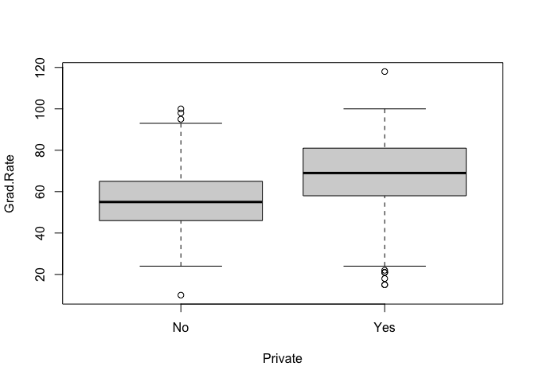<!-- -->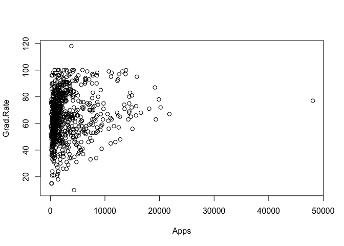<!-- -->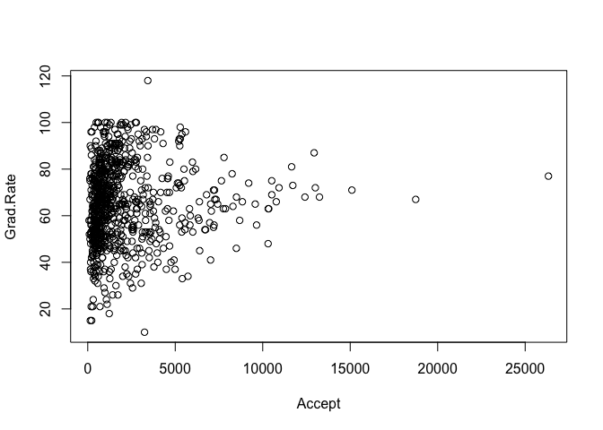<!-- -->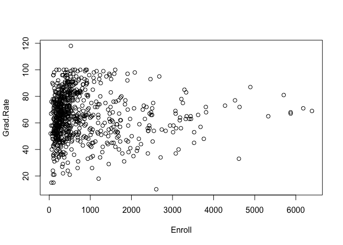<!-- -->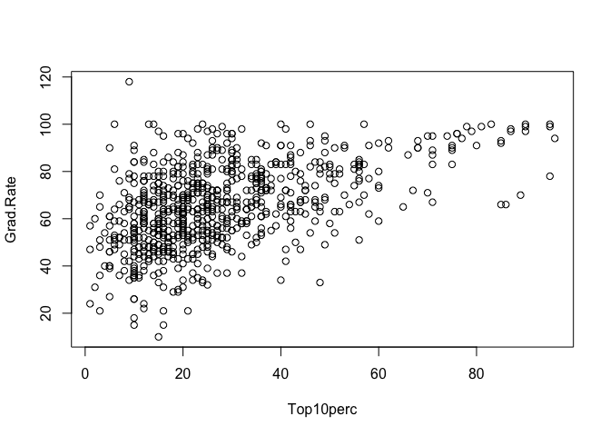<!-- -->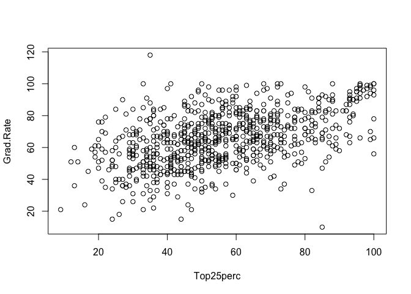<!-- -->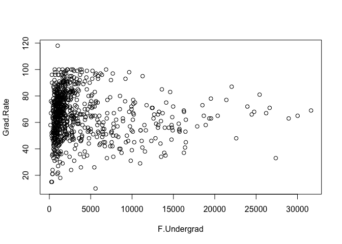<!-- -->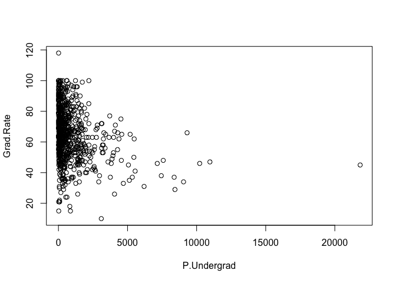<!-- -->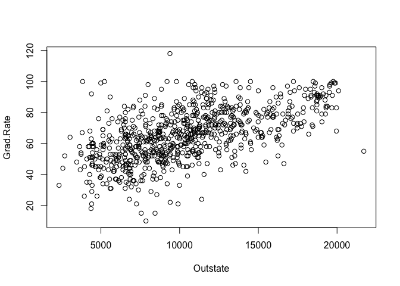<!-- -->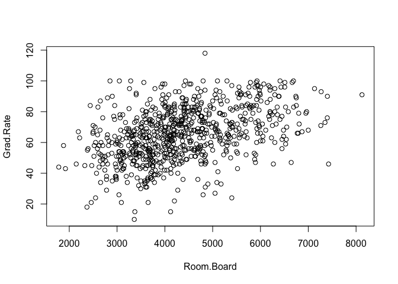<!-- -->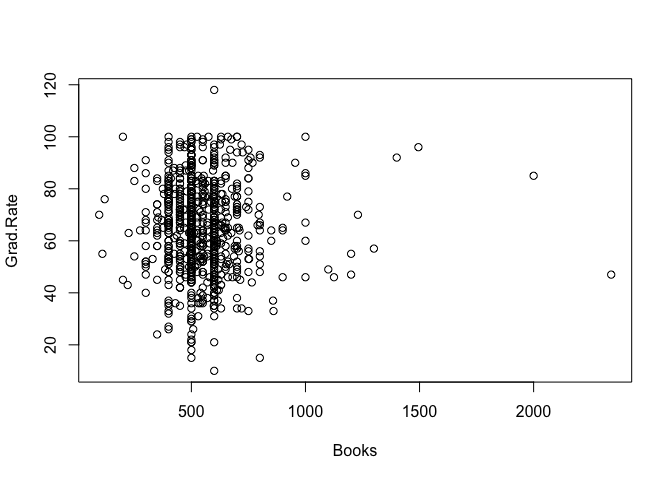<!-- -->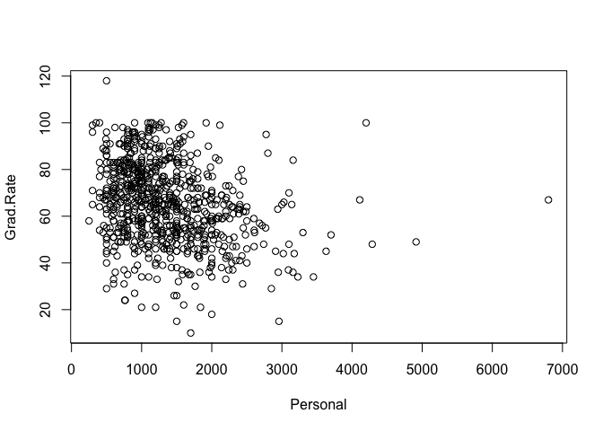<!-- -->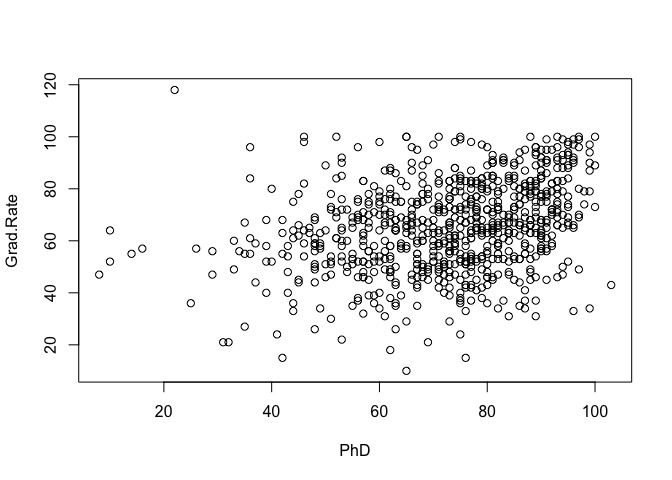<!-- -->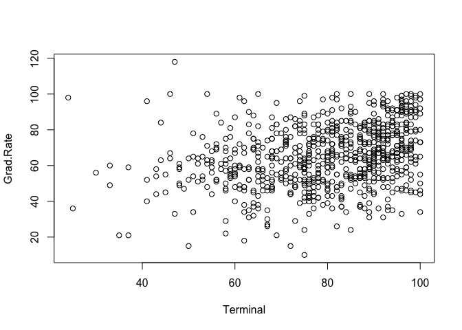<!-- -->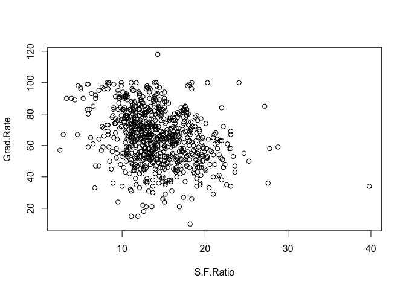<!-- -->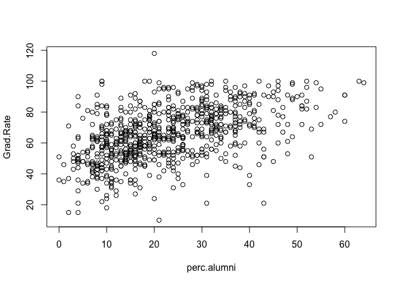<!-- -->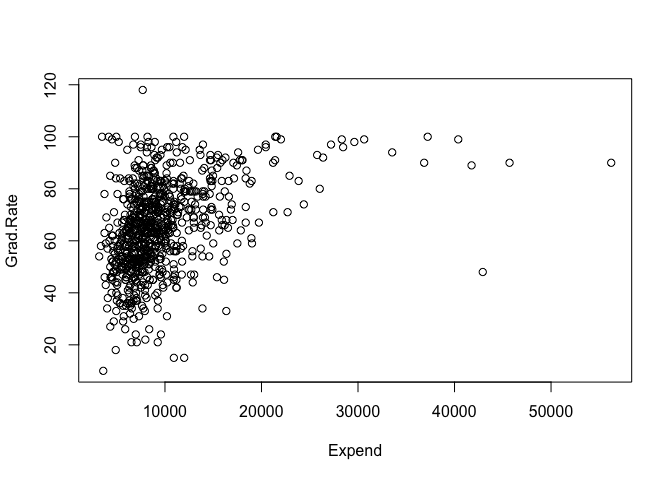<!-- -->

## b
The relationship between out of state tuition and graduation rate seems to be fairly linear, so I have chosen this predictor for my plot.


```r
m1 <- lm(Grad.Rate~ Outstate, data = College)
plot(Grad.Rate~ Outstate, data = College)
abline(m1)
```

<!-- -->
Despite fairly high variance, I would say this linear model does an adequate  job of roughly approximating the relationship between out of state tuition and college graduation rates.


