```r
birds <- read.csv("birds.csv")
```

# Problem 1

## a 
"Is patch area associated with abundance of birds?"


```r
#bad
m1 <- lm(abundance ~ patch_area, data = birds)
summary(m1)
```

```
## 
## Call:
## lm(formula = abundance ~ patch_area, data = birds)
## 
## Residuals:
##      Min       1Q   Median       3Q      Max 
## -17.3042  -6.6133   0.8361   8.8045  20.2950 
## 
## Coefficients:
##              Estimate Std. Error t value Pr(>|t|)    
## (Intercept) 18.799005   1.446956  12.992   <2e-16 ***
## patch_area   0.010326   0.005307   1.946   0.0569 .  
## ---
## Signif. codes:  0 '***' 0.001 '**' 0.01 '*' 0.05 '.' 0.1 ' ' 1
## 
## Residual standard error: 10.47 on 54 degrees of freedom
## Multiple R-squared:  0.06552,	Adjusted R-squared:  0.04822 
## F-statistic: 3.786 on 1 and 54 DF,  p-value: 0.05689
```

```r
m2 <- lm(abundance ~ log_patch_area, data = birds)
summary(m2)
```

```
## 
## Call:
## lm(formula = abundance ~ log_patch_area, data = birds)
## 
## Residuals:
##     Min      1Q  Median      3Q     Max 
## -13.380  -6.119   1.372   4.631  14.255 
## 
## Coefficients:
##                Estimate Std. Error t value Pr(>|t|)    
## (Intercept)     10.4015     1.4894   6.984 4.38e-09 ***
## log_patch_area   4.2467     0.5252   8.086 7.18e-11 ***
## ---
## Signif. codes:  0 '***' 0.001 '**' 0.01 '*' 0.05 '.' 0.1 ' ' 1
## 
## Residual standard error: 7.286 on 54 degrees of freedom
## Multiple R-squared:  0.5477,	Adjusted R-squared:  0.5393 
## F-statistic: 65.38 on 1 and 54 DF,  p-value: 7.178e-11
```

```r
plot(abundance ~ patch_area, data = birds)
abline(m1)
```

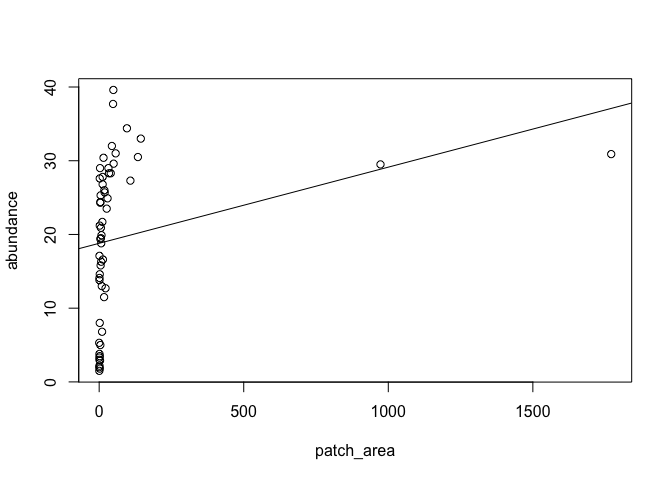<!-- -->

```r
plot(abundance ~ log_patch_area, data = birds)
abline(m2)
```

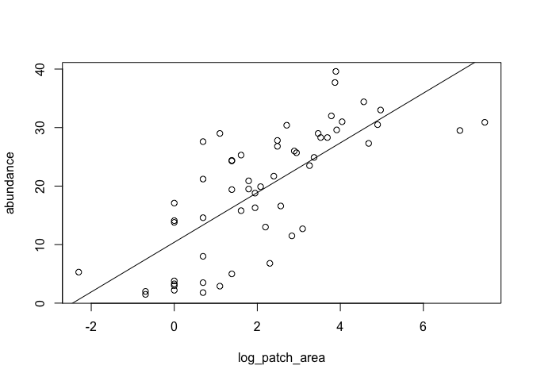<!-- -->

As seen in the plots above, patch_area has very limited correlation with abundance, but log_patch_area has a very noticeable correlation and and R-squared value of 0.55, indicating moderate correlation. In this simple regression model between abundance and log_patch_area, an increase in one unit of log_patch_area (the natural log of the patch area in hectares) corresponds to an increase in abundance by 4.25 birds on average.

To check for least square regression conditions:

```r
plot(m2)
```

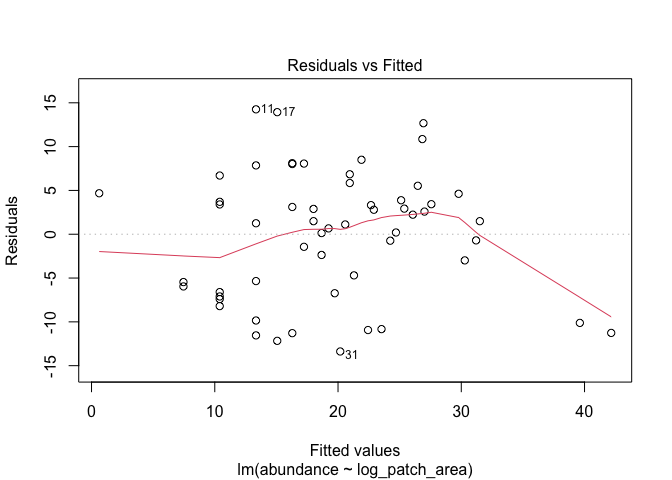<!-- -->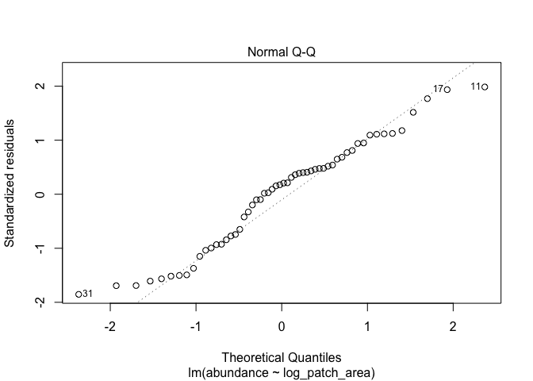<!-- -->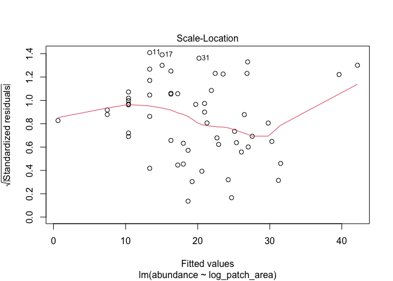<!-- -->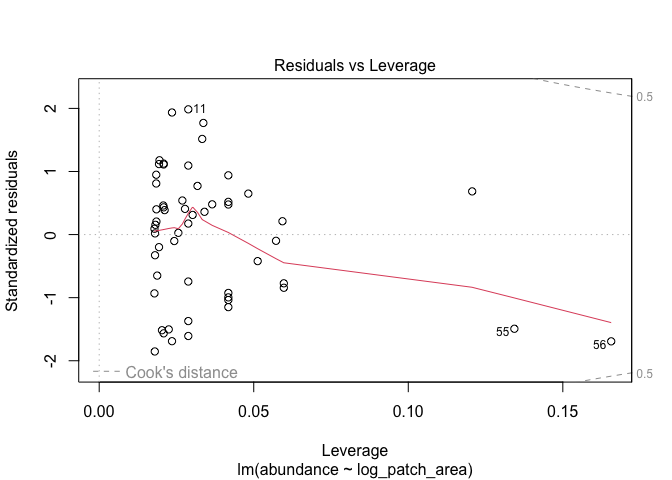<!-- -->

```r
acf(m2$residuals)
```

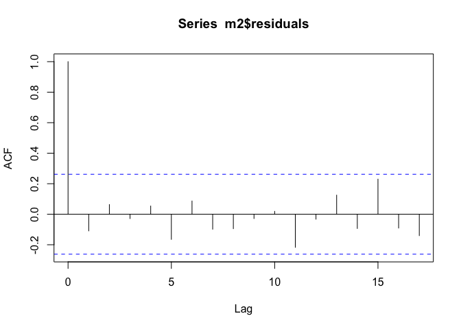<!-- -->

While the model is far from perfect, the model is roughly horizontal in the Residuals vs Fitted with near-constant variance, the residuals are very roughly normally distributed as seen in the Normal Q-Q plot, and there is not a clear trend in the Scale-Location plot. While there are two observations fairly close to 0.5 Cook's distance, there are no egregiously influential outliers and the errors of the model are uncorrelated as seen in the auto correlated residuals plot.


## b
"Provide a 95% confidence interval for the slope of the model from part (a)."


```r
confint(m2)
```

```
##                   2.5 %    97.5 %
## (Intercept)    7.415418 13.387508
## log_patch_area 3.193718  5.299714
```
Thus the 95% confidence interval for the slope of the model from part (a) is [3.193718, 5.299714].


## c
"Construct a multiple regression model with two predictors: log_patch_area and one other variable. Choose a variable that improves (in a meaningful way) the model with only log_patch_area (explain how you assessed that the variable improved the model). Interpret the new model (slopes and R2). Check whether conditions for a least squares model seem to be satisfied."


```r
#simple regression model
plot(abundance ~ log_patch_area, data = birds)
abline(m2)
```

<!-- -->

```r
summary(m2)
```

```
## 
## Call:
## lm(formula = abundance ~ log_patch_area, data = birds)
## 
## Residuals:
##     Min      1Q  Median      3Q     Max 
## -13.380  -6.119   1.372   4.631  14.255 
## 
## Coefficients:
##                Estimate Std. Error t value Pr(>|t|)    
## (Intercept)     10.4015     1.4894   6.984 4.38e-09 ***
## log_patch_area   4.2467     0.5252   8.086 7.18e-11 ***
## ---
## Signif. codes:  0 '***' 0.001 '**' 0.01 '*' 0.05 '.' 0.1 ' ' 1
## 
## Residual standard error: 7.286 on 54 degrees of freedom
## Multiple R-squared:  0.5477,	Adjusted R-squared:  0.5393 
## F-statistic: 65.38 on 1 and 54 DF,  p-value: 7.178e-11
```

```r
#multiple regression model
birds$grazing_intensity <- factor(birds$grazing_intensity,
levels = c("light", "less than average",
"average", "moderately heavy", "heavy"))
m7 <- lm(abundance ~ log_patch_area + grazing_intensity, data = birds)
summary(m7)
```

```
## 
## Call:
## lm(formula = abundance ~ log_patch_area + grazing_intensity, 
##     data = birds)
## 
## Residuals:
##      Min       1Q   Median       3Q      Max 
## -16.0849  -2.4793  -0.0819   2.6485  11.6344 
## 
## Coefficients:
##                                    Estimate Std. Error t value Pr(>|t|)    
## (Intercept)                         15.7164     2.7674   5.679 6.87e-07 ***
## log_patch_area                       3.1474     0.5451   5.774 4.90e-07 ***
## grazing_intensityless than average   0.3826     2.9123   0.131 0.895993    
## grazing_intensityaverage            -0.1893     2.5498  -0.074 0.941103    
## grazing_intensitymoderately heavy   -1.5916     2.9762  -0.535 0.595183    
## grazing_intensityheavy             -11.8938     2.9311  -4.058 0.000174 ***
## ---
## Signif. codes:  0 '***' 0.001 '**' 0.01 '*' 0.05 '.' 0.1 ' ' 1
## 
## Residual standard error: 5.883 on 50 degrees of freedom
## Multiple R-squared:  0.727,	Adjusted R-squared:  0.6997 
## F-statistic: 26.63 on 5 and 50 DF,  p-value: 5.148e-13
```

```r
m10 <- lm(abundance ~ log_patch_area + year_of_isolation, data = birds)
summary(m10)
```

```
## 
## Call:
## lm(formula = abundance ~ log_patch_area + year_of_isolation, 
##     data = birds)
## 
## Residuals:
##      Min       1Q   Median       3Q      Max 
## -14.9560  -3.7973  -0.0104   4.0384  16.7192 
## 
## Coefficients:
##                     Estimate Std. Error t value Pr(>|t|)    
## (Intercept)       -252.19542   69.58669  -3.624 0.000650 ***
## log_patch_area       3.73177    0.49003   7.615 4.62e-10 ***
## year_of_isolation    0.13525    0.03583   3.774 0.000407 ***
## ---
## Signif. codes:  0 '***' 0.001 '**' 0.01 '*' 0.05 '.' 0.1 ' ' 1
## 
## Residual standard error: 6.529 on 53 degrees of freedom
## Multiple R-squared:  0.6435,	Adjusted R-squared:   0.63 
## F-statistic: 47.83 on 2 and 53 DF,  p-value: 1.35e-12
```

```r
confint(m10)
```

```
##                           2.5 %       97.5 %
## (Intercept)       -391.76864024 -112.6222058
## log_patch_area       2.74889664    4.7146525
## year_of_isolation    0.06337588    0.2071223
```
While the multiple regression model with the categorical predictor grazing_intensity yielded the highest R-squared values, it seems as though the addition of four dummy variables are likely the cause of this, and only one of four of the added coefficients were statistically significant.
 
For this reason, I opted for the multiple regression model with predictors year_of_isolation and log_patch_area as the best improvement on the model with log_patch_area as the single predictor. Not only was the coefficient for year_of_isolation very significant with the p-value of 0.000407 (95% confidence interval on [0.06337588, 0.2071223]) indicating a close association with abundance, but  this multiple regression significantly improved the R-squared and adjusted R-squared values. Whereas the simple regression model had values of 0.5477 and 0.5393 respectively, the multiple regression model improved these to 0.6435 and 0.63. The F-statistic p-value also decreased from the simple to multiple regression model, dropping from 7.178e-11 to 1.35e-12. For these reasons, I decided this model made significant improvements on the simple regression model.

As for interpretation, we can see that holding log_patch_area constant, an increase in year_of_isolation(i.e. the time period of isolation is one year more recent) corresponds to an increase of abundance by 0.13525 birds on average. Holding year_of_isolation constant, we see than an increase of log_patch_area (the natural log of patch area in hectares) by one unit corresponds to a 2.7489 increase in abundance of birds on average. As already mentioned, the R-squared and adjusted R-squared values of  0.6435 and 0.63 indicate that a bit more of 60% of the data is explained by the multiple regression model.

The condition for least squares model:

```r
plot(m10)
```

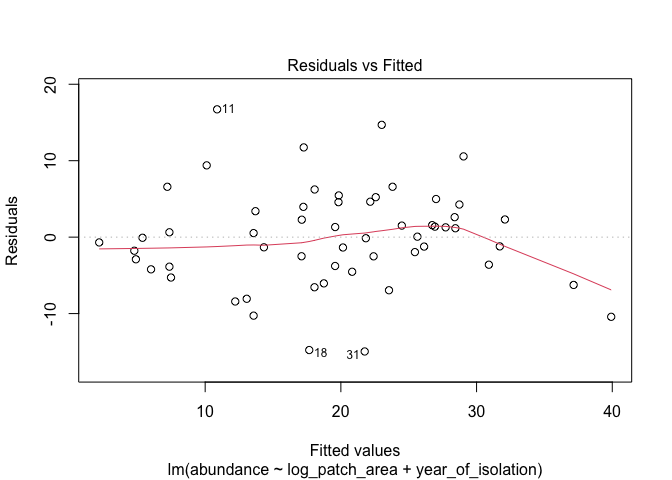<!-- -->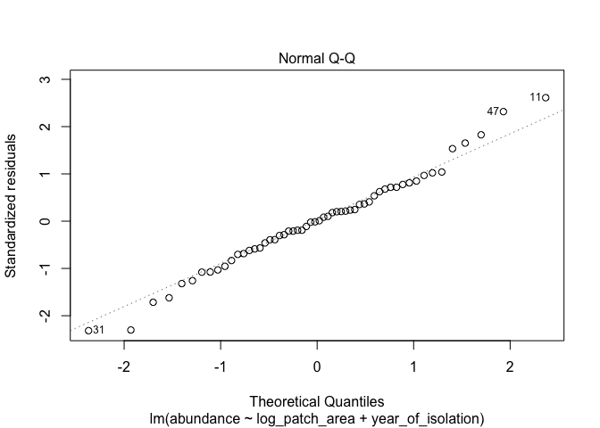<!-- -->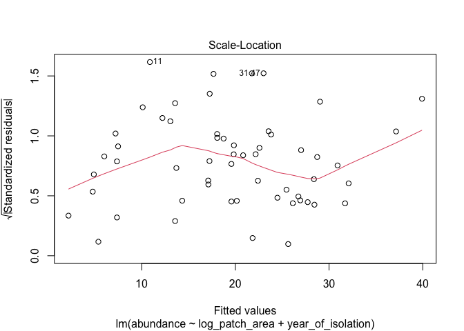<!-- -->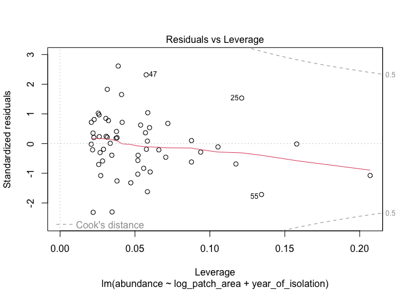<!-- -->

```r
acf(m10$residuals)
```

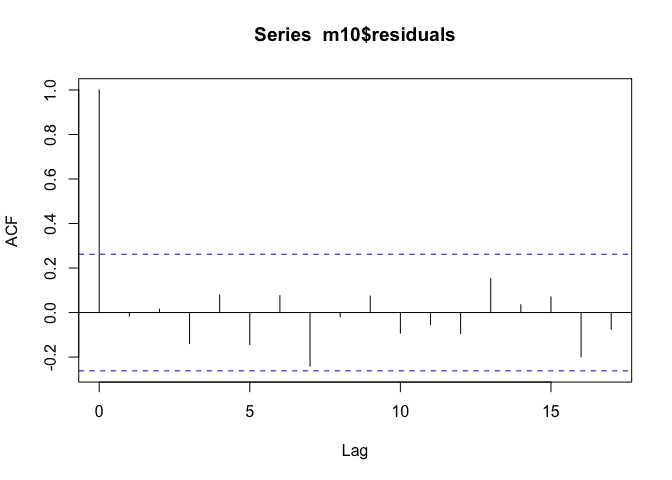<!-- -->

While clearly the multiple regression model is not perfect, we see a roughly horizontal line in the Residuals vs Fitted plot(except for the two right-most observations) with roughly constant variance. In the Normal Q-Q plot, we see that residuals are largely normally distributed. In the Scale-Location plot, the line is not quite horizontal but there is not an obvious trend and variance is roughly constant. We also see that there are no influential outliers in the Residuals vs Leverage plot.

Finally, in the auto correlated residuals plot, we see that model errors are uncorrelated. Since our model roughly passes the diagnostics for least squares regression and improved the simple regression model in the ways already discussed, the model seems to be a moderate improvement.

