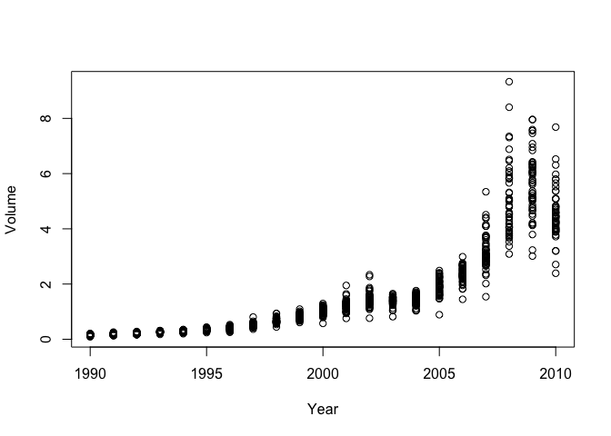
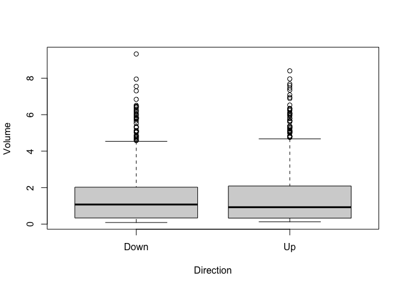
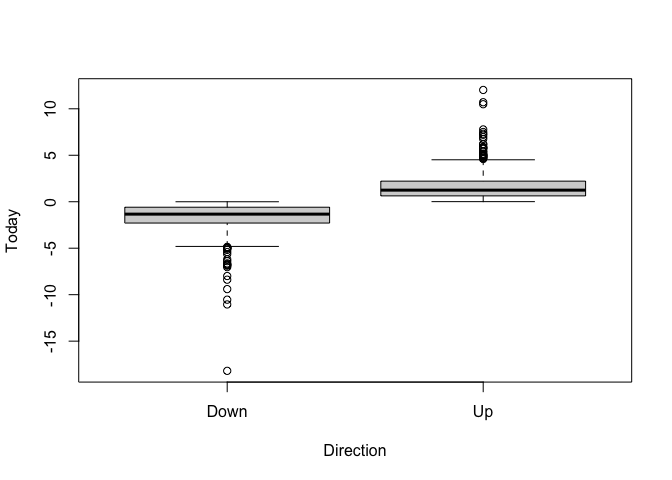

# Problem 13
"This question should be answered using the Weekly data set, which is part of the ISLR2 package. This data is similar in nature to the Smarket data from this chapter’s lab, except that it contains 1, 089 weekly returns for 21 years, from the beginning of 1990 to the end of 2010."

### a 
Produce some numerical and graphical summaries of the Weekly data. Do there appear to be any patterns?


```r
plot(Volume~Year, data = Weekly)
```

<!-- -->

```r
plot(Volume~Direction, data = Weekly)
```

<!-- -->

```r
plot(Today ~ Direction, data = Weekly)
```

<!-- -->

As can be seen in the plots above, it appears that year has a postive relationship with the volume of shares traded. It also appears that the direction predictor has some relationship with volume of shares traded, as when direction is "Up" the volume of shares traded is slightly lower in comparison to Volume. Unsuprisingly, direction is also correlated with Today, the percentage return for the week. If the Direction is "Up", Today is increased in comparison to Direction "Down".

### b 
Use the full data set to perform a logistic regression with Direction as the response and the five lag variables plus Volume as predictors. Use the summary function to print the results. Do any of the predictors appear to be statistically significant? If so, which ones?


```r
Direction <- factor(Weekly$Direction)
m1_log <- glm(Direction ~ Lag1 + Lag2 + Lag3 + Lag4 + Lag5 + Volume, data = Weekly, family = "binomial")
summary(m1_log)
```

```
## 
## Call:
## glm(formula = Direction ~ Lag1 + Lag2 + Lag3 + Lag4 + Lag5 + 
##     Volume, family = "binomial", data = Weekly)
## 
## Deviance Residuals: 
##     Min       1Q   Median       3Q      Max  
## -1.6949  -1.2565   0.9913   1.0849   1.4579  
## 
## Coefficients:
##             Estimate Std. Error z value Pr(>|z|)   
## (Intercept)  0.26686    0.08593   3.106   0.0019 **
## Lag1        -0.04127    0.02641  -1.563   0.1181   
## Lag2         0.05844    0.02686   2.175   0.0296 * 
## Lag3        -0.01606    0.02666  -0.602   0.5469   
## Lag4        -0.02779    0.02646  -1.050   0.2937   
## Lag5        -0.01447    0.02638  -0.549   0.5833   
## Volume      -0.02274    0.03690  -0.616   0.5377   
## ---
## Signif. codes:  0 '***' 0.001 '**' 0.01 '*' 0.05 '.' 0.1 ' ' 1
## 
## (Dispersion parameter for binomial family taken to be 1)
## 
##     Null deviance: 1496.2  on 1088  degrees of freedom
## Residual deviance: 1486.4  on 1082  degrees of freedom
## AIC: 1500.4
## 
## Number of Fisher Scoring iterations: 4
```
The only significant predictor appears to be Lag2.

### c
Compute the confusion matrix and overall fraction of correct predictions. Explain what the confusion matrix is telling you about the types of mistakes made by logistic regression.

```r
glm.probs <- predict(m1_log, type = "response")
glm.pred <- rep("Down", 1089)
glm.pred[glm.probs >0.5] = "Up"
#create confusion matrix
table(glm.pred, Weekly$Direction)
```

```
##         
## glm.pred Down  Up
##     Down   54  48
##     Up    430 557
```

```r
#fraction of correct predictions.
mean(glm.pred == Weekly$Direction)
```

```
## [1] 0.5610652
```
The confusion matrix is telling us that the logistic regression mostly made the mistake of predicting "Down" points to be "Up", as this comprised the vast majority of incorrect placements.

### d
Now fit the logistic regression model using a training data period from 1990 to 2008, with Lag2 as the only predictor. Compute the confusion matrix and the overall fraction of correct predictions for the held out data (that is, the data from 2009 and 2010).

```r
new_f <- data.frame(Weekly[1:985,])
test_f <- data.frame(Weekly[985:1089,])
train <- (Weekly$Year < 2009)
m2_log <- glm(Direction ~  Lag2 , data = new_f,  family = "binomial")
glm.probs2 <- predict(m2_log, test_f, type = "response")
glm.pred2 <- rep("Down", 105)
glm.pred2[glm.probs2 >0.5] = "Up"
#create confusion matrix
table(glm.pred2, test_f$Direction)
```

```
##          
## glm.pred2 Down Up
##      Down    9  5
##      Up     34 57
```

```r
#fraction of correct predictions.
mean(glm.pred2 == test_f$Direction)
```

```
## [1] 0.6285714
```


### e
Repeat (d) using LDA.

```r
library(MASS)
m_lda <- lda(Direction ~ Lag2 , data = new_f)
predict_lda <- predict(m_lda, test_f)
lda_class <- predict_lda$class
table(lda_class, test_f$Direction)
```

```
##          
## lda_class Down Up
##      Down    9  5
##      Up     34 57
```

```r
mean(lda_class == test_f$Direction)
```

```
## [1] 0.6285714
```


### f 
Repeat (d) using QDA.

```r
m_qda <- qda(Direction ~ Lag2 , data = new_f)
predict_qda <- predict(m_qda, test_f)
qda_class <- predict_qda$class
table(qda_class, test_f$Direction)
```

```
##          
## qda_class Down Up
##      Down    0  0
##      Up     43 62
```

```r
mean(qda_class == test_f$Direction)
```

```
## [1] 0.5904762
```


### g 
Repeat (d) using KNN with K = 1.

```r
library(e1071)
library(class)
train <-(Weekly$Year <2009)
train.X <- data.frame(new_f$Lag2)
test.X <- data.frame(test_f$Lag2)
train.Direction <- new_f$Direction
v1 = new_f[, 9]
knn_pred <- knn(train.X, test.X, v1, k = 1)
table(knn_pred, test_f$Direction)
```

```
##         
## knn_pred Down Up
##     Down   21 29
##     Up     22 33
```

```r
mean(knn_pred == test_f$Direction)
```

```
## [1] 0.5142857
```


### h 
Repeat (d) using naive Bayes.


```r
library(e1071)
naive_b <- naiveBayes(Direction ~ Lag2, data = new_f)
nb_class <- predict(naive_b, test_f)
mean(nb_class == test_f$Direction)
```

```
## [1] 0.5904762
```

```r
table(nb_class, test_f$Direction)
```

```
##         
## nb_class Down Up
##     Down    0  0
##     Up     43 62
```


### i
Which of these methods appears to provide the best results on this data?

The LDA model provided the best results.

### j
Experiment with different combinations of predictors, including possible transformations and interactions, for each of the methods. Report the variables, method, and associated confusion matrix that appears to provide the best results on the held out data. Note that you should also experiment with values for K in the KNN classifier.

### logistic

```r
m2_log <- glm(Direction ~  Lag1 + Lag2 , data = new_f,  family = binomial)
glm.probs2 <- predict(m2_log, test_f, type = "response")
glm.pred2 <- rep("Down", 105)
glm.pred2[glm.probs2 >0.5] = "Up"
#create confusion matrix
table(glm.pred2, test_f$Direction)
```

```
##          
## glm.pred2 Down Up
##      Down    7  8
##      Up     36 54
```

```r
#fraction of correct predictions.
#mean(glm.pred2 == test_f$Directions)
61/(61+44)
```

```
## [1] 0.5809524
```

### lda

```r
m_lda2 <- lda(Direction ~ Lag1 + Lag2 , data = new_f)
predict_lda <- predict(m_lda2, test_f)
lda_class <- predict_lda$class
table(lda_class, test_f$Direction)
```

```
##          
## lda_class Down Up
##      Down    7  8
##      Up     36 54
```

```r
mean(lda_class == test_f$Direction)
```

```
## [1] 0.5809524
```

### qda

```r
m_qda <- qda(Direction ~ Lag2 + Today , data = new_f)
predict_qda <- predict(m_qda, test_f)
qda_class <- predict_qda$class
table(qda_class, test_f$Direction)
```

```
##          
## qda_class Down Up
##      Down   41  0
##      Up      2 62
```

```r
mean(qda_class == test_f$Direction)
```

```
## [1] 0.9809524
```

As we can see here, Today is a very accurate predictor of Direction.

### knn

```r
library(e1071)
library(class)
# train <-(Weekly$Year <2009)
# train.X <- data.frame(new_f$Lag2)
# test.X <- data.frame(test_f$Lag2)
# train.Direction <- new_f$Direction
v1 = new_f[, 9]
knn_pred <- knn(train.X, test.X, v1, k = 2)
table(knn_pred, test_f$Direction)
```

```
##         
## knn_pred Down Up
##     Down   25 27
##     Up     18 35
```

```r
mean(knn_pred == test_f$Direction)
```

```
## [1] 0.5714286
```

```r
knn_pred <- knn(train.X, test.X, v1, k = 3)
table(knn_pred, test_f$Direction)
```

```
##         
## knn_pred Down Up
##     Down   16 20
##     Up     27 42
```

```r
mean(knn_pred == test_f$Direction)
```

```
## [1] 0.552381
```

```r
#knn with Today as predictor
train.X2 <- data.frame(cbind(new_f$Lag2,new_f$Today))
test.X2 <- data.frame(cbind(test_f$Lag2, test_f$Today))

knn_pred2 <- knn(train.X2, test.X2, v1, k = 3)
table(knn_pred2, test_f$Direction)
```

```
##          
## knn_pred2 Down Up
##      Down   42  1
##      Up      1 61
```

```r
mean(knn_pred2 == test_f$Direction)
```

```
## [1] 0.9809524
```

```r
knn_pred <- knn(train.X, test.X, v1, k = 4)
table(knn_pred, test_f$Direction)
```

```
##         
## knn_pred Down Up
##     Down   18 21
##     Up     25 41
```

```r
mean(knn_pred == test_f$Direction)
```

```
## [1] 0.5619048
```

```r
knn_pred <- knn(train.X, test.X, v1, k = 5)
table(knn_pred, test_f$Direction)
```

```
##         
## knn_pred Down Up
##     Down   16 21
##     Up     27 41
```

```r
mean(knn_pred == test_f$Direction)
```

```
## [1] 0.5428571
```

None of these KNN models did very well, but once again knn_pred2 had the added precitor of Today which made the model an excellent predictor.

### naive Bayes

```r
library(e1071)
naive_b <- naiveBayes(Direction ~ Lag2+ Today, data = new_f)
nb_class <- predict(naive_b, test_f)
mean(nb_class == test_f$Direction)
```

```
## [1] 0.9619048
```

```r
table(nb_class, test_f$Direction)
```

```
##         
## nb_class Down Up
##     Down   39  0
##     Up      4 62
```
Adding the Today predictor to a naive Bayes model, our model become an excellent predictor but not quite as good at KNN with Today as a predictor.
