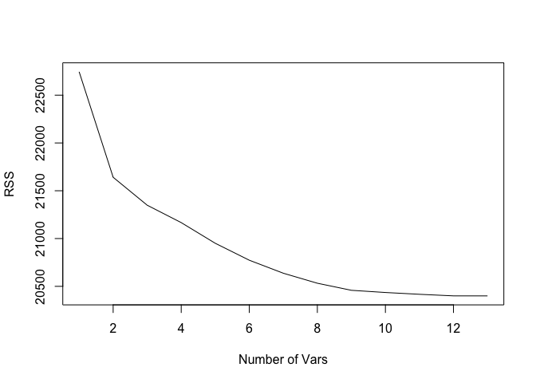
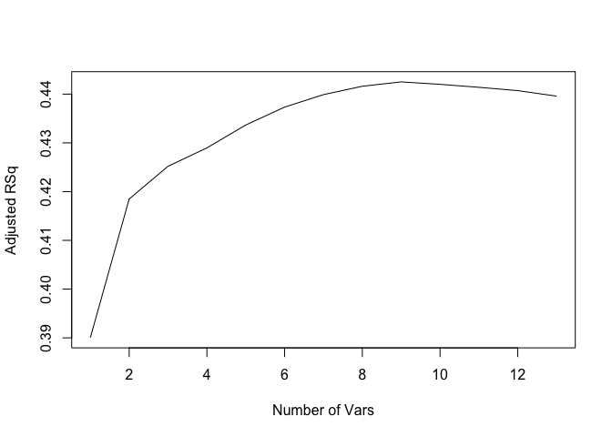
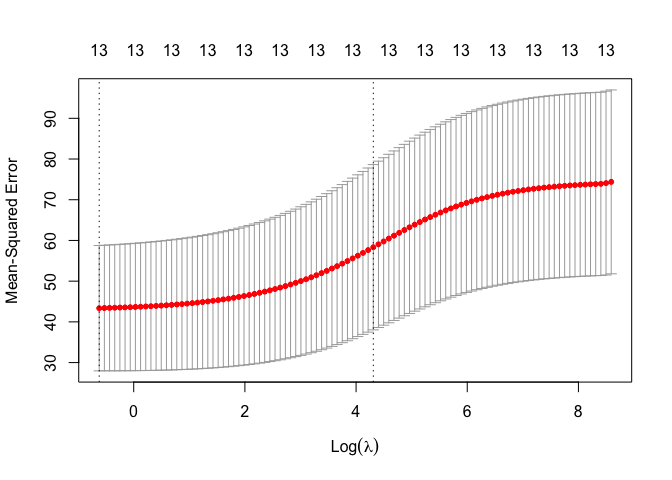
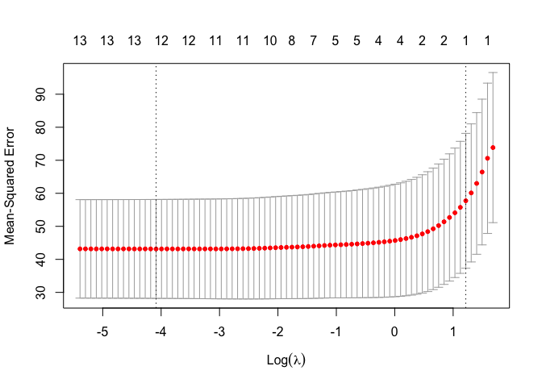

# Problem 11, Chapter 6
" We will now try to predict per capita crime rate in the Boston data set.

```r
library(MASS)
```


## a 
"Try out some of the regression methods explored in this chapter, such as best subset selection, the lasso, ridge regression, and PCR. Present and discuss results for the approaches that you consider."

### Best subset selection

```r
library(leaps)
reg_fit <- regsubsets(crim~., data = Boston, nvmax = 14)
reg.b.summary <- summary(reg_fit)
reg.b.summary
```

```
## Subset selection object
## Call: regsubsets.formula(crim ~ ., data = Boston, nvmax = 14)
## 13 Variables  (and intercept)
##         Forced in Forced out
## zn          FALSE      FALSE
## indus       FALSE      FALSE
## chas        FALSE      FALSE
## nox         FALSE      FALSE
## rm          FALSE      FALSE
## age         FALSE      FALSE
## dis         FALSE      FALSE
## rad         FALSE      FALSE
## tax         FALSE      FALSE
## ptratio     FALSE      FALSE
## black       FALSE      FALSE
## lstat       FALSE      FALSE
## medv        FALSE      FALSE
## 1 subsets of each size up to 13
## Selection Algorithm: exhaustive
##           zn  indus chas nox rm  age dis rad tax ptratio black lstat medv
## 1  ( 1 )  " " " "   " "  " " " " " " " " "*" " " " "     " "   " "   " " 
## 2  ( 1 )  " " " "   " "  " " " " " " " " "*" " " " "     " "   "*"   " " 
## 3  ( 1 )  " " " "   " "  " " " " " " " " "*" " " " "     "*"   "*"   " " 
## 4  ( 1 )  "*" " "   " "  " " " " " " "*" "*" " " " "     " "   " "   "*" 
## 5  ( 1 )  "*" " "   " "  " " " " " " "*" "*" " " " "     "*"   " "   "*" 
## 6  ( 1 )  "*" " "   " "  "*" " " " " "*" "*" " " " "     "*"   " "   "*" 
## 7  ( 1 )  "*" " "   " "  "*" " " " " "*" "*" " " "*"     "*"   " "   "*" 
## 8  ( 1 )  "*" " "   " "  "*" " " " " "*" "*" " " "*"     "*"   "*"   "*" 
## 9  ( 1 )  "*" "*"   " "  "*" " " " " "*" "*" " " "*"     "*"   "*"   "*" 
## 10  ( 1 ) "*" "*"   " "  "*" "*" " " "*" "*" " " "*"     "*"   "*"   "*" 
## 11  ( 1 ) "*" "*"   " "  "*" "*" " " "*" "*" "*" "*"     "*"   "*"   "*" 
## 12  ( 1 ) "*" "*"   "*"  "*" "*" " " "*" "*" "*" "*"     "*"   "*"   "*" 
## 13  ( 1 ) "*" "*"   "*"  "*" "*" "*" "*" "*" "*" "*"     "*"   "*"   "*"
```

```r
names(reg.b.summary)
```

```
## [1] "which"  "rsq"    "rss"    "adjr2"  "cp"     "bic"    "outmat" "obj"
```

```r
reg.b.summary$rsq
```

```
##  [1] 0.3912567 0.4207965 0.4286123 0.4334892 0.4392738 0.4440173 0.4476594
##  [8] 0.4504606 0.4524408 0.4530572 0.4535605 0.4540031 0.4540104
```

```r
plot(reg.b.summary$rss, xlab = "Number of Vars", ylab = "RSS", type = "l")
```

<!-- -->

```r
plot(reg.b.summary$adjr2, xlab = "Number of Vars", ylab = "Adjusted RSq", type = "l")
```

<!-- -->

```r
predict.regsubsets <- function(object, newdata, id, ...) {
form <- as.formula(object$call[[2]]) 
mat <- model.matrix(form, newdata) 
coefi <-coef(object, id = id)
xvars <- names(coefi)
mat[, xvars] %*% coefi
}

k <- 10
n <- nrow(Boston)
set.seed(1)
folds <- sample(rep(1:k, length = n))
cv.errors <- matrix(NA, k, 13, dimnames = list(NULL, paste(1:13)))

for (j in 1:k) {
    best.fit <- regsubsets(crim ~., data = Boston[folds != j,], nvmax = 12) 
  for (i in 1:12) {
    pred <- predict(best.fit, Boston[folds == j, ], id = i)
    cv.errors[j, i] <- mean((Boston$crim[folds == j] - pred)^2)
  }
}
mean.cv.errors <- apply(cv.errors, 2, mean)
mean.cv.errors
```

```
##        1        2        3        4        5        6        7        8 
## 46.00617 44.22854 43.80757 44.63674 44.37501 44.10329 43.38296 43.18012 
##        9       10       11       12       13 
## 42.81453 43.01895 43.03912 42.88730       NA
```

From the exploration of the best subset method, it looks as though a model with the four best predictors ("zn", "dis", "rad", and "medv") strikes a balance of simplicity and predictive power, but the cross validation results support the choice of an eleven predictor model as it has the lowest CV MSE of 42.67672.

### Ridge regression

```r
set.seed(10)
library(glmnet)
```

```
## Loading required package: Matrix
```

```
## Loaded glmnet 4.1-7
```

```r
x <- model.matrix(crim ~., data = Boston)[,-1]
y <- Boston$crim
grid <- 10^seq(10, -2, length = 100)
ridge_model <- glmnet(x, y, alpha = 0, lambda = grid)
summary(ridge_model)
```

```
##           Length Class     Mode   
## a0         100   -none-    numeric
## beta      1300   dgCMatrix S4     
## df         100   -none-    numeric
## dim          2   -none-    numeric
## lambda     100   -none-    numeric
## dev.ratio  100   -none-    numeric
## nulldev      1   -none-    numeric
## npasses      1   -none-    numeric
## jerr         1   -none-    numeric
## offset       1   -none-    logical
## call         5   -none-    call   
## nobs         1   -none-    numeric
```

```r
cv1 <- cv.glmnet(x,y,alpha = 0)
plot(cv1)
```

<!-- -->

```r
best_lambda = cv1$lambda.min
best_lambda
```

```
## [1] 0.5374992
```

```r
#best CV MSE
cv1$cvm[which.min(cv1$lambda)]
```

```
## [1] 43.3609
```

Our ridge regression model has a 10-fold cross validation MSE of 42.95232, very similar to that of the best subset regression.

### Lasso model

```r
set.seed(10)
library(glmnet)
x2 <- model.matrix(crim ~., data = Boston)[,-1]
y2 <- Boston$crim
lasso_model2 <- glmnet(x2, y2, alpha = 1, lambda = grid)
summary(lasso_model2)
```

```
##           Length Class     Mode   
## a0         100   -none-    numeric
## beta      1300   dgCMatrix S4     
## df         100   -none-    numeric
## dim          2   -none-    numeric
## lambda     100   -none-    numeric
## dev.ratio  100   -none-    numeric
## nulldev      1   -none-    numeric
## npasses      1   -none-    numeric
## jerr         1   -none-    numeric
## offset       1   -none-    logical
## call         5   -none-    call   
## nobs         1   -none-    numeric
```

```r
cv2 <- cv.glmnet(x,y,alpha = 1)
plot(cv2)
```

<!-- -->

```r
best_lambda2 = cv2$lambda.min
best_lambda2
```

```
## [1] 0.0168007
```

```r
#best CV MSE
cv2$cvm[which.min(cv2$lambda)]
```

```
## [1] 43.17332
```

Again, very similar to that of the best subset and ridge regression, our lasso regression produces a 10-fold CV MSE of 42.64223.


## b
"Propose a model (or set of models) that seem to perform well on this data set, and justify your answer. Make sure that you are evaluating model performance using validation set error, cross- validation, or some other reasonable alternative, as opposed to using training error."

Simply on the basis of the lowest 10-fold cross validation MSE, I propose that the lasso regression model works well to predict the per capita crime rates in Boston suburbs. As already discussed in part (a), while CV MSE's were all close, the lasso regression model has the least, so it is an obvious choice.


## c 
"Does your chosen model involve all of the features in the data set? Why or why not?"

Because ridge and lasso methods are particularly fast and accurate with relatively high number of predictors relative to observations, I built my lasso model using all of the features of the data set which does not appear to have been detrimental to my model. I could have spent much more time experimenting with combinations of predictos, but the beauty of the ridge and lasso methods is thier ease of use in high-dimensional spaces.


