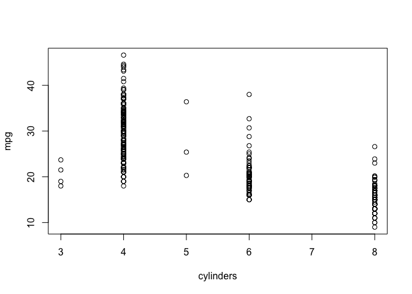
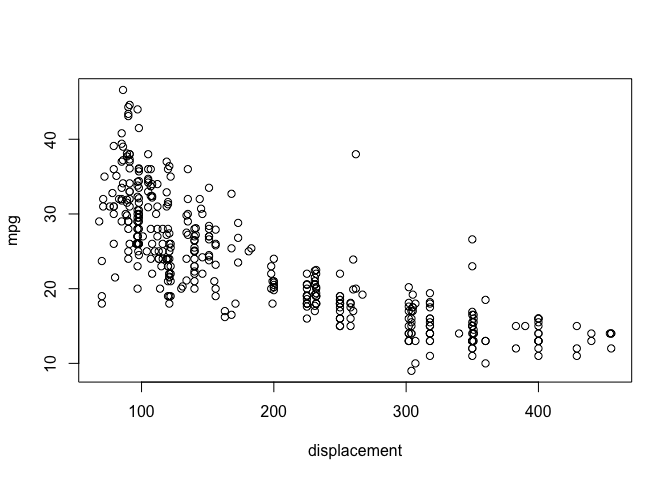
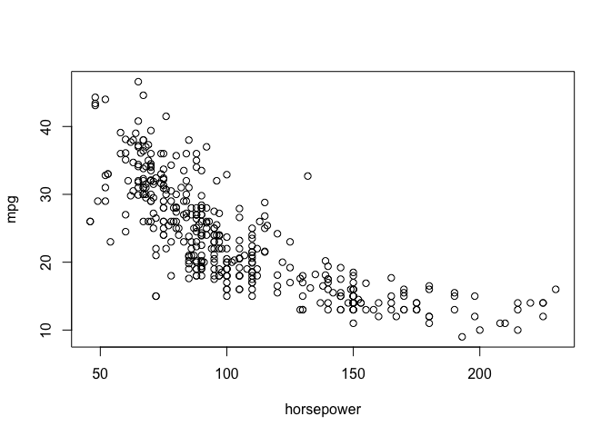
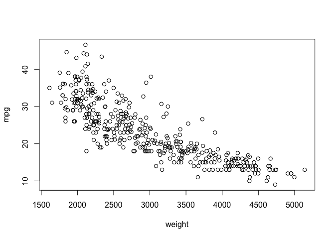
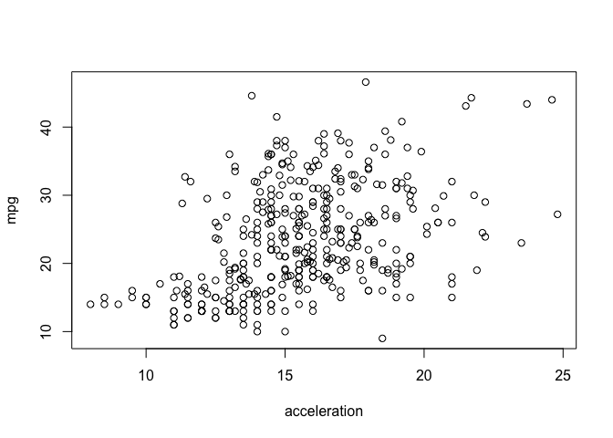
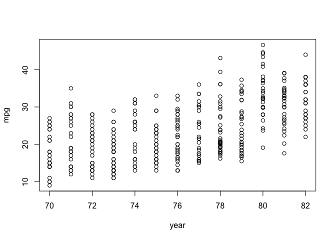
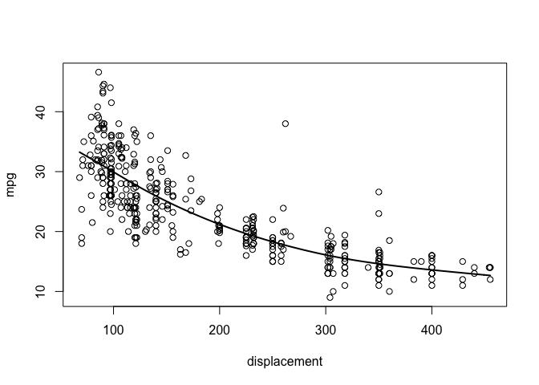
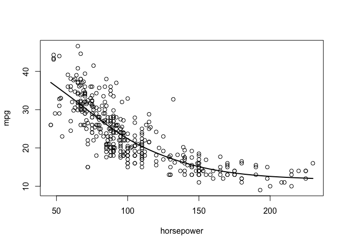
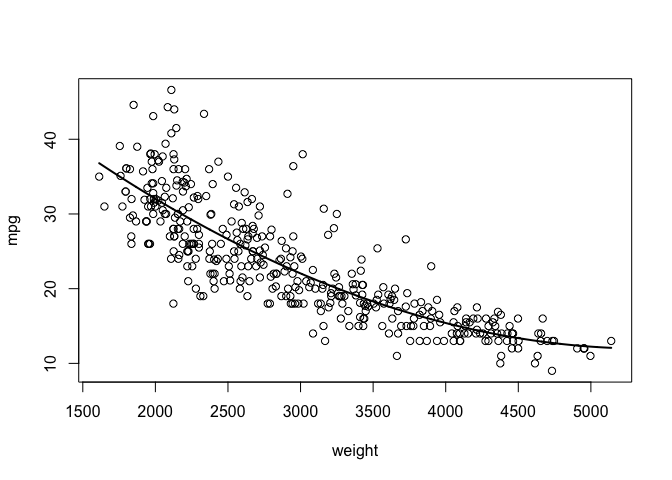
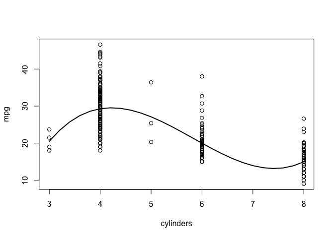

#Test Problems 5

```r
library(ISLR2)
Auto$origin <- factor(Auto$origin)
```
"Your task is to build a model that can predict mpg using tools that can capture non-linear relationships. There are 7 possible predictors in the Auto data, 6 of which are numerical."

### a
"Through scatter plots, investigate whether any of the 6 numerical predictors (cylinders, displacement, horsepower, weight, acceleration, year) appear to have a non-linear relationship with mpg."

```r
plot(mpg ~., data = Auto[,-c(8,9)])
```

<!-- --><!-- --><!-- --><!-- --><!-- --><!-- -->

It appears that the predictors "displacement", "horsepower", "weight", and "cylinders" have non-linear relationships with "mpg". Due to the few discrete levels of the predictor "cylinders" and the very few observations of 3-cylinder engines, the intensity of this non linearity is somewhat hard to gauge. The variance is high enough in the acceleration plot to prohibit any firm conclusion of linearity or nonlinearity, so I chose to neglect this trend as decidedly non-linear.

### b
"For each predictor that appears to have a non-linear relationship with mpg, fit a non-linear model and plot the non-linear model on the scatter plot of mpg vs the variable. Explain how you selected the non-linear model."

Displacement model

```r
library(splines)
library(boot)
library(gam)
```

```
## Loading required package: foreach
```

```
## Loaded gam 1.22-2
```

```r
disrange <- range(Auto$displacement)
grid <- seq(from = disrange[1], to = disrange[2])
plot(mpg~ displacement, data = Auto)
s1 <- gam(mpg~s(displacement,3), data = Auto,)
pred_spline <- predict(s1, data.frame(displacement = grid), se = T)
```

```
## Warning in newdata.predict.Gam(object, newdata, type, dispersion, se.fit, : No
## standard errors (currently) for gam predictions with newdata
```

```r
#plot(mpg ~ displacement, data = Auto, col = "gray")
lines(pred_spline ~ grid, lwd = 2)
```

<!-- -->

```r
#lines((pred_spline+2*pred_spline$se) ~ dis.grid, lty = "dashed")
#lines((pred_spline$fit-2*pred_spline$se) ~ dis.grid, lty = "dashed")
```
I selected a cubic smoothing splines model because the data is visibly non-linear, but not excessively wavy. A model with more degree's of freedom but add unwanted variance and over fit the data, but this trend line is visibly a good approximation of the data.

Horsepower Model


```r
library(splines)
library(boot)
library(gam)
horserange <- range(Auto$horsepower)
grid <- seq(from = horserange[1], to = horserange[2])
plot(mpg~ horsepower, data = Auto)
s2 <- gam(mpg~s(horsepower,3), data = Auto,)
pred_spline2 <- predict(s2, data.frame(horsepower = grid), se = T)
```

```
## Warning in newdata.predict.Gam(object, newdata, type, dispersion, se.fit, : No
## standard errors (currently) for gam predictions with newdata
```

```r
#plot(mpg ~ displacement, data = Auto, col = "gray")
lines(pred_spline2 ~ grid, lwd = 2)
```

<!-- -->

I again selected cubic splines for simplicity and I wanted to avoid over fitting and unwanted variance introduced by higher degree polynomials or splines.

Weight Model

```r
library(splines)
library(boot)
library(gam)
weightrange <- range(Auto$weight)
grid <- seq(from = weightrange[1], to = weightrange[2])
s3 <- lm(mpg ~ poly(weight,3), data = Auto)
pred_spline3 <- predict(s3, data.frame(weight = grid), se = T)
#plot(mpg ~ displacement, data = Auto, col = "gray")
plot(mpg~ weight, data = Auto)
lines(pred_spline3$fit ~ grid, lwd = 2)
```

<!-- -->

I chose a cubic polynomial for this model to see what effect could be visibly different from cubic splines and a cubic polynomial. I did not notice much of a difference and it appears that both model types do a good job of approximating the relationship between weight, horsepower, and displacement with mpg.

Cylinders Model

```r
library(splines)
library(boot)
library(gam)
cylrange <- range(Auto$cylinders)
grid <- seq(from = cylrange[1], to = cylrange[2], by = 0.2)
s4 <- gam(mpg ~ poly(cylinders,3), data = Auto)
pred_spline4 <- predict(s4, data.frame(cylinders = grid), se = T)
#plot(mpg ~ displacement, data = Auto, col = "gray")
plot(mpg~ cylinders, data = Auto)
lines(pred_spline4$fit ~ grid, lwd = 2)
```

<!-- -->

Although the four data points with three cylinders are the most likely the cause of much of the non-linearity seen in the plot above, we can clearly see that a non-linear relationship exists between cylinders and mpg. It appears as though even without the observations with three cylinders, a third degree polynomial would still be a good fit for this data. 


### c
"Fit a GAM model to predict mpg using all predictors and find the cross-validation error (using 10-fold CV). You may use the function cv.glm for GAM models."

All predictor model

```r
library(splines)
library(boot)
library(gam)
s5 <- gam(mpg~ poly(cylinders,3) + poly(weight,3) + s(horsepower,3) + s(displacement,3) + acceleration + year + origin, data = Auto,)
#pred_spline2 <- predict(s5, newdata =  se = T)
#plot(mpg ~ displacement, data = Auto, col = "gray")
#lines(pred_spline2 ~ grid, lwd = 2)
cv <- cv.glm(Auto, s5, K = 10)
cv$delta[1]
```

```
## [1] 8.444861
```

I found the cross validation error to be 8.288642 when using 10-fold CV.


### d
"Fit a regular linear regression model using all predictors and find the cross-validation error (using 10-fold CV)."


```r
s6 <- glm(mpg ~., data = Auto[,-9])
cv3 <- cv.glm(Auto[,-9], s6, K = 10)
cv3$delta[1]
```

```
## [1] 11.25772
```

For a regular linear regression model with all predictors, I found the 10-fold CV error to be 11.33458, which is significantly higher than that of the non-linear model with all predictors created in part(c).


### e
" Which of the models from parts (c) and (d) was a better fit? Does the addition of non-linear terms seem to improve the purely linear model?"

Based on the significantly lower CV error or the non-linear, multivariate model, we can conclude with confidence that the model from part (c) is a better fit and significantly improves the purely linear model in part (d).
